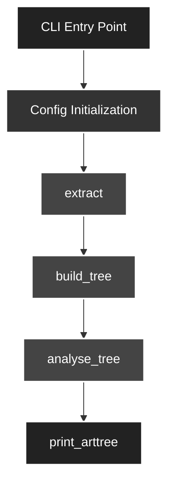

# Processing Pipeline Overview

This document describes the processing pipeline for the Requirement Management System (RMS) CLI tool, as implemented in `cli.py`, `analyse.py`, and `extract.py`.

## Pipeline Steps

### 1. CLI Entry Point
The user interacts with the system via the CLI, which provides commands such as `analyze` (full project analysis).

### 2. Config Initialization
For the `analyze` command, the configuration is initialized using the provided config file and CLI options.

### 3. Extraction
Artifacts are extracted from the input files using the appropriate extractor (e.g., text, markdown, obsidian, etc.).

### 4. Tree Building
The extracted artifacts are organized into a tree structure, establishing parent-child relationships.

### 5. Analysis
The artifact tree is analyzed for validity, including checks for artifact types, root presence, allowed/required children, etc.

### 6. Output
The resulting artifact tree is printed. Errors are reported as needed.

---

## Pipeline Flow (Mermaid Diagram)

---

## Summary Table

| Step                | Function/Module         | Description                                      |
|---------------------|------------------------|--------------------------------------------------|
| CLI Entry Point     | `cli.py`               | Handles user commands and options                 |
| Config Initialization | `Config` (config.py)  | Loads configuration and parameters                |
| Extraction          | `extract` (extract.py) | Extracts artifacts from input files               |
| Tree Building       | `build_tree` (tree.py) | Builds parent-child relationships between artifacts |
| Analysis            | `analyse_tree` (analyse.py) | Validates artifact tree structure and content |
| Output              | `print_arttree` (render.py) | Prints the artifact tree to the user         |
