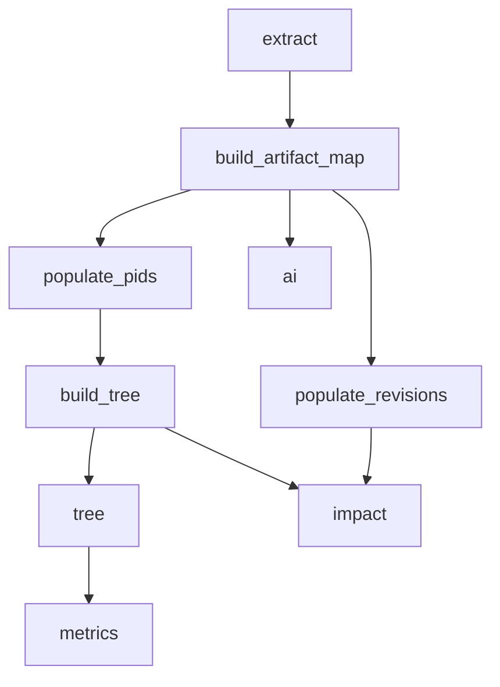

# Processing Pipeline Overview

This document describes the processing pipeline for the Requirement Management System (RMS) CLI tool, as implemented in `cli.py`, `main.py`, and `utils.py`.

## Topological Execution Plan

Syntagmax uses a dynamic execution pipeline based on a Directed Acyclic Graph (DAG). Instead of a hardcoded sequence, the system determines the necessary steps to reach a requested target (e.g., `metrics` or `impact`) using a topological sorter.

### Pipeline Steps and Dependencies

The core pipeline steps and their dependencies are defined as follows:

| Step | Dependencies | Description |
|------|--------------|-------------|
| `extract` | None | Extracts raw artifacts from input sources. |
| `build_artifact_map` | `extract` | Organizes extracted artifacts into a searchable map. |
| `populate_pids` | `build_artifact_map` | Resolves parent IDs from artifact attributes. |
| `build_tree` | `populate_pids` | Establishes parent-child relationships and builds the hierarchy. |
| `tree` | `build_tree` | Performs structural analysis and validation of the tree. |
| `populate_revisions` | `build_artifact_map` | Extracts Git history and populates artifact revisions. |
| `impact` | `populate_revisions`, `build_tree` | Performs impact analysis by comparing revisions. |
| `metrics` | `tree` | Calculates project metrics (coverage, TBDs, etc.). |
| `ai` | `build_artifact_map` | Performs AI-assisted analysis of artifacts. |

## Pipeline Flow (Mermaid Diagram)

```mermaid
flowchart TD
    extract --> build_artifact_map
    build_artifact_map --> populate_pids
    build_artifact_map --> populate_revisions
    build_artifact_map --> ai
    populate_pids --> build_tree
    build_tree --> tree
    build_tree --> impact
    populate_revisions --> impact
    tree --> metrics
```

## Execution Logic

When a user runs `syntagmax analyze <step>`, the system:
1. Identifies the target `<step>`.
2. Resolves all recursive dependencies for that step.
3. Orders them topologically.
4. Executes each step in sequence, passing a shared `artifacts` map and `errors` list between them.

This approach ensures that only the necessary work is performed and that dependencies are always satisfied.
