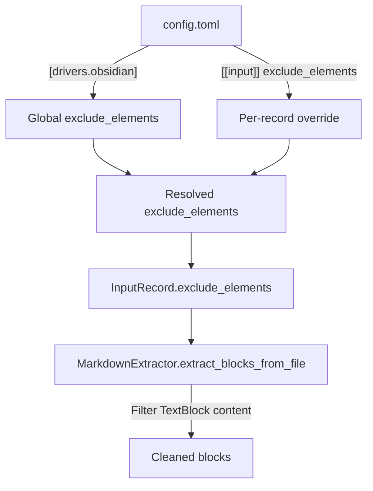

# Driver-Level Element Exclusion

## Problem Statement

The current `ignore_plain_text_prefixes` parameter in `publish.yaml` is a generic string-prefix filter applied at render time, but its use cases are inherently Markdown-specific. It should be replaced with a predefined, driver-aware exclusion mechanism that operates at extraction time, configured in `config.toml` with global driver defaults and per-input-record overrides.

## Requirements

1. Remove `ignore_plain_text_prefixes` from `PublishConfig` (breaking change).
2. Introduce a `[drivers.obsidian]` section in `config.toml` for global driver defaults.
3. Allow per-input-record `exclude_elements` that merges with (not overrides) the global default.
4. Predefined excludable element set for the Obsidian/Markdown driver:
   - `callouts` — blockquote lines (`>`)
   - `headings` — lines starting with `#`
   - `horizontal_rules` — lines that are `---`, `***`, or `___`
   - `frontmatter` — entire YAML frontmatter block at file start
5. Filtering happens at extraction time (inside `_extract_blocks_from_markdown` / `extract_blocks_from_file`), not at render time.
6. The `adjust_text_headings_and_prefixes` function loses its `ignore_prefixes` parameter.
7. Resolution logic: if a record specifies `exclude_elements`, merge its contents with the global `[drivers.<name>]` defaults list (union) to form the resolved exclusion list. If neither is set, the list is empty (no exclusion).

## Background

- `ObsidianExtractor` inherits from `MarkdownExtractor`. The key extraction method is `_extract_blocks_from_markdown`, which produces `TextBlock`, `ArtifactBlock`, and `ErrorBlock` instances.
- `TextBlock.content` holds raw markdown text between artifact markers. This is where element filtering should be applied.
- `InputRecord` is the runtime dataclass passed to extractors. It currently has no driver options field.
- `InputConfig` is the Pydantic model for `[[input]]` TOML sections.
- `ConfigFile` is the top-level Pydantic model for the whole config file.
- The `adjust_text_headings_and_prefixes` function in `publish.py` currently accepts and uses `ignore_prefixes`. Three call sites exist.

## Config Shape

```toml
# Global default for all obsidian inputs
[drivers.obsidian]
exclude_elements = ["callouts"]

# Per-record additions (merged with global via union)
[[input]]
name = "system-requirements"
dir = "SYS"
driver = "obsidian"
exclude_elements = ["callouts", "horizontal_rules"]
```

## Proposed Solution



### Element Filtering Logic

- **Code-block awareness**: Before applying any filters to a `TextBlock`, the filtering logic must identify fenced code blocks (lines delimited by ` ``` `). Lines inside code blocks are preserved exactly as-is and are excluded from heading (`#`) and callout (`>`) stripping.
- **callouts**: Remove lines starting with `>` outside of code blocks.
- **headings**: Remove lines starting with `#` outside of code blocks.
- **horizontal_rules**: Remove lines matching `^\s*[-*_]{3,}\s*$` outside of code blocks.
- **frontmatter**: If the file content starts with `---\r?\n`, remove everything up to and including the closing `---\r?\n`. This applies only at the very start of a file (the first `TextBlock` in a file before any artifact marker). Use a regex that supports both LF and CRLF line endings.

### Empty Block Handling

If filtering leaves a `TextBlock` with only whitespace content, omit it from the block list entirely.

## Task Breakdown

### Task 1: Add `DriversConfig` model and wire global driver defaults

- **Objective:** Introduce a `[drivers.obsidian]` section in the config schema.
- **Implementation:**
  - In `config.py`, add an `ObsidianDriverConfig` Pydantic model with `exclude_elements: list[str] = Field(default_factory=list)`.
  - Add a `DriversConfig` model with `obsidian: ObsidianDriverConfig = Field(default_factory=ObsidianDriverConfig)`.
  - Add `drivers: DriversConfig = Field(default_factory=DriversConfig)` to `ConfigFile`.
  - Add a validator on `exclude_elements` that rejects values not in the known set: `{"callouts", "headings", "horizontal_rules", "frontmatter"}`.
- **Test requirements:**
  - Unit test: parsing of `[drivers.obsidian]` from TOML yields expected model.
  - Unit test: unknown element names raise a validation error.
  - Unit test: missing `[drivers]` section defaults to empty list.
- **Demo:** `config.toml` with `[drivers.obsidian]` section loads without error; unknown element names produce a validation error.

### Task 2: Add `exclude_elements` to `InputConfig` and `InputRecord`

- **Objective:** Allow per-record override of element exclusions.
- **Implementation:**
  - Add `exclude_elements: list[str] | None = Field(default=None)` to `InputConfig` (with the same known-set validator).
  - Add `exclude_elements: list[str] = field(default_factory=list)` to the `InputRecord` dataclass.
  - In `_read_input_records`, resolve the effective list: take the union of the global driver default and the record-level list (if present). Deduplicate. If both are absent, the result is an empty list.
  - Pass the resolved list into the `InputRecord` constructor.
- **Test requirements:**
  - Unit test: record-level list merges with global (union).
  - Unit test: absent record-level uses global only.
  - Unit test: both absent yields empty list.
  - Unit test: unknown names at record level are rejected.
- **Demo:** Config with per-record `exclude_elements` loads correctly; the resolved `InputRecord` carries the expected list.

### Task 3: Implement element filtering in `MarkdownExtractor`

- **Objective:** Filter excluded elements from `TextBlock` content at extraction time.
- **Implementation:**
  - Add a `_filter_text_content(self, content: str, is_file_start: bool) -> str` method to `MarkdownExtractor` that applies each enabled filter:
    - Track fenced code block state (toggle on lines starting with ` ``` `). Lines inside code blocks are never filtered.
    - `callouts`: Remove lines starting with `>` (outside code blocks).
    - `headings`: Remove lines starting with `#` (outside code blocks).
    - `horizontal_rules`: Remove lines matching `^\s*[-*_]{3,}\s*$` (outside code blocks).
    - `frontmatter`: Only when `is_file_start=True`. If content starts with `---` followed by `\n` or `\r\n`, remove everything up to and including the next `---\r?\n`. Use a regex supporting both LF and CRLF.
  - In `_extract_blocks_from_markdown`, after creating each `TextBlock`, call `_filter_text_content`. The first `TextBlock` in a file gets `is_file_start=True`.
  - If the filtered content is empty or whitespace-only, do not append the block.
  - In `extract_blocks_from_file`, read `self._record.exclude_elements` to determine which filters are active. If the list is empty, skip filtering entirely (no performance cost).
- **Test requirements:**
  - Unit test for each element type individually.
  - Unit test for combined exclusions.
  - Unit test: frontmatter removal only applies to the first text block.
  - Unit test: frontmatter removal works with both LF and CRLF line endings.
  - Unit test: lines inside fenced code blocks are preserved even when `headings` or `callouts` are excluded.
  - Unit test: empty blocks after filtering are omitted.
  - Unit test: no filtering when `exclude_elements` is empty.
- **Demo:** Run extraction on a sample file with callouts; with `exclude_elements = ["callouts"]`, the resulting `TextBlock` content has no `>` lines.

### Task 4: Remove `ignore_plain_text_prefixes` from `PublishConfig` and `adjust_text_headings_and_prefixes`

- **Objective:** Clean up the old mechanism.
- **Implementation:**
  - Remove `ignore_plain_text_prefixes` field from `PublishConfig` in `publish_config.py`.
  - Remove the `ignore_prefixes` parameter from `adjust_text_headings_and_prefixes` in `publish.py`.
  - Update the three call sites in `publish.py` (`render_block` function) to stop passing that argument.
  - Update `docs/schemas/publish-config.schema.json` to remove the property.
  - Remove related tests in `test_publish.py` and `test_publish_config.py`.
- **Test requirements:**
  - Existing publish tests updated to not reference `ignore_plain_text_prefixes`.
  - Remaining tests continue to pass.
  - Verify `PublishConfig` rejects the old key if using strict validation, or silently ignores it if using `extra='ignore'`.
- **Demo:** Publishing still works correctly without the parameter. YAML with `ignore_plain_text_prefixes` either errors or is silently ignored depending on model config.

### Task 5: Update documentation and examples

- **Objective:** Reflect the new configuration in reference docs, schema, and README.
- **Implementation:**
  - Update `docs/reference/publishing.md` to remove `ignore_plain_text_prefixes` from the schema and parameter table.
  - Update `docs/reference/configuration.md` to document `[drivers.obsidian]` and per-record `exclude_elements`.
  - Update `README.md` Configuration section to show the `[drivers.obsidian]` example.
  - Update `docs/schemas/publish-config.schema.json`.
  - Update `openwiki/domain.md` to replace the `ignore_plain_text_prefixes` note with `exclude_elements`.
- **Test requirements:** N/A (documentation only).
- **Demo:** Reference docs accurately describe the new config shape.

### Task 6: Integration test with example project

- **Objective:** End-to-end verification.
- **Implementation:**
  - Update or add an example config (e.g. `example/obsidian-driver/.syntagmax/config.toml`) with `[drivers.obsidian]` section using `exclude_elements = ["callouts"]`.
  - Add an integration test that runs extraction via the CLI and asserts excluded elements are absent from blocks/output.
- **Test requirements:**
  - Integration test: run `syntagmax analyze` on a project with callouts in text; verify the analysis output does not include callout content.
  - Integration test: run `syntagmax publish` and verify published markdown has no callout lines.
- **Demo:** `uv run syntagmax --cwd ./example/obsidian-driver publish ...` produces output without callouts when configured to exclude them.
