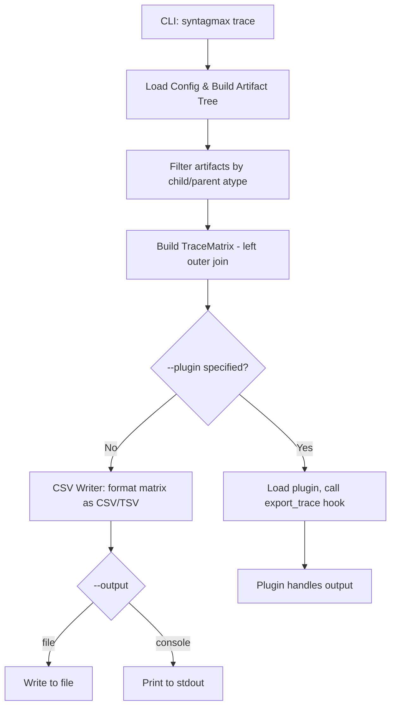

# Export Artifact Tree as Tracing Tables

## Problem Statement

Users need to export artifact traceability relationships as forward (child→parent) or reverse (parent→child) matrices in CSV format, with optional attribute columns, a flat mode to consolidate multiple links per row, and a plugin hook for custom export formats.

## Requirements

- New `trace` CLI subcommand
- `--child <type>` and `--parent <type>` (required) to specify artifact types
- `--forward` / `--reverse` flag to choose direction (default forward)
- `--attribute <name>` repeatable option for additional lead-object attribute columns
- `--flat` flag to merge multiple linked objects into semicolon-separated values
- `--delimiter <char>` to specify CSV column separator (default: `,`, or `\t` if file ends in `.tsv`)
- `--plugin <name>` to delegate export to a plugin instead of CSV
- Left outer join behavior by default: all artifacts of the lead type (child in forward, parent in reverse) must be listed, even if they have no links (leaving the linked ID column empty).
- Default output file: `.syntagmax/reports/trace.csv`, with `--output console` for stdout
- Plugin hook: `export_trace(matrix, config, params) -> None` — plugin handles output itself
- Update README.md and docs/technical-summary.md
- Example plugin for tab-separated format (illustrating custom plugin hook usage)

## Background

- The project uses Click for CLI, pydantic for config models, and pytest for tests
- Artifact parent-child links are stored in `Artifact.pids` (list of parent IDs) and `Artifact.children` (set of child IDs)
- The existing pipeline resolves parent links via `populate_pids()` and `build_tree()`
- The plugin system already has `load_plugins()`, `LoadedPlugin`, and uses `FatalError` for errors
- The existing plugin hook pattern is: check `hasattr(module, hook_name)`, call it, validate return type
- Output default path pattern matches `.syntagmax/reports/report.md`
- The `process()` function in `main.py` returns a `Report` object and does **not** expose the raw `ArtifactMap`. The CLI command must build the artifact tree manually to retain access to the artifacts dict.

## Proposed Solution



### Data Model

```python
@dataclass
class TraceRecord:
    record_number: int    # 1-based sequential row index in the output
    lead_id: str          # ChildID (forward) or ParentID (reverse)
    linked_id: str        # ParentID (forward) or ChildID (reverse) — may be "; " separated in flat mode, empty if no links
    attributes: dict[str, str]  # Additional lead attributes (serialized to str)

@dataclass
class TraceMatrix:
    direction: str        # "forward" or "reverse"
    child_type: str
    parent_type: str
    attribute_names: list[str]
    records: list[TraceRecord]
```

### CLI Interface

```bash
uv run syntagmax trace [OPTIONS]
```

Options:
- `--child <type>` — the `atype` of child artifacts (required)
- `--parent <type>` — the `atype` of parent artifacts (required)
- `--forward` / `--reverse` — direction flag (mutually exclusive, default forward)
- `--attribute <name>` — additional attributes of the lead object to include as columns (optional, repeatable)
- `--flat` — combine multiple linked objects into a single record with semicolon-separated list (optional flag)
- `--delimiter <char>` — column delimiter to use (default: `,` or `\t` if output file suffix is `.tsv`)
- `--plugin <name>` — use a named plugin instead of CSV output
- `--output <path>` — output file path (default: `.syntagmax/reports/trace.csv`), use `console` for stdout
- `-f / --config-file` — path to config file (default: `.syntagmax/config.toml`)

### Forward Matrix Logic

1. Iterate all artifacts where `atype == child_type`
2. For each child artifact, find its parents where `atype == parent_type` (from `pids` resolved against `ArtifactMap`)
3. If no matching parents exist, emit one row with the child ID and an empty ParentID.
4. Without `--flat`: emit one row per (child, parent) pair.
5. With `--flat`: emit one row per child, joining all parent IDs with `"; "`. If no parents, the parent column is empty.
6. If any requested attribute in `--attribute` is missing on the artifact, output an empty string. If the attribute value is a non-string (integer, boolean, list), serialize it using `str()`. Lists are serialized as semicolon-separated values.

### Reverse Matrix Logic

1. Iterate all artifacts where `atype == parent_type`
2. For each parent artifact, find its children where `atype == child_type` (from `children` set)
3. If no matching children exist, emit one row with the parent ID and an empty ChildID.
4. Without `--flat`: emit one row per (parent, child) pair.
5. With `--flat`: emit one row per parent, joining all child IDs with `"; "`. If no children, the child column is empty.
6. If any requested attribute in `--attribute` is missing on the artifact, output an empty string. If the attribute value is a non-string (integer, boolean, list), serialize it using `str()`. Lists are serialized as semicolon-separated values.

### Record Numbering

`record_number` is a 1-based sequential row index incremented for every row emitted in the resulting matrix. It does not represent the lead artifact count — in non-flat mode, a single lead artifact with N links produces N rows with consecutive record numbers.

### CSV Output Format

Header columns depend on direction:
- Forward: `RecordNumber, ChildID, ParentID, <attr1>, <attr2>, ...`
- Reverse: `RecordNumber, ParentID, ChildID, <attr1>, <attr2>, ...`

Uses Python's `csv` module for proper escaping. The delimiter is configurable (default `,`, auto-detected as `\t` for `.tsv` output files).

### Unresolved References

If a child artifact references a parent ID that does not exist in the `ArtifactMap` or whose artifact type does not match `--parent`, the reference is still included in the matrix output as-is. This allows users to see broken links. The linked ID column will contain the raw reference string (e.g., `SYS-999`). No special marker is added — the absence of the target artifact from the project is the signal.

### Plugin Hook

New hook signature added to the plugin system:

```python
from syntagmax.trace import TraceMatrix
from syntagmax.config import Config

def export_trace(matrix: TraceMatrix, config: Config, params: dict) -> None:
    """Called instead of CSV writer when --plugin is specified.
    Plugin is responsible for writing output (file, stdout, etc.)."""
    ...
```

Execution:
- The named plugin is looked up from `config.plugins()` by name
- If `--plugin <name>` is specified but the plugin is not found in the list of enabled plugins, raise a descriptive `FatalError` indicating whether the plugin is not configured, disabled, or not loaded
- If the plugin doesn't have an `export_trace` hook, raise `FatalError`
- If the hook raises an exception, log traceback at DEBUG level and raise `FatalError`

### Example Output

#### Forward Matrix (Left Outer Join)

| RecordNumber | ChildID | ParentID | ChildAttrA   | ChildAttrB   |
| ------------ | ------- | -------- | ------------ | ------------ |
| 1            | LLR-001 | HLR-001  | custom-val-a | custom-val-b |
| 2            | LLR-002 | HLR-002  | custom-val-c | custom-val-d |
| 3            | LLR-002 | HLR-003  | custom-val-c | custom-val-d |
| 4            | LLR-003 |          | custom-val-e |              |

#### Forward Matrix (Flat)

| RecordNumber | ChildID | ParentID         | ChildAttrA   | ChildAttrB   |
| ------------ | ------- | ---------------- | ------------ | ------------ |
| 1            | LLR-001 | HLR-001          | custom-val-a | custom-val-b |
| 2            | LLR-002 | HLR-002; HLR-003 | custom-val-c | custom-val-d |
| 3            | LLR-003 |                  | custom-val-e |              |

#### Reverse Matrix

| RecordNumber | ParentID | ChildID | ParentAttrA  | ParentAttrB  |
| ------------ | -------- | ------- | ------------ | ------------ |
| 1            | HLR-001  | LLR-001 | custom-val-a | custom-val-b |
| 2            | HLR-001  | LLR-002 | custom-val-a | custom-val-b |
| 3            | HLR-002  | LLR-003 | custom-val-c | custom-val-d |
| 4            | HLR-003  |         | custom-val-e |              |

## Task Breakdown

### Task 1: TraceMatrix data model and matrix-building logic

**Objective:** Create the `TraceMatrix` and `TraceRecord` dataclasses, and implement the core function that takes an `ArtifactMap` plus parameters and produces a `TraceMatrix`.

**Implementation guidance:**
- Create `src/syntagmax/trace.py` with `TraceRecord` and `TraceMatrix` dataclasses
- Implement `build_trace_matrix(artifacts: ArtifactMap, child_type: str, parent_type: str, direction: str, attributes: list[str], flat: bool) -> TraceMatrix`
- Use left outer join logic: every lead artifact of the requested type appears in the matrix even if it has no links to the target type
- For forward: iterate artifacts where `atype == child_type`, find parents where `atype == parent_type` (from `pids`). One row per (child, parent) pair unless `--flat`. If no matching parents, one row with empty linked ID.
- For reverse: iterate artifacts where `atype == parent_type`, find children where `atype == child_type` (from `children`). One row per (parent, child) pair unless `--flat`. If no matching children, one row with empty linked ID.
- In flat mode, group by lead and join linked IDs with `"; "`. Leads with no links get an empty string.
- Sequential record numbering starts at 1 (row index, not artifact index).
- Serialize attribute values: missing attributes → `""`, list values → `"; "` joined, non-string scalars → `str()`.

**Test requirements:**
- Test forward matrix with simple 1:1 parent-child links
- Test forward matrix with 1:N (child has multiple parents of target type)
- Test reverse matrix with 1:N (parent has multiple children)
- Test `--flat` mode collapses multiple linked IDs
- Test left outer join: lead artifact with no matching links still appears with empty linked ID
- Test that artifacts not matching the requested types are excluded
- Test attribute extraction populates the dict correctly
- Test missing attributes render as empty strings
- Test list attribute serialization
- Test empty result (no artifacts of lead type at all)

**Demo:** `uv run pytest tests/test_trace_export.py` passes; a mock artifact map produces the expected `TraceMatrix`.

---

### Task 2: CSV/TSV writer for TraceMatrix

**Objective:** Implement a function that serializes a `TraceMatrix` to delimited format (CSV or TSV) as a string.

**Implementation guidance:**
- In `src/syntagmax/trace.py`, add `render_trace_csv(matrix: TraceMatrix, delimiter: str = ',') -> str`
- Use Python's `csv` module with `io.StringIO`
- Header row: `RecordNumber`, lead column name (based on direction), linked column name, then attribute column names
- Column naming: for forward, columns are `RecordNumber, ChildID, ParentID, <attr1>, <attr2>...`. For reverse: `RecordNumber, ParentID, ChildID, <attr1>, <attr2>...`
- Accept a `delimiter` parameter to support TSV and other separators

**Test requirements:**
- Test CSV output matches expected format for a simple forward matrix
- Test CSV output for reverse matrix
- Test that attributes appear as additional columns
- Test flat mode output with semicolons in linked column
- Test TSV output with tab delimiter
- Test that empty linked IDs (left outer join orphans) appear as empty cells

**Demo:** `uv run pytest tests/test_trace_export.py` passes; CSV output can be parsed back and matches expectations.

---

### Task 3: Plugin hook for trace export (`export_trace`)

**Objective:** Extend the plugin system with a new `export_trace` hook that receives the matrix and handles output.

**Implementation guidance:**
- In `src/syntagmax/plugin.py`, add `run_trace_export(plugin: LoadedPlugin, matrix: TraceMatrix, config: Config) -> None`
- The function calls `plugin.module.export_trace(matrix, config, plugin.params)` if the hook exists
- If the hook doesn't exist on the named plugin, raise `FatalError` with message: `Plugin "<name>" does not implement the export_trace hook`
- If the hook raises, log traceback at DEBUG and raise `FatalError`
- No return type validation needed (returns None)
- The plugin signature: `def export_trace(matrix: TraceMatrix, config: Config, params: dict) -> None`
- Add a helper `find_plugin_by_name(plugins: list[LoadedPlugin], name: str) -> LoadedPlugin` that raises a descriptive `FatalError` if the plugin is not found among enabled plugins

**Test requirements:**
- Test that a plugin with `export_trace` is called with correct arguments
- Test that a plugin without `export_trace` raises `FatalError`
- Test that exceptions in the hook are wrapped in `FatalError`
- Test that looking up a non-existent plugin name raises descriptive `FatalError`

**Demo:** `uv run pytest tests/test_trace_export.py` passes; mock plugin receives the matrix.

---

### Task 4: CLI `trace` command wiring

**Objective:** Add the `trace` subcommand to the CLI that orchestrates config loading, pipeline execution, matrix building, and output.

**Implementation guidance:**
- In `cli.py`, add a new `@rms.command` named `trace`
- Options: `--child` (required), `--parent` (required), `--forward`/`--reverse` (mutually exclusive flags, default forward), `--attribute` (multiple), `--flat` (flag), `--delimiter` (optional string), `--plugin` (optional string), `-f/--config-file` (default `.syntagmax/config.toml`), `--output` (default `.syntagmax/reports/trace.csv`)
- Load config, run the pipeline up through the `tree` step manually (call `extract`, `build_artifact_map`, `populate_pids`, and `build_tree` to retrieve the active `ArtifactMap` along with errors).
- Check for errors; if any fatal errors exist, report them and exit.
- Call `build_trace_matrix(...)` with the resolved artifacts.
- If `--plugin`: find that specific plugin from `config.plugins()` by name using `find_plugin_by_name`, call `run_trace_export`
- Else: determine delimiter (explicit `--delimiter`, or `\t` if output path ends in `.tsv`, or `,` by default), call `render_trace_csv()`, write to output path or print to stdout if `--output console`
- Ensure parent directory of output file is created (e.g. `output_path.parent.mkdir(parents=True, exist_ok=True)`).

**Test requirements:**
- Integration test: end-to-end with a temp project producing a CSV file
- Test `--output console` prints to stdout
- Test missing `--child`/`--parent` shows error
- Test invalid atype (no matching artifacts) produces CSV with header only
- Test `.tsv` output auto-detects tab delimiter
- Test left outer join: orphan artifacts appear in output

**Demo:** `uv run syntagmax --cwd ./example/obsidian-driver trace --child REQ --parent SYS` produces a CSV in `.syntagmax/reports/trace.csv`.

---

### Task 5: Example plugin for tab-separated export

**Objective:** Create an example plugin that exports the trace matrix as TSV instead of CSV, with its own README. This serves as an educational example of the `export_trace` plugin hook.

**Implementation guidance:**
- Create `example/trace-tsv-plugin/` directory with:
  - `.syntagmax/config.toml` referencing the plugin and some input records
  - `.syntagmax/plugins/tsv-export.py` implementing `export_trace`
  - `README.md` explaining how the plugin works and the `export_trace` API
- The plugin should write TSV to a file path derived from params (e.g., `params['output']`)
- Include a small set of requirement files for the example (or reference the obsidian-driver example structure)

**Test requirements:**
- The example works end-to-end: `uv run syntagmax --cwd ./example/trace-tsv-plugin trace --child REQ --parent SYS --plugin tsv-export`

**Demo:** Running the example produces a `.tsv` file with tab-separated trace data.

---

### Task 6: Documentation updates

**Objective:** Update README.md and docs/technical-summary.md with the new `trace` command and plugin hook.

**Implementation guidance:**
- In `README.md` "Quick Demo" section, add a tracing example alongside the existing analysis and publish examples:
  ```bash
  uv run syntagmax --cwd ./example/obsidian-driver trace --child REQ --parent SYS
  ```
- In `README.md`, add a "Tracing Export" section after "Publishing" covering:
  - Command syntax and all options
  - Forward vs reverse explanation
  - Left outer join behavior (orphan artifacts still listed)
  - Flat mode
  - Delimiter option and TSV auto-detection
  - Plugin usage
  - Example output
- In `docs/technical-summary.md`, add a bullet under "Traceability & Impact Analysis" mentioning CSV/plugin export and left outer join semantics
- In the Plugins section of README, document the new `export_trace` hook signature

**Test requirements:**
- No code tests, but verify docs are consistent with implementation

**Demo:** README has clear usage examples for the `trace` command, including the Quick Demo entry.
