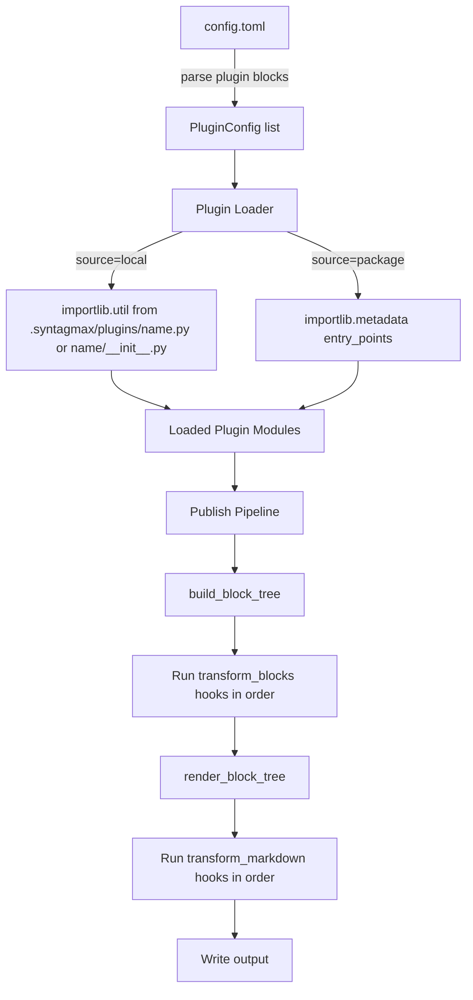

# Plugin System for Syntagmax

## Problem Statement

Users need to apply niche transformations (e.g., during publishing) without those capabilities living in the core open-source repository. A plugin system allows separate installation and activation of custom transforms.

## Requirements

- Plugins are explicitly listed in `config.toml` via `[[plugin]]` blocks
- Execution order follows the listing order in config
- Each plugin block has a `source` field (`"local"` or `"package"`), a `name`, and an optional `enabled` flag (default `true`)
- Per-plugin parameters are nested under a `[plugin.params]` table
- Two hook types: `transform_blocks(tree, config, params) -> BlockTree` and `transform_markdown(markdown, config, params) -> str`
- A plugin module may implement either or both hooks
- Local plugins live in `.syntagmax/plugins/{name}.py` or `.syntagmax/plugins/{name}/__init__.py`
- Package plugins are discovered via `importlib.metadata.entry_points(group="syntagmax.plugins")`
- Plugin errors halt the pipeline (raised as `FatalError`)
- Hook return types are validated at runtime; incorrect returns raise `FatalError`
- No inter-plugin dependencies

## Background

- The publish pipeline is: `build_block_tree()` → `BlockTree` → `render_block_tree()` → markdown string → write file
- Config is parsed in `Config.__init__` using pydantic models and TOML
- The project uses `hatchling` as build backend, which supports entry-points
- Error handling uses `FatalError` with a list of error strings
- Tests use `pytest` with in-memory fixtures

## Proposed Solution



### Configuration Example

```toml
[[plugin]]
name = "strip-classified"
source = "local"
enabled = true

[plugin.params]
strip_marker = "CLASSIFIED"

[[plugin]]
name = "syntagmax-company-header"
source = "package"

[plugin.params]
company = "Acme Corp"
```

Plugins with `enabled = false` are skipped entirely (not loaded, not executed).

### Plugin API

A plugin is a Python module that exposes one or both of the following functions:

```python
from syntagmax.blocks import BlockTree
from syntagmax.config import Config

def transform_blocks(tree: BlockTree, config: Config, params: dict) -> BlockTree:
    """Pre-render hook. Called after block tree is built, before rendering.
    Must return a BlockTree instance."""
    ...

def transform_markdown(markdown: str, config: Config, params: dict) -> str:
    """Post-render hook. Called after markdown is rendered, before writing to file.
    Must return a str instance."""
    ...
```

Either function is optional — a plugin may implement one or both.

### Return Type Validation

The execution engine validates hook return types at runtime:
- `transform_blocks` must return an instance of `BlockTree`
- `transform_markdown` must return an instance of `str`

If a hook returns `None` or an incorrect type, a descriptive `FatalError` is raised identifying the offending plugin.

### Local Plugins

Local plugins are Python files or packages placed in `.syntagmax/plugins/` relative to the config file's directory:

```
project/
├── .syntagmax/
│   ├── config.toml
│   └── plugins/
│       ├── strip-classified.py          # Single-file plugin
│       └── complex-transform/           # Directory plugin
│           ├── __init__.py
│           └── helpers.py
```

The loader resolves a local plugin name by checking (in order):
1. `.syntagmax/plugins/{name}.py` — single file
2. `.syntagmax/plugins/{name}/__init__.py` — directory package

### Package Plugins

Package plugins are installed Python packages that register an entry-point:

```toml
# In the plugin package's pyproject.toml:
[project.entry-points."syntagmax.plugins"]
syntagmax-company-header = "syntagmax_company_header"
```

Syntagmax discovers them via `importlib.metadata.entry_points(group="syntagmax.plugins", name=...)`.

### Module Namespace

Dynamically loaded local plugins are registered in `sys.modules` under `syntagmax.plugins.local.{name}` to avoid namespace collisions between projects or plugins with identical module names.

### Error Handling

- If a plugin cannot be found or loaded, a `FatalError` is raised immediately
- If a plugin hook raises an exception during execution:
  1. The full traceback is logged at `DEBUG` level
  2. A `FatalError` is raised with the plugin name and error context
- If a hook returns an incorrect type, a `FatalError` is raised identifying the plugin and expected type
- Errors halt the pipeline; no partial output is produced

## Task Breakdown

### Task 1: Plugin configuration model and parsing

**Objective:** Add `PluginConfig` pydantic model and parse `[[plugin]]` blocks from config.toml.

**Implementation guidance:**
- Create `src/syntagmax/plugin.py` with `PluginConfig(BaseModel)` containing: `name: str`, `source: Literal['local', 'package']`, `enabled: bool = True`, `params: dict = {}`
- Add `plugin: list[PluginConfig] = Field(default_factory=list)` to `ConfigFile`
- Store parsed plugin configs on the `Config` instance

**Test requirements:**
- Test that a config with `[[plugin]]` blocks parses correctly
- Test that `params` sub-table is captured as a dict
- Test that missing `name` or `source` raises validation error
- Test that `enabled = false` is parsed correctly
- Test that an empty plugin list (no `[[plugin]]`) works fine

**Demo:** `uv run pytest tests/test_plugin.py` passes; a config with plugin blocks parses without error.

---

### Task 2: Plugin loader (local and package discovery)

**Objective:** Implement loading of plugin modules from both local files and installed entry-points.

**Implementation guidance:**
- In `src/syntagmax/plugin.py`, add a `load_plugin(plugin_config, root_dir) -> ModuleType` function
- For `source = "local"`: resolve to `{root_dir}/plugins/{name}.py` or `{root_dir}/plugins/{name}/__init__.py`; use `importlib.util.spec_from_file_location` to load; register in `sys.modules` as `syntagmax.plugins.local.{name}`
- For `source = "package"`: use `importlib.metadata.entry_points(group='syntagmax.plugins', name=name)` to find and load the module
- Skip plugins with `enabled = False`
- Raise `FatalError` if the plugin cannot be found or loaded
- Add a `load_plugins(plugin_configs, root_dir) -> list[LoadedPlugin]` that returns loaded modules with their params in config order

**Test requirements:**
- Test local plugin loading from a temp directory with a dummy `.py` file
- Test local plugin loading from a directory with `__init__.py`
- Test that missing local file raises `FatalError`
- Test package plugin loading with a mocked entry-point
- Test that missing package entry-point raises `FatalError`
- Test that `enabled = False` plugins are skipped
- Test ordering is preserved
- Test that loaded modules are registered under `syntagmax.plugins.local.{name}`

**Demo:** `uv run pytest tests/test_plugin.py` passes with loader tests; a dummy local plugin file loads successfully.

---

### Task 3: Plugin execution engine (hook invocation)

**Objective:** Implement the hook invocation logic that runs `transform_blocks` and `transform_markdown` on loaded plugins in order.

**Implementation guidance:**
- Add `run_block_transforms(plugins, tree, config) -> BlockTree` — iterates plugins, calls `transform_blocks` if present, validates return type, passes result to next
- Add `run_markdown_transforms(plugins, markdown, config) -> str` — same for `transform_markdown`
- Each plugin's params are passed as the `params` argument
- If a hook returns `None` or wrong type, raise `FatalError` with descriptive message naming the plugin
- If a plugin raises an exception, log the traceback at `DEBUG` level and re-raise as `FatalError` with plugin name context
- Use `hasattr()` to check if the hook function exists on the module

**Test requirements:**
- Test that a plugin with only `transform_blocks` is called correctly
- Test that a plugin with only `transform_markdown` is called correctly
- Test that a plugin with both hooks has both called
- Test chaining: plugin A modifies tree, plugin B receives modified tree
- Test that plugin exception is wrapped in `FatalError` (and traceback is logged)
- Test that returning `None` from `transform_blocks` raises `FatalError`
- Test that returning wrong type from `transform_markdown` raises `FatalError`

**Demo:** `uv run pytest tests/test_plugin.py` passes; a chain of two mock plugins transforms a `BlockTree` sequentially.

---

### Task 4: Integrate plugins into the publish pipeline

**Objective:** Wire the plugin system into the CLI publish command so plugins are loaded and executed during publishing.

**Implementation guidance:**
- In `Config.__init__`, after parsing plugin configs, call `load_plugins()` and store the result
- In `cli.py` publish command, after `build_block_tree()`: call `run_block_transforms()`
- After `render_block_tree()`: call `run_markdown_transforms()`
- This applies to both `--single` and per-record publish paths
- Log plugin loading and execution at INFO level

**Test requirements:**
- Integration test: config with a local plugin that uppercases all `TextBlock` content → verify output
- Integration test: config with a local plugin that appends a footer to markdown → verify output
- Test that publish without any plugins still works identically (regression)

**Demo:** Create a sample local plugin in the example directory, run `uv run syntagmax publish` with it configured, and observe the transformation in the output markdown.

---

### Task 5: Documentation and example plugin

**Objective:** Document the plugin system and provide an example local plugin.

**Implementation guidance:**
- Add a "Plugins" section to `README.md` covering: config format, local vs package plugins, hook API signatures, error behaviour, `enabled` flag
- Create `example/plugin-demo/` with a minimal config and a local plugin that demonstrates both hooks
- Document how to create a package plugin (entry-point setup in `pyproject.toml`)

**Test requirements:**
- The example plugin demo should work end-to-end: `uv run syntagmax --cwd ./example/plugin-demo publish output.md`

**Demo:** README has a clear plugin section; the example runs and produces transformed output.
