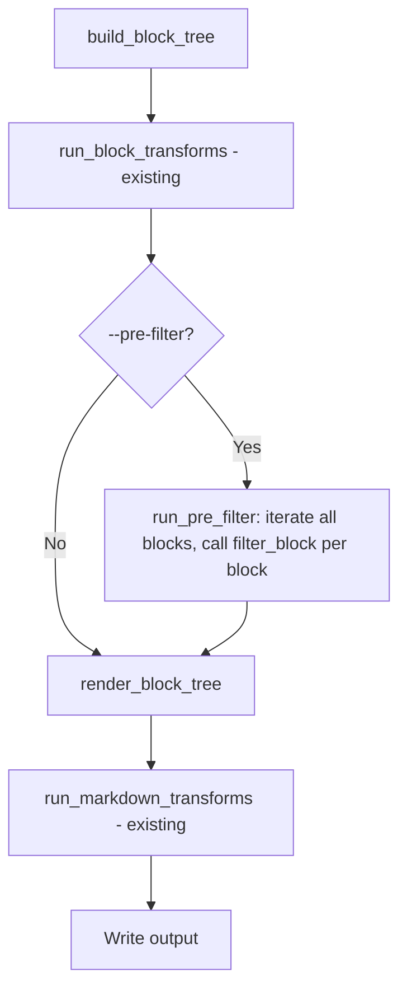

# Pre-Publishing Filter Plugin Hook

## Problem Statement

Users need a way to transform or inspect individual blocks before the publish pipeline renders them to markdown. The existing `transform_blocks` hook receives the entire `BlockTree`, which is powerful but makes simple per-block logic (e.g., redacting classified content, rewriting URLs, stripping draft artifacts) overly complex. A per-block filter hook gives plugin authors a simpler, focused API that operates on one block at a time without manipulating block lists directly.

## Requirements

1. A new plugin hook `filter_block(block, file_record, config, params) -> Block | None` that receives blocks one at a time and returns a (possibly modified) block, or `None` to omit the block from the output.
2. The hook itself cannot directly mutate the list of blocks, but it can filter out a block by returning `None`.
3. Returning a value that is neither a `Block` instance nor `None` is a fatal error.
4. Activated via `--pre-filter <plugin-name>` on the `publish` command.
5. The named plugin must already be configured in `config.toml` (loaded among enabled plugins).
6. Runs **after** `transform_blocks` but before rendering (`render_block_tree`).
7. Must not disrupt the existing `transform_blocks` / `transform_markdown` plugin pipeline.
8. A single plugin module can implement both existing hooks (`transform_blocks`, `transform_markdown`) and the new `filter_block` hook.

### Design Decisions

- The `--pre-filter` flag is intentionally explicit (not automatic) because filtering is inherently destructive — it removes content from published output. This differs from `transform_blocks` which is expected to preserve tree structure.
- This hook applies only to the `publish` command. Other interfaces (e.g., the MCP server) do not apply publish-time filters. Documentation must note this clearly.

## Background

- The current publish pipeline is: `build_block_tree()` → `run_block_transforms()` → `render_block_tree()` → `run_markdown_transforms()` → write.
- Plugins are loaded eagerly in `Config.__init__` from `[[plugin]]` blocks in `config.toml`.
- `find_plugin_by_name()` already exists in `src/syntagmax/plugin.py` and raises `FatalError` if the plugin isn't among enabled plugins.
- The `Block` type hierarchy: `Block` → `TextBlock`, `ArtifactBlock`, `ErrorBlock` (defined in `src/syntagmax/blocks.py`).
- `FileRecord` has `.path: str` and `.blocks: list[Block]`.
- Existing hook validation pattern: check `hasattr` for the hook, call it, validate return type, wrap exceptions in `FatalError` with traceback at DEBUG level.
- The CLI publish command already has both a `--single` path and a per-record loop; both must support the new option.

## Proposed Solution



The new `run_pre_filter` function:
1. Finds the plugin by name (using `find_plugin_by_name`).
2. Verifies it has a `filter_block` callable; raises `FatalError` if not.
3. Iterates all `InputBlock` → `FileRecord` → `Block`, calling `filter_block(block, file_record, config, params)` for each.
4. Rebuilds each `file_record.blocks` list with only the non-`None` returned blocks.
5. Validates the return is a `Block` instance or `None`; raises `FatalError` with file path and plugin name otherwise.

### Plugin API Addition

```python
from syntagmax.blocks import Block, FileRecord
from syntagmax.config import Config

def filter_block(block: Block, file_record: FileRecord, config: Config, params: dict) -> Block | None:
    """Called per-block after tree transforms, before rendering.
    Return a Block instance to keep/modify, or None to omit the block."""
    ...
```

### CLI Option

```
--pre-filter <plugin-name>    Run a pre-publishing block filter plugin
```

## Task Breakdown

### Task 1: Add `run_pre_filter` execution function in `plugin.py`

**Objective:** Implement the core execution logic for the pre-filter hook.

**Implementation guidance:**
- Add `run_pre_filter(plugin: LoadedPlugin, tree: BlockTree, config) -> BlockTree` to `src/syntagmax/plugin.py`.
- Verify the plugin module has a `filter_block` attribute; raise `FatalError` if not.
- Iterate `tree.inputs` → `input_block.files` → `file_record.blocks`.
- For each block, call `plugin.module.filter_block(block, file_record, config, plugin.params)`.
- Rebuild each `file_record.blocks` list using only the non-`None` returned blocks.
- Validate that each return value is a `Block` instance or `None`; raise `FatalError` with plugin name and `file_record.path` if not.
- Wrap exceptions in `FatalError` with file path context and traceback at DEBUG (same pattern as other hooks).
- Return the modified tree.

**Test requirements:**
- Test that a plugin's `filter_block` is called for each block in the tree.
- Test that the returned block replaces the original in the tree.
- Test that `file_record` is correctly passed (verify path accessible inside hook).
- Test that returning `None` successfully removes the block from the tree.
- Test that returning a non-`Block`, non-`None` type raises `FatalError`.
- Test that an exception inside `filter_block` raises `FatalError` with plugin name and file path.
- Test that a plugin missing `filter_block` raises `FatalError`.
- Test that params are passed correctly.

**Demo:** `uv run pytest tests/test_plugin.py -k pre_filter` passes.

---

### Task 2: Add `--pre-filter` CLI option to the `publish` command

**Objective:** Wire the new option into the publish command and invoke `run_pre_filter` at the correct pipeline stage.

**Implementation guidance:**
- Add `@click.option('--pre-filter', 'pre_filter_name', default=None, help='Run a pre-publishing block filter plugin')` to the `publish` command in `cli.py`.
- After `run_block_transforms()` and before `render_block_tree()`, if `pre_filter_name` is set:
  - Call `find_plugin_by_name(config.plugins(), pre_filter_name)` to get the plugin.
  - Call `run_pre_filter(plugin, tree, config)` and use the returned tree.
- This applies to both the `--single` path and the per-record loop.
- Import `run_pre_filter` from `syntagmax.plugin`.

**Test requirements:**
- Integration test: a config with a plugin implementing `filter_block` that uppercases `TextBlock.content`. Publish with `--pre-filter <name>` and verify output is uppercased.
- Integration test: a plugin implementing `filter_block` that returns `None` for draft artifacts. Verify those blocks are absent from output.
- Integration test: publish WITHOUT `--pre-filter` and verify the filter does NOT run (even if the plugin has the hook).
- Integration test: `--pre-filter` with a plugin name not in config raises `FatalError`.
- Verify that existing `transform_blocks` and `transform_markdown` hooks still run alongside the pre-filter.

**Demo:** `uv run syntagmax --cwd ./example/plugin-demo publish --pre-filter redact-draft --all` produces filtered output.

---

### Task 3: Example plugin and documentation

**Objective:** Provide a working example and update README/docs.

**Implementation guidance:**
- Create `example/plugin-demo/.syntagmax/plugins/redact-draft.py` implementing `filter_block`:
  - If block is an `ArtifactBlock` with `status == 'draft'`, return `None` to omit it entirely.
  - Otherwise return block unchanged.
- Add a `[[plugin]]` entry for `redact-draft` in `example/plugin-demo/.syntagmax/config.toml`.
- Update `README.md` Plugins section to document:
  - The `filter_block` hook signature (including `-> Block | None`).
  - The `--pre-filter` CLI option.
  - That returning `None` omits the block; returning a non-Block/non-None value is fatal.
  - That the hook runs after `transform_blocks` but before rendering.
  - That the plugin must be configured in `config.toml`.
  - That this hook applies only to publishing — MCP server queries are not filtered.

**Test requirements:**
- The example plugin demo works end-to-end: `uv run syntagmax --cwd ./example/plugin-demo publish --pre-filter redact-draft --all`.

**Demo:** README documents the new hook; the example runs and draft blocks are omitted from output.
