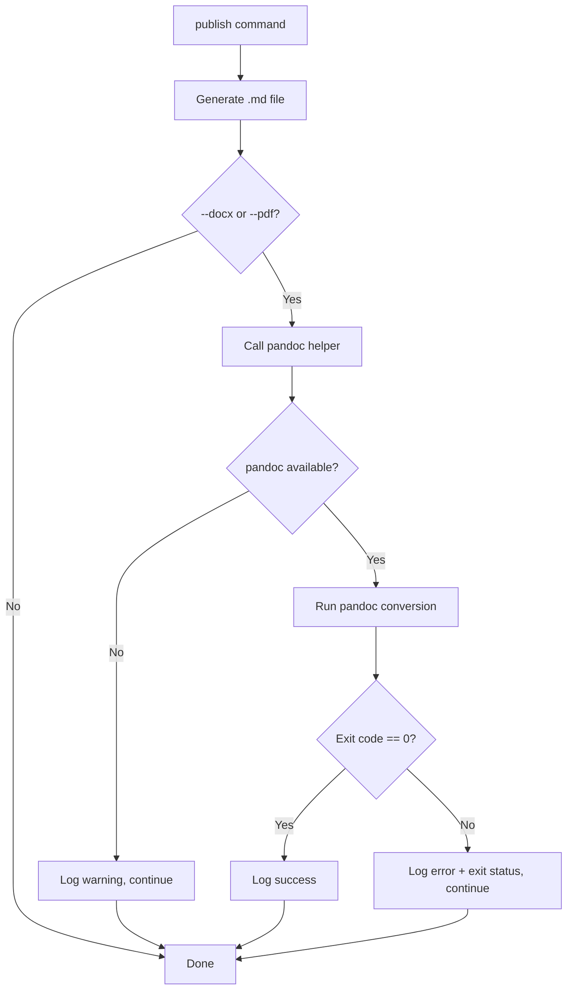

# Spec: Publishing to MS Word and PDF via Pandoc

## Problem Statement

The `publish` command currently only outputs Markdown. Users need to produce Word (.docx) and PDF documents from the same content for sharing with stakeholders who don't work with Markdown.

## Requirements

- Add `--docx` and `--pdf` flags to the `publish` CLI command.
- After generating each Markdown file, invoke Pandoc to convert it to the requested format(s).
- Output files use the same base name and directory as the Markdown (e.g., `requirements.md` → `requirements.docx`).
- Works in both single-file and per-record mode (every `.md` produced gets a companion).
- No template/reference-doc support initially — plain Pandoc conversion.
- Graceful failure: if Pandoc is absent or returns non-zero, log the error (exit status), preserve the Markdown, and exit successfully.

## Background

- The `publish` command in `cli.py` writes Markdown files via `Path.write_text()`, either a single consolidated file (`--single`) or one per input record.
- The project uses `logging` (aliased as `lg`) with `RichHandler` for structured output, and `syntagmax.utils.pprint` (rich console) for user-facing messages.
- No `subprocess` usage exists yet in the project.
- Tests use `click.testing.CliRunner` and `pytest` with `tmp_path` fixtures.

## Proposed Solution

Create a small `pandoc.py` module that encapsulates the Pandoc invocation logic (checking availability, running conversion, returning success/failure with exit status). Then add `--docx` and `--pdf` click options to the `publish` command and call the Pandoc helper after each Markdown file is written.

## Task Breakdown

### Task 1: Create the Pandoc helper module (`src/syntagmax/pandoc.py`)

**Objective:** Implement a self-contained module that checks for Pandoc availability and runs conversions.

**Implementation guidance:**
- Create `src/syntagmax/pandoc.py`.
- Function `check_pandoc() -> bool`: uses `shutil.which('pandoc')` to determine availability.
- Function `convert(source_md: Path, output_path: Path, output_format: str) -> tuple[bool, str]`: runs `subprocess.run(['pandoc', str(source_md), '-o', str(output_path)])`, captures stderr, returns `(success, message)` where message includes exit code on failure.
- Use `logging` for debug-level details and return structured results to the caller.

**Test requirements:**
- Unit test `check_pandoc()` with mocked `shutil.which` (both found and not-found cases).
- Unit test `convert()` with mocked `subprocess.run` — simulate success (returncode=0), failure (returncode!=0 with stderr), and `FileNotFoundError` (pandoc missing at runtime).

**Demo:** Running `pytest tests/test_pandoc.py` passes, demonstrating the helper module works correctly in isolation.

---

### Task 2: Add `--docx` and `--pdf` CLI options to the `publish` command

**Objective:** Wire the new flags into the CLI and invoke the Pandoc helper after each Markdown file is written.

**Implementation guidance:**
- In `cli.py`, add two click options to the `publish` command: `@click.option('--docx', is_flag=True, help='Convert output to DOCX via Pandoc')` and `@click.option('--pdf', is_flag=True, help='Convert output to PDF via Pandoc')`.
- After each `.md` file is written (both in the `single` branch and the per-record loop), if either flag is set:
  1. Check Pandoc availability once (cache result at start of command).
  2. If not available, log a warning via `lg.warning()` and `u.pprint('[yellow]...[/yellow]')`, then skip conversion.
  3. If available, call `convert()` for each requested format.
  4. On success, print a green confirmation message.
  5. On failure, print a yellow warning with the exit status and stderr snippet. Do not `sys.exit(1)`.
- Output path: replace `.md` extension with `.docx` or `.pdf` respectively.

**Test requirements:**
- CLI integration test using `CliRunner` with mocked `pandoc` module:
  - `--docx` flag produces expected call to `convert()` with correct paths.
  - `--pdf` flag works similarly.
  - Both flags together produce both calls.
  - When `check_pandoc()` returns False, command still exits 0 and Markdown file exists.
  - When `convert()` returns failure, command still exits 0 and Markdown file exists.

**Demo:** Running `uv run syntagmax publish --all --docx --pdf` on a test project shows the Markdown file is produced; if Pandoc is installed, DOCX and PDF are generated; if not, a clear warning is logged and the command exits cleanly.

---

### Task 3: Add logging for Pandoc exit status

**Objective:** Ensure the Pandoc exit status is logged in a structured way for troubleshooting.

**Implementation guidance:**
- In `pandoc.py`, when `subprocess.run` returns non-zero, include the exit code and truncated stderr (first 500 chars) in the returned message.
- In `cli.py`, log the message via `lg.warning(message)` so it appears in verbose output, and use `u.pprint(f'[yellow]Pandoc conversion failed: {message}[/yellow]')` for user-facing output.
- When Pandoc is not found, log: `lg.warning('pandoc executable not found in PATH')`.

**Test requirements:**
- Verify the returned message from `convert()` contains the exit code when subprocess fails.
- Verify the warning message is present in CLI output when conversion fails (check `result.output` from CliRunner).

**Demo:** Running the publish command with a deliberately broken Pandoc scenario shows the exit status logged clearly without crashing.

---

### Task 4: Update documentation

**Objective:** Document the new `--docx` and `--pdf` options in README.md.

**Implementation guidance:**
- Add a subsection under the "Publishing" section in `README.md` titled "DOCX/PDF Export (Pandoc Integration)".
- Document the flags, the requirement for Pandoc to be installed, and the graceful failure behavior.
- Add examples: `uv run syntagmax publish --all --docx` and `uv run syntagmax publish --all --single --pdf`.

**Test requirements:** N/A (documentation only).

**Demo:** README reflects the new functionality with clear usage examples.
