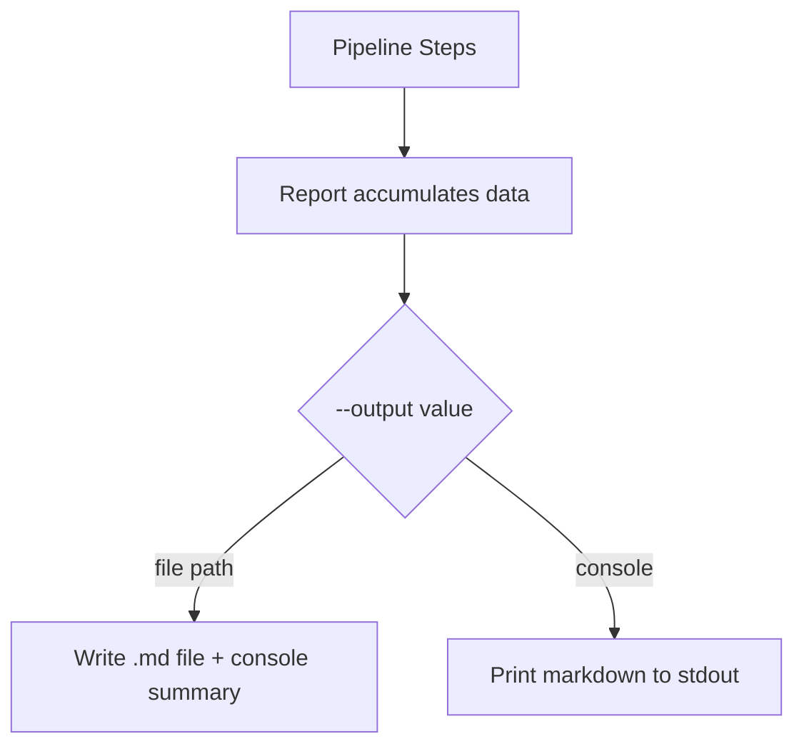

# Unified Report — Implementation Spec

## Problem Statement

Currently, Syntagmax outputs analysis results (errors, metrics, impact, AI scores, tree) via separate mechanisms — some to individual files, some to console via rich tables. The goal is to consolidate everything into a single Markdown report file (default: `.syntagmax/reports/report.md`), with a `--output` CLI flag to override the path (or `console` for stdout).

## Requirements

- Unite errors, metrics, impact, AI analysis, and (optionally) tree into one Markdown report
- Rename `--error-output` flag to `--output`
- Default output path: `<cwd>/.syntagmax/reports/report.md`
- When `--render-tree` is given, include the tree in the report (not console)
- When `--output console`, print the Markdown to stdout
- Remove per-section `output_format` / `output_file` config options (always markdown in unified report)
- AI analysis section: table with one row per artifact, 4 metric columns
- Report section order: Errors → Tree → Metrics → Impact → AI
- After writing, print a brief summary line to console (e.g., "Report written to X, N errors")

## Background

- The pipeline in `main.py` runs steps via DAG. Each step mutates `artifacts` and appends to `errors`.
- Metrics/impact currently render their own output at the end of their step functions.
- The tree is rendered to console via `print_arttree` after all steps.
- AI results are printed inline per artifact.
- Errors are only written to a file in the `FatalError` exception handler in `cli.py`.

## Proposed Solution

Introduce a `Report` class that accumulates sections (errors, tree, metrics, impact, AI) during pipeline execution. Each step writes its data to the report object instead of rendering independently. After pipeline completion, the report is rendered to a single Markdown string (via a Jinja2 template) and written to the output path.

## Task Breakdown

### Task 1: Create the `Report` class and unified template

- **Objective:** Build a `Report` dataclass/class in a new `src/syntagmax/report.py` that holds sections (errors, tree_text, metrics, impact, ai_results) and a `render()` method that produces Markdown via a Jinja2 template.
- Create `src/syntagmax/resources/report.j2` template with all sections in order.
- **Test:** Unit test that creates a `Report` with sample data for each section, calls `render()`, and asserts the output contains expected headings and content.
- **Demo:** `pytest` passes with a test that renders a complete report from sample data.

### Task 2: Refactor `Params` and CLI flags

- **Objective:** Replace `error_output` with `output` in `Params` TypedDict. Rename `--error-output` to `--output` in `cli.py` with default `.syntagmax/reports/report.md`. Remove the global `_error_output` variable pattern.
- Update all test files that construct `Params` to include the new field.
- **Test:** Existing tests still pass with updated `Params` construction.
- **Demo:** `uv run syntagmax --help` shows `--output` instead of `--error-output`.

### Task 3: Refactor `Config` to remove per-section output options

- **Objective:** Remove `output_format` and `output_file` fields from `MetricsConfig` and `ImpactConfig`. Remove `template` and `locale` fields if they're only used for per-section rendering (keep `locale` if used elsewhere). Update `ConfigFile` model accordingly.
- Keep backward compatibility: if old config files have these fields, they are simply ignored (use `model_config` with `extra='ignore'` or just remove the fields and let pydantic ignore unknowns).
- **Test:** Config loading still works with example configs that have the old fields.
- **Demo:** Loading the example config doesn't crash despite having `output_format`/`output_file`.

### Task 4: Refactor metrics step to return data instead of rendering

- **Objective:** Modify `calculate_metrics()` to return the `metrics` benedict instead of calling `print_metrics`/`publish_metrics`. The caller (`main.py`) will store it in the report.
- Remove `publish.py` (its logic is now in the unified report template).
- Remove `print_metrics` from `render.py`.
- **Test:** Unit test that `calculate_metrics` returns expected data structure.
- **Demo:** Running the pipeline populates the report's metrics section.

### Task 5: Refactor impact step to return data instead of rendering

- **Objective:** Modify `perform_impact_analysis()` to return `impact_data` without calling `_render_impact_report`. Remove `_print_impact_console` and `_publish_impact_report` from `impact.py`.
- **Test:** Existing impact tests still pass (they already check returned data).
- **Demo:** Impact data flows into the report object.

### Task 6: Refactor AI step to return structured results

- **Objective:** Modify `ai_analyze()` to collect results into a list of dicts (`[{aid, atype, ambiguity, completeness, verifiability, singularity}]`) and return it, instead of printing inline.
- **Test:** Unit test with a mock provider verifying the returned structure.
- **Demo:** AI results are captured as structured data.

### Task 7: Refactor tree rendering for Markdown output

- **Objective:** Add a `render_tree_markdown(artifacts, ref, verbose)` function in `render.py` that returns a plain-text tree string (same format as current console output, but without rich markup). This string will be embedded in the report as a code block.
- **Test:** Unit test that the rendered tree string contains expected artifact IDs and structure characters.
- **Demo:** Tree can be rendered to a string suitable for Markdown.

### Task 8: Wire everything together in `main.py` and `cli.py`

- **Objective:**
  - In `main.py`, create a `Report` instance, pass data from each step into it (metrics, impact, AI, tree).
  - After pipeline, if `render_tree` is set, generate tree text and add to report.
  - Errors are always added to the report.
  - Return the report from `process()`.
  - In `cli.py`, after `process()` returns, call `report.render()` and write to `--output` path (or stdout if `console`). Print summary line to console.
  - Remove the `FatalError` error-report-writing logic from `cli.py`; errors are now part of the unified report. (Keep `FatalError` for early pipeline failures, but the report handles the normal error flow.)
- **Test:** Integration test that runs the example project and verifies a report file is produced at the default path with all expected sections.
- **Demo:** `uv run syntagmax --render-tree --cwd ./example/obsidian-driver analyze` produces `.syntagmax/reports/report.md` with all sections, and prints a summary line.

### Task 9: Update documentation and example config

- **Objective:** Update `README.md` to reflect the new `--output` flag, remove references to per-section `output_format`/`output_file`, document the unified report. Update example config to remove the old output fields.
- **Test:** N/A (documentation).
- **Demo:** README accurately describes the new behavior.

## Files Affected

| File | Action |
|------|--------|
| `src/syntagmax/report.py` | **New** — Report class |
| `src/syntagmax/resources/report.j2` | **New** — Unified Jinja2 template |
| `src/syntagmax/cli.py` | Modify — rename flag, wire report output |
| `src/syntagmax/params.py` | Modify — `error_output` → `output` |
| `src/syntagmax/main.py` | Modify — orchestrate report accumulation |
| `src/syntagmax/config.py` | Modify — remove per-section output fields |
| `src/syntagmax/metrics.py` | Modify — return data, remove rendering |
| `src/syntagmax/impact.py` | Modify — return data, remove rendering |
| `src/syntagmax/ai.py` | Modify — return structured results |
| `src/syntagmax/render.py` | Modify — add markdown tree renderer, remove `print_metrics` |
| `src/syntagmax/publish.py` | **Delete** |
| `src/syntagmax/resources/metrics.j2` | **Delete** (content moves to `report.j2`) |
| `src/syntagmax/resources/impact.j2` | **Delete** (content moves to `report.j2`) |
| `example/obsidian-driver/.syntagmax/config.toml` | Modify — remove output fields |
| `README.md` | Modify — update docs |
| `tests/test_report.py` | **New** — unit tests for report rendering |
| `tests/*.py` (multiple) | Modify — update `Params` construction |
