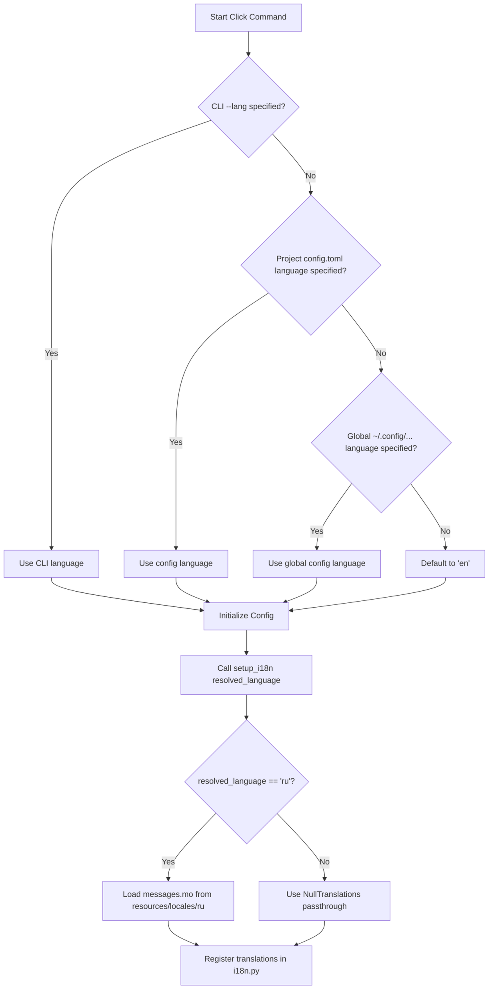

# Spec Critique: Localization — Implementation Specification

## Executive Summary

This report evaluates the proposed specification for [localization.spec.md](../specs/localization.spec.md) under the Product Lens and the Engineering Lens.

The specification introduces a unified localization infrastructure (i18n) for Syntagmax, supporting English (`en`) and Russian (`ru`) output for reports (change reports and analysis reports), controlled via a global `language` config setting and a `--lang` CLI flag.

While the feature addresses a clear user requirement, two critical implementation gaps must be addressed to prevent runtime errors and packaging failures:
1. **CLI option variable mapping**: The `@click.option('--lang')` parameter name `lang` mismatch with the `Params` TypedDict `language` field will cause a `KeyError` or type incompatibility at runtime.
2. **Hatchling wheel packaging**: The project's `.gitignore` contains `*.mo`. Since the Hatch build backend respects `.gitignore` by default, the compiled `.mo` translation catalogs will be silently omitted from the distributed wheel package, breaking localization in production.

Additionally, several architectural improvements are recommended to keep the implementation DRY, avoid polluting Python's global `builtins`, and provide warning diagnostics when translation catalogs are missing.

**Verdict:** ⚠️ **PROCEED WITH UPDATES**

---

## Findings Summary Table

| ID | Lens | Severity | Category | Finding | Suggestion |
|----|------|----------|----------|---------|------------|
| **P1** | Product | 🎯 **Must-Address** | CLI Interface | `@click.option('--lang')` maps to argument `lang`, but `Params` TypedDict specifies `language`, causing a variable mismatch. | Define the option as `@click.option('--lang', 'language', default=None)` to map it directly to `language`. |
| **E1** | Engineering | 🎯 **Must-Address** | Packaging | `.mo` is gitignored. Hatchling respects `.gitignore` and will exclude `.mo` files from built wheels, breaking production i18n. | Add exception `!src/syntagmax/resources/locales/**/*.mo` in `.gitignore`. |
| **E2** | Engineering | 💡 **Recommendation** | Architecture | Duplicating i18n resolution and `setup_i18n` calls in every subcommand violates DRY and is error-prone. | Centralize resolution and setup in the `Config` constructor. |
| **E3** | Engineering | 💡 **Recommendation** | Code Cleanliness | Modifying global `builtins` via `translations.install()` is redundant and causes static analysis (Ruff) errors. | Remove `translations.install()`; let `_` dynamically delegate to the active catalog in `i18n.py`. |
| **E4** | Engineering | 💡 **Recommendation** | Diagnostics | Silent fallback to English on missing `.mo` files for supported locales makes troubleshooting hard for users. | Log a warning when a requested translation catalog (e.g. `ru`) fails to load. |
| **E5** | Engineering | 💡 **Recommendation** | Performance | Creating and compiling a redundant English catalog is unnecessary since English is the source language. | Use `NullTranslations` directly for `'en'` and bypass loading/compiling English translation catalogs. |
| **P2** | Product | 💡 **Recommendation** | UX / Validation | Invalid CLI values are validated late during command execution rather than at option parsing time. | Use `click.Choice(['en', 'ru'])` for the CLI option definition. |
| **P3** | Product | 🤔 **Question** | Boundaries | The specification is silent on whether the MCP server should return localized responses when `language` is `'ru'`. | Clarify the localization requirements/boundaries for the MCP server. |

---

## Product Lens Findings

### CLI Interface & Parameter Mapping
* **P1: CLI Option Parameter Mismatch (Severity: 🎯 Must-Address)**
  * *Finding:* Task 2 proposes adding `@click.option('--lang', default=None)` to `rms` group and storing it in `ctx.obj` as `language`. However, Click defaults the variable name to `lang` (derived from the option name). Since the `Params` TypedDict defines `language: str`, calling `Params(**kwargs)` will cause a type/key mismatch and `language` will not be resolved from CLI correctly.
  * *Suggestion:* Declare the Click option with an explicit variable name: `@click.option('--lang', 'language', default=None, help='Output language (en, ru)')`.

* **P2: Late Command Validation (Severity: 💡 Recommendation)**
  * *Finding:* The spec proposes validating the language inside `setup_i18n` by raising a `FatalError` at runtime. Click has built-in support for restricting choices, which provides immediate, standard error formatting for CLI users.
  * *Suggestion:* Define the CLI option using `type=click.Choice(['en', 'ru'])`.

### Feature Scope Boundaries
* **P3: MCP Server Localization (Severity: 🤔 Question)**
  * *Finding:* The spec defines localization boundaries for change reports and analysis reports, and explicitly excludes `publish` (which renders user content). However, it does not specify whether the MCP server (`src/syntagmax/mcp/server.py`) should be localized.
  * *Suggestion:* Clarify whether the MCP server (consumed by LLMs) should remain English-only or adapt based on configuration. Keeping it English-only is recommended to avoid breaking LLM prompts that parse specific headers.

---

## Engineering Lens Findings

### Packaging & Distribution
* **E1: Git-Ignored Compiled catalogs (Severity: 🎯 Must-Address)**
  * *Finding:* The project's `.gitignore` contains `*.mo` to prevent binary translation catalogs from being tracked. However, Hatchling respects `.gitignore` by default when building wheel packages. If `*.mo` is ignored, Hatchling will not include the compiled Russian `.mo` catalogs in the wheel, causing localization to be broken in the installed package.
  * *Suggestion:* Add a Git ignore exception `!src/syntagmax/resources/locales/**/*.mo` in `.gitignore` to track these files and ensure Hatchling bundles them.

### Architectural Soundness
* **E2: Decentralized Resolution Logic (Severity: 💡 Recommendation)**
  * *Finding:* Task 2 proposes having each command independently resolve the active language and call `setup_i18n`. This duplicates resolution code across all commands and makes it easy to omit i18n setup in new or less-frequent commands (like CSV export).
  * *Suggestion:* Move language resolution and i18n setup into the `Config` class constructor. Since `Config` is instantiated by all commands and receives both CLI `Params` and the configuration file model, it can cleanly run:
    ```python
    cli_lang = self.params.get('language')
    self.language = cli_lang or config_model.language or 'en'
    setup_i18n(self.language)
    ```

* **E3: Pollution of Global Builtins (Severity: 💡 Recommendation)**
  * *Finding:* Calling `translations.install()` in `setup_i18n` injects `_` into Python's builtins. This is generally discouraged in library code because it can conflict with other tools and triggers linting errors (e.g. Ruff `F821 Undefined name`) unless imported. Since Task 5 already requires importing `_` from `syntagmax.i18n`, builtins pollution is redundant.
  * *Suggestion:* Define `_` in `syntagmax.i18n` as a module-level wrapper function that dynamically delegates to the active translation object, avoiding modification of Python's builtins.

* **E4: Observability & Fallback Diagnostics (Severity: 💡 Recommendation)**
  * *Finding:* If a `.mo` file is missing or corrupted, gettext falls back to English (`NullTranslations`). Doing this silently without warnings makes it hard for users or developers to debug why they are getting English when Russian was requested.
  * *Suggestion:* Log a warning in `setup_i18n` when loading a configured translation catalog fails:
    ```python
    lg.warning(f"Translation catalog for '{language}' not found. Falling back to English.")
    ```

* **E5: Redundant English Identity Catalog (Severity: 💡 Recommendation)**
  * *Finding:* Task 6 suggests creating an English `.po` catalog with identity translations (e.g., `msgstr = msgid`) and compiling it. Since English is the source language, calling gettext lookup on a redundant English catalog adds unnecessary file size and runtime lookup overhead.
  * *Suggestion:* For `'en'`, return `gettext.NullTranslations()` directly, bypassing the need to read or compile any English catalogs.

---

## Cross-Lens Insights

* **P1 × E2 (CLI Option vs Config Resolution):**
  By centralizing the language option mapping and resolving the language choice within `Config`, we eliminate the risk of subcommand parameter mismatches while keeping subcommand code clean and decoupled from localization details.
* **E1 × Packaging Reliability:**
  Fixing the gitignore issue ensures that the packaged application is identical to the development environment, preventing frustrating deployment-only bugs where translations are absent.

---

## Verdict & Action Plan

**Verdict:** ⚠️ **PROCEED WITH UPDATES**

### Proposed Specification Changes

#### 1. Under `Proposed Solution` in [localization.spec.md](file:///C:/Users/boris/projects/flyvercity/stmx-ws/stmx/syntagmax/docs/specs/localization.spec.md):
* **Add:**
  ```markdown
  9. Add exception rule `!src/syntagmax/resources/locales/**/*.mo` to `.gitignore` to ensure compiled catalog distribution.
  ```

#### 2. Under `Task 1: Create the i18n Module` in [localization.spec.md](file:///C:/Users/boris/projects/flyvercity/stmx-ws/stmx/syntagmax/docs/specs/localization.spec.md):
* **Replace:**
  ```markdown
  - Calls `translations.install()` to set the global `_` builtin
  - Module-level `_()` convenience accessor that delegates to the installed translations
  ```
* **With:**
  ```markdown
  - Does NOT call `translations.install()` to avoid builtins pollution and static analysis issues.
  - Module-level `_()` wrapper that delegates to the active `GNUTranslations` or `NullTranslations` object.
  - Exposes `get_translations() -> gettext.BaseTranslations` to return the current translation catalog for Jinja2 environment initialization.
  ```

#### 3. Under `Task 2: Add --lang Global CLI Flag and language Config Field` in [localization.spec.md](file:///C:/Users/boris/projects/flyvercity/stmx-ws/stmx/syntagmax/docs/specs/localization.spec.md):
* **Replace:**
  ```markdown
  - Add `@click.option('--lang', default=None, help='Output language (en, ru)')` to the `rms` Click group
  - Store in `ctx.obj` as `language`
  - Add `language: str = Field(default='en', description='Output language for reports')` to `ConfigFile` with validator restricting to `SUPPORTED_LANGUAGES`
  - Resolution logic (in each command that produces reports):
    1. If `--lang` is provided on CLI → use it
    2. Else if `language` is set in config → use it
    3. Else → `'en'`
  - Call `setup_i18n(resolved_language)` early in `analyze`, `change report`, and any other report-producing commands
  ```
* **With:**
  ```markdown
  - Add `@click.option('--lang', 'language', type=click.Choice(['en', 'ru']), default=None, help='Output language (en, ru)')` to the `rms` Click group.
  - Store in `ctx.obj` as `language`.
  - Add `language: str = Field(default='en', description='Output language for reports')` to `ConfigFile` with validator restricting to `SUPPORTED_LANGUAGES`.
  - Centralize the resolution logic inside the `Config` constructor (`config.py`):
    1. Resolve active language: `cli_lang = self.params.get('language') or config_model.language or 'en'`.
    2. Call `setup_i18n(self.language)`.
  ```

#### 4. Add a flow diagram to `Proposed Solution` in [localization.spec.md](file:///C:/Users/boris/projects/flyvercity/stmx-ws/stmx/syntagmax/docs/specs/localization.spec.md):

