# Internal Architecture Reference

This document describes the internal design of Syntagmax for prospective contributors. It covers the module structure, data flow, key abstractions, and extension points. For user-facing documentation, see [CLI.md](CLI.md), [configuration.md](configuration.md), and the [README](../../README.md).

---

## Table of Contents

- [System Overview](#system-overview)
- [Module Map](#module-map)
- [Core Data Model](#core-data-model)
- [Analysis Pipeline](#analysis-pipeline)
- [Extraction Layer](#extraction-layer)
- [Tree Construction & Validation](#tree-construction--validation)
- [Impact Analysis](#impact-analysis)
- [Metrics Engine](#metrics-engine)
- [Publishing Pipeline](#publishing-pipeline)
- [Plugin System](#plugin-system)
- [Metamodel & DSL Parser](#metamodel--dsl-parser)
- [Configuration Architecture](#configuration-architecture)
- [Git Integration](#git-integration)
- [MCP Server](#mcp-server)
- [Error Handling Strategy](#error-handling-strategy)
- [Agent-First Development Process](#agent-first-development-process)

---

## System Overview

Syntagmax consists of two independent pipelines (analysis and publish) sharing a common extraction layer, configuration model, and plugin infrastructure.

### Command Surface

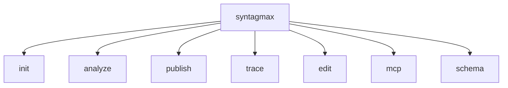

### Analysis Pipeline

The `analyze` command drives a DAG-based pipeline that resolves dependencies automatically:

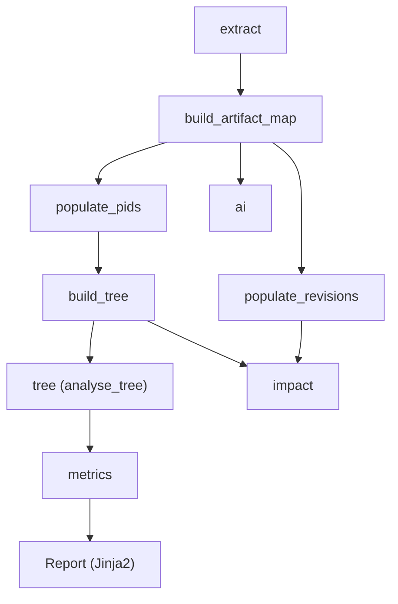

### Publish Pipeline

The `publish` command builds a block tree from extracted content, transforms it via plugins, and renders to Markdown with optional Pandoc conversion:

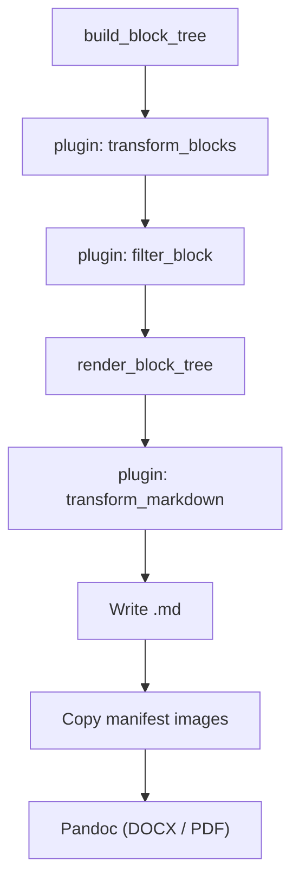

---

## Module Map

| Module | Responsibility | Key Types |
|--------|---------------|-----------|
| [`cli.py`](../../src/syntagmax/cli.py) | Click command definitions, argument parsing, orchestration | — |
| [`main.py`](../../src/syntagmax/main.py) | DAG-based step resolution and execution | `STEPS`, `DEPS` |
| [`config.py`](../../src/syntagmax/config.py) | Configuration loading, validation, input record discovery | `Config`, `ConfigFile`, `InputRecord` |
| [`artifact.py`](../../src/syntagmax/artifact.py) | Core domain model | `Artifact`, `ArtifactBuilder`, `Revision`, `ParentLink`, `Location` |
| [`blocks.py`](../../src/syntagmax/blocks.py) | Block tree model for publishing | `BlockTree`, `InputBlock`, `FileRecord`, `ArtifactBlock`, `TextBlock` |
| [`extract.py`](../../src/syntagmax/extract.py) | Extraction orchestration, artefact map construction | `EXTRACTORS` |
| [`extractors/`](../../src/syntagmax/extractors/) | Per-driver extraction logic | `Extractor` (base), `ObsidianExtractor`, `TextExtractor`, etc. |
| [`tree.py`](../../src/syntagmax/tree.py) | Parent-child tree construction, ancestor propagation | `RootArtifact`, `populate_pids`, `build_tree` |
| [`analyse.py`](../../src/syntagmax/analyse.py) | Metamodel validation, ID schema enforcement, trace validation | `ArtifactValidator` |
| [`impact.py`](../../src/syntagmax/impact.py) | Revision-based impact detection | `perform_impact_analysis` |
| [`metrics.py`](../../src/syntagmax/metrics.py) | Polars-based metrics aggregation | `calculate_metrics` |
| [`ai.py`](../../src/syntagmax/ai.py) | AI analysis orchestration | `ai_analyze` |
| [`ai_providers.py`](../../src/syntagmax/ai_providers.py) | Provider adapters (Anthropic, OpenAI, Gemini, Ollama, Bedrock) | — |
| [`publish.py`](../../src/syntagmax/publish.py) | Block tree construction and markdown rendering | `build_block_tree`, `render_block_tree` |
| [`publish_config.py`](../../src/syntagmax/publish_config.py) | Pydantic model for `publish.yaml` | `PublishConfig`, `TableSection`, `TextSection` |
| [`publish_context.py`](../../src/syntagmax/publish_context.py) | Image manifest and resolution context | `RenderContext`, `ImageManifest` |
| [`plugin.py`](../../src/syntagmax/plugin.py) | Plugin loading, validation, and hook execution | `PluginConfig`, `LoadedPlugin` |
| [`metamodel.py`](../../src/syntagmax/metamodel.py) | Lark grammar parser for `.syntagmax` DSL | `DSLTransformer`, `load_metamodel` |
| [`git_utils.py`](../../src/syntagmax/git_utils.py) | Git blame, revision population, dirty worktree detection | `RepoCache`, `populate_revisions` |
| [`trace.py`](../../src/syntagmax/trace.py) | Traceability matrix construction and CSV rendering | `TraceMatrix`, `TraceRecord` |
| [`edit.py`](../../src/syntagmax/edit.py) | Artefact ID renumbering | `renumber_artifacts` |
| [`edit_attrs.py`](../../src/syntagmax/edit_attrs.py) | Bulk attribute manipulation | `manipulate_attributes`, `load_csv_mapping` |
| [`report.py`](../../src/syntagmax/report.py) | Jinja2-based report rendering | `Report` |
| [`pandoc.py`](../../src/syntagmax/pandoc.py) | Pandoc subprocess integration | `convert`, `check_pandoc` |
| [`obsidian_settings.py`](../../src/syntagmax/obsidian_settings.py) | Obsidian vault `app.json` reader | `read_obsidian_attachment_path` |
| [`utils.py`](../../src/syntagmax/utils.py) | Topological sort, console output | `get_execution_plan` |
| [`errors.py`](../../src/syntagmax/errors.py) | Exception hierarchy | `RMSException`, `FatalError`, `ValidationError` |
| [`mcp/server.py`](../../src/syntagmax/mcp/server.py) | FastMCP server with tool definitions | `SyntagmaxMCPServer` |

---

## Core Data Model

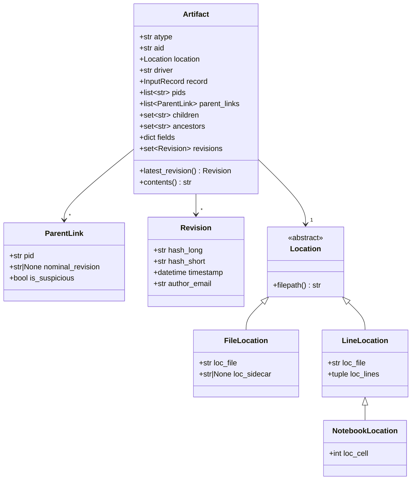

**`ArtifactMap`** is defined as `dict[str, Artifact]` — keyed by artifact ID. This is the primary shared data structure across pipeline steps.

---

## Analysis Pipeline

The analysis pipeline is a DAG resolved at runtime. Users request a target step; the engine computes the transitive dependency closure and executes steps in topological order.

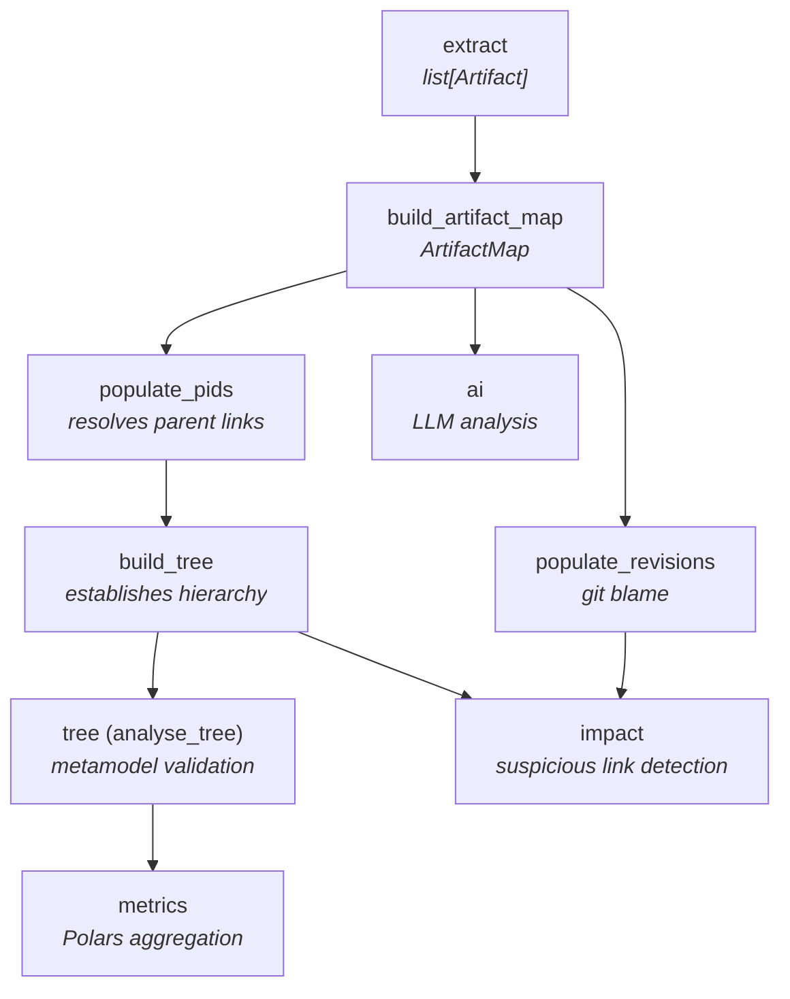

### Step Resolution

Resolution uses Python's `graphlib.TopologicalSorter`. Given target `T`:

1. Collect all transitive dependencies of `T` into a set.
2. Build the subgraph containing only those steps.
3. Topologically sort the subgraph.
4. Execute in order, passing shared `artifacts` map and `errors` list.

**Design constraint:** Steps communicate exclusively through the shared `ArtifactMap` and `errors` list. There is no return value protocol between steps (except `extract` → `build_artifact_map` which passes the raw list).

### Public vs Internal Steps

Five steps are exposed to users: `extract`, `tree`, `impact`, `metrics`, `ai`. The remaining steps (`build_artifact_map`, `populate_pids`, `build_tree`, `populate_revisions`) are internal intermediates resolved automatically.

---

## Extraction Layer

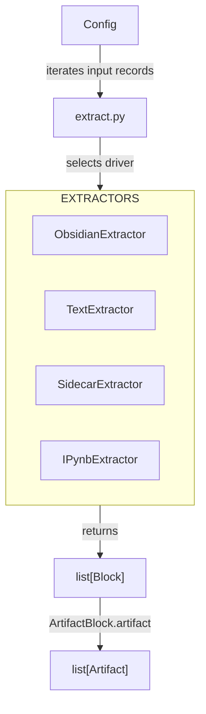

### Extractor Base Class

All drivers inherit from `Extractor` ([`extractors/extractor.py`](../../src/syntagmax/extractors/extractor.py)) and implement:

- `extract_blocks_from_file(filepath) → list[Block]` — primary extraction hook (used by both analysis and publishing)
- `update_artifact(artifact, fields)` — in-place edit for renumbering
- `update_artifact_attributes(...)` — bulk attribute manipulation (returns modified content as string for atomic writes)

The `extract_from_file` convenience method derives artifacts and errors from blocks, but the block-level method is the canonical interface.

### Driver Characteristics

| Driver | Input Format | Location Type | Block Types Produced |
|--------|-------------|---------------|---------------------|
| Obsidian | Markdown + YAML frontmatter | `LineLocation` | `ArtifactBlock`, `TextBlock`, `ErrorBlock` |
| Text | Source code with comment markers | `LineLocation` | `ArtifactBlock`, `TextBlock`, `ErrorBlock` |
| Sidecar | Binary file + `.yaml` sidecar | `FileLocation` | `ArtifactBlock`, `ErrorBlock` |
| IPYNB | Jupyter Notebook cells | `NotebookLocation` | `ArtifactBlock`, `ErrorBlock` |

### ArtifactBuilder

Extraction uses the builder pattern (`ArtifactBuilder`) to construct artefacts incrementally. The builder consults the metamodel at field-addition time to handle:
- Multiple-value attributes (list accumulation)
- Reference-type attributes (comma-split parsing)
- Enum types (comma-separated multi-enum parsing)

---

## Tree Construction & Validation

Tree construction is a two-phase process:

**Phase 1: `populate_pids`** — Scans all artefacts, identifies reference-to-parent attributes via the metamodel, and populates `artifact.pids` and `artifact.parent_links`. Handles revision pinning (`parent: REQ-001@c2d94e4`) and multiple parent references.

**Phase 2: `build_tree`** — Establishes bidirectional links (`children` sets), identifies top-level artefacts, creates the synthetic `RootArtifact`, and propagates ancestor sets via DFS (depth-limited to 20 levels for cycle detection).

**Validation (`analyse_tree`)** uses `ArtifactValidator` to enforce:
- Required/optional attributes (with conditional presence via boolean anchors)
- Enum value membership
- ID schema patterns (`{atype}-{num:3}`)
- Trace rule completeness (every artefact of type X must link to type Y if declared mandatory)

---

## Impact Analysis

Impact analysis ([`impact.py`](../../src/syntagmax/impact.py)) compares revision metadata to detect stale parent links.

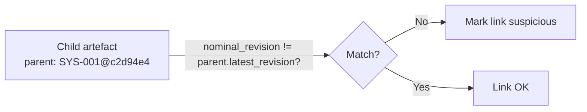

**Two modes:**

| Mode | Trigger | Comparison |
|------|---------|------------|
| `via commit` | Explicit hash in parent reference | Exact match: 7-char short hash or 40-char full hash only |
| `via timestamp` | Implicit (`nominal_revision = 'older'`) | `parent.latest_revision.timestamp > child.latest_revision.timestamp` |

The exact-hash comparison is a deliberate design choice — partial prefixes of other lengths are rejected.

Output: A `benedict` dict containing `suspicious_links` (list of dicts with IDs, types, nominal vs actual revisions) and `suspicious_tree` (ASCII tree visualisation of affected subtrees).

---

## Metrics Engine

Metrics ([`metrics.py`](../../src/syntagmax/metrics.py)) uses Polars DataFrames for efficient aggregation over large artefact sets.

**Computed metrics:**
- Total requirement count
- Requirements grouped by status
- Percentage without verification method
- Percentage containing TBD markers
- Status distribution

The engine is configurable via `[metrics]` in config: `requirement_type`, `status_field`, `verify_field`, `tbd_marker`.

---

## Publishing Pipeline

The publish pipeline is independent from analysis and operates on a **block tree** intermediate representation.

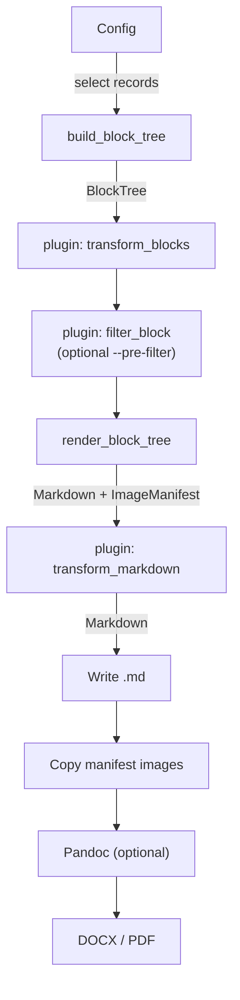

### Block Tree Structure

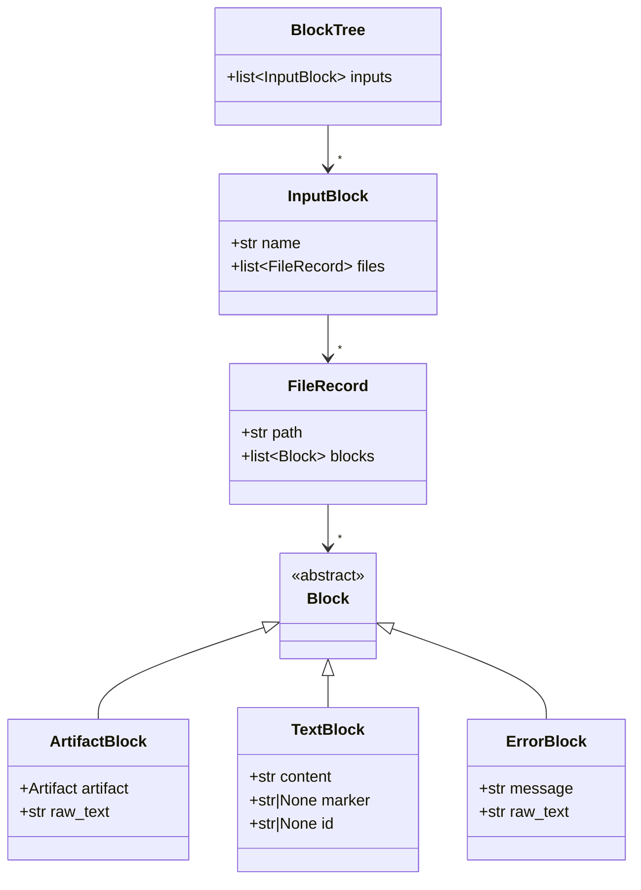

### Image Resolution

The `RenderContext` resolves `![[image.png]]` Obsidian-style references:

1. Check Obsidian `attachmentFolderPath` (if integration enabled) — O(1) lookup.
2. Fall back to vault-wide file scan.
3. Register resolved source in `ImageManifest` (deduplication via resolved path).
4. After rendering, all manifest entries are copied to `<output_dir>/images/` with stale cleanup.

### Publish Configuration

Per-record rendering is controlled by `publish.yaml` files (Pydantic-validated via `PublishConfig`). These define:
- Artefact attribute rendering (table sections, text sections)
- Fragment marker rendering
- Attribute aliases

---

## Plugin System

Plugins ([`plugin.py`](../../src/syntagmax/plugin.py)) provide four hooks:

| Hook | Signature | Purpose |
|------|-----------|---------|
| `transform_blocks` | `(tree, config, params) → BlockTree` | Modify the block tree before rendering |
| `transform_markdown` | `(markdown, config, params) → str` | Post-process rendered markdown |
| `filter_block` | `(block, config, params) → bool` | Per-block pre-publishing filter (activated via `--pre-filter`) |
| `export_trace` | `(matrix, config, params) → None` | Custom tracing export (activated via `--plugin` on trace command) |

### Loading Strategy

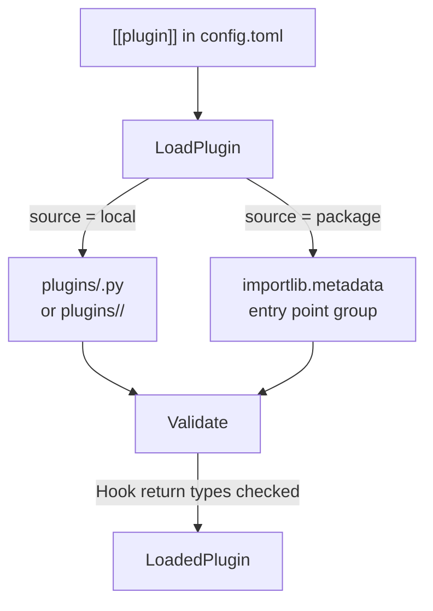

- Execution order matches declaration order in `config.toml`.
- Individual plugins can be disabled via `enabled = false`.
- Plugin names are validated against path traversal.
- Missing or broken plugins raise `FatalError` at load time (fail-fast).

---

## Metamodel & DSL Parser

The metamodel ([`metamodel.py`](../../src/syntagmax/metamodel.py)) is parsed from `.syntagmax` files using a **Lark grammar** with indentation-based syntax.

### Parser Output Structure

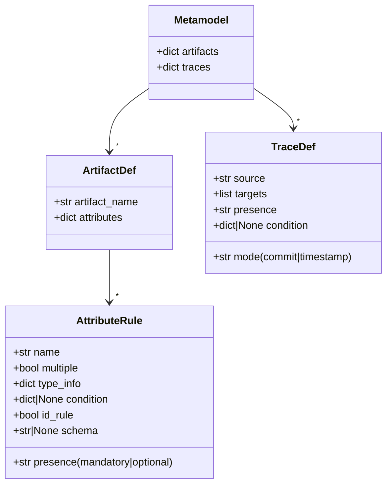

### Supported Attribute Types

| Type | `type_info.type` | Notes |
|------|------------------|-------|
| `string` | `string` | — |
| `integer` | `integer` | — |
| `boolean` | `boolean` | Custom true/false values supported |
| `enum [...]` | `enum` | `allowed_values` list in type_info |
| `multiple enum [...]` | `enum` | `multiple = True` |
| `reference to parent` | `reference` | `to_parent = True` |

### Conditional Attributes

Attributes can have conditions: `if <anchor>` or `if not <anchor>`. The anchor must refer to a boolean attribute on the same artefact. Condition evaluation occurs during validation in `ArtifactValidator`.

---

## Configuration Architecture

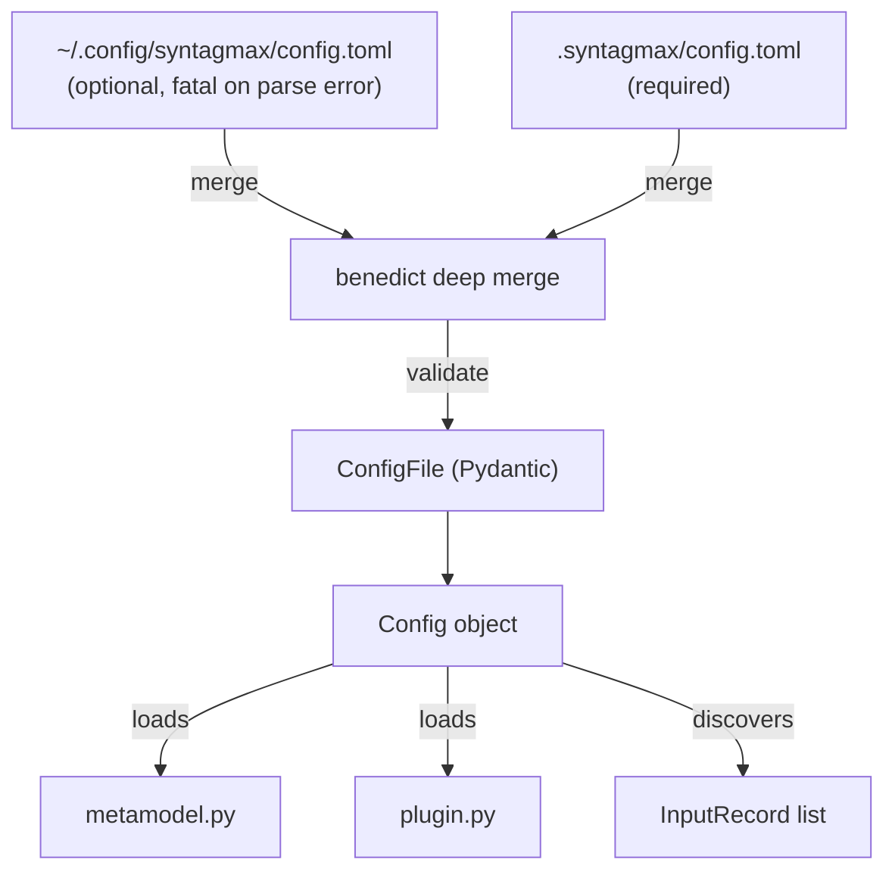

**Key design decisions:**
- Global config parse errors are intentionally **fatal** (not silently ignored).
- Project config takes precedence over global config via deep merge.
- All configuration is validated through Pydantic models (`ConfigFile`, `InputConfig`, `MetricsConfig`, etc.) with `extra='forbid'` where applicable.
- `Config` is the God object — it's passed to nearly every subsystem. Contributors should be aware this is a high-risk file for changes.

### Directory Resolution

- **Root directory:** Directory containing `config.toml`
- **Base directory:** `config.base` relative to root (typically `..`)
- **Input record paths:** `config.input[].dir` relative to base directory
- **Publish config paths:** Relative to root directory

---

## Git Integration

Git integration ([`git_utils.py`](../../src/syntagmax/git_utils.py)) provides revision metadata via `git blame`.

### Revision Population Strategy

| Location Type | Strategy |
|---------------|----------|
| `LineLocation` | `git blame` on the specific line range → set of unique commit hashes |
| `FileLocation` (sidecar) | Last commit on primary file + all commits on sidecar file |

The `RepoCache` avoids repeated repository discovery: once a repo is found for a given directory, it's cached for all subsequent artefacts in that subtree.

**Dirty worktree:** Detected per-repository. Unless `--allow-dirty-worktree` is set, a dirty worktree produces an error and halts analysis.

---

## MCP Server

The MCP server ([`mcp/server.py`](../../src/syntagmax/mcp/server.py)) uses FastMCP and exposes three tools:

| Tool | Description |
|------|-------------|
| `list_artifacts` | List all artefacts with ID, type, location |
| `search_artifacts` | Keyword search across artefact fields |
| `get_artifact_content` | Full artefact detail including parent links and revisions |

On startup, the server runs the full analysis pipeline (through `analyse_tree`) and holds the `ArtifactMap` in memory. The server supports both `stdio` and `sse` transports.

---

## Error Handling Strategy

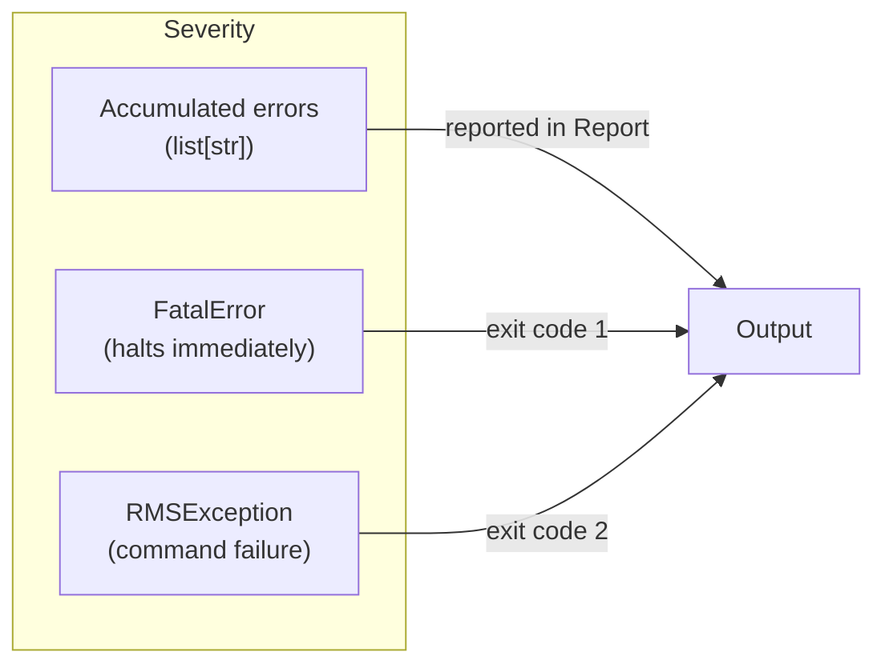

**Three severity levels:**

| Level | Mechanism | When Used |
|-------|-----------|-----------|
| **Accumulated** | Appended to `errors: list[str]` | Validation failures, missing parents, extraction warnings |
| **Fatal** | `raise FatalError(errors)` | Config parse failure, metamodel load failure, plugin load failure |
| **Exception** | `raise RMSException(msg)` | Unrecoverable processing errors |

Design principle: the system accumulates as many errors as possible per run (to give the user a full picture) rather than failing on the first error. Fatal errors are reserved for conditions where continued execution would be meaningless.

---

## Agent-First Development Process

Syntagmax follows an agent-first development workflow where AI agents are primary implementers under human direction.

### Specification Workflow

```
docs/seed/<name>.md  →  docs/specs/<name>.md  →  Implementation
     (intent)              (blueprint)              (code + tests)
```

1. **Seed spec** (`docs/seed/`): Concise human-written intent document — what to build, key examples, expected interfaces. Written in the developer's voice, may be informal.
2. **Full spec** (`docs/specs/`): Detailed implementation blueprint derived from the seed — requirements, background, architecture diagrams, and numbered task breakdowns with test requirements.
3. **Implementation**: Agents execute the full spec's tasks. Each task includes implementation guidance (which files, which patterns) and verification criteria.

### Contribution Checklist

Contributors (human or agent) should:

1. Check for existing seed/spec before implementing a feature.
2. Run `ruff` after any code change — zero errors/warnings required.
3. Run `pytest tests` — all tests must pass.
4. Follow the project's existing patterns rather than introducing new abstractions.
5. Use `--dry-run` when testing edit operations during development.

### Pin-Based Context

The project uses a Pin MCP to store persistent factoids (coding style, design decisions, intentional behaviours). Agents should fetch these before starting work to avoid violating documented constraints.

### Key Constraints to Respect

- Global config parse errors are **intentionally fatal** — do not add fallback logic.
- Impact analysis uses **exact hash comparison** (7 or 40 chars) — partial prefixes are rejected by design.
- Plugin hook return types are **strictly validated** — changing signatures is a breaking change.
- Configuration uses **Pydantic `extra='forbid'`** in most models — unknown keys are rejected.
- The project uses **CalVer** (`YYYY.M.D`) for versioning.
