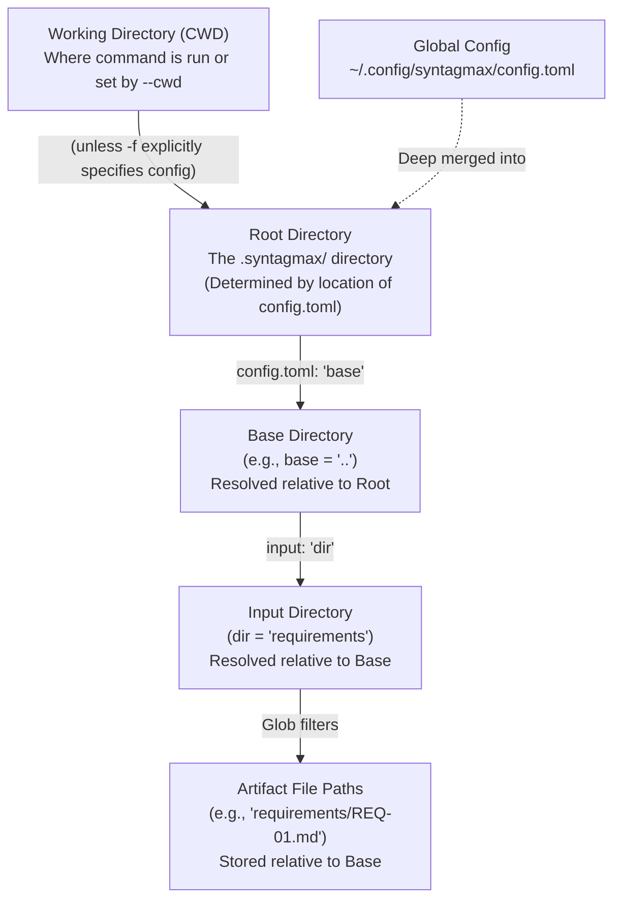

# Paths Reference

This document describes how Syntagmax resolves different directories, configuration paths, and file references. Understanding these path resolution rules is critical for organizing your requirements repositories, setting up custom output folders, or integration with external editors like Obsidian.

---

## Path Hierarchy Overview

Syntagmax uses a hierarchical, relative-by-default system to locate your requirements, templates, configurations, and outputs.

Here is how the main directory concepts relate to each other:

---

## Directory Types

### 1. Working Directory (CWD)
* **What it is:** The operating system current working directory from which you execute the `syntagmax` CLI command.
* **How to change it:** Pass the global `--cwd PATH` option **before** any command name (e.g., `syntagmax --cwd ./my-project analyze`).
* **Role in resolution:** When initializing a project with `syntagmax init` or searching for the default `.syntagmax/config.toml`, Syntagmax resolves paths relative to this directory.

### 2. Root Directory
* **What it is:** The directory containing the configuration file (`config.toml`). By default, this is the `.syntagmax/` directory.
* **How it is determined:** Computed as the parent directory of the loaded `config.toml` file (which defaults to `.syntagmax/config.toml` relative to the Working Directory, or can be overridden via `-f / --config-file`).
* **Role in resolution:**
  * The **Base Directory** is resolved relative to this Root Directory. For example, if Root is `.syntagmax/` and `base = ".."`, the Base Directory resolves to the parent of `.syntagmax/` (which is your project root).
  * Global publish configuration paths are resolved relative to this Root Directory.
  * Metamodel filenames (e.g., `project.syntagmax`) are resolved relative to this Root Directory.

### 3. Base Directory
* **What it is:** The absolute root of your source repository or vault where all artifacts are physically located.
* **How it is configured:** In `.syntagmax/config.toml` under the top-level option `base` (e.g., `base = ".."`).
* **How it resolves:** It is resolved relative to the **Root Directory** (the directory of the config file).
* **Role in resolution:**
  * All input record directories (`[[input]]` -> `dir`) are resolved relative to the Base Directory.
  * All extracted artifact locations (saved in the artifact database) are stored as relative paths with respect to this Base Directory.
  * Obsidian vault settings (like the `.obsidian` folder or vault-relative attachment paths) are resolved relative to this Base Directory.

### 4. Input Directory (`dir`)
* **What it is:** The specific directory containing artifacts/requirements for a given input source.
* **How it is configured:** Under `[[input]]` using the `dir` field (e.g., `dir = "requirements/SYS"`).
* **How it resolves:** It is resolved relative to the **Base Directory**.

---

## Configuration Paths

### Global Configuration
* **Path:** `~/.config/syntagmax/config.toml`
* **Resolution:** Loaded first, if present. Errors in global configuration are intentionally fatal and will halt execution. The project-specific `config.toml` is deep-merged on top of the global configuration, with project settings taking precedence.

### Publish Configuration
Publish configurations (`publish.yaml` or `publish.toml`) dictate how artifacts and sections are formatted during rendering. They can be defined at different levels with the following resolution order:

1. **Per-record publish configuration:**
   * Configured via `publish` under an `[[input]]` block in `config.toml`.
   * **Resolution:** Resolved relative to the **Base Directory**. If the file is not found, Syntagmax raises a fatal configuration error.
2. **Global publish configuration:**
   * Configured via the `publish` field under the top-level of `config.toml`.
   * **Resolution:** Resolved relative to the **Root Directory** (the directory of the configuration file, typically `.syntagmax/`).
3. **Auto-discovery:**
   * If neither per-record nor global publish configuration is defined, Syntagmax searches for `publish.yaml`, `publish.yml`, or `publish.toml` inside the Root Directory (typically `.syntagmax/`).
4. **All-default rendering:**
   * If no publish file is found, Syntagmax falls back to the default rendering template structure.

---

## Obsidian Vault Path Resolution

When `integration = true` is set in `[drivers.obsidian]`, Syntagmax integrates with the Obsidian vault settings.

### 1. Obsidian Root (`root`)
* **How it is configured:** Under `[drivers.obsidian]` via the `root` option.
* **Default:** `<base_dir>/.obsidian`
* **Resolution:** Resolved relative to the **Base Directory**. This directory is scanned for Obsidian vault settings, specifically `app.json` to read settings like `attachmentFolderPath` or `strictLineBreaks`.

### 2. Attachment Folder Resolution
During publishing, image references (`![[image.png]]`) in Markdown are resolved in the following priority order:

1. **Obsidian `attachmentFolderPath` (if integration enabled):**
   * Syntagmax reads the `attachmentFolderPath` setting from `.obsidian/app.json`.
   * **Vault-relative paths** (e.g., `"attachments/pics"`) are resolved relative to the **Base Directory**.
   * **Note-relative paths** (e.g., `"./attachments"` or `"."`) are resolved relative to the directory of the current source note.
2. **Vault-wide File Scan:**
   * If the file is not found in the configured attachment folder (or integration is disabled), Syntagmax performs a vault-wide scan relative to the **Base Directory** to find the file by name.

All resolved attachment files are copied into `<output_dir>/images/` during publishing.
