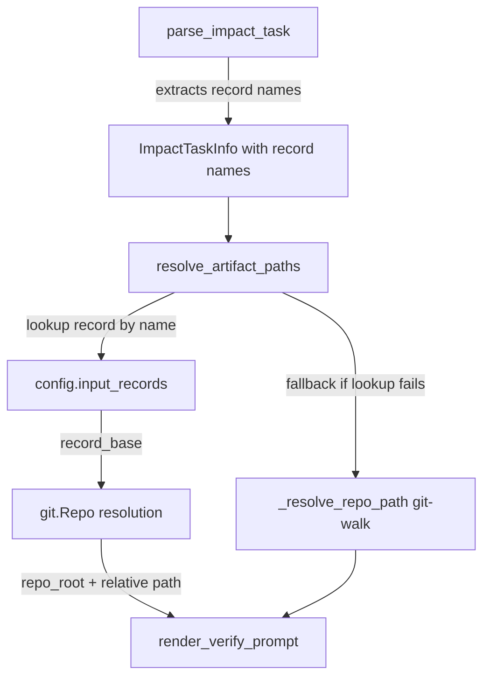

# Spec: Pass Full Filenames and Repo Paths to Agents

GitHub Issue: https://github.com/flyvercity/syntagmax/issues/117

## Problem Statement

The `syntagmax ai verify` command passes artifact file paths to the AI agent prompt, but the agent is slow to locate the actual files. Currently the prompt includes absolute file paths and a dynamically-resolved repo root, but does not clearly separate the **repository root** from the **file's relative path within that repository**. The agent wastes time navigating or searching for files instead of immediately opening them.

The fix is to leverage input records (which already know each `record_base` directory and can resolve the owning git repository) to pass explicit, unambiguous path information: the absolute repo root and the file path relative to that repo root.

## Requirements

1. The prompt template must include a `Relative Path (in repo)` field for both parent and child artifacts, showing the file path relative to the git repository root.
2. The `Repository` field in the prompt must contain the absolute path to the git repository working tree root.
3. The `File` field continues to show the absolute path to the artifact file (for backward compatibility and direct access).
4. Path resolution must use **input records** (loaded from config) to determine which git repository each artifact belongs to, rather than generic `git.Repo(search_parent_directories=True)` walk from the file path.
5. The `ImpactTaskInfo` dataclass must be extended to include `parent_record_name` and `child_record_name`, parsed from the task file's "Input Record" fields.
6. If the input record name is missing from the task file (backward compatibility with old tasks) or not found in the current config, the system must fall back to the existing `_resolve_repo_path()` git-walk behavior.
7. The task file template (`task.j2`) is NOT modified — this is runtime-only resolution.
8. All existing tests must continue to pass.
9. Documentation (`docs/reference/ai.md`) must be updated to mention the explicit path fields in the prompt.
10. All relative paths passed to the prompt must be normalized to forward slashes using `.as_posix()`. If `relative_to()` raises a `ValueError` (e.g., cross-drive paths on Windows, symlinks outside repo), the helper must fall back gracefully to returning `file_path` (the base_dir-relative path, forward-slash normalized).

## Background

### Current Path Resolution Flow (`cli_ai.py`)

```python
parent_repo_path = _resolve_repo_path(config, task_info.parent_file_path)
# ...
parent_file_path=str(config.base_dir() / task_info.parent_file_path),
parent_repo_path=parent_repo_path,
```

`_resolve_repo_path()` takes the file path (relative to `base_dir`), constructs an absolute path, and walks up with `git.Repo(search_parent_directories=True)` to find the repo root. This is generic and always works, but doesn't leverage the structured knowledge in input records.

### Input Records and Path Structure

Each input record has:
- `name`: e.g., `"system-requirements"`
- `dir`: e.g., `"SYS"` (relative to `base_dir`)
- `record_base`: `base_dir / dir` (absolute path to the record's directory)

The `record_base` is always inside a git repository. `change_baseline.py` already demonstrates the pattern of resolving `record_base → git.Repo → repo_root`:

```python
repo = git.Repo(str(record_path), search_parent_directories=True)
repo_root = Path(repo.working_tree_dir).resolve()
```

### Task File Structure

Task files contain (for both parent and child):
```markdown
- **Input Record:** system-requirements
- **File:** SYS/SYS-003.md
```

The "Input Record" field maps to a config input record name, which provides `record_base`.

### Current Prompt Template Fields

```jinja2
- File: {{ parent_file_path }}
- Repository: {{ parent_repo_path }}
```

### Artifact File Paths

Artifact `location.filepath()` returns paths relative to `base_dir` (via `config.derive_path()`). Example: `SYS/SYS-003.md` where `base_dir` might be `/home/user/project` and the file is at `/home/user/project/SYS/SYS-003.md`.

The git repo root might be the same as `base_dir`, or it could be a parent directory (e.g., if `base_dir` is a subdirectory of a larger repo). The relative-to-repo path would then be different from the relative-to-base-dir path.

## Proposed Solution

### Architecture



### Data Model Changes

`ImpactTaskInfo` gains two optional fields:

```python
@dataclass
class ImpactTaskInfo:
    # ... existing fields ...
    parent_record_name: str  # empty string if not present in task file
    child_record_name: str   # empty string if not present in task file
```

### New Resolution Helper

```python
@dataclass
class ArtifactPaths:
    """Resolved path information for an artifact."""
    repo_root: str       # Absolute path to git repo working tree root
    relative_path: str   # File path relative to repo root (forward slashes)
    absolute_path: str   # Absolute path to the file


def resolve_artifact_paths(
    config: Config,
    record_name: str,
    file_path: str,
) -> ArtifactPaths:
    """Resolve artifact paths using input record configuration.

    Looks up the input record by name, resolves the git repo root from
    record_base, and computes the file's path relative to that repo root.

    Falls back to generic git-walk if record lookup fails.
    """
```

### Updated Prompt Template

```jinja2
### Parent (updated)
- ID: {{ parent_aid }}
- Type: {{ parent_atype }}
- File: {{ parent_file_path }}
- Relative Path (in repo): {{ parent_relative_path }}
- Repository: {{ parent_repo_path }}
- Revision at task creation: {{ parent_revision }}

### Child (potentially outdated)
- ID: {{ child_aid }}
- Type: {{ child_atype }}
- File: {{ child_file_path }}
- Relative Path (in repo): {{ child_relative_path }}
- Repository: {{ child_repo_path }}
```

## Task Breakdown

### Task 1: Extend `ImpactTaskInfo` and `parse_impact_task()`

**Objective:** Add `parent_record_name` and `child_record_name` to `ImpactTaskInfo` and parse them from the task file.

**Implementation guidance:**
- File: `src/syntagmax/ai.py`
- Add two fields to the `ImpactTaskInfo` dataclass (default to empty string for backward compat)
- In `parse_impact_task()`, extract "Input Record" safely using `parent_fields.get('Input Record', '')` and `child_fields.get('Input Record', '')` (defaulting to empty string if missing). Do NOT use direct key indexing to avoid `KeyError` on legacy task files.
- These fields are optional — if not present, default to empty string

**Test requirements:**
- Update `VALID_TASK_CONTENT` fixture to include "Input Record" fields
- Assert `info.parent_record_name == 'system-requirements'` and `info.child_record_name == 'software-requirements'`
- Add a test with a task file missing Input Record fields → fields default to empty string

**Demo:** `pytest tests/test_ai.py -k parse_impact_task`

### Task 2: Add `ArtifactPaths` dataclass and `resolve_artifact_paths()` helper

**Objective:** Create a function that resolves repo root and relative path from input record configuration.

**Implementation guidance:**
- File: `src/syntagmax/ai.py`
- Add `ArtifactPaths` dataclass with `repo_root`, `relative_path`, `absolute_path` fields
- Implement `resolve_artifact_paths(config, record_name, file_path)`:
  1. Compute `abs_path = config.base_dir() / file_path`
  2. If `record_name` is non-empty, look up record in `config.input_records()` by name
  3. If found, resolve git repo from `record.record_base` using `git.Repo(search_parent_directories=True)`
  4. Compute `relative_path`: try `abs_path.resolve().relative_to(repo_root).as_posix()`. On `ValueError` (cross-drive, symlink outside repo), catch exception and fall back to `Path(file_path).as_posix()`.
  5. If lookup fails at any step, fall back: resolve git repo from `abs_path.parent` directly
  6. Return `ArtifactPaths(repo_root=str(repo_root), relative_path=relative_path, absolute_path=str(abs_path))`

**Test requirements:**
- Create a git repo in `tmp_path`, add files, mock config with input records
- Test successful resolution via record name
- Test fallback when record name is empty
- Test fallback when record name doesn't match any config record
- Test when file is not in a git repo (returns base_dir as repo_root, file_path as relative)
- Assert that `relative_path` always uses forward slashes (no backslashes), even on Windows

**Demo:** `pytest tests/test_ai.py -k resolve_artifact_paths`

### Task 3: Update prompt template and `render_verify_prompt()`

**Objective:** Add relative path fields to the Jinja2 template and update the render function signature.

**Implementation guidance:**
- File: `src/syntagmax/resources/ai-verify-impact.j2`
  - Add `- Relative Path (in repo): {{ parent_relative_path }}` after the File line in Parent section
  - Add `- Relative Path (in repo): {{ child_relative_path }}` after the File line in Child section
- File: `src/syntagmax/ai.py`
  - Add `parent_relative_path: str` and `child_relative_path: str` parameters to `render_verify_prompt()`
  - Pass them to `template.render()`

**Test requirements:**
- Update `test_render_verify_prompt_contains_expanded_sections` to assert "Relative Path (in repo)" appears in output
- Add a focused test that verifies the relative paths are correctly interpolated

**Demo:** `pytest tests/test_ai.py -k render_verify_prompt`

### Task 4: Wire up resolution in `cli_ai.py`

**Objective:** Replace `_resolve_repo_path()` calls with the new `resolve_artifact_paths()` helper.

**Implementation guidance:**
- File: `src/syntagmax/cli_ai.py`
- Import `ArtifactPaths` and `resolve_artifact_paths` from `syntagmax.ai`
- In `verify()`, after parsing task info:
  ```python
  parent_paths = resolve_artifact_paths(config, task_info.parent_record_name, task_info.parent_file_path)
  child_paths = resolve_artifact_paths(config, task_info.child_record_name, task_info.child_file_path)
  ```
- Update `render_verify_prompt()` call to use:
  ```python
  parent_file_path=parent_paths.absolute_path,
  parent_repo_path=parent_paths.repo_root,
  parent_relative_path=parent_paths.relative_path,
  child_file_path=child_paths.absolute_path,
  child_repo_path=child_paths.repo_root,
  child_relative_path=child_paths.relative_path,
  ```
- Remove or deprecate `_resolve_repo_path()` (it's now internal to `resolve_artifact_paths`)
- Add `lg.debug()` calls logging the resolved `repo_root` and `relative_path` for both parent and child after resolution, for troubleshooting visibility

**Test requirements:**
- Verify that the full verify flow uses the new resolution (mock `resolve_artifact_paths` or check prompt output)

**Demo:** `uv run syntagmax --log debug --cwd ./example/obsidian-driver ai verify .syntagmax/tasks/TASK-IMPACT-REQ-003-SYS-003.md` (log output shows correct paths)

### Task 5: Update documentation and tests

**Objective:** Update docs and ensure full test coverage.

**Implementation guidance:**
- File: `docs/reference/ai.md` — add a note about the new "Relative Path (in repo)" field in the prompt format documentation
- Edge-case tests:
  - Task file without "Input Record" fields (backward compat) — falls back to git-walk
  - Record name in task file doesn't match any config record — falls back to git-walk
  - Multi-repo scenario: parent and child in different repos

**Test requirements:**
- Full `pytest tests/test_ai.py` passes
- No regressions in other test modules

**Demo:** `pytest tests/test_ai.py` all green
