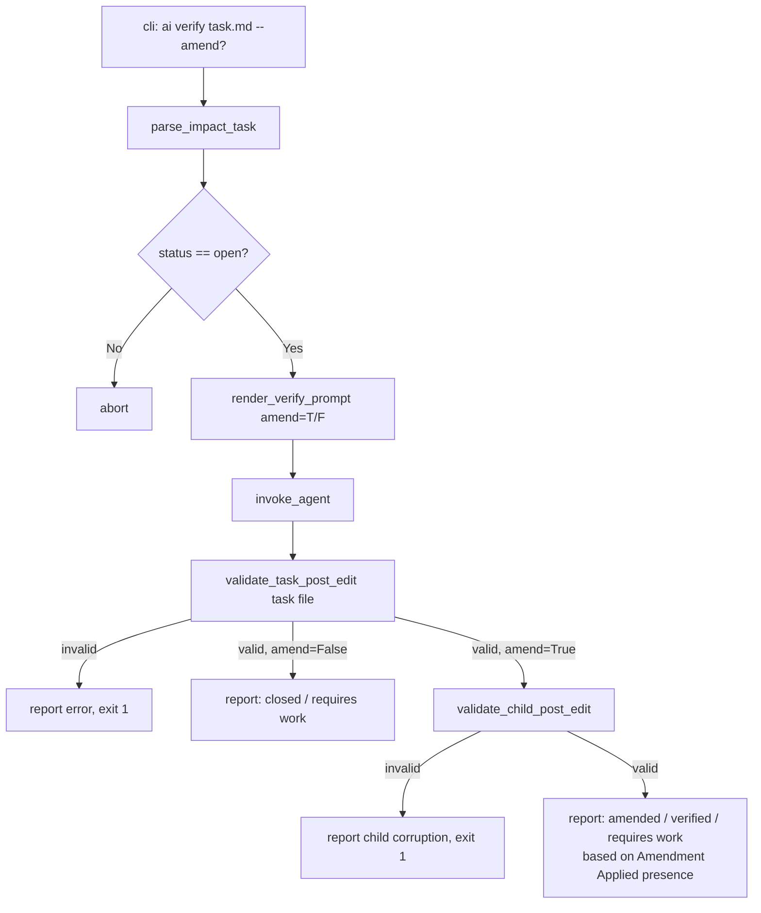

# Spec: `ai verify --amend` — Two-Phase Verification with Amendment

## Problem Statement

`syntagmax ai verify` currently performs an audit-only consistency check. When a child artifact fails
verification, the user gets a FAIL verdict but no guidance on what to change or any automated fix.

This spec adds `--amend` mode and restructures the agent prompt into two explicit phases:

- **Phase 1 (Analysis)** — always runs: assess parent/child consistency and write the Verification Report.
- **Phase 2 (Recommendation)** — runs on FAIL when `--amend` is absent: append an `### Amendment Recommendation`
  subsection to the report describing what the child needs to change, without touching the child file.
- **Phase 2 (Implementation)** — runs on FAIL when `--amend` is present: directly edit the child artifact
  to resolve the discrepancies, then close the task.

## Requirements

1. `syntagmax ai verify <task-file>` gains a new `--amend` flag (boolean, default off).
2. Without `--amend`: the rendered prompt instructs the agent to perform Phase 1 (audit), and — if the verdict
   is FAIL — also Phase 2 (Recommendation), appending a `### Amendment Recommendation` subsection inside
   `## Verification Report`. The child artifact MUST NOT be modified.
3. With `--amend`: the rendered prompt instructs the agent to perform Phase 1 (audit), and — if the verdict
   is FAIL — also Phase 2 (Implementation): edit the child artifact to resolve every discrepancy identified
   in the Change Mapping, then set `status: closed` in the task frontmatter and append a
   `### Amendment Applied` subsection inside `## Verification Report` describing what was changed.
4. When `--amend` is used and the amendment succeeds, the task is closed (same post-edit validation path
   as a regular PASS). The CLI status message distinguishes amendment from a clean PASS: it prints
   `"✓ Task <id> verified and child artifact amended."` **only** when `### Amendment Applied` is present
   in the final task file content, confirming the agent actually edited the child. When `--amend` is set
   but the verdict was PASS (no amendment needed), the message is the standard
   `"✓ Task <id> verified and closed."`. A `git diff` reminder is printed after the "amended" message.
5. `validate_task_post_edit` is not changed — validation of the task file remains loose (no new required
   sections). A separate `validate_child_post_edit` function validates the child artifact after `--amend`
   runs: the file must exist, be non-empty, and — if it contains YAML frontmatter — parse without errors.
6. `render_verify_prompt` gains an `amend: bool = False` parameter passed through to the template.
7. All behavioural difference between `--amend` and default mode lives entirely in the Jinja2 template.
8. The `--amend` flag is CLI-only — no config-file equivalent.
9. Under `amend=True`, the prompt explicitly constrains the agent to modify **only** the child artifact
   and the task file. The parent artifact and all other project files are strictly read-only.
10. If the agent is **unsure** how to perform Phase 2 (either Recommendation or Implementation) — for
    example because the required change is ambiguous, requires design judgment, or the agent cannot
    determine the correct fix with confidence — it MUST: leave `status: open`, leave the child artifact
    untouched, and append a `### Rationale` subsection (inside `## Verification Report`) explaining
    specifically why it is uncertain and what information would be needed to proceed.

## Background

### Affected Files

| File | Role |
|------|------|
| `src/syntagmax/ai.py` | `render_verify_prompt` signature; new `validate_child_post_edit` |
| `src/syntagmax/resources/ai-verify-impact.j2` | Prompt template (primary change surface) |
| `src/syntagmax/cli_ai.py` | Click `verify` command options and post-run messaging |
| `docs/reference/ai.md` | Reference documentation |
| `tests/test_ai.py` | Unit tests for rendering and child validation |
| `tests/test_cli_ai.py` | New: CLI integration tests for `--amend` flag |

### Current `render_verify_prompt` Signature

```python
def render_verify_prompt(
    config,
    task_file_path: str,
    parent_aid: str,
    parent_atype: str,
    parent_file_path: str,
    parent_repo_path: str,
    parent_relative_path: str,
    parent_revision: str,
    child_aid: str,
    child_atype: str,
    child_file_path: str,
    child_repo_path: str,
    child_relative_path: str,
    agent_name: str,
) -> str:
```

### Current Template Structure

The existing `ai-verify-impact.j2` has these sections:
- Persona injection
- `## Task` — context framing
- `## Artifacts` — parent and child metadata
- `## Instructions` — numbered steps culminating in editing the task file
- `## Verification Report Format` — format reference for the agent
- `## Constraints` — guard rails

The new template extends this with a Phase 1 / Phase 2 split and conditional Phase 2 content.

### Post-Edit Validation

`validate_task_post_edit` (unchanged) checks the task file:
- frontmatter is valid
- `id` is unchanged
- `status` is `open` or `closed`
- `## Verification Report` section is present

With `--amend`, a successful amendment closes the task (`status: closed`), which satisfies
the existing validation. No changes to this function are required.

A new `validate_child_post_edit(child_path: Path) -> tuple[bool, str]` function is called
after the agent exits when `amend=True`. It checks:
- `child_path.exists()` — the child file was not deleted
- `child_path.stat().st_size > 0` — the child file is non-empty
- If the child file contains YAML frontmatter (`---`), it must parse without syntax errors

If validation fails, Syntagmax reports the failure and exits with code 1.
The user can recover with `git checkout -- <child_file>`.

## Proposed Solution

### Architecture



### `render_verify_prompt` Signature Extension

Add `amend: bool = False` as the last keyword parameter:

```python
def render_verify_prompt(
    config,
    task_file_path: str,
    parent_aid: str,
    parent_atype: str,
    parent_file_path: str,
    parent_repo_path: str,
    parent_relative_path: str,
    parent_revision: str,
    child_aid: str,
    child_atype: str,
    child_file_path: str,
    child_repo_path: str,
    child_relative_path: str,
    agent_name: str,
    amend: bool = False,
) -> str:
```

Pass `amend=amend` to `template.render(...)`.

### Template Structure

The template is restructured into two named phases. Phase 1 is always rendered; Phase 2 is conditional.

```
{{ persona }}

## Task
[context framing — unchanged]

## Artifacts
[parent/child metadata — unchanged]

---

## Phase 1: Analysis

[numbered instructions for assessment + writing the Verification Report including all
existing subsections: Parent Changes, Child Changes, Change Mapping, Rationale]

### Verification Report Format (Phase 1)

[existing format including Verdict/Agent/Date/revisions/Parent Changes/Child Changes/
Change Mapping/Rationale subsections]

---

## Phase 2: {{ "Implementation" if amend else "Recommendation" }}


**Execute Phase 2 only if the Phase 1 verdict is FAIL.**

Append a `### Amendment Recommendation` subsection at the end of the
`## Verification Report` section. Do NOT modify the child artifact file.

### Amendment Recommendation Format

```
### Amendment Recommendation
<Bulleted list of specific, actionable edits to make to the child artifact
to bring it into consistency with the parent. Each bullet should reference
a specific discrepancy from the Change Mapping and state the exact change
needed (e.g., attribute to add/update, text to revise, reference to add).>
```

**Execute Phase 2 only if the Phase 1 verdict is FAIL.**

Edit the child artifact at `{{ child_file_path }}` to resolve every discrepancy
identified in the Phase 1 Change Mapping. Preserve the child artifact's existing
structure, formatting conventions, attribute order, and writing style. Then:

1. Set `status: closed` in the task file frontmatter.
2. Append a `### Amendment Applied` subsection at the end of the
   `## Verification Report` section.

### Amendment Applied Format

```
### Amendment Applied
<Bulleted list of the specific changes made to the child artifact.
Each bullet should reference the discrepancy it resolves
and briefly describe the edit made.>
```


---

## Constraints

[existing constraints, but the "Do NOT modify child artifact" constraint
is gated: present unconditionally when amend=False, replaced when amend=True]
```

**Constraint list by mode:**

| Constraint | amend=False | amend=True |
|---|---|---|
| Do NOT modify `id` or `contents` in frontmatter | ✓ | ✓ |
| Do NOT alter existing markdown sections above report | ✓ | ✓ |
| Do NOT modify the parent artifact file | ✓ | ✓ |
| Do NOT modify the child artifact file | ✓ | — |
| Do NOT modify any file other than the child artifact and task file | — | ✓ |
| DO edit the child artifact to resolve discrepancies; preserve structure and style | — | ✓ |
| If uncertain how to perform Phase 2, leave `status: open`, leave child untouched, append `### Rationale` explaining the uncertainty | ✓ | ✓ |
| If a discrepancy requires human design judgment, apply only safe partial amendments and leave `status: open`, noting unresolvable items | — | ✓ |
| Only change `status` to `closed` if verdict is PASS | ✓ | — |
| Only change `status` to `closed` after amendment is applied | — | ✓ |
| Change Mapping MUST address every item in Parent Changes | ✓ | ✓ |

### CLI Change (`cli_ai.py`)

```python
@ai.command(help='Verify an impact task using an AI agent')
@click.argument('task_file', type=click.Path(exists=True))
@click.option('--agent', default=None, help='Override the default agent')
@click.option('--amend', is_flag=True, default=False,
              help='Directly amend the child artifact if verification fails')
@click.pass_obj
def verify(obj: Params, task_file: str, agent: str | None, amend: bool):
    ...
    prompt = render_verify_prompt(
        ...,
        amend=amend,
    )
    ...
    # Re-read to check final status and whether amendment was applied
    final_content = task_path.read_text(encoding='utf-8')
    final_fm = _parse_frontmatter(final_content)
    final_status = final_fm.get('status', 'unknown') if final_fm else 'unknown'
    amendment_applied = '### Amendment Applied' in final_content

    # Post-edit validation: child artifact (amend + amendment actually applied only)
    if amend and amendment_applied:
        child_valid, child_message = validate_child_post_edit(Path(child_paths.absolute_path))
        if not child_valid:
            u.pprint(f'[red]Child artifact integrity check failed: {child_message}[/red]')
            u.pprint('[yellow]Use `git checkout -- <child_file>` to recover if needed.[/yellow]')
            sys.exit(1)

    # Post-run messaging
    if final_status == 'closed':
        if amend and amendment_applied:
            u.pprint(f'[green]✓ Task {task_info.task_id} verified and child artifact amended.[/green]')
            u.pprint(f'[dim]Review changes: git diff {child_paths.relative_path}[/dim]')
        else:
            u.pprint(f'[green]✓ Task {task_info.task_id} verified and closed.[/green]')
    else:
        u.pprint(f'[yellow]Task {task_info.task_id} requires more work (status: {final_status}).[/yellow]')
```

## Task Breakdown

### Task 1: Extend `render_verify_prompt` to accept `amend`

**Objective:** Add `amend: bool = False` to the function signature in `ai.py` and pass it through
to the Jinja2 template renderer.

**Implementation guidance:**
- In `src/syntagmax/ai.py`, add `amend: bool = False` as the last parameter to `render_verify_prompt`.
- Pass `amend=amend` in the `template.render(...)` call alongside all existing variables.
- No other logic changes in `ai.py`.

**Test requirements:**
- Update `test_render_verify_prompt_contains_expanded_sections` to call with explicit `amend=False`
  (keeps existing assertions; confirms default is backward-compatible).
- Add `test_render_verify_prompt_amend_false_contains_recommendation`:
  - Call with `amend=False`.
  - Assert `'### Amendment Recommendation'` is present in the output.
  - Assert `'### Amendment Applied'` is absent.
  - Assert `'Phase 2: Recommendation'` is present.
  - Assert the child-file path is NOT mentioned in an edit/modify instruction.
- Add `test_render_verify_prompt_amend_true_contains_implementation`:
  - Call with `amend=True`.
  - Assert `'### Amendment Applied'` is present in the output.
  - Assert `'### Amendment Recommendation'` is absent.
  - Assert `'Phase 2: Implementation'` is present.
  - Assert `child_file_path` value appears in child-editing instructions.
  - Assert `'### Amendment Applied'` format block is present.
  - Assert the parent artifact immutability constraint is present (e.g. "Do NOT modify the parent artifact").
  - Assert the scope constraint is present (e.g. "Do NOT modify any file other than").
- Add `test_render_verify_prompt_uncertainty_constraint_present` (call with both `amend=False` and `amend=True`):
  - Assert `'unsure'` or `'uncertain'` appears in the rendered output.
  - Assert `'### Rationale'` appears as an uncertainty fallback instruction.
  - Assert the instruction to leave `status: open` and leave the child untouched is present.

**Demo:**
```python
prompt_rec = render_verify_prompt(..., amend=False)
assert '### Amendment Recommendation' in prompt_rec

prompt_impl = render_verify_prompt(..., amend=True)
assert '### Amendment Applied' in prompt_impl
```

---

### Task 2: Rewrite `ai-verify-impact.j2` with two-phase structure

**Objective:** Split the prompt into Phase 1 (Analysis) and Phase 2 (Recommendation or Implementation)
using the `amend` variable.

**Implementation guidance:**
- Restructure `src/syntagmax/resources/ai-verify-impact.j2` as described in the Proposed Solution.
- Phase 1 instructions: steps 1–5 from the current template (read parent, inspect diff, inspect child,
  map changes, assess overall consistency) plus the full Verification Report format block (unchanged).
- Phase 2 block gated on `` / ``:
  - `amend=False`: Phase 2 heading `## Phase 2: Recommendation`, instruction to append
    `### Amendment Recommendation` on FAIL only, format block, constraint "Do NOT modify the child artifact."
  - `amend=True`: Phase 2 heading `## Phase 2: Implementation`, instruction to edit the child artifact
    and append `### Amendment Applied` on FAIL only, format block, constraint to preserve child structure.
- Move the "Do NOT modify the child artifact" constraint inside the `` block;
  replace with "DO edit the child artifact…" inside ``.
- Keep all other constraints (do not modify `id`/`contents`, do not modify parent artifact, etc.)
  unconditional.
- Add the uncertainty constraint unconditionally (applies to both modes):
  > If you are **unsure** how to perform Phase 2 — because the required change is ambiguous, requires
  > design judgment, or you cannot determine the correct fix with confidence — you MUST:
  > - Leave `status: open`.
  > - Leave the child artifact file untouched.
  > - Append a `### Rationale` subsection inside `## Verification Report` explaining specifically
  >   why you are uncertain and what information would be needed to proceed.
- Preserve all existing Phase 1 content verbatim — the current instruction set, the full
  Verification Report format reference, and all existing constraints that are not amend-dependent.

**Test requirements:**
- Tests in Task 1 cover template rendering differences.
- Manually verify the rendered prompt is well-formed Markdown (no stray Jinja2 artifacts).

**Demo:**
```bash
# Inspect rendered prompt for each mode
python -c "
from unittest.mock import MagicMock
from syntagmax.ai import render_verify_prompt
cfg = MagicMock(); cfg.ai.persona = 'You are a systems engineer.'
print(render_verify_prompt(cfg, 'task.md', 'SYS-001', 'SYS', '/f/SYS-001.md',
  '/repo', 'SYS-001.md', 'abc1234', 'REQ-001', 'REQ', '/f/REQ-001.md',
  '/repo', 'REQ-001.md', 'kiro', amend=False))
"
```

---

### Task 3: Add `validate_child_post_edit` to `ai.py`

**Objective:** Implement a post-edit integrity check for the child artifact after an `--amend` run.

**Implementation guidance:**
- In `src/syntagmax/ai.py`, add:
  ```python
  def validate_child_post_edit(child_path: Path) -> tuple[bool, str]:
      """Validate child artifact integrity after agent amendment.

      Returns (is_valid, message).
      """
      if not child_path.exists():
          return False, f'Child artifact was deleted: {child_path}'
      if child_path.stat().st_size == 0:
          return False, f'Child artifact is empty after amendment: {child_path}'
      try:
          content = child_path.read_text(encoding='utf-8')
      except Exception as e:
          return False, f'Cannot read child artifact: {e}'
      # If frontmatter is present, it must parse cleanly
      if content.startswith('---'):
          fm = _parse_frontmatter(content)
          if fm is None:
              return False, 'Child artifact frontmatter is invalid after amendment'
      return True, 'valid'
  ```
- Export `validate_child_post_edit` from `ai.py` (add to imports in `cli_ai.py`).

**Test requirements** (in `tests/test_ai.py`):
- `test_validate_child_post_edit_valid_no_frontmatter`: non-empty file without frontmatter → valid.
- `test_validate_child_post_edit_valid_with_frontmatter`: file with valid YAML frontmatter → valid.
- `test_validate_child_post_edit_missing_file`: non-existent path → invalid, message contains "deleted".
- `test_validate_child_post_edit_empty_file`: zero-byte file → invalid, message contains "empty".
- `test_validate_child_post_edit_broken_frontmatter`: file starting with `---` but invalid YAML → invalid,
  message contains "frontmatter".

**Demo:**
```python
from syntagmax.ai import validate_child_post_edit
from pathlib import Path

ok, msg = validate_child_post_edit(Path('REQ-001.md'))
assert ok
```

---

### Task 4: Wire `--amend` into `cli_ai.py`

**Objective:** Add the `--amend` Click option, call `validate_child_post_edit` on amend runs,
and produce accurate post-run messaging.

**Implementation guidance:**
- Add to `verify` command decorator:
  ```python
  @click.option('--amend', is_flag=True, default=False,
                help='Directly amend the child artifact if verification fails')
  ```
- Add `amend: bool` to the function signature.
- Import `validate_child_post_edit` from `syntagmax.ai`.
- Pass `amend=amend` to `render_verify_prompt(...)`.
- After `validate_task_post_edit` passes, if `amend=True`, call `validate_child_post_edit`:
  ```python
  if amend:
      child_valid, child_message = validate_child_post_edit(Path(child_paths.absolute_path))
      if not child_valid:
          u.pprint(f'[red]Child artifact integrity check failed: {child_message}[/red]')
          u.pprint('[yellow]Use `git checkout -- <child_file>` to recover if needed.[/yellow]')
          sys.exit(1)
  ```
- Update the post-run status block to check for `### Amendment Applied` in `final_content`
  before printing "amended" (not merely whether `amend` flag is set):
  ```python
  amendment_applied = '### Amendment Applied' in final_content

  if final_status == 'closed':
      if amend and amendment_applied:
          u.pprint(f'[green]✓ Task {task_info.task_id} verified and child artifact amended.[/green]')
          u.pprint(f'[dim]Review changes: git diff {child_paths.relative_path}[/dim]')
      else:
          u.pprint(f'[green]✓ Task {task_info.task_id} verified and closed.[/green]')
  else:
      u.pprint(f'[yellow]Task {task_info.task_id} requires more work (status: {final_status}).[/yellow]')
  ```

**Test requirements** (in `tests/test_cli_ai.py`, using `click.testing.CliRunner`):

All tests mock `invoke_agent` to return 0 and pre-write the expected post-edit task file state.
Use the existing `cli` entry point (the top-level `rms` Click group from `cli.py`).

- `test_cli_verify_amend_pass_no_amendment`:
  - Agent produces a closed task with `## Verification Report` but no `### Amendment Applied`.
  - Assert stdout contains `"verified and closed"` (not "amended").
  - Assert `validate_child_post_edit` is NOT called (or mock it and assert zero calls).
- `test_cli_verify_amend_pass_with_amendment`:
  - Agent produces a closed task with both `## Verification Report` and `### Amendment Applied`.
  - Mock `validate_child_post_edit` to return `(True, 'valid')`.
  - Assert stdout contains `"verified and child artifact amended"`.
  - Assert stdout contains `"git diff"`.
- `test_cli_verify_amend_child_validation_failure`:
  - Agent produces valid task file but `validate_child_post_edit` returns `(False, 'Child artifact is empty')`.
  - Assert exit code is 1.
  - Assert stdout contains `"Child artifact integrity check failed"`.
- `test_cli_verify_no_amend_flag`:
  - No `--amend` flag; agent produces a closed task.
  - Assert `validate_child_post_edit` is NOT called.
  - Assert stdout contains `"verified and closed"` (not "amended").

**Demo:**
```bash
# Default mode — recommendation on fail
uv run syntagmax ai verify .syntagmax/tasks/TASK-IMPACT-REQ-003-SYS-003.md

# Amend mode — direct implementation on fail, child validated post-edit
uv run syntagmax ai verify .syntagmax/tasks/TASK-IMPACT-REQ-003-SYS-003.md --amend
```

---

### Task 5: Update `docs/reference/ai.md`

**Objective:** Document `--amend`, the two-phase prompt structure, and the new report subsections.

**Implementation guidance:**

1. **Options table** for `syntagmax ai verify`: add `--amend` row:
   ```
   | `--amend` | off | Directly amend the child artifact if verification fails |
   ```

2. **Behaviour section**: add a "Two-Phase Verification" subsection after the existing numbered list:

   > ### Two-Phase Verification
   >
   > The agent prompt is structured in two phases:
   >
   > **Phase 1 (Analysis)** — always runs. The agent reads both artifacts, inspects git history,
   > maps parent changes to child responses, and appends a `## Verification Report` section to the
   > task file with a PASS or FAIL verdict.
   >
   > **Phase 2 — Recommendation (default, `--amend` absent)** — runs only on FAIL.
   > The agent appends a `### Amendment Recommendation` subsection inside the Verification Report,
   > listing specific edits that would bring the child into consistency. The child artifact is NOT modified.
   >
   > **Phase 2 — Implementation (`--amend` present)** — runs only on FAIL.
   > The agent edits the child artifact to resolve each discrepancy, then sets `status: closed`
   > in the task frontmatter and appends a `### Amendment Applied` subsection describing what was changed.

3. **Important Notes**: change the Phase 1 note to be conditional, and add `--amend` safety notes:
   > - **Phase 1 is audit-only (without `--amend`):** The agent evaluates consistency and updates the
   >   task file. Without `--amend`, it MUST NOT modify the parent or child artifact files.
   > - **`--amend` grants write access to the child artifact:** The agent is explicitly instructed to
   >   edit the child artifact. Always review changes with `git diff` before committing.
   > - **Working directory cleanliness:** Running `--amend` on a dirty repository may overwrite pending
   >   edits in the child artifact. Ensure your working tree is clean before using `--amend`, or stash
   >   uncommitted changes first. Syntagmax emits a warning if the repository is dirty and `--amend` is set.

4. **Verification Report Format section**: extend with the conditional subsections:
   ```markdown
   ### Amendment Recommendation (appended on FAIL, without --amend)
   <Bulleted list of specific, actionable edits to make to the child artifact.>

   ### Amendment Applied (appended on FAIL, with --amend)
   <Bulleted list of changes made to the child artifact, each referencing the discrepancy resolved.>

   ### Rationale (appended instead of Amendment Recommendation/Applied when agent is uncertain)
   <Explanation of why the agent is uncertain and what information would be needed to proceed.
   status remains open; child artifact is untouched.>
   ```

5. **Examples section**: add two examples:
   ```bash
   # Verify and receive amendment guidance on fail
   syntagmax ai verify .syntagmax/tasks/TASK-IMPACT-REQ-003-SYS-003.md

   # Verify and automatically amend the child artifact on fail
   syntagmax ai verify .syntagmax/tasks/TASK-IMPACT-REQ-003-SYS-003.md --amend
   ```

**Test requirements:** None (docs only).
