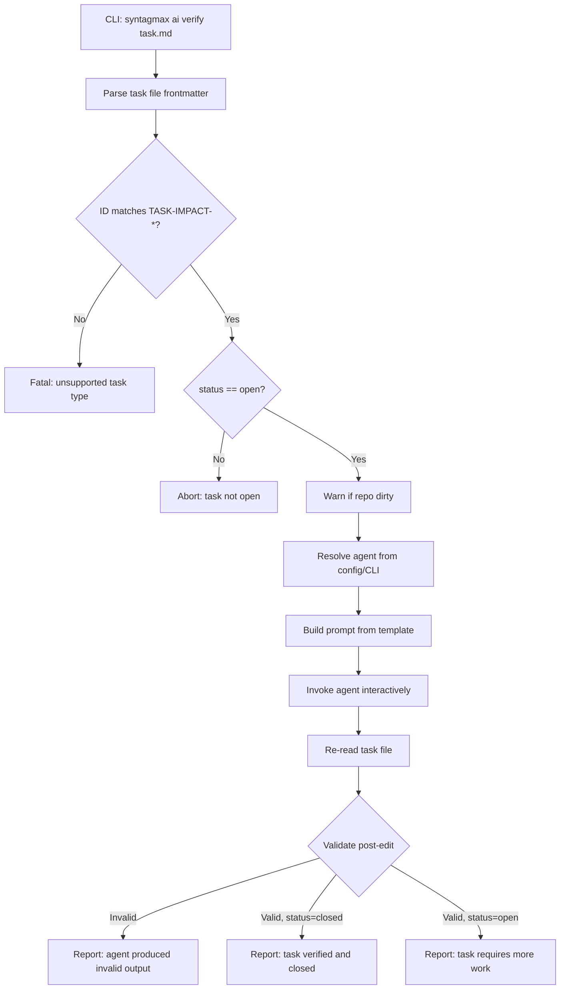

# Spec: AI Agent Commands — Phase 1: Impact Task Verification

## Problem Statement

Syntagmax generates impact tasks when a parent artifact is updated and its child may be outdated. Currently, verifying and closing these tasks is a manual process. We need an `ai verify` command that delegates the verification to a local CLI AI coding agent, validates the agent's edits, and reports the outcome.

## Requirements

1. A new `syntagmax ai verify <task-file>` command invokes a configured CLI agent to assess whether an impact task's child artifact is consistent with its updated parent. In Phase 1, verification is an audit operation: the agent evaluates consistency, updates task `status` (to `closed` if consistent or `open` if not), and appends a verification report. The agent MUST NOT modify the child or parent artifact files.
2. All AI commands live under the `syntagmax ai` command group.
3. Agent invocation is interactive (foreground, user sees agent output in real-time).
4. Agent selection uses an `[ai]` config section with a `default_agent` field, overridable via `--agent <name>` CLI flag.
5. Agent definitions are stored in a YAML registry file (`agents.yaml`) bundled as a package resource, mapping agent names to command-line invocation patterns.
6. If the repository is dirty, emit a warning but proceed (no abort, no escape hatch flag).
7. Only impact tasks (ID matching `TASK-IMPACT-*`) are supported in this version; other task types produce a fatal error.
8. The task file must have `status: open`; otherwise abort with an informative message.
9. After agent execution, Syntagmax validates the task file:
   - `id` field is unchanged
   - `status` is either `open` or `closed`
   - A `## Verification Report` section exists
   - File is not malformed (valid frontmatter)
10. If validation fails, report the failure and leave the file as-is (user can `git checkout` to recover).
11. If the agent process exits with a non-zero exit code or is not found on PATH, abort immediately with an error and skip post-edit validation.
12. Report result to user: "task verified and closed" or "task requires more work" or "agent produced invalid output".
13. The prompt template is a Jinja2 file in package resources, with a configurable persona via `[ai]` config section.
14. The prompt provides artifact file paths and repository paths but does NOT inject file contents — the agent reads them itself.
15. Parent and child may reside in different repositories; the prompt explicitly warns the agent about this.
16. The verification report appended by the agent must include: Verdict (PASS/FAIL), parent revision observed (with dirty flag), child revision observed (with dirty flag), and a rationale.

## Background

### Impact Task File Format

Generated by `src/syntagmax/tasks.py`, task files have YAML frontmatter and structured markdown:

```markdown
---
id: TASK-IMPACT-REQ-003-SYS-003
status: open
contents: "Verify REQ-003 is updated after SYS-003 change"
parent_revision: "5784c50"
child_revision: "0bf4a16"
---
# Impact Task: REQ-003 → SYS-003

## Parent (Updated)
- **ID:** SYS-003
- **Type:** SYS
- **Input Record:** system-requirements
- **File:** SYS/SYS-003.md
- **Current Revision:** 5784c50 (full: ...)

## Child (Outdated)
- **ID:** REQ-003
- **Type:** REQ
- **Input Record:** software-requirements
- **File:** REQ/REQ-003.md
- **Referenced Revision:** older

## Action Required
Verify that REQ-003 is still consistent with the updated SYS-003...
```

### Parsing Infrastructure

- `SimpleMarkdownExtractor` in `src/syntagmax/extractors/simple_markdown.py` parses frontmatter using a regex + `yaml.safe_load`.
- `_FRONTMATTER_RE` extracts the YAML block and body from markdown.
- The `tasks.py` module has `_parse_frontmatter()` for lightweight frontmatter reading during task de-duplication.

### Repository Discovery

- `git_utils.py` provides `RepoCache` which discovers repos per artifact path using `git.Repo(path, search_parent_directories=True)`.
- `is_dirty()` checks if any discovered repo has uncommitted changes.
- Parent and child artifacts may belong to different `InputRecord`s pointing to different repositories.

### CLI Architecture

- Click groups in `cli.py`; subcommands in separate `cli_*.py` files.
- Commands are registered via `rms.add_command(...)`.
- `Params` TypedDict carries CLI options through the context.

### Configuration

- `ConfigFile` Pydantic model in `config.py` holds all config sections.
- New sections are added as Pydantic models with defaults, then wired into `Config._read_config()`.

## Proposed Solution

### Architecture



### Configuration Schema

```toml
[ai]
agent = "kiro"
persona = "You are a systems engineer reviewing requirements traceability."
```

The `persona` field is injected into the prompt template. Agent-specific personas (e.g., `impact_persona`) may be added later but are out of scope for Phase 1.

### Agent Registry (`agents.yaml`)

Bundled in `src/syntagmax/resources/agents.yaml`:

```yaml
agents:
  kiro:
    command: "kiro-cli"
    prompt_flag: "--prompt"
    prompt_mode: "file"    # pass prompt as a temp file path
    description: "Kiro CLI agent"

  claude-code:
    command: "claude"
    prompt_flag: "--print"
    prompt_mode: "stdin"   # pipe prompt via stdin
    description: "Claude Code CLI"

  codex:
    command: "codex"
    prompt_flag: "--prompt"
    prompt_mode: "arg"     # pass prompt as argument value
    description: "OpenAI Codex CLI"

  copilot:
    command: "copilot"
    prompt_flag: ""
    prompt_mode: "arg"
    description: "GitHub Copilot CLI"

  opencode:
    command: "opencode"
    prompt_flag: "--prompt"
    prompt_mode: "file"
    description: "OpenCode CLI"

  antigravity:
    command: "antigravity"
    prompt_flag: "--prompt"
    prompt_mode: "file"
    description: "Antigravity CLI"

  mistral-vibe:
    command: "vibe"
    prompt_flag: "--prompt"
    prompt_mode: "file"
    description: "Mistral Vibe CLI"
```

The registry is loaded from package resources by default. Users can override it via `[ai] agents_file = "path/to/custom-agents.yaml"` (resolved relative to config file directory).

### Prompt Template

Stored as `src/syntagmax/resources/ai-verify-impact.j2`:

```jinja2
{{ persona }}

## Task
You are verifying impact traceability task `{{ task_file_path }}`.

A parent artifact was updated after the child artifact was last verified.
Determine whether the child is still consistent with the current parent.

## Artifacts

### Parent (updated)
- ID: {{ parent_aid }}
- Type: {{ parent_atype }}
- File: {{ parent_file_path }}
- Repository: {{ parent_repo_path }}
- Revision at task creation: {{ parent_revision }}

### Child (potentially outdated)
- ID: {{ child_aid }}
- Type: {{ child_atype }}
- File: {{ child_file_path }}
- Repository: {{ child_repo_path }}

**Note:** Parent and child may reside in different repositories. Use the correct repository root when inspecting git history.

## Instructions

1. Read the parent and child artifact files.
2. Understand what changed in the parent since revision `{{ parent_revision }}`.
3. Assess whether the child still correctly derives from / implements the parent.
4. Edit the task file at `{{ task_file_path }}`:
   - If consistent: set `status: closed` in frontmatter.
   - If not consistent: leave `status: open`.
   - Append a `## Verification Report` section (format below).

## Verification Report Format

Append this section at the end of the task file:

```
## Verification Report
- **Verdict:** PASS | FAIL
- **Parent revision observed:** <short hash> (dirty: yes/no)
- **Child revision observed:** <short hash> (dirty: yes/no)
- **Rationale:** <3-10 sentences explaining your assessment>
```

## Constraints

- Do NOT modify `id` or `contents` in the frontmatter.
- Do NOT alter existing markdown sections above the report.
- Do NOT modify the parent or child artifact files. This is an audit operation only.
- Only change `status` from `open` to `closed` if verdict is PASS.
```

### Invocation Logic

```python
def invoke_agent(agent_config: dict, prompt: str, working_dir: Path) -> int:
    """Invoke the agent interactively, returning exit code."""
    import subprocess
    import tempfile
    import shlex
    import os

    cmd_parts = shlex.split(agent_config['command'])
    prompt_flag = agent_config.get('prompt_flag', '')
    prompt_mode = agent_config.get('prompt_mode', 'file')

    prompt_path = None
    try:
        if prompt_mode == 'file':
            with tempfile.NamedTemporaryFile(mode='w', suffix='.md', delete=False, encoding='utf-8') as f:
                f.write(prompt)
                prompt_path = f.name
            if prompt_flag:
                cmd_parts += [prompt_flag, prompt_path]
            else:
                cmd_parts.append(prompt_path)
            stdin_input = None
        elif prompt_mode == 'stdin':
            if prompt_flag:
                cmd_parts.append(prompt_flag)
            stdin_input = prompt
        elif prompt_mode == 'arg':
            if prompt_flag:
                cmd_parts += [prompt_flag, prompt]
            else:
                cmd_parts.append(prompt)
            stdin_input = None

        result = subprocess.run(
            cmd_parts,
            cwd=working_dir,
            stdin=subprocess.PIPE if stdin_input else None,
            input=stdin_input,
            encoding='utf-8' if stdin_input else None,
        )
        return result.returncode
    except FileNotFoundError:
        raise FatalError(f"Agent executable '{cmd_parts[0]}' not found on PATH.")
    finally:
        if prompt_path and os.path.exists(prompt_path):
            os.unlink(prompt_path)
```

The agent runs in the foreground — stdout/stderr are inherited by default, so the user sees the agent's output in real-time.

### Post-Edit Validation

```python
def validate_task_post_edit(task_path: Path, original_id: str) -> tuple[bool, str]:
    """Validate the task file after agent edit.

    Returns (is_valid, message).
    """
    content = task_path.read_text(encoding='utf-8')
    frontmatter = parse_frontmatter(content)

    if frontmatter is None:
        return False, 'Task file has no valid frontmatter after edit'

    if frontmatter.get('id') != original_id:
        return False, f'Task ID was modified (expected {original_id})'

    status = frontmatter.get('status')
    if status not in ('open', 'closed'):
        return False, f'Invalid status "{status}" (must be open or closed)'

    if '## Verification Report' not in content:
        return False, 'No "## Verification Report" section found'

    return True, 'valid'
```

### File Layout

```
src/syntagmax/
├── ai.py                  # Core: agent registry, prompt building, invocation, validation
├── cli_ai.py              # Click command group and verify subcommand
├── resources/
│   ├── agents.yaml        # Agent registry
│   └── ai-verify-impact.j2  # Prompt template
```

### Module Responsibilities

| Module | Responsibility |
|--------|---------------|
| `cli_ai.py` | Click group `ai`, subcommand `verify`, CLI option handling |
| `ai.py` | Load agent registry, resolve agent, render prompt, invoke agent, validate result |
| `config.py` | New `AiConfig` Pydantic model, wired into `ConfigFile` and `Config` |

## Task Breakdown

### Task 1: Add `AiConfig` to configuration

**Objective:** Add `[ai]` config section with `default_agent`, `persona`, and optional `agents_file` fields.

**Implementation guidance:**
- In `src/syntagmax/config.py`, add:
  ```python
  class AiConfig(BaseModel):
      model_config = ConfigDict(extra='ignore')
      default_agent: str = Field(default='kiro', description='Default CLI agent name')
      persona: str = Field(
          default='You are a systems engineer reviewing requirements traceability.',
          description='Persona injected into AI prompts',
      )
      agents_file: str | None = Field(default=None, description='Custom agents registry YAML (relative to config file dir)')
  ```
- Add `ai: AiConfig = Field(default_factory=AiConfig)` to `ConfigFile`.
- Wire `self.ai = config_model.ai` in `Config._read_config()`.
- Add a `Config.ai_config` property returning `self.ai`.

**Test requirements:**
- Unit test: default `AiConfig` values.
- Unit test: custom `[ai]` section parses correctly.
- Unit test: missing `[ai]` section uses defaults.

**Demo:**
```bash
uv run syntagmax --cwd ./example/obsidian-driver analyze
```
(Should not break existing behaviour.)

---

### Task 2: Create agent registry and loader

**Objective:** Bundle `agents.yaml` and implement registry loading logic.

**Implementation guidance:**
- Create `src/syntagmax/resources/agents.yaml` with agent definitions (kiro, claude-code, codex, copilot, opencode, antigravity, mistral-vibe).
- In `src/syntagmax/ai.py`, implement:
  ```python
  def load_agent_registry(config: Config) -> dict:
      """Load agent definitions from package resources or custom file."""

  def resolve_agent(registry: dict, agent_name: str) -> dict:
      """Look up agent by name, raise FatalError if not found."""
  ```
- Use `importlib.resources` to load the bundled YAML.
- If `config.ai.agents_file` is set, load from that path instead (resolved relative to `config.root_dir`).

**Test requirements:**
- Unit test: default registry loads all expected agents.
- Unit test: custom registry file overrides default.
- Unit test: unknown agent name raises `FatalError`.

---

### Task 3: Implement prompt rendering

**Objective:** Create the Jinja2 prompt template and rendering function.

**Implementation guidance:**
- Create `src/syntagmax/resources/ai-verify-impact.j2` with the prompt template from this spec.
- In `src/syntagmax/ai.py`, implement:
  ```python
  def render_verify_prompt(
      config: Config,
      task_file_path: str,
      parent_aid: str,
      parent_atype: str,
      parent_file_path: str,
      parent_repo_path: str,
      parent_revision: str,
      child_aid: str,
      child_atype: str,
      child_file_path: str,
      child_repo_path: str,
  ) -> str:
      """Render the impact verification prompt."""
  ```
- Load template using `jinja2.Environment` with `PackageLoader` or `FileSystemLoader` pointing to resources.
- Inject `persona` from `config.ai.persona`.

**Test requirements:**
- Unit test: rendered prompt contains all expected fields.
- Unit test: custom persona appears in output.
- Snapshot test: full rendered prompt for a sample task.

---

### Task 4: Implement agent invocation

**Objective:** Invoke the selected CLI agent interactively with the rendered prompt.

**Implementation guidance:**
- In `src/syntagmax/ai.py`, implement:
  ```python
  def invoke_agent(agent_config: dict, prompt: str, working_dir: Path) -> int:
      """Invoke agent interactively, return exit code."""
  ```
- Support three `prompt_mode` values: `file` (write to temp file, pass path), `stdin` (pipe), `arg` (pass as argument).
- Use `subprocess.run()` with inherited stdout/stderr for interactive output.
- Clean up temp files after invocation.
- Log the command being executed at `debug` level.

**Test requirements:**
- Unit test: command construction for each `prompt_mode`.
- Unit test: mock `subprocess.run` returning exit code 0 and non-zero exit code.
- Unit test: handles missing executable (`FileNotFoundError`) gracefully.
- Unit test: temp file is cleaned up even on failure.
- Integration test (manual): invoke a real agent against example task.

---

### Task 5: Implement post-edit validation

**Objective:** Validate the task file after agent modification.

**Implementation guidance:**
- In `src/syntagmax/ai.py`, implement:
  ```python
  def validate_task_post_edit(task_path: Path, original_id: str) -> tuple[bool, str]:
      """Validate task file integrity after agent edit."""
  ```
- Check: valid frontmatter, `id` unchanged, `status` in (`open`, `closed`), `## Verification Report` section present.
- Reuse `_parse_frontmatter` pattern from `tasks.py` (or extract shared utility).

**Test requirements:**
- Unit test: valid closed task passes.
- Unit test: valid open task (agent left it open) passes.
- Unit test: modified ID fails.
- Unit test: missing report section fails.
- Unit test: malformed frontmatter fails.
- Unit test: invalid status value fails.

---

### Task 6: Implement `cli_ai.py` with `ai verify` command

**Objective:** Wire everything together in a Click command.

**Implementation guidance:**
- Create `src/syntagmax/cli_ai.py`:
  ```python
  @click.group(help='AI-assisted commands')
  def ai():
      pass

  @ai.command(help='Verify an impact task using an AI agent')
  @click.argument('task_file', type=click.Path(exists=True))
  @click.option('--agent', default=None, help='Override the default agent')
  @click.option('-f', '--config-file', type=click.Path(), default='.syntagmax/config.toml')
  @click.pass_obj
  def verify(obj, task_file, agent, config_file):
      ...
  ```
- Flow:
  1. Load config.
  2. Parse task file, extract frontmatter.
  3. Validate ID pattern (`TASK-IMPACT-*`) and status (`open`).
  4. Check repo dirty state → warn.
  5. Extract parent/child metadata from task markdown (parse the structured sections).
  6. Resolve repo paths for parent and child.
  7. Load agent registry, resolve agent.
  8. Render prompt.
  9. Invoke agent.
  10. Validate post-edit.
  11. Report result.
- Register in `cli.py`: `rms.add_command(ai)`.

**Test requirements:**
- Unit test: abort on non-impact task ID.
- Unit test: abort on status != open.
- Unit test: dirty repo emits warning (captured in log).
- Integration test (manual): full flow with example task and real agent.

**Demo:**
```bash
uv run syntagmax ai verify .syntagmax/tasks/TASK-IMPACT-REQ-003-SYS-003.md --agent kiro
```

---

### Task 7: Extract parent/child metadata from task file

**Objective:** Parse the structured markdown sections of an impact task to extract artifact paths and repo information.

**Implementation guidance:**
- In `src/syntagmax/ai.py`, implement:
  ```python
  @dataclass
  class ImpactTaskInfo:
      task_id: str
      status: str
      parent_aid: str
      parent_atype: str
      parent_file_path: str
      parent_revision: str
      child_aid: str
      child_atype: str
      child_file_path: str

  def parse_impact_task(task_path: Path) -> ImpactTaskInfo:
      """Parse an impact task file and extract all metadata."""
  ```
- Parse frontmatter for `id`, `status`, `parent_revision`.
- Parse markdown body using regex to extract parent/child `ID`, `Type`, `File` from the structured list items.
- Resolve parent and child file paths to absolute paths relative to `config.base_dir` (e.g. `abs_path = (config.base_dir() / file_path).resolve()`), then discover their repository roots using `git.Repo(abs_path.parent, search_parent_directories=True)`.

**Test requirements:**
- Unit test: parses example task file correctly.
- Unit test: handles missing fields gracefully (fatal error with message).
- Unit test: resolves repo paths from file paths.

---

### Task 8: Documentation update

**Objective:** Update README.md and reference documentation.

**Implementation guidance:**
- Add `## AI Commands` section to `README.md` after the existing sections, documenting:
  - `syntagmax ai verify` command with options and example.
  - `[ai]` config section reference.
  - Agent registry and how to add custom agents.
- Create `docs/reference/ai.md` with full reference:
  - Command reference.
  - Configuration reference.
  - Agent registry format.
  - Prompt template customisation (future).
  - Supported agents table.

**Test requirements:**
- Verify documentation renders correctly (manual).
- Verify example command in README matches implementation.
