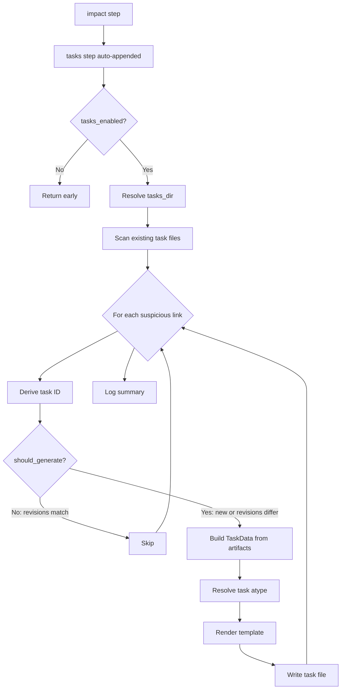

# Spec: Task Subsystem — Phase I: Tasks from Impact Analysis

## Problem Statement

Syntagmax's impact analysis identifies "suspicious links" — outdated child artifacts whose parents have been updated — but currently only reports them in the analysis report. There is no mechanism to track the follow-up work of verifying and updating each affected artifact. We need to generate actionable, git-friendly task files from impact analysis results.

## Requirements

1. Task generation triggers automatically at the end of `analyze impact` when `tasks_enabled = true` in `[impact]` config. This is achieved by dynamically appending the `tasks` step to the execution plan if `tasks_enabled` is set.
2. Task IDs are deterministic: `TASK-IMPACT-{child_aid}-{parent_aid}` (stable per artifact pair).
3. Revision-aware de-duplication: task generation tracks the parent and child revision hashes in frontmatter. A task is regenerated (overwritten with `status: open`) if the parent or child revision has changed since the task was last generated. If revisions match the current state, the task is skipped regardless of its status.
4. Task files are markdown with flat YAML frontmatter containing attributes (`id`, `contents`, `status`, `parent_revision`, `child_revision`). These files use a flat frontmatter format designed for a future `simple-markdown` driver and must not be parsed using the `obsidian` driver.
5. Default `atype` is `TASK`. If no metamodel definition exists for `TASK`, an implicit metamodel is injected into the global metamodel during configuration loading.
6. Implicit TASK metamodel: `id` (mandatory string), `contents` (mandatory string), `status` (mandatory enum [open, closed]).
7. Task body is rendered from a configurable Jinja2 template (with a sensible default). The configured `tasks_template` path is respected via a `ChoiceLoader`.
8. Configuration lives in the `[impact]` section of `config.toml`.
9. Tasks are standard markdown artifacts (one file per task) and can have an `atype` described by the metamodel.
10. Task `atype` can be mapped per parent/child type pair via `task_atype_map`.
11. Task filenames are sanitized to replace filesystem-unsafe characters with hyphens.

## Background

### Impact Analysis Output

The `perform_impact_analysis` function in `src/syntagmax/impact.py` returns a `benedict` with:
- `suspicious_links`: list of dicts, each containing:
  - `artifact_aid` (child)
  - `artifact_atype` (child type)
  - `parent_aid`
  - `parent_atype`
  - `nominal_revision` (what the child references)
  - `actual_revision` (formatted string with hash, timestamp, author)
- `total_suspicious`: count
- `suspicious_tree`: rendered tree string

### Artifact Data Model

From `src/syntagmax/artifact.py`:
- `Artifact` has: `aid`, `atype`, `record` (InputRecord), `location` (Location with `loc_file`), `revisions` (set of `Revision`), `parent_links`, `fields`
- `Revision` has: `hash_long`, `hash_short`, `timestamp`, `author_email`
- `InputRecord` has: `name`, `dir`, `record_base`

### Pipeline Architecture

From `src/syntagmax/main.py`:
- Steps are defined in `STEPS` dict and `DEPS` dict
- Pipeline uses `get_execution_plan(DEPS, requested_step)` to resolve dependency order
- The `process` function runs steps sequentially, passing `config`, `artifacts`, `errors`
- `report.impact` holds the impact data after the `impact` step runs

### Configuration

From `src/syntagmax/config.py`:
- `ImpactConfig` is a Pydantic model (currently only `enabled: bool`)
- `ConfigFile` assembles all config sections
- `Config` class resolves paths relative to `root_dir` (config file directory)

### Template System

- Jinja2 templates live in `src/syntagmax/resources/`
- `report.py` loads templates via `FileSystemLoader` pointing at the resources directory
- i18n is available via `jinja2.ext.i18n` and `get_translations()`

### YAML Handling

- `ruamel.yaml` used for round-trip YAML editing (`src/syntagmax/yaml_utils.py`)
- Frontmatter pattern: `---\n...\n---\n` followed by body content

### Driver Compatibility Note

Task files use a flat YAML frontmatter format (attributes at the root level, no `attrs:` nesting). This is intentionally different from the `obsidian` driver format and is designed for a future `simple-markdown` driver. Task files must not be configured as an input record using the `obsidian` driver.

## Proposed Solution

### Architecture



### Configuration Schema

```toml
[impact]
enabled = true
tasks_enabled = true
tasks_dir = ".syntagmax/tasks/"           # relative to root_dir
tasks_template = "custom-task.j2"         # optional, relative to root_dir
# Mapping: "parent_atype/child_atype" -> task_atype
# Default fallback: TASK
[impact.task_atype_map]
"SYS/REQ" = "TASK"
```

### Task File Format

```markdown
---
id: TASK-IMPACT-REQ-001-SYS-001
status: open
contents: "Verify REQ-001 is updated after SYS-001 change"
parent_revision: "abc1234"
child_revision: "def5678"
---
# Impact Task: REQ-001 → SYS-001

## Parent (Updated)
- **ID:** SYS-001
- **Type:** SYS
- **Input Record:** system-requirements
- **File:** SYS/SYS-001.md
- **Current Revision:** abc1234 (full: abc1234abc1234abc1234abc1234abc1234abc1234)

## Child (Outdated)
- **ID:** REQ-001
- **Type:** REQ
- **Input Record:** software-requirements
- **File:** REQ/REQ-001.md
- **Referenced Revision:** old1234

## Action Required
Verify that REQ-001 is still consistent with the updated SYS-001 and update the tracing reference.
```

### File Naming

Task files are named after their ID with filesystem-unsafe characters sanitized: `TASK-IMPACT-REQ-001-SYS-001.md`. Characters `/`, `\`, `:`, `*`, `?`, `"`, `<`, `>`, `|` are replaced with hyphens.

### De-duplication Logic

```python
def should_generate_task(task_id: str, current_parent_rev: str, current_child_rev: str, existing_tasks: dict[str, dict]) -> bool:
    if task_id not in existing_tasks:
        return True
    task_info = existing_tasks[task_id]
    # If parent or child revision has changed, regenerate (updates details, resets to open)
    if task_info.get('parent_revision') != current_parent_rev or task_info.get('child_revision') != current_child_rev:
        return True
    # Revisions match — skip regeneration regardless of status
    return False
```

### Implicit Metamodel

When the project metamodel does not define the resolved task `atype`, an implicit definition is injected into the global metamodel during configuration loading:

```python
IMPLICIT_TASK_METAMODEL = {
    'attributes': {
        'id': [{'presence': 'mandatory', 'multiple': False, 'type_info': {'type': 'string'}}],
        'contents': [{'presence': 'mandatory', 'multiple': False, 'type_info': {'type': 'string'}}],
        'status': [{'presence': 'mandatory', 'multiple': False, 'type_info': {'type': 'enum', 'values': ['open', 'closed']}}],
    }
}
```

This injection happens in `Config._read_config()` after the metamodel is loaded, ensuring the `ArtifactValidator` and other downstream consumers recognize the TASK type.

## Task Breakdown

### Task 1: Extend ImpactConfig with task generation settings

**Objective:** Add task-related fields to `ImpactConfig` Pydantic model and wire up configuration loading.

**Implementation guidance:**
- In `src/syntagmax/config.py`, extend `ImpactConfig`:
  ```python
  class ImpactConfig(BaseModel):
      model_config = ConfigDict(extra='ignore')
      enabled: bool = Field(default=False, description='Enable impact analysis')
      tasks_enabled: bool = Field(default=False, description='Enable task generation from impact analysis')
      tasks_dir: str = Field(default='.syntagmax/tasks/', description='Directory for generated task files (relative to config file directory)')
      tasks_template: str | None = Field(default=None, description='Path to custom Jinja2 task template (relative to config file directory)')
      task_atype_map: dict[str, str] = Field(default_factory=dict, description='Mapping of "parent_atype/child_atype" to task atype. Fallback: TASK')
  ```
- In `Config` class, add a method to resolve the tasks directory:
  ```python
  def tasks_dir(self) -> Path:
      return Path(self._root_dir, self.impact.tasks_dir)
  ```
- Update `init_cmd.py` to include commented task config in generated TOML. Handle `default_factory` fields (dict type) safely — format as `# task_atype_map = {}` rather than printing `PydanticUndefined`.

**Test requirements:**
- Test that config loads with new fields and defaults are correct.
- Test that `tasks_dir` resolves correctly relative to root_dir.
- Test that `task_atype_map` parses correctly from TOML.

**Demo:** Loading a config TOML containing `[impact]\ntasks_enabled = true\ntasks_dir = "custom/tasks"` succeeds and `config.tasks_dir()` returns the expected resolved path.

---

### Task 2: Create task file generation module with Jinja2 template

**Objective:** Implement `src/syntagmax/tasks.py` with core task generation logic and a default template.

**Implementation guidance:**
- Create `src/syntagmax/tasks.py` with:
  ```python
  @dataclass
  class TaskData:
      task_id: str
      task_atype: str
      child_aid: str
      child_atype: str
      child_record_name: str
      child_file_path: str
      child_revision_short: str | None
      child_revision_long: str | None
      parent_aid: str
      parent_atype: str
      parent_record_name: str
      parent_file_path: str
      parent_revision_short: str | None
      parent_revision_long: str | None
      nominal_revision: str
      actual_revision: str

  def generate_task_id(child_aid: str, parent_aid: str) -> str:
      return f'TASK-IMPACT-{child_aid}-{parent_aid}'

  def sanitize_filename(name: str) -> str:
      """Replace filesystem-unsafe characters with hyphens."""
      unsafe = r'/\:*?"<>|'
      for ch in unsafe:
          name = name.replace(ch, '-')
      return name

  def render_task_file(template_env: Environment, task_data: TaskData) -> str:
      template = template_env.get_template('task.j2')
      return template.render(task=task_data)
  ```
- Create `src/syntagmax/resources/task.j2`:
  ```jinja2
  ---
  id: {{ task.task_id }}
  status: open
  contents: "Verify {{ task.child_aid }} is updated after {{ task.parent_aid }} change"
  parent_revision: "{{ task.parent_revision_short or '' }}"
  child_revision: "{{ task.child_revision_short or '' }}"
  ---
  # Impact Task: {{ task.child_aid }} → {{ task.parent_aid }}

  ## Parent (Updated)
  - **ID:** {{ task.parent_aid }}
  - **Type:** {{ task.parent_atype }}
  - **Input Record:** {{ task.parent_record_name }}
  - **File:** {{ task.parent_file_path }}
  - **Current Revision:** {{ task.parent_revision_short }} (full: {{ task.parent_revision_long }})

  ## Child (Outdated)
  - **ID:** {{ task.child_aid }}
  - **Type:** {{ task.child_atype }}
  - **Input Record:** {{ task.child_record_name }}
  - **File:** {{ task.child_file_path }}
  - **Referenced Revision:** {{ task.nominal_revision }}

  ## Action Required
  Verify that {{ task.child_aid }} is still consistent with the updated {{ task.parent_aid }} and update the tracing reference.
  ```
- Template loading uses a `ChoiceLoader`:
  ```python
  from jinja2 import Environment, FileSystemLoader, ChoiceLoader

  def _build_template_env(config: Config) -> Environment:
      loaders = []
      if config.impact.tasks_template:
          custom_dir = Path(config.root_dir(), config.impact.tasks_template).parent
          loaders.append(FileSystemLoader(str(custom_dir)))
      resources_dir = Path(__file__).parent / 'resources'
      loaders.append(FileSystemLoader(str(resources_dir)))
      return Environment(loader=ChoiceLoader(loaders))

  def _get_template_name(config: Config) -> str:
      if config.impact.tasks_template:
          return Path(config.impact.tasks_template).name
      return 'task.j2'
  ```

**Test requirements:**
- Unit test: `generate_task_id('REQ-001', 'SYS-001')` returns `'TASK-IMPACT-REQ-001-SYS-001'`.
- Unit test: `sanitize_filename` replaces unsafe chars with hyphens.
- Unit test: `render_task_file` with mock `TaskData` produces valid YAML frontmatter with correct `id`, `status`, `contents`, `parent_revision`, `child_revision` fields.
- Unit test: rendered body contains parent/child references.
- Unit test: custom template path is loaded when configured.

**Demo:** `render_task_file(env, task_data)` with mock data produces correctly formatted markdown.

---

### Task 3: Implement task file scanning and revision-aware de-duplication

**Objective:** Add logic to scan existing task files, parse their YAML frontmatter (including revision hashes), and decide whether to skip or regenerate.

**Implementation guidance:**
- In `src/syntagmax/tasks.py` add:
  ```python
  def scan_existing_tasks(tasks_dir: Path) -> dict[str, dict]:
      """Scan task files and return {task_id: {status, parent_revision, child_revision}} mapping."""
      existing = {}
      if not tasks_dir.exists():
          return existing
      for md_file in tasks_dir.glob('*.md'):
          content = md_file.read_text(encoding='utf-8')
          frontmatter = _parse_frontmatter(content)
          if frontmatter and 'id' in frontmatter:
              existing[frontmatter['id']] = {
                  'status': frontmatter.get('status', 'open'),
                  'parent_revision': frontmatter.get('parent_revision', ''),
                  'child_revision': frontmatter.get('child_revision', ''),
              }
      return existing

  def should_generate_task(task_id: str, current_parent_rev: str, current_child_rev: str, existing_tasks: dict[str, dict]) -> bool:
      """Determine if a task should be generated/regenerated."""
      if task_id not in existing_tasks:
          return True
      task_info = existing_tasks[task_id]
      # Regenerate if revisions have changed
      if task_info.get('parent_revision') != current_parent_rev:
          return True
      if task_info.get('child_revision') != current_child_rev:
          return True
      # Revisions match — skip regardless of status
      return False

  def _parse_frontmatter(content: str) -> dict | None:
      """Extract YAML frontmatter from markdown content."""
      if not content.startswith('---'):
          return None
      end = content.find('---', 3)
      if end == -1:
          return None
      yaml_str = content[3:end].strip()
      yaml = YAML(typ='safe')
      try:
          return yaml.load(yaml_str)
      except Exception:
          return None
  ```
- Use `ruamel.yaml` for parsing (consistent with project).
- Treat missing revision fields as empty string (will trigger regeneration on first run with revision tracking).

**Test requirements:**
- Test with temp dir containing task files with matching/mismatching revisions.
- Test `should_generate_task` returns `False` when revisions match (regardless of status).
- Test `should_generate_task` returns `True` when parent revision differs.
- Test `should_generate_task` returns `True` when child revision differs.
- Test `should_generate_task` returns `True` for missing tasks.
- Test malformed frontmatter is handled gracefully (file skipped).

**Demo:** Given a task file with `parent_revision: "abc1234"` and current parent revision is `"abc1234"`, `should_generate_task` returns `False`. If current is `"xyz9999"`, returns `True`.

---

### Task 4: Implement implicit TASK metamodel injection

**Objective:** When the project metamodel doesn't define the resolved task atype, dynamically inject an implicit definition into the global metamodel during config loading so that all validators recognize it.

**Implementation guidance:**
- In `src/syntagmax/tasks.py` define the constant:
  ```python
  IMPLICIT_TASK_METAMODEL = {
      'attributes': {
          'id': [{'presence': 'mandatory', 'multiple': False, 'type_info': {'type': 'string'}}],
          'contents': [{'presence': 'mandatory', 'multiple': False, 'type_info': {'type': 'string'}}],
          'status': [{'presence': 'mandatory', 'multiple': False, 'type_info': {'type': 'enum', 'values': ['open', 'closed']}}],
      }
  }

  def inject_task_metamodel(metamodel: dict, impact_config: 'ImpactConfig') -> None:
      """Inject implicit TASK metamodel for any task atypes not already defined."""
      if not impact_config.tasks_enabled:
          return
      artifacts = metamodel.setdefault('artifacts', {})
      # Collect all task atypes that might be used
      task_atypes = set(impact_config.task_atype_map.values()) | {'TASK'}
      for atype in task_atypes:
          if atype not in artifacts:
              artifacts[atype] = IMPLICIT_TASK_METAMODEL
  ```
- In `src/syntagmax/config.py`, call `inject_task_metamodel` after the metamodel is loaded:
  ```python
  if config_model.metamodel.filename:
      self.metamodel = load_metamodel(Path(root_dir, config_model.metamodel.filename), errors)
  else:
      lg.warning('No static validation model')
      self.metamodel = None

  # Inject implicit task metamodel definitions
  if self.metamodel and self.impact.tasks_enabled:
      from syntagmax.tasks import inject_task_metamodel
      inject_task_metamodel(self.metamodel, self.impact)
  ```

**Test requirements:**
- Test: when metamodel has no TASK definition and `tasks_enabled = true`, TASK is injected.
- Test: when metamodel already defines TASK, it is not overwritten.
- Test: custom atypes from `task_atype_map` are also injected if missing.
- Test: injection does not happen when `tasks_enabled = false`.

**Demo:** After loading config with `tasks_enabled = true` and no TASK in metamodel, `config.metamodel['artifacts']['TASK']` exists with implicit attributes.

---

### Task 5: Wire task generation into the pipeline as a step

**Objective:** Add `tasks` as a pipeline step in `main.py` that runs after `impact` and is automatically appended to the execution plan when `tasks_enabled` is set.

**Implementation guidance:**
- In `src/syntagmax/tasks.py` add the main entry point:
  ```python
  def generate_tasks(config: Config, artifacts: ArtifactMap, errors: list[str], impact_data: benedict) -> dict:
      """Generate task files from impact analysis results. Returns summary dict."""
      if not config.impact.tasks_enabled:
          return {'created': 0, 'skipped': 0}

      tasks_dir = config.tasks_dir()
      tasks_dir.mkdir(parents=True, exist_ok=True)

      existing_tasks = scan_existing_tasks(tasks_dir)
      suspicious_links = impact_data.get('suspicious_links', [])

      template_env = _build_template_env(config)
      created = 0
      skipped = 0

      for link in suspicious_links:
          child = artifacts.get(link['artifact_aid'])
          parent = artifacts.get(link['parent_aid'])
          if not child or not parent:
              continue

          task_id = generate_task_id(link['artifact_aid'], link['parent_aid'])

          current_parent_rev = parent.latest_revision.hash_short if parent.latest_revision else ''
          current_child_rev = child.latest_revision.hash_short if child.latest_revision else ''

          if not should_generate_task(task_id, current_parent_rev, current_child_rev, existing_tasks):
              skipped += 1
              continue

          atype_key = f"{link['parent_atype']}/{link['artifact_atype']}"
          task_atype = config.impact.task_atype_map.get(atype_key, 'TASK')

          task_data = _build_task_data(task_id, task_atype, child, parent, link)
          content = render_task_file(template_env, task_data)

          safe_filename = sanitize_filename(f'{task_id}.md')
          task_file = tasks_dir / safe_filename
          task_file.write_text(content, encoding='utf-8')
          created += 1

      return {'created': created, 'skipped': skipped}
  ```
- In `src/syntagmax/main.py`:
  - Add `'tasks'` to `STEPS` and `DEPS` (`{'impact'}`)
  - Add `'tasks'` to `public_steps()`
  - Dynamically append `'tasks'` to the execution plan when `impact` is in the plan and `tasks_enabled` is true:
    ```python
    plan = get_execution_plan(DEPS, requested_step)
    if 'impact' in plan and config.impact.tasks_enabled and 'tasks' not in plan:
        plan.append('tasks')
    ```
  - In the `process` function's match block, add:
    ```python
    case 'tasks':
        if report.impact:
            from syntagmax.tasks import generate_tasks
            report.tasks_summary = generate_tasks(config, artifacts, errors, report.impact)
    ```
- Extend `Report` dataclass with `tasks_summary: dict | None = None`

**Test requirements:**
- Integration test: mock artifacts with suspicious links, verify task files are created with correct names and content.
- Test: `tasks_enabled = false` produces no files and `tasks` step is not appended.
- Test: running `analyze impact` with `tasks_enabled = true` automatically generates task files.
- Test: pre-existing task with matching revisions is skipped.
- Test: pre-existing task with different revisions is regenerated.
- Test: `task_atype_map` correctly resolves custom atypes.
- Test: filenames with unsafe characters are sanitized.

**Demo:** `process('impact', config)` with `tasks_enabled = true` and mock suspicious links produces task files in the configured directory.

---

### Task 6: Add example configuration and end-to-end test

**Objective:** Update the example project and add an end-to-end test covering the full lifecycle.

**Implementation guidance:**
- Update `example/obsidian-driver/.syntagmax/config.toml` to include commented task config:
  ```toml
  # [impact]
  # tasks_enabled = true
  # tasks_dir = ".syntagmax/tasks/"
  # tasks_template = ""
  # [impact.task_atype_map]
  # "SYS/REQ" = "TASK"
  ```
- Add `tests/test_tasks.py` with:
  1. Setup: temp project with two artifacts in a suspicious link relationship (use `MockRevision` pattern from `test_impact.py`)
  2. Run `generate_tasks` → verify task file exists with correct ID, frontmatter (including `parent_revision`, `child_revision`), and body
  3. Run again with same revisions → verify no regeneration (skipped count == 1)
  4. Update parent revision, run again → verify task is regenerated with updated details
  5. Test custom template path via `ChoiceLoader`
  6. Test `task_atype_map` resolution
  7. Test filename sanitization for artifact IDs with special characters
  8. Test that `analyze impact` automatically triggers task generation
- Update `init_cmd.py` to include commented `tasks_enabled` in generated config (handle `default_factory` dict fields safely).

**Test requirements:**
- Full round-trip test covering create, skip-on-matching-revisions, regenerate-on-changed-revisions.
- Test custom Jinja2 template loading via `ChoiceLoader`.
- Test error handling for invalid template paths.
- Test implicit metamodel injection is present after config loading.

**Demo:** `uv run syntagmax --cwd ./example/obsidian-driver analyze tasks` runs without error (reports "0 tasks created" since example has no suspicious links with git history, or produces tasks if run with appropriate fixture).
