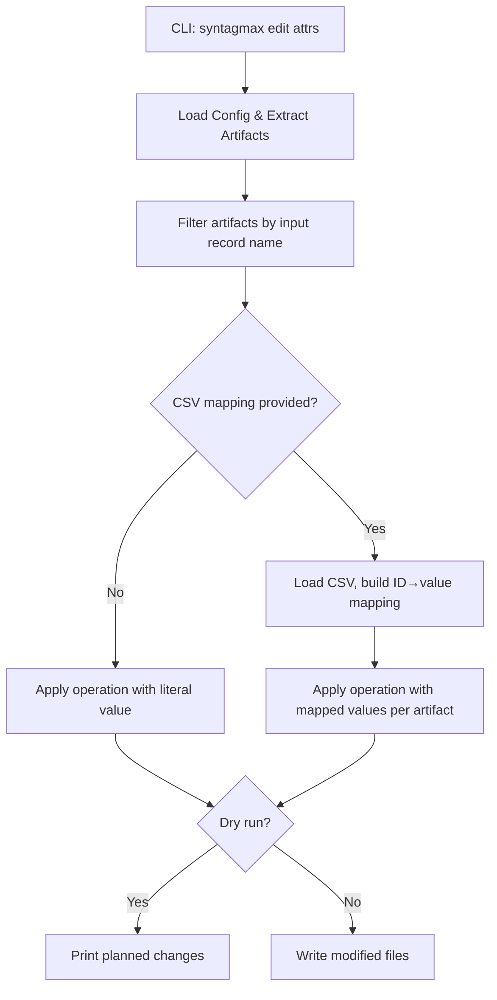

# Specification: Bulk Attribute Manipulation

## Problem Statement

Users need to add, remove, or replace attributes (YAML `attrs` fields) and inline fields (`[FIELD]` format) across all artifacts in a given input section. Currently, such changes require manual per-file editing, which is error-prone and time-consuming for operations like adding a `status` field to all requirements or updating an `owner` attribute project-wide.

## Requirements

- New `edit attrs` CLI subcommand under the existing `edit` command group
- Operations: `add`, `del`, `replace`
  - `add`: Adds a field/attribute with a value to all artifacts that do not already have it
  - `del`: Removes the named field/attribute from all artifacts
  - `replace`: Updates existing values and adds the attribute where missing (upsert semantics)
- Target types: `attr` (YAML `attrs` block) and `field` (inline `[FIELD]` format)
- Works recursively across all matching files in the selected input record
- Supports value substitution from a CSV mapping file (lookup by artifact ID)
- Supports `--dry-run` to preview changes without writing
- Must preserve file structure: non-artifact text, headings, comments, and markers remain untouched
- Must be idempotent: running the same command twice produces the same result
- Only the Obsidian driver is supported in this version; other drivers exit with a clear error

## Background

- The `edit` CLI group already exists with the `renumber` subcommand
- Artifacts have `fields: dict[str, str | list[str]]` accessible via `artifact.fields`
- The Obsidian driver stores attributes in YAML blocks (````yaml\nattrs:\n  key: value\n`````) and inline fields (`[field] value`)
- The Markdown extractor has `update_artifacts()` which manipulates YAML blocks and `[id]` fields by reading/rewriting file segments based on `LineLocation`
- `MarkdownArtifact.yaml_data` provides structured access to the YAML block (supports `.to_yaml()` for re-emission)
- `Config` loads input records with `name`, `dir`, `driver`, `marker`, `atype`, etc.
- The extraction pipeline (`extract()`) returns a flat list of all artifacts with their locations
- `EXTRACTORS` dict maps driver names to extractor classes

## Proposed Solution



### CLI Interface

```bash
uv run syntagmax edit attrs [OPTIONS]
```

Options:

| Option | Required | Default | Description |
|--------|----------|---------|-------------|
| `-o, --operation` | No | `add` | Operation: `add`, `del`, or `replace` |
| `-t, --type` | No | `attr` | Target type: `attr` (YAML attribute) or `field` (inline `[FIELD]` marker) |
| `-n, --name` | No* | — | Name of the field or attribute to manipulate. If omitted for `add`, all mandatory metamodel attributes are added. |
| `-l, --value` | No** | `TBD` | Value for the attribute. Defaults to `TBD` for `add`. Required for `replace` unless `--csv` is specified. Ignored for `del`. |
| `-s, --section` | Yes | — | Input record name (as defined in `config.toml`) |
| `--csv` | No | — | Path to a CSV file for value lookup. Columns: `id` (artifact ID) and `value` (value to set). |
| `--csv-id-column` | No | `id` | Column name in the CSV used to match artifacts |
| `--csv-value-column` | No | `value` | Column name in the CSV used as the attribute value |
| `-d, --csv-delimiter` | No | `,` | CSV column delimiter (e.g., `,`, `\t`, `;`) |
| `--dry-run` | No | `false` | Preview changes without modifying files |
| `-f, --config-file` | No | `.syntagmax/config.toml` | Path to the config file |

*`--name` is required for `del` and `replace` operations. If omitted for `add`, all mandatory attributes from the metamodel are added with `TBD` values.

**`--value` defaults to `TBD` for `add` when not provided. Required for `replace` unless `--csv` is specified. Ignored for `del`.

### Operation Semantics

#### `add`
- If the attribute already exists on an artifact, skip it (no-op for that artifact)
- If missing, add it with the provided value (or `TBD` if no value is specified)
- **If `--name` is omitted**: look up all mandatory attributes from the metamodel for the artifact's type and add any that are missing, using `TBD` as the value for each. This requires a metamodel to be loaded; if none is available, exit with an error.
- For YAML attrs: inserts a new key in the `attrs:` block
- For inline fields: appends `[name] value` line before the closing `[/MARKER]` tag

#### `del`
- Removes the named attribute from all artifacts where it exists
- For YAML attrs: removes the key from `attrs:`
- For inline fields: removes the `[name] value` line entirely

#### `replace`
- If the attribute exists, update its value
- If the attribute is missing, add it (upsert)
- Equivalent to `del` + `add`, but in a single pass

### CSV Mapping

When `--csv` is provided, the value for each artifact is looked up from the CSV file based on the artifact's ID:

1. Load the CSV file using the delimiter specified by `--csv-delimiter` (defaults to `,`)
2. Build a mapping: `csv[id_column]` → `csv[value_column]`
3. For each artifact, look up its `aid` in the mapping
4. If found, use the mapped value for the operation
5. If not found, skip that artifact and log a `WARNING` with the artifact ID and file location
6. In dry-run mode, list all unmatched artifact IDs in the summary

This allows bulk import of data from external tools (e.g., DOORS IDs, external status values).

### File Modification Strategy

File reads, segment identification, and block updates are **delegated to the Extractor interface** — the `edit_attrs` module does not manipulate file content directly. This preserves driver encapsulation and reuses existing segment-handling logic. Only the Obsidian (Markdown) extractor provides a concrete implementation in this version.

1. Group artifacts by file (same approach as `renumber_artifacts`)
2. Instantiate the appropriate extractor for the input record's driver
3. Call `extractor.update_artifact_attributes(loc_file, updates)` where each update is a `(artifact, attrs_delta, operation)` tuple
4. The extractor implementation handles:
   - **YAML attributes** (`--type attr`): Modify the `attrs` dict in-place on the parsed representation and re-serialize. Note: standard YAML re-emission via `benedict.to_yaml()` discards comments — warn users in `--dry-run` output if YAML blocks contain comments.
   - **Inline fields** (`--type field`): Use a multiline-safe regex that handles field continuation lines (matching the `FIELD_CONT*` grammar rule). The field name must be escaped with `re.escape()`:
     ```python
     pattern = re.compile(
         rf'(?mi)^\[{re.escape(name)}\][^\r\n]*(?:\r?\n(?!(?:\[|```yaml)).*)*'
     )
     ```
     This matches the `[name]` header line and all subsequent continuation lines up to the next field marker (`[`) or YAML block.
   - **Line ending preservation**: Detect the file's line ending style (`\r\n` vs `\n`) before editing and use the matching separator when formatting new inline fields.
5. All modifications are computed in memory first (see Atomic Write Strategy below)
6. Write modified file content back only after all files have been validated

### Atomic Write Strategy

To prevent leaving the workspace in a partially modified state:

1. **Validation pass**: Load config, extract artifacts, load CSV (if any), resolve all values. If any validation fails, abort before any file I/O.
2. **Computation pass**: Compute all modifications in memory. Each file produces a `(path, new_content)` pair. No files are written during this phase.
3. **Write pass**: Only after all modifications are computed successfully, write all files in sequence. If a write fails, log the error and report which files were and were not written.

This ensures that parse errors, missing CSV mappings, or regex failures are caught before any file is touched.

### Metamodel Validation

If a metamodel is loaded and the target attribute name (`--name`) is not defined for the artifact type being modified:
- Log a `WARNING` indicating the attribute is not in the metamodel
- In `--dry-run` mode, include this in the summary
- Do **not** block the operation (the user may intentionally add attributes ahead of metamodel updates)

If the metamodel defines the attribute with a constrained type (e.g., `enum`, `boolean`), validate the provided value against the type and warn if it does not conform.

### Error Handling

- If the specified `--section` does not exist in config, exit with error
- If the section's driver is not `obsidian`, exit with error (only the Obsidian driver is supported in this version)
- If `--csv` file doesn't exist or is malformed, exit with error
- If `--name` is omitted for `del` or `replace`, exit with error
- If `--name` is omitted for `add` and no metamodel is loaded, exit with error
- If `--value` is missing for `replace` without `--csv`, exit with error

## Example Usage

```bash
# Add 'status: draft' to all REQ artifacts
uv run syntagmax edit attrs -s requirements -n status -l draft

# Remove 'owner' from all SYS artifacts
uv run syntagmax edit attrs -s system-requirements -o del -n owner

# Replace priority values across all REQs
uv run syntagmax edit attrs -s requirements -o replace -n priority -l high

# Import DOORS IDs from CSV
uv run syntagmax edit attrs -s requirements -o replace -n doors_id --csv ../doors-export.csv --csv-id-column ext_id --csv-value-column doors_id

# Dry-run to preview changes
uv run syntagmax edit attrs -s requirements -n status -l draft --dry-run

# Add 'source' attr with default TBD value (no --value needed)
uv run syntagmax edit attrs -s requirements -n source

# Add ALL mandatory metamodel attributes (with TBD) to artifacts missing them
uv run syntagmax edit attrs -s requirements

# Manipulate inline [field] format instead of YAML attrs
uv run syntagmax edit attrs -s requirements -t field -n priority -l high
```

### Example Output (Dry Run)

```
DRY-RUN: Would add attr 'status' = 'draft' to REQ-001 at REQ/REQ-001.md
DRY-RUN: Would add attr 'status' = 'draft' to REQ-002 at REQ/REQ-002.md
DRY-RUN: REQ-003 already has attr 'status', skipping (operation: add)
DRY-RUN: Would add attr 'status' = 'draft' to REQ-004 at REQ/REQ-004.md

Summary: 3 artifacts would be modified, 1 skipped
```

## Task Breakdown

### Task 1: Extend the Extractor interface with `update_artifact_attributes`

**Objective:** Add a generic attribute update method to the Extractor base class, with a concrete implementation in the Obsidian/Markdown extractor.

**Implementation guidance:**
- In `src/syntagmax/extractors/extractor.py`, add an abstract method:
  ```python
  def update_artifact_attributes(
      self, loc_file: str,
      updates: list[tuple[Artifact, dict[str, str | None], str]]
  ) -> str:
      """Apply attribute updates to artifacts in a file. Returns the modified file content.
      Each update is (artifact, {attr_name: value_or_None}, operation).
      operation is 'add', 'del', or 'replace'. value=None means deletion."""
      raise NotImplementedError
  ```
- In `src/syntagmax/extractors/markdown.py`, implement the method:
  - Read the file, split into lines
  - Sort updates in reverse line order to avoid offset drift
  - For each artifact segment:
    - **YAML attrs**: modify `yaml_data['attrs']` dict, re-emit via `.to_yaml()`, replace the YAML block in the segment
    - **Inline fields**: use a multiline-safe regex:
      ```python
      pattern = re.compile(rf'(?mi)^\[{re.escape(name)}\][^\r\n]*(?:\r?\n(?!(?:\[|```yaml)).*)*')
      ```
      For `add`: if pattern doesn't match, insert `[name] value` before `[/MARKER]`; for `del`: remove matches; for `replace`: remove + insert
  - Detect file line endings (`\r\n` vs `\n`) and use matching separator for insertions
  - Return the modified content as a string (do not write — caller handles I/O)
- Other extractors: raise `NotImplementedError` (Obsidian-only for this version)

**Test requirements:**
- Test YAML attr add/del/replace produces correct modified content
- Test inline field add/del/replace with multiline fields
- Test line ending preservation (CRLF files stay CRLF)
- Test that continuation lines of inline fields are fully removed on `del`
- Test that YAML comment loss warning is logged

**Demo:** `uv run pytest tests/test_edit_attrs.py` passes extractor-level tests.

---

### Task 2: Core orchestration logic and CSV loading

**Objective:** Implement the orchestration layer that coordinates extraction, CSV mapping, metamodel validation, and delegates to the extractor.

**Implementation guidance:**
- Create `src/syntagmax/edit_attrs.py` with:
  - `load_csv_mapping(csv_path: Path, id_column: str, value_column: str, delimiter: str) -> dict[str, str]`
    - Use `csv.DictReader` with explicit delimiter
    - Validate columns exist; raise `FatalError` if not
    - Handle UTF-8 with BOM detection
    - Duplicate IDs: last value wins, log WARNING
  - `manipulate_attributes(config: Config, section: str, operation: str, target_type: str, name: str | None, value: str | None, csv_mapping: dict[str, str] | None, dry_run: bool) -> None`
    - Validate section exists and uses the `obsidian` driver
    - Extract artifacts, filter by section
    - If `name` is None (only valid for `add`): load metamodel, resolve all mandatory attributes for the artifact type, add each missing one with `TBD` value
    - If `name` is given but `value` is None (only valid for `add`): use `TBD` as the default value
    - If metamodel is loaded, check if `name` is defined for the artifact type; warn if not
    - Resolve values (literal or CSV lookup per artifact); log WARNING for unmatched IDs
    - **Atomic write strategy**:
      1. Compute all modifications in memory via `extractor.update_artifact_attributes()`
      2. Collect `(path, new_content)` pairs
      3. In dry-run: print planned changes + summary (modified / skipped / unmatched)
      4. Otherwise: write all files in final pass
- Print summary: N modified, M skipped, K unmatched (if CSV)

**Test requirements:**
- Test `add` skips artifacts that already have the attribute
- Test `add` with name but no value uses `TBD`
- Test `add` with no name adds all mandatory metamodel attributes with `TBD`
- Test `add` with no name and no metamodel raises error
- Test `del` is no-op when attribute absent
- Test `replace` upserts
- Test CSV mapping applies correct per-artifact values
- Test WARNING logged for unmatched CSV IDs
- Test dry-run produces no file writes
- Test non-obsidian driver section raises error
- Test metamodel warning for undefined attribute

**Demo:** `uv run pytest tests/test_edit_attrs.py` passes.

---

### Task 3: CLI wiring

**Objective:** Add the `edit attrs` subcommand to the CLI.

**Implementation guidance:**
- In `cli.py`, add `@edit.command('attrs')` with options:
  - `-o, --operation` (choice: add/del/replace, default: add)
  - `-t, --type` (choice: attr/field, default: attr)
  - `-n, --name` (required)
  - `-l, --value` (optional)
  - `-s, --section` (required)
  - `--csv` (optional path)
  - `--csv-id-column` (default: `id`)
  - `--csv-value-column` (default: `value`)
  - `-d, --csv-delimiter` (default: `,`)
  - `--dry-run` (flag)
  - `-f, --config-file` (default: `.syntagmax/config.toml`)
- Validation:
  - if operation is `del` or `replace` and `--name` is not provided, exit with error
  - if operation is `add` and `--name` is omitted and no metamodel is loaded, exit with error
  - if operation is `replace` and neither `--value` nor `--csv` is provided, exit with error
- Load config, optionally load CSV mapping, call `manipulate_attributes()`

**Test requirements:**
- Integration test: end-to-end with a temp project, verify attribute added to file
- Test error when `--section` doesn't exist
- Test error when section uses non-obsidian driver
- Test error when `--name` missing for `del` or `replace`
- Test error when `--name` missing for `add` with no metamodel
- Test error when `--value` missing for `replace` without `--csv`
- Test `--dry-run` produces output but no file changes
- Test `--csv-delimiter` is passed through correctly

**Demo:** `uv run syntagmax edit attrs -s requirements -n status -l draft --dry-run` works on the example project.

---

### Task 4: Documentation and example

**Objective:** Update README.md with the new `edit attrs` command documentation.

**Implementation guidance:**
- Add `edit attrs` to the "Editing and Renumbering" section of README.md (or create a broader "Editing" section)
- Document all options with examples
- Include a CSV mapping example
- Note Obsidian-only limitation for this version
- Add a quick demo command in the appropriate section

**Test requirements:**
- README accurately describes the feature with working examples

**Demo:** Documentation is clear and consistent with implementation.

## Non-Functional Requirements

- **Idempotency**: Running the same `add` command twice must not duplicate the attribute.
- **Input Immutability (dry-run)**: With `--dry-run`, no files are modified.
- **Determinism**: Same inputs produce identical file modifications regardless of execution order.
- **Atomicity**: All file writes happen after all computations succeed; partial writes are avoided.
- **Performance**: File I/O is grouped per file (single read + single write per file, not per artifact).
- **Backward Compatibility**: Existing `edit renumber` command is unaffected.
- **Driver Scope**: Only the Obsidian driver is supported in this version. Other drivers will raise a clear error message.
