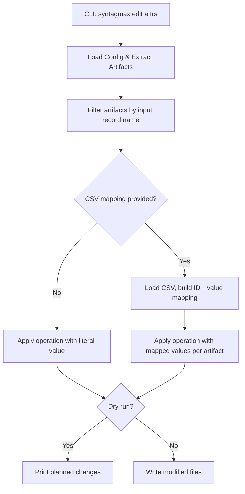

# Specification: Bulk Attribute Manipulation

## Problem Statement

Users need to add, remove, or replace attributes (YAML `attrs` fields) and inline fields (`[FIELD]` format) across all artifacts in a given input section. Currently, such changes require manual per-file editing, which is error-prone and time-consuming for operations like adding a `status` field to all requirements or updating an `owner` attribute project-wide.

## Requirements

- New `edit attrs` CLI subcommand under the existing `edit` command group
- Operations: `add`, `del`, `replace`
  - `add`: Adds a field/attribute with a value to all artifacts that do not already have it
  - `del`: Removes the named field/attribute from all artifacts
  - `replace`: Updates existing values and adds the attribute where missing (upsert semantics)
- Target types: `attr` (YAML `attrs` block) and `field` (inline `[FIELD]` format)
- Works recursively across all matching files in the selected input record
- Supports value substitution from a CSV mapping file (lookup by artifact ID)
- Supports `--dry-run` to preview changes without writing
- Must preserve file structure: non-artifact text, headings, comments, and markers remain untouched
- Must be idempotent: running the same command twice produces the same result

## Background

- The `edit` CLI group already exists with the `renumber` subcommand
- Artifacts have `fields: dict[str, str | list[str]]` accessible via `artifact.fields`
- The Obsidian driver stores attributes in YAML blocks (````yaml\nattrs:\n  key: value\n`````) and inline fields (`[field] value`)
- The Markdown extractor has `update_artifacts()` which manipulates YAML blocks and `[id]` fields by reading/rewriting file segments based on `LineLocation`
- `MarkdownArtifact.yaml_data` provides structured access to the YAML block (supports `.to_yaml()` for re-emission)
- `Config` loads input records with `name`, `dir`, `driver`, `marker`, `atype`, etc.
- The extraction pipeline (`extract()`) returns a flat list of all artifacts with their locations
- `EXTRACTORS` dict maps driver names to extractor classes

## Proposed Solution



### CLI Interface

```bash
uv run syntagmax edit attrs [OPTIONS]
```

Options:

| Option | Required | Default | Description |
|--------|----------|---------|-------------|
| `-o, --operation` | No | `add` | Operation: `add`, `del`, or `replace` |
| `-t, --type` | No | `attr` | Target type: `attr` (YAML attribute) or `field` (inline `[FIELD]` marker) |
| `-n, --name` | Yes | — | Name of the field or attribute to manipulate |
| `-l, --value` | No* | — | Value for the attribute. Required for `add` and `replace` unless `--csv` is specified. |
| `-s, --section` | Yes | — | Input record name (as defined in `config.toml`) |
| `--csv` | No | — | Path to a CSV file for value lookup. Columns: `id` (artifact ID) and `value` (value to set). |
| `--csv-id-column` | No | `id` | Column name in the CSV used to match artifacts |
| `--csv-value-column` | No | `value` | Column name in the CSV used as the attribute value |
| `--dry-run` | No | `false` | Preview changes without modifying files |
| `-f, --config-file` | No | `.syntagmax/config.toml` | Path to the config file |

*`--value` is required for `add` and `replace` operations when `--csv` is not provided. It is ignored for `del`.

### Operation Semantics

#### `add`
- If the attribute already exists on an artifact, skip it (no-op for that artifact)
- If missing, add it with the provided value
- For YAML attrs: inserts a new key in the `attrs:` block
- For inline fields: appends `[name] value` line before the closing `[/MARKER]` tag

#### `del`
- Removes the named attribute from all artifacts where it exists
- For YAML attrs: removes the key from `attrs:`
- For inline fields: removes the `[name] value` line entirely

#### `replace`
- If the attribute exists, update its value
- If the attribute is missing, add it (upsert)
- Equivalent to `del` + `add`, but in a single pass

### CSV Mapping

When `--csv` is provided, the value for each artifact is looked up from the CSV file based on the artifact's ID:

1. Load the CSV file with the specified delimiter (auto-detected or comma)
2. Build a mapping: `csv[id_column]` → `csv[value_column]`
3. For each artifact, look up its `aid` in the mapping
4. If found, use the mapped value for the operation
5. If not found, skip that artifact (log a warning at DEBUG level)

This allows bulk import of data from external tools (e.g., DOORS IDs, external status values).

### File Modification Strategy

1. Group artifacts by file (same approach as `renumber_artifacts`)
2. For each file, read content and parse artifact segments
3. For YAML-based attributes (`--type attr`):
   - Access `MarkdownArtifact.yaml_data`
   - Modify the `attrs` dict in-place
   - Re-emit the YAML block via `.to_yaml()`
   - Replace the segment in the file
4. For inline fields (`--type field`):
   - Use regex to find/remove `[name] value` lines within the artifact segment
   - For `add`/`replace`: insert `[name] value` before the closing marker if adding
5. Write the modified file content back

### Error Handling

- If the specified `--section` does not exist in config, exit with error
- If `--csv` file doesn't exist or is malformed, exit with error
- If `--value` is missing for `add`/`replace` without `--csv`, exit with error
- If the extractor for the driver doesn't support attribute updates, log a warning and skip

## Example Usage

```bash
# Add 'status: draft' to all REQ artifacts
uv run syntagmax edit attrs -s requirements -n status -l draft

# Remove 'owner' from all SYS artifacts
uv run syntagmax edit attrs -s system-requirements -o del -n owner

# Replace priority values across all REQs
uv run syntagmax edit attrs -s requirements -o replace -n priority -l high

# Import DOORS IDs from CSV
uv run syntagmax edit attrs -s requirements -o replace -n doors_id --csv ../doors-export.csv --csv-id-column ext_id --csv-value-column doors_id

# Dry-run to preview changes
uv run syntagmax edit attrs -s requirements -n status -l draft --dry-run

# Manipulate inline [field] format instead of YAML attrs
uv run syntagmax edit attrs -s requirements -t field -n priority -l high
```

### Example Output (Dry Run)

```
DRY-RUN: Would add attr 'status' = 'draft' to REQ-001 at REQ/REQ-001.md
DRY-RUN: Would add attr 'status' = 'draft' to REQ-002 at REQ/REQ-002.md
DRY-RUN: REQ-003 already has attr 'status', skipping (operation: add)
DRY-RUN: Would add attr 'status' = 'draft' to REQ-004 at REQ/REQ-004.md

Summary: 3 artifacts would be modified, 1 skipped
```

## Task Breakdown

### Task 1: Core manipulation logic

**Objective:** Implement the attribute manipulation engine that operates on extracted artifacts.

**Implementation guidance:**
- Create `src/syntagmax/edit_attrs.py` with the core logic
- Define a function `manipulate_attributes(config: Config, section: str, operation: str, target_type: str, name: str, value: str | None, csv_mapping: dict[str, str] | None, dry_run: bool) -> None`
- Filter artifacts by input record name (matching `--section`)
- Group by file, sort updates in reverse line order (same pattern as `renumber_artifacts`)
- For YAML attrs:
  - `add`: if key not in `yaml_data['attrs']`, set it
  - `del`: pop key from `yaml_data['attrs']` if present
  - `replace`: always set the key to the new value
  - Re-emit YAML and replace segment in file
- For inline fields:
  - `add`: if `[name]` line not found in segment, insert before `[/MARKER]`
  - `del`: remove `[name] ...` line from segment via regex
  - `replace`: remove existing `[name]` line if present, then insert new one
- Print summary: N modified, M skipped

**Test requirements:**
- Test `add` operation on artifact without the attribute (YAML)
- Test `add` operation skips artifact that already has the attribute
- Test `del` operation removes existing attribute
- Test `del` operation is no-op when attribute is absent
- Test `replace` updates existing and adds missing
- Test inline field operations (`[field] value` format)
- Test dry-run produces no file changes
- Test CSV mapping applies correct values per artifact

**Demo:** `uv run pytest tests/test_edit_attrs.py` passes.

---

### Task 2: CSV loading utility

**Objective:** Implement CSV file loading and mapping construction.

**Implementation guidance:**
- In `src/syntagmax/edit_attrs.py`, add `load_csv_mapping(csv_path: Path, id_column: str, value_column: str) -> dict[str, str]`
- Use Python's `csv.DictReader`
- Validate that both columns exist in the header; raise `FatalError` if not
- Return a dict mapping ID values to attribute values
- Handle encoding (UTF-8 with BOM detection)

**Test requirements:**
- Test loading a valid CSV produces correct mapping
- Test missing column raises `FatalError`
- Test empty CSV returns empty dict
- Test duplicate IDs: last value wins (with a warning)

**Demo:** `uv run pytest tests/test_edit_attrs.py` passes CSV loading tests.

---

### Task 3: CLI wiring

**Objective:** Add the `edit attrs` subcommand to the CLI.

**Implementation guidance:**
- In `cli.py`, add a new command under the `edit` group: `@edit.command('attrs')`
- Options: `-o/--operation` (choice: add/del/replace, default: add), `-t/--type` (choice: attr/field, default: attr), `-n/--name` (required), `-l/--value`, `-s/--section` (required), `--csv`, `--csv-id-column` (default: id), `--csv-value-column` (default: value), `--dry-run`, `-f/--config-file`
- Validate: if operation is `add` or `replace` and neither `--value` nor `--csv` is provided, error
- Load config, optionally load CSV mapping, call `manipulate_attributes()`

**Test requirements:**
- Integration test: end-to-end with a temp project, verify attribute added to file
- Test error when `--section` doesn't exist
- Test error when `--value` missing for `add` without `--csv`
- Test `--dry-run` produces output but no file changes

**Demo:** `uv run syntagmax edit attrs -s requirements -n status -l draft --dry-run` works on the example project.

---

### Task 4: Inline field manipulation support

**Objective:** Extend the manipulation engine to handle `[FIELD] value` format (non-YAML attributes).

**Implementation guidance:**
- Add regex-based manipulation for inline fields within artifact segments
- Pattern to match: `^\[{name}\]\s*.*$` (case-insensitive)
- For `add`: check if pattern exists; if not, insert `[{name}] {value}` before `[/{marker}]`
- For `del`: remove matching lines
- For `replace`: remove matching lines, then insert new line
- Handle the case where the artifact uses both YAML and inline fields (operate on the specified type only)

**Test requirements:**
- Test add/del/replace on inline `[field] value` format
- Test that YAML block is not affected when `--type field` is used
- Test that inline fields are not affected when `--type attr` is used
- Test artifact with no closing marker (error handling)

**Demo:** `uv run pytest tests/test_edit_attrs.py` passes inline field tests.

---

### Task 5: Documentation and example

**Objective:** Update README.md with the new `edit attrs` command documentation.

**Implementation guidance:**
- Add `edit attrs` to the "Editing and Renumbering" section of README.md (or create a broader "Editing" section)
- Document all options with examples
- Include a CSV mapping example
- Add a quick demo command in the appropriate section

**Test requirements:**
- README accurately describes the feature with working examples

**Demo:** Documentation is clear and consistent with implementation.

## Non-Functional Requirements

- **Idempotency**: Running the same `add` command twice must not duplicate the attribute.
- **Input Immutability (dry-run)**: With `--dry-run`, no files are modified.
- **Determinism**: Same inputs produce identical file modifications regardless of execution order.
- **Performance**: File I/O is grouped per file (single read + single write per file, not per artifact).
- **Backward Compatibility**: Existing `edit renumber` command is unaffected.
