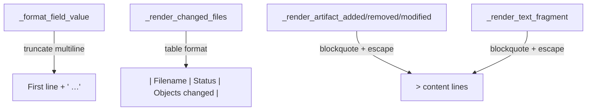

# Change Report Rendering Fixes

## Problem Statement

Three rendering issues in the change report Markdown output need fixing:

1. The "Changed Files" section uses per-file `###` headings with bullet lists instead of a compact table.
2. Text content in "Detailed Changes" is wrapped in fenced `` ```text ... ``` `` blocks, which hides the actual markdown structure. Content should be rendered as blockquoted raw markdown with headers escaped.
3. Multi-line attribute values break markdown table rows because `_format_field_value` does not handle embedded newlines.

## Requirements

- **R1:** The `## Changed Files` section renders as a markdown table with columns `| Filename | Status | Objects changed |`. Objects are listed as `ID (Status)` comma-separated. Files with no matched artefacts show `—` in the Objects column.
- **R2:** All "before"/"after" text content in the Detailed Changes section uses `> ` blockquote prefix instead of fenced code blocks. Lines starting with `#` (followed by whitespace) within the content are escaped with a backslash (`\#`) to prevent them from being interpreted as report headings. Lines inside fenced code blocks within the content are **not** escaped.
- **R3:** `_format_field_value` truncates multi-line values to the first non-empty line followed by ` …` (ellipsis). Single-line values remain unchanged. Pipe characters (`|`) are escaped as `\|`. List elements are individually truncated before joining.
- **R4:** Summary report rendering (`render_summary_report`) is unaffected by these changes.
- **R5:** All existing tests are updated to match the new output format and the full test suite passes.

## Background

### Affected Module

All rendering logic lives in `src/syntagmax/change_render.py`.

### Key Functions

| Function | Role |
|----------|------|
| `_format_field_value(val)` | Formats a value for display in a markdown table cell. Used in added/modified artifact tables and binary artifact attribute tables. |
| `_render_changed_files(data)` | Renders the `## Changed Files` section. Currently uses per-file `###` headings. |
| `_render_artifact_added(aid, atype, block, file_path)` | Renders an added artifact — text in fenced block + attributes table. |
| `_render_artifact_removed(aid, atype, block, file_path)` | Renders a removed artifact — text in fenced block. |
| `_render_artifact_modified(change)` | Renders a modified artifact — "Previous"/"Current" text in fenced blocks + attribute change table. |
| `_render_text_fragment(change)` | Renders a non-artifact text fragment change — "Previous"/"Current" in fenced blocks. |
| `_render_binary_artifact_change(change)` | Renders binary artefact changes — attribute table (unaffected by R2, but uses `_format_field_value`). |

### Data Structures (from `change_diff.py`)

- `ChangeReportData` — top-level container with `file_diffs`, `artifact_diff`, `text_diff`, `binary_diff`, `extraction_errors`.
- `ArtifactDiff` — has `added` (list of tuples `(aid, atype, block, file_path)`), `removed` (same), `modified` (list of `ArtifactChange`).
- `ArtifactChange` — carries `aid`, `atype`, `changed_fields`, `content_changed`, `base_raw_text`, `target_raw_text`, `file_path`.
- `TextFragmentChange` — carries `status`, `file_path`, `old_content`, `new_content`, `old_lines`, `new_lines`.

### Test Files

- `tests/test_change_report.py` — integration tests (CLI invocation, section presence, statistics).
- `tests/test_change_summary.py` — unit tests for summary-mode helpers and rendering.

## Proposed Solution

### Architecture



### New Helper: `_blockquote_content`

```python
def _blockquote_content(text: str) -> list[str]:
    """Convert text to blockquoted lines with headers escaped.

    - Each line is prefixed with '> '.
    - Lines starting with '#' outside of fenced code blocks are escaped:
      '# Foo' → '\\# Foo'.
    - Lines inside fenced code blocks (``` markers) are left untouched.
    """
    lines = []
    in_code_block = False
    for line in text.splitlines():
        stripped = line.strip()
        if stripped.startswith('```'):
            in_code_block = not in_code_block

        # Only escape headers outside code blocks
        if not in_code_block and line.lstrip().startswith('#'):
            idx = len(line) - len(line.lstrip())
            line = line[:idx] + '\\' + line[idx:]

        lines.append(f'> {line}')
    return lines
```

### Changed `_format_field_value`

```python
def _format_field_value(val) -> str:
    """Format a field value for display in a table cell, handling newlines and pipes."""
    if val is None:
        return '—'

    def _format_single(v) -> str:
        s = str(v)
        if '\n' in s:
            first_line = next((l for l in s.splitlines() if l.strip()), s.splitlines()[0])
            s = f'{first_line.strip()} …'
        return s.replace('|', '\\|')

    if isinstance(val, list):
        return ', '.join(_format_single(v) for v in val)
    return _format_single(val)
```

### Changed `_render_changed_files`

Builds an artefact-to-file mapping from `data.artifact_diff` and renders a table:

```markdown
## Changed Files

| Filename | Status | Objects changed |
|----------|--------|-----------------|
| REQ/REQ-001.md | Modified | REQ-001 (Modified) |
| REQ/REQ-003.md | Added | REQ-003 (Added) |
| REQ/REQ-002.md | Removed | REQ-002 (Removed) |
```

Implementation uses the same suffix-matching logic already present in `_match_file_path`.

### Changed Content Rendering (R2)

In `_render_artifact_added`, `_render_artifact_removed`, `_render_artifact_modified`, and `_render_text_fragment`:

**Before:**
```python
lines.extend([
    '```text',
    contents,
    '```',
    '',
])
```

**After:**
```python
lines.extend(_blockquote_content(contents))
lines.append('')
```

## Task Breakdown

### Task 1: Fix `_format_field_value` — Truncate Multi-line Values

**Objective:** Multi-line attribute values no longer break markdown table rows.

**Implementation guidance:**
- File: `src/syntagmax/change_render.py`, function `_format_field_value`.
- Introduce an inner helper `_format_single(v)` that: (a) converts to string, (b) if `\n` present, extracts the first non-empty line and appends ` …`, (c) escapes pipe characters `|` → `\|`.
- For `None`, return `'—'`.
- For lists, apply `_format_single` to each element and join with `', '`.
- For scalars, call `_format_single` directly.

**Test requirements:**
- Add a unit test class `TestFormatFieldValue` in `tests/test_change_summary.py` (or a new `tests/test_change_render.py`).
- Cases:
  - `None` → `'—'`
  - `'simple'` → `'simple'`
  - `'line1\nline2'` → `'line1 …'`
  - `['a', 'b']` → `'a, b'`
  - `'first\n- bullet\n- bullet'` → `'first …'`
  - Empty first line `'\n\nreal'` → `'real …'`
  - Value with pipe `'a | b'` → `'a \\| b'`
  - List with multiline element `['line1\nline2', 'ok']` → `'line1 …, ok'`

**Demo:** `uv run pytest tests -k "format_field_value"` passes.

---

### Task 2: Add `_blockquote_content` Helper and Replace Fenced Blocks

**Objective:** Text content in Detailed Changes is rendered as blockquoted raw markdown with escaped headers.

**Implementation guidance:**
- File: `src/syntagmax/change_render.py`.
- Add `_blockquote_content(text: str) -> list[str]` as described in Proposed Solution.
- Replace all occurrences of the pattern `['```text', <content>, '```', '']` in:
  - `_render_artifact_added` (the `contents` block)
  - `_render_artifact_removed` (the `contents` block)
  - `_render_artifact_modified` (both `base_raw_text` and `target_raw_text` blocks)
  - `_render_text_fragment` (both `old_content` and `new_content` blocks)
- Each replacement: call `_blockquote_content(text)` and extend lines, then append `''`.

**Test requirements:**
- Unit test class `TestBlockquoteContent` with cases:
  - Plain text → each line prefixed with `> `.
  - Text with `# Header` → becomes `> \# Header`.
  - Text with `## Sub` → becomes `> \## Sub`.
  - Empty string → empty list.
  - Text with leading whitespace before `#` → whitespace preserved, `#` still escaped.
  - Text with `#` inside a fenced code block → NOT escaped (code-block-awareness).
  - Text with multiple code blocks toggling in and out → only non-code-block `#` lines escaped.

**Demo:** `uv run syntagmax --cwd ./example/obsidian-driver change report --base HEAD~1 --target HEAD --output console` shows `>` prefixed content, no fenced blocks.

---

### Task 3: Refactor `_render_changed_files` to Table Format

**Objective:** Changed Files section is a compact table with object IDs and statuses.

**Implementation guidance:**
- File: `src/syntagmax/change_render.py`, function `_render_changed_files`.
- Build an artefact-by-file mapping from `data.artifact_diff` and `data.binary_diff`.
- **Important (R4 isolation):** Do NOT modify the existing `_group_artifacts_by_file` helper used by `render_summary_report`. Instead, implement a separate internal helper (e.g. `_build_objects_by_file(data)`) that combines both regular and binary artefact changes for the full report's Changed Files table.
- **Status normalisation (binary artefacts):** Map binary status strings to title-case labels: `'added'` → `'Added'`, `'removed'` → `'Removed'`, `'modified_binary'`/`'modified_metadata'` → `'Modified'`.
- Render:
  ```
  ## Changed Files

  | Filename | Status | Objects changed |
  |----------|--------|-----------------|
  ```
- For each `FileDiff`, look up matched artefacts. Format objects column as `ID (Status)` comma-separated, or `—` if none.
- For renamed files, show status as `Renamed (from old/path.md)`.

**Test requirements:**
- Update `test_report_contains_all_sections` in `tests/test_change_report.py` — check for table header `| Filename |` instead of `###` subheadings.
- Add unit test for `_render_changed_files` with mock data: file with artefacts, file without artefacts, renamed file.

**Demo:** `uv run pytest tests/test_change_report.py` passes with updated assertions.

---

### Task 4: Update Existing Tests and Run Full Suite

**Objective:** All tests pass; linter is clean.

**Implementation guidance:**
- `tests/test_change_report.py`:
  - `test_report_contains_all_sections`: Replace assertion for `### ` under Changed Files with `| Filename |`.
  - Any assertion checking for `` ```text `` in detailed output must be replaced with `> ` prefix checks.
- `tests/test_change_summary.py`: Summary tests should remain unchanged (summary doesn't render content).
- Run `uv run ruff check src tests` — fix any warnings.
- Run `uv run pytest tests` — all green.

**Demo:** `uv run pytest tests && uv run ruff check src tests` exits 0.

---

### Task 5: Documentation Update

**Objective:** README and reference docs reflect the new rendering behaviour.

**Implementation guidance:**
- `README.md`: Update the "Example Report Structure" section to mention table format for Changed Files and blockquoted content in Detailed Changes.
- No new reference page needed — this is internal rendering behaviour, not a user-facing configuration change.

**Demo:** Review README diff for accuracy.
