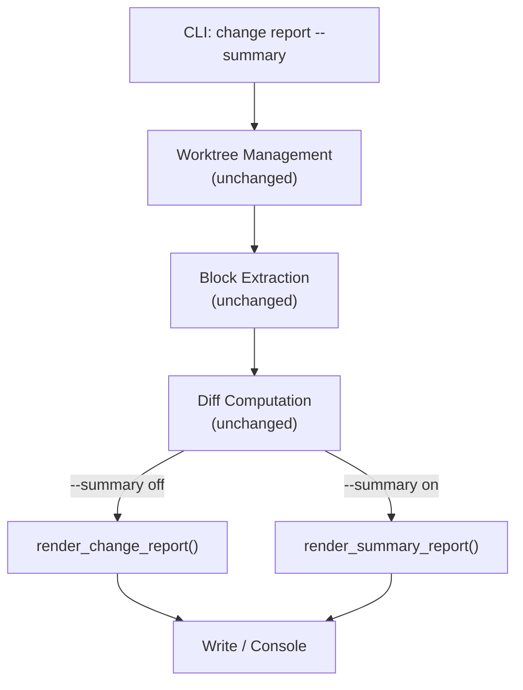
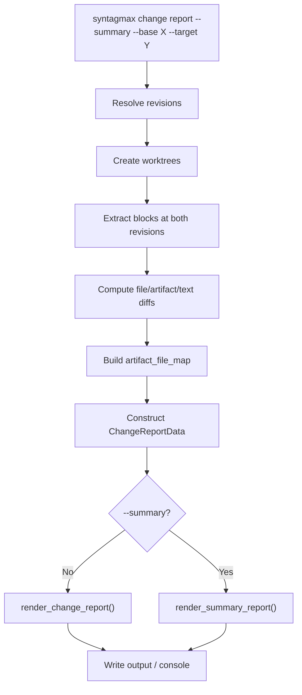

# Change Summary Report Mode — Implementation Specification

## Problem Statement

Implement a `--summary` flag for the existing `syntagmax change report` command that generates an abbreviated Markdown report showing which files, artefacts, and text fragments changed between two revisions — without displaying content, attribute diffs, or OLD/NEW comparison blocks. This enables quick triage of change scope before deciding whether a full report is necessary.

## Requirements

- Add a `--summary` boolean flag to the `change report` CLI command
- When `--summary` is active, produce a report containing only:
  - Repository Information (identical to the full report header)
  - Summary statistics table (identical to the full report)
  - Per-file breakdown with objects and text fragments listed compactly
- Per-file breakdown must show:
  - File path as a section heading
  - File status (Added / Modified / Removed / Renamed)
  - Objects listed with identifier, artefact type, and change status
  - Text fragments listed with change type and line ranges (base → target)
- The following MUST NOT appear in summary mode:
  - Object text content
  - Attribute change tables
  - Link (parent) changes
  - Text fragment content
  - Previous/Current fenced code blocks
  - Fallback plain-text diffs (unified diffs for extraction failures)
- Files with extraction errors are listed with status "Error" and error message (no fallback diff)
- `--summary` is combinable with `--single`, `--include-non-artifact`, and `--output`
- When `--include-non-artifact` is omitted, the Text fragments sub-section is suppressed
- Output filename appends `-summary` when `--summary` is active (e.g. `{safe_name}-{base_label}-to-{target_label}-{date_str}-summary.md` or `change-{base_label}-to-{target_label}-{date_str}-summary.md` for consolidated reports)
- `--output console` works identically

## Background

### Existing Architecture

The change report pipeline is split across four modules:

| Module | Responsibility |
|--------|---------------|
| `change_worktree.py` | Create/remove git worktrees, resolve revisions |
| `change_extract.py` | Extract blocks at a revision using existing extractors |
| `change_diff.py` | File-level, artefact-level, and text-block comparison |
| `change_render.py` | Markdown report generation from `ChangeReportData` |

The CLI (`cli.py`, line 471) orchestrates these modules: resolve → worktree → extract → diff → render → write.

### Data Models (from `change_diff.py`)

- `FileDiff(path, status, old_path)` — file-level change
- `ArtifactChange(aid, atype, changed_fields, content_changed, base_raw_text, target_raw_text)` — modified artefact
- `ArtifactDiff(added, removed, modified)` — aggregate; `added`/`removed` are tuples of `(aid, atype, block, file_path)`
- `TextFragmentChange(status, file_path, old_content, new_content, old_lines, new_lines, marker)` — text block change
- `TextBlockDiff(added, removed, modified)` — aggregate

### Renderer (from `change_render.py`)

- `ChangeReportData` dataclass aggregates all report inputs
- `render_change_report(data)` is the single entry point producing the full Markdown
- Internal helpers: `_render_repo_info`, `_render_summary`, `_render_changed_files`, `_render_detailed_changes`
- `compute_summary(data)` returns a stats dictionary used by both full and summary modes

### CLI Command (from `cli.py`)

Current options: `--base`, `--target`, `--output`, `--include-non-artifact`, `--single`, `-f/--config-file`. No `--summary` flag exists yet.

## Design Decisions

1. **Separate render function** — rather than adding a boolean mode parameter to the existing `render_change_report`, introduce `render_summary_report(data) -> str` in `change_render.py`. This keeps the full renderer untouched, avoids branching complexity, and makes each function testable in isolation.

2. **Reuse existing diff pipeline** — the summary renderer consumes the same `ChangeReportData` structure. All diff computation (worktree, extraction, comparison) is unchanged; only the rendering stage differs.

3. **Per-file grouping** — the full report separates "Changed Files" (overview) from "Detailed Changes". The summary report merges these into a single per-file section that lists objects and text fragments directly under the file heading.

4. **Always include artefacts** — artefact changes are always shown in summary mode. Text fragments are shown only when `--include-non-artifact` is active, consistent with the full report behaviour.

5. **Display extraction errors without diffs** — extraction errors are listed under the affected files with status marked as "Error" and the error message displayed, but the large fallback plain-text diff is omitted to keep the summary compact.

5. **`--summary` takes precedence over rendering depth** — it is an all-or-nothing mode. There is no partial summary or progressive disclosure within a single report.

## Proposed Solution

### Architecture



### Summary Renderer Output Structure

```markdown
# Change Report (Summary)

---

## Repository Information

- **Base revision:** <base>
- **Target revision:** <target>
- **Generated:** <timestamp>
- **Input record:** <record_name>

---

## Summary

| Parameter | Value |
|-----------|-------|
| Files changed | N |
| ...       | ... |

---

## Changed Files

### path/to/file.md

Status: Modified

**Objects**

- REQ-101 (Modified)
- REQ-102 (Added)
- REQ-110 (Removed)

**Text fragments**

- Modified (lines 45–52 → 45–56)
- Added (lines 128–135)

### path/to/another.md

Status: Added

**Objects**

- SYS-201 (Added)

### path/to/renamed.md

Status: Renamed (from path/to/old-name.md)

**Objects**

- SYS-105 (Modified)
```

### Key Implementation Details

#### `render_summary_report` Signature

```python
def render_summary_report(data: ChangeReportData) -> str:
    """Render an abbreviated summary report from the same data used for the full report."""
```

#### Per-File Object Grouping

Artefacts from `ArtifactDiff` need to be grouped by file path. The `added` and `removed` tuples already carry `file_path`. For `modified`, the file path must be derived from the target extraction (which is already available in `target_blocks`). A helper function will build a `dict[str, list]` mapping file paths to their artefact entries.

```python
def _group_artifacts_by_file(data: ChangeReportData) -> dict[str, list[tuple[str, str, str]]]:
    """Group artefact changes by file path.

    Returns:
        Dict mapping file_path -> list of (aid, atype, status_str).
    """
```

#### Per-File Text Fragment Grouping

Text fragments already carry `file_path`. Group them by path, rendering only status and line ranges.

```python
def _group_text_fragments_by_file(data: ChangeReportData) -> dict[str, list[str]]:
    """Group text fragment changes by file path.

    Returns:
        Dict mapping file_path -> list of formatted line descriptions.
    """
```

#### Line Range Formatting

```python
def _format_line_range(change: TextFragmentChange) -> str:
    """Format a text fragment change as a compact line range description.

    Single-line ranges omit the separator (e.g. 'lines 45' not 'lines 45–45').

    Examples:
        'Modified (lines 45–52 → 45–56)'
        'Added (lines 128)'
        'Removed (lines 210–218)'
    """
```

---

## Task Breakdown

### Task 1: Summary Renderer Implementation

**Objective:** Add `render_summary_report()` and its helper functions to `change_render.py`.

**Implementation:**
- Add `render_summary_report(data: ChangeReportData) -> str` below the existing `render_change_report` function.
- Reuse `_render_repo_info(data)` and `compute_summary(data)` / `_render_summary(summary)` unchanged.
- Implement `_group_artifacts_by_file(data)`:
  - For `added`: key = `file_path` from the tuple element (index 3).
  - For `removed`: key = `file_path` from the tuple element (index 3).
  - For `modified`: key = `file_path` from the `ArtifactChange.file_path` field.
- Implement `_group_text_fragments_by_file(data)`:
  - Iterate `data.text_diff.added + modified + removed`, group by `change.file_path`.
  - Format each entry with `_format_line_range(change)`.
- Implement `_format_line_range(change)`:
  - If a range is single-line (start == end), format as a single number (e.g. `lines 45` instead of `lines 45–45`).
  - Modified: `Modified (lines {old_range} → {new_range})`
  - Added: `Added (lines {new_range})`
  - Removed: `Removed (lines {old_range})`
- Render per-file sections: for each `FileDiff` in `data.file_diffs`, emit heading, status (including `Renamed (from {old_path})` for renames), objects list (if any), text fragments list (if `data.text_diff` is not None and has entries for that file).
- Render extraction errors: for each file with an extraction error, render the path heading, status as `Error`, and the error message (no fallback diff).
- If no files have changes or errors, render `No changes detected.` under the Changed Files heading.
- Title: `# Change Report (Summary)` to visually distinguish from the full report.

**Test requirements:**
- Unit test `render_summary_report` with mock `ChangeReportData` containing added, modified, removed artefacts and text fragments.
- Assert: title is `# Change Report (Summary)`.
- Assert: no `Previous`/`Current` headings, no fenced code blocks with artefact content, no attribute tables.
- Assert: objects appear as `- {atype} {aid} ({status})` lines.
- Assert: text fragments appear as `- {status} (lines ...)` lines.
- Assert: when `text_diff` is None, no "Text fragments" sub-sections appear.

**Demo command:**
```bash
uv run syntagmax change report --summary --base HEAD~1 --target HEAD --output console
```

---

### Task 2: Add `file_path` to ArtifactChange

**Objective:** Extend the `ArtifactChange` dataclass and `compare_artifacts` diff pipeline to carry the target file path for each modified artefact.

**Implementation:**
- Add `file_path: str = ""` field to `ArtifactChange` in `src/syntagmax/change_diff.py`.
- In `compare_artifacts()` inside `src/syntagmax/change_diff.py`, set `file_path=target_path` when constructing `ArtifactChange` instances (the `target_path` is already resolved from `target_map[aid]`).
- No changes to `ChangeReportData` — the file path is now intrinsic to each `ArtifactChange`.

**Test requirements:**
- Existing `test_change_report.py` tests pass without modification (new field has a default).
- Add a unit test verifying that `compare_artifacts` populates `file_path` on modified artefacts.
- Verify that added/removed tuples already carry `file_path` at index 3 (no change needed there).

---

### Task 3: CLI Flag Wiring

**Objective:** Add `--summary` flag to the `change report` command and route to the summary renderer.

**Implementation:**
- Add Click option:
  ```python
  @click.option('--summary', is_flag=True, help='Generate abbreviated summary report (no content)')
  ```
- Add `summary: bool` parameter to `change_report()` function signature.
- After constructing `report_data`, branch:
  ```python
  if summary:
      markdown = render_summary_report(report_data)
  else:
      markdown = render_change_report(report_data)
  ```
- Import `render_summary_report` alongside `render_change_report`.
- When `--summary` is active, always compute text diffs if `--include-non-artifact` is set (existing behaviour, no change needed).
- When `--summary` is active, append `-summary` to the output filename before the `.md` extension (both per-record and consolidated).

**Test requirements:**
- Integration test with `CliRunner`: invoke `change report --summary --base HEAD~1 --target HEAD --output console`.
- Assert exit code 0.
- Assert output contains `# Change Report (Summary)`.
- Assert output does NOT contain `## Detailed Changes`.
- Test combinability: `--summary --single`, `--summary --include-non-artifact`.

**Demo command:**
```bash
uv run syntagmax change report --summary --base HEAD~2 --target HEAD --include-non-artifact
```

---

### Task 4: Unit Tests for Summary Rendering

**Objective:** Create focused unit tests for all summary-mode rendering logic.

**Implementation:**
- Add tests in `tests/test_change_report.py` (or a dedicated `tests/test_change_summary.py` if the existing file grows too large).
- Test `_group_artifacts_by_file` with mixed file paths.
- Test `_group_text_fragments_by_file` with added/modified/removed fragments.
- Test `_format_line_range` edge cases:
  - Single-line range: `(45, 45)` → `lines 45`
  - Multi-line range: `(45, 52)` → `lines 45–52`
  - None old_lines (Added): only new range shown.
  - None new_lines (Removed): only old range shown.
- Test full `render_summary_report` output shape against a known fixture.
- Test that extraction errors appear with status "Error" and error message, but no fallback unified diff.

**Test requirements:**
- All assertions should be negative as well: verify absence of forbidden content.
- Run: `uv run pytest tests/test_change_summary.py -v`

---

### Task 5: Integration Test — End-to-End Summary Mode

**Objective:** Verify the full pipeline produces correct summary output using a realistic fixture.

**Implementation:**
- Extend the existing `_setup_test_repo` fixture in `tests/test_change_report.py` or create a dedicated fixture.
- Scenario:
  1. Create initial commit with 2 artefact files (3 artefacts total).
  2. Second commit: modify one artefact's content and attributes, add a new artefact, remove one artefact, modify a text block.
  3. Run `change report --summary --base HEAD~1 --target HEAD --include-non-artifact --output console`.
- Assertions:
  - Output contains per-file headings for each modified file.
  - Objects section lists all 3 change types (Added, Modified, Removed).
  - Text fragments section lists the modified block with line ranges.
  - No `Previous`/`Current` blocks.
  - No attribute change tables.

**Demo command:**
```bash
uv run pytest tests/test_change_report.py -k summary -v
```

---

### Task 6: Documentation Updates

**Objective:** Update all relevant documentation to cover `--summary`.

**Implementation:**
- **README.md** — In the "Change Reports" section, add `--summary` to the options table and add a usage example:
  ```bash
  # Quick overview of changes
  syntagmax change report --summary --base v1.2.0 --target v1.3.0
  ```
- **README.md** — Add a brief description under the options table:
  > `--summary` — Generate an abbreviated report showing only file paths, changed object IDs, and text fragment locations. No content or attribute diffs are included.
- **docs/reference/CLI.md** — Add `--summary` option and summary report usage examples under the `change report` section.
- Include a sample output snippet showing the per-file breakdown format.

**Test requirements:**
- Verify the `--summary` flag appears in CLI help: `syntagmax change report --help`.
- Manually confirm documentation renders correctly.

---

## Workflow Diagram



## File Layout

```
src/syntagmax/
├── change_render.py     # (modified) Add render_summary_report() and helpers
├── change_diff.py       # (unchanged)
├── change_extract.py    # (unchanged)
├── change_worktree.py   # (unchanged)
└── cli.py               # (modified) Add --summary flag, import summary renderer

tests/
├── test_change_report.py   # (modified) Add integration tests for summary mode
└── test_change_summary.py  # (new, optional) Dedicated unit tests for summary rendering

docs/
├── seed/change-summary-report.md  # Seed spec (existing)
└── specs/change-summary-report.spec.md  # This document
```
