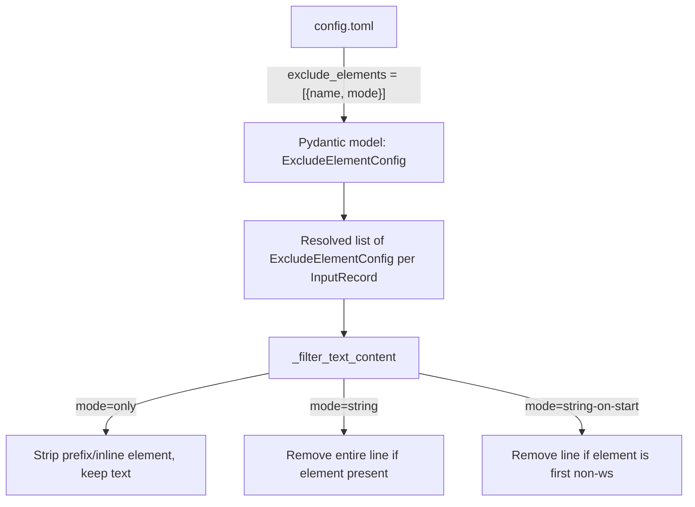

# Element Exclusion Removal Modes

## Problem Statement

The `exclude_elements` mechanism currently has hard-coded removal semantics per element type (line-level elements remove the whole line; `tags` strips inline). Users need configurable control over *how much* is removed: the element only, the whole line, or the whole line only when the element starts it.

## Requirements

1. Change `exclude_elements` from a list of strings to a list of objects: `[{name = "tags", mode = "string"}, {name = "callouts"}]`
2. Three modes: `only` (remove just the element), `string` (remove the entire line containing the element), `string-on-start` (remove line if element is first non-whitespace)
3. Default mode for all elements: `string-on-start`
4. **Breaking change** — plain string format no longer accepted
5. All five element types (`callouts`, `headings`, `horizontal_rules`, `frontmatter`, `tags`) support all three modes
6. `only` mode for `callouts`/`headings` strips the prefix marker (`>`, `# `) but keeps the text, preserving any leading whitespace/indentation before the marker
7. `only` mode for `horizontal_rules` removes the line (it *is* the element)
8. `only` mode for `tags` strips inline tags (current behaviour)
9. `only` mode for `frontmatter` removes the frontmatter block (block-level, mode has no additional meaning beyond `only`)
10. For `frontmatter` and `horizontal_rules`, all three modes behave identically (complete removal) — the mode is accepted for schema consistency but has no semantic difference
11. "Starts the line" means the element is the first non-whitespace character
12. Code-block awareness preserved for all modes
13. Inline code span protection preserved for `tags` in all modes — including `string` and `string-on-start` line-level decisions (tags inside code spans must not trigger line removal)
14. Duplicate element names within a single `exclude_elements` list are rejected at validation time

## Background

- Config models: `ObsidianDriverConfig.exclude_elements` and `InputConfig.exclude_elements` are currently `list[str]`
- Validation: `VALID_EXCLUDE_ELEMENTS` frozenset in `config.py`
- Runtime: `InputRecord.exclude_elements` is `list[str]`, resolved as union of global + per-record
- Filtering: `MarkdownExtractor._filter_text_content()` and `_strip_tags_from_line()` in `src/syntagmax/extractors/markdown.py`
- Tests: `tests/test_exclude_tags.py` covers the current tag stripping and element exclusion behaviour

## Proposed Solution



### New Config Shape

```toml
[drivers.obsidian]
exclude_elements = [
    {name = "frontmatter"},
    {name = "callouts", mode = "only"},
    {name = "tags", mode = "string"},
]

[[input]]
name = "reqs"
dir = "REQ"
driver = "obsidian"
exclude_elements = [{name = "headings", mode = "string-on-start"}]
```

### Data Model

```python
class ExcludeElementConfig(BaseModel):
    name: str
    mode: str = "string-on-start"  # only | string | string-on-start

VALID_EXCLUDE_MODES = frozenset({'only', 'string', 'string-on-start'})
```

A container-level validator on `exclude_elements` lists rejects duplicate `name` values (e.g., `[{name = "tags", mode = "only"}, {name = "tags", mode = "string"}]` is invalid).

### Mode Semantics by Element

| Element | `only` | `string` | `string-on-start` |
|---------|--------|----------|-------------------|
| `callouts` | Strip `> ` prefix, keep text (preserve leading whitespace) | Remove line if `>` is first non-ws | Remove line if `>` is first non-ws |
| `headings` | Strip `# ` prefix, keep text (preserve leading whitespace) | Remove line if `#` heading is first non-ws | Remove line if `#` heading is first non-ws |
| `horizontal_rules` | Remove line | Remove line | Remove line |
| `frontmatter` | Remove frontmatter block | Remove frontmatter block | Remove frontmatter block |
| `tags` | Strip `#tag` inline, keep surrounding text | Remove entire line if it contains any `#tag` (outside code spans) | Remove line only if `#tag` is first non-ws (outside code spans); otherwise fall back to `only` |

Notes:
- For `callouts` and `headings`, `string` and `string-on-start` are effectively identical because these elements inherently start at line beginning. The distinction matters mainly for `tags`.
- For `frontmatter` and `horizontal_rules`, all three modes produce identical results. The mode is accepted for schema consistency but documented as having no additional effect.
- For `tags` in `string` and `string-on-start` modes, inline code spans must be masked before evaluating whether a tag is present on the line (see Task 3 implementation guidance).

### Merge Logic

When resolving per-record + global `exclude_elements`:
- Union on `name` — an element present in either list is included.
- If both define the same element name, per-record `mode` takes precedence.

## Task Breakdown

### Task 1: Introduce `ExcludeElementConfig` Pydantic model and update config schema

- **Objective:** Replace `list[str]` with `list[ExcludeElementConfig]` in `ObsidianDriverConfig` and `InputConfig`.
- **Implementation guidance:**
  - Add `ExcludeElementConfig` model in `config.py` with `name: str` and `mode: str = "string-on-start"`.
  - Add validator on `name` checking against `VALID_EXCLUDE_ELEMENTS`.
  - Add validator on `mode` checking against `{"only", "string", "string-on-start"}`.
  - Add a container-level validator on `exclude_elements` in both `ObsidianDriverConfig` and `InputConfig` that rejects duplicate `name` values.
  - Change `ObsidianDriverConfig.exclude_elements` to `list[ExcludeElementConfig]`.
  - Change `InputConfig.exclude_elements` to `list[ExcludeElementConfig] | None`.
  - Update `InputRecord.exclude_elements` dataclass field to `list[ExcludeElementConfig]`.
  - Update resolution logic in `_read_input_records` — merge by union on `name`, with per-record taking precedence for mode if both define the same element.
- **Test requirements:**
  - Config with `[{name = "tags", mode = "string"}]` parses correctly.
  - Config with `[{name = "callouts"}]` defaults mode to `string-on-start`.
  - Invalid `name` rejected. Invalid `mode` rejected.
  - Duplicate `name` in the same list rejected (e.g., `[{name = "tags"}, {name = "tags", mode = "only"}]`).
  - Merge logic: per-record mode overrides global mode for same element name.
  - Old plain-string format is rejected (breaking change).
- **Demo:** Config parsing succeeds with new format; validation errors on invalid modes/names/duplicates.

### Task 2: Refactor `_filter_text_content` to be mode-aware for line-level elements

- **Objective:** Implement mode-driven filtering for `callouts`, `headings`, and `horizontal_rules`.
- **Implementation guidance:**
  - Refactor `_filter_text_content` to accept `list[ExcludeElementConfig]` instead of `list[str]`.
  - For each line-level element, branch on mode:
    - `string-on-start`: current behaviour (remove line if element starts it — first non-ws).
    - `string`: remove line if the element pattern is found anywhere on the line. For `callouts` this means `>` anywhere; for `headings` `#` followed by space anywhere. (In practice, for these elements `string` and `string-on-start` are equivalent since they always start lines.)
    - `only`: strip the prefix marker but keep the rest of the line, **preserving leading whitespace/indentation**. E.g., `  > text` → `  text`; `  ## Title` → `  Title`. Use a regex that captures leading whitespace and text after the marker: `r'^(\s*)>\s?(.*)$'` for callouts, `r'^(\s*)#{1,6}\s+(.*)$'` for headings.
  - `horizontal_rules`: all modes remove the line.
  - `frontmatter`: all modes remove the frontmatter block.
- **Test requirements:**
  - `callouts` with `only`: `> quoted text` becomes `quoted text`.
  - `callouts` with `only` preserving indent: `  > indented` becomes `  indented`.
  - `callouts` with `string-on-start`: line removed.
  - `headings` with `only`: `## Title` becomes `Title`.
  - `headings` with `only` preserving indent: `  ## Title` becomes `  Title`.
  - `headings` with `string-on-start`: line removed.
  - `horizontal_rules`: line removed in all modes.
  - Code blocks still protected in all modes.
- **Demo:** A text block with `  > Important note` + `exclude_elements = [{name = "callouts", mode = "only"}]` produces `  Important note`.

### Task 3: Implement mode-aware tag filtering

- **Objective:** Support all three modes for `tags`.
- **Implementation guidance:**
  - `only`: current behaviour — `_strip_tags_from_line()` removes tags inline.
  - `string`: if line (outside code spans) contains any Obsidian tag, remove the entire line.
  - `string-on-start`: if the first non-whitespace on the line (outside code spans) is a tag, remove the entire line; otherwise apply `only` mode (strip tags inline).
  - **Code span masking for line-level decisions:** Before evaluating whether a tag exists on the line (`string` mode) or starts the line (`string-on-start` mode), temporarily mask inline code spans by replacing backtick-enclosed content with a placeholder of the same length (e.g., `X` characters). This prevents false-positive matches on tags inside code spans like `` `#tag` ``. The masking is only for the detection decision — actual content modification still uses the existing `_strip_tags_from_line()` logic which already handles code spans correctly.
  - Reuse the existing `_tag_pattern` regex for detection on the masked line.
  - For `string` mode: check if `_tag_pattern` matches anywhere on the masked line; if so, skip the line.
  - For `string-on-start`: check if the first non-whitespace on the masked line is a tag match; if so, skip the line; otherwise fall through to `only` logic.
- **Test requirements:**
  - `tags` mode `only`: `Hello #safety world` → `Hello world` (current behaviour).
  - `tags` mode `string`: `Hello #safety world` → line removed entirely.
  - `tags` mode `string`: `` Text with `#safe` only `` → line preserved (tag is inside code span).
  - `tags` mode `string-on-start`: `#safety is important` → line removed; `Important #safety note` → `Important note` (falls back to `only`).
  - `tags` mode `string-on-start`: `` `#safety` is important `` → line preserved (tag is inside code span at line start).
  - `tags` mode `string-on-start` with leading whitespace: `   #safety rest` → line removed.
  - Tags in fenced code blocks preserved in all modes.
  - Multiple tags on line with `string` mode: line removed.
- **Demo:** Config with `[{name = "tags", mode = "string-on-start"}]` removes lines starting with tags but preserves mid-line text with tags stripped.

### Task 4: Update existing tests to new config format

- **Objective:** Migrate all tests in `test_exclude_tags.py` to use the new object format.
- **Implementation guidance:**
  - Replace `exclude_elements=['tags']` with `exclude_elements=[ExcludeElementConfig(name='tags', mode='only')]` in fixtures that test inline stripping (to preserve existing test assertions).
  - Add new test fixtures for `string-on-start` and `string` modes.
  - Update integration tests that use TOML config strings.
  - Ensure all existing assertions still pass (with appropriate mode selection).
- **Test requirements:**
  - All previously passing tests continue to pass.
  - New tests for each mode combination added.
- **Demo:** `pytest tests/test_exclude_tags.py` passes.

### Task 5: Update documentation and configuration reference

- **Objective:** Document the new structured format and mode options.
- **Implementation guidance:**
  - Update `docs/reference/configuration.md`: change `exclude_elements` description, add mode documentation with table.
  - Update `docs/reference/obsidian.md`: element filtering section.
  - Update `README.md` configuration example if relevant.
  - Note breaking change in format.
- **Test requirements:** N/A.
- **Demo:** Documentation accurately describes the new config shape and all modes.

### Task 6: Integration test with full pipeline

- **Objective:** End-to-end verification with the new config format through CLI.
- **Implementation guidance:**
  - Write integration test that creates a TOML config with structured `exclude_elements`, runs extraction, and verifies mode-specific behaviour.
  - Test combining multiple elements with different modes.
- **Test requirements:**
  - Config-driven extraction respects per-element modes.
  - Mixed modes (e.g., `callouts` with `only`, `tags` with `string-on-start`) work together.
- **Demo:** `pytest tests/test_exclude_tags.py` passes all integration tests with new format.
