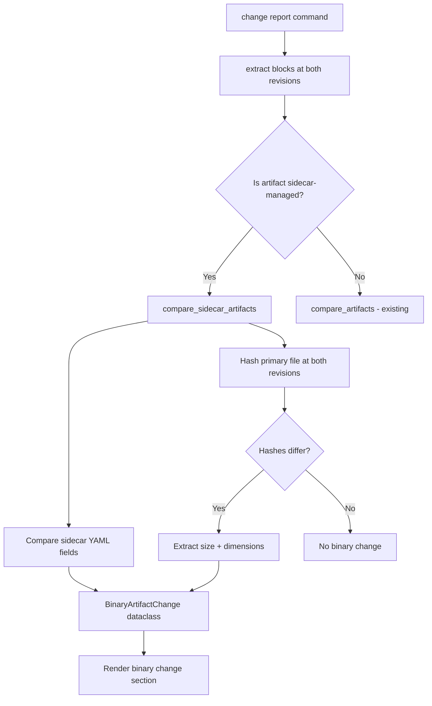

# Images in Change Report — Implementation Specification

## Problem Statement

The `syntagmax change report` command currently only handles text-based artifacts meaningfully. Sidecar-managed image/binary artifacts (e.g., `diagram.png` with `diagram.png.stmx`) are not detected or reported during change analysis. This specification adds layered image change detection combining metadata comparison (approach 1), hash-based binary change detection (approach 2), and file size/dimensions metadata extraction (approach 3).

## Requirements

1. Sidecar-managed image artifacts MUST participate in `filter_changed_files` and appear in change reports when their primary file or sidecar file changes.
2. Sidecar attribute changes (YAML field diffs) MUST be reported using the existing `compare_artifacts` mechanism.
3. Binary content changes to the primary file MUST be detected via SHA-256 hash comparison and reported as "Binary content changed".
4. When the primary file is a supported image format (PNG, JPEG, GIF, BMP, TIFF, WebP), file size and pixel dimensions MUST be extracted at both revisions and reported in a property table.
5. Dimension/size extraction failures MUST be handled gracefully — report hash change without dimensions.
6. No new CLI flags for baseline — activates automatically for sidecar input records.
7. `_remap_record` MUST use the record's configured filter rather than falling back to a hardcoded glob.
8. Summary statistics MUST include separate counts for binary artifacts added, modified, and removed.
9. Rendered report MUST include a dedicated section for image/binary artifact changes.
10. The "Binary Content" property table MUST only be rendered when `binary_changed=True`. Metadata-only changes show only the attribute changes table.
11. The "Dimensions" row MUST be omitted from the property table when both base and target dimensions are `None` (non-image binaries).
12. Files ending in `.stmx` or `.syntagmax` MUST be skipped when encountered as primary files in `SidecarExtractor.extract_blocks_from_file` (prevents crashes when broad globs match sidecar files themselves).
13. Path resolution for primary files MUST account for the offset between `config.base_dir()` and the repository root when joining with worktree paths.
14. When a sidecar-managed file is renamed between revisions, base and target file paths MUST be resolved independently using their respective `artifact.location.loc_file` values.

## Background

### Existing Infrastructure

- **Sidecar extractor** (`extractors/sidecar.py`): Receives `filepaths` pointing to the primary files (e.g., `*.png`). It then locates the `.stmx` or `.syntagmax` sidecar, parses its YAML, and produces an `ArtifactBlock` whose `raw_text` is the sidecar content.
- **`FileLocation`** (`artifact.py`): Stores both `loc_file` (primary file path) and `loc_sidecar` (sidecar path). Sidecar artifacts always have `loc_sidecar` set. `loc_file` is relative to `config.base_dir()`, NOT the repository root.
- **`_remap_record`** (`change_extract.py`): Re-globs files in a worktree. Currently uses `DEFAULT_FILTERS` dict keyed by driver name; the sidecar driver is absent from this dict, causing fallback to `'**/*'`. The per-record filter from config is never consulted because `InputRecord` doesn't store it.
- **`compare_artifacts`** (`change_diff.py`): Compares `ArtifactBlock` objects by `aid`. Already handles sidecar artifacts for field/attribute diffs. Does not detect binary file changes.
- **`change_render.py`**: Renders artifacts as text diff blocks. No rendering path for binary/image changes.
- **Example**: `example/obsidian-driver/SYS/diagram.png` with `diagram.png.stmx` is already in a `sidecar` input record filtered by `**/*.png`.
- **Path semantics**: `config.base_dir()` may differ from the repository root (e.g., when `base = ".."` is set in config). Worktree paths (`base_path`, `target_path`) point to the repository root. To resolve `loc_file` within a worktree, you must compute the relative offset of `config.base_dir()` from the repo root and apply it.

### Gap Analysis

| Component | Gap |
|-----------|-----|
| `InputRecord` | Does not store the configured glob filter |
| `_remap_record` | Falls back to `'**/*'` for unknown drivers instead of using record's filter |
| `SidecarExtractor` | Crashes when `.stmx`/`.syntagmax` files themselves match the glob |
| `compare_artifacts` | No binary content comparison for sidecar artifacts |
| `change_render.py` | No rendering branch for binary/image artifacts |
| `ChangeReportData` | No field for binary artifact changes |
| Summary stats | No binary artifact counter |

### Pillow Dependency

Pillow is a widely-used, well-maintained library. It will be added as an optional dependency (`syntagmax[images]`) and used only for dimension extraction. If Pillow is not installed, dimension extraction is skipped gracefully and only hash + size are reported.

## Proposed Solution



### Path Resolution Strategy

When resolving the primary file within a worktree:

```python
# Compute the relative offset of base_dir from repo root
import git
repo = git.Repo(config.base_dir(), search_parent_directories=True)
repo_root = Path(repo.working_tree_dir).resolve()
base_dir_offset = config.base_dir().resolve().relative_to(repo_root)

# Resolve loc_file within a worktree
primary_in_worktree = worktree_path / base_dir_offset / artifact.location.loc_file
```

For renamed files, resolve base and target independently:
```python
base_primary = base_path / base_dir_offset / base_block.artifact.location.loc_file
target_primary = target_path / base_dir_offset / target_block.artifact.location.loc_file
```

### Data Model

New dataclass in `change_diff.py`:

```python
@dataclass
class ImageProperties:
    """Properties extracted from an image file."""
    size_bytes: int
    width: int | None = None
    height: int | None = None


@dataclass
class BinaryArtifactChange:
    """Represents changes to a sidecar-managed binary artifact."""
    aid: str
    atype: str
    file_path: str
    binary_changed: bool
    hash_base: str | None  # SHA-256 hex, None if file didn't exist
    hash_target: str | None
    base_properties: ImageProperties | None = None
    target_properties: ImageProperties | None = None
    field_changes: dict = field(default_factory=dict)  # sidecar attribute diffs
```

Extended `ChangeReportData`:

```python
@dataclass
class ChangeReportData:
    # ... existing fields ...
    binary_diff: list[BinaryArtifactChange] = field(default_factory=list)
```

### Key Functions

1. **`compute_file_hash(path: Path) -> str | None`** — SHA-256 of file contents. Returns None if file doesn't exist.
2. **`extract_image_properties(path: Path) -> ImageProperties | None`** — File size + optional Pillow-based dimensions. Graceful fallback.
3. **`compare_sidecar_artifacts(base_records, target_records, base_path, target_path, base_dir_offset) -> list[BinaryArtifactChange]`** — Matches sidecar artifacts by `aid`, resolves primary file paths using `base_dir_offset`, computes hashes and properties, delegates YAML field comparison to existing `_compare_fields`.

### Rendering Rules

- The "Binary Content" property table is only rendered when `binary_changed=True`.
- The "Dimensions" row is omitted when both base and target `width` are `None`.
- The "Attribute Changes" table is rendered when `field_changes` is non-empty.

Example output (binary + metadata change):

```markdown
#### SYS SYS-004

**Status:** Modified (binary)

##### Binary Content

| Property | Previous | Current |
|----------|----------|---------|
| SHA-256 | `a1b2c3d4e5f6` | `d4e5f67890ab` |
| Size | 45.2 KB | 52.1 KB |
| Dimensions | 1024×768 | 1280×960 |

##### Attribute Changes

| Attribute | Previous | Current |
|-----------|----------|---------|
| title | Old title | New title |
```

Example output (metadata-only change, no binary diff):

```markdown
#### SYS SYS-004

**Status:** Modified (metadata)

##### Attribute Changes

| Attribute | Previous | Current |
|-----------|----------|---------|
| status | draft | active |
```

---

## Task Breakdown

### Task 1: Add `filter_glob` field to `InputRecord` and harden sidecar extractor

**Objective:** Store the resolved glob pattern in `InputRecord` so downstream code (especially `_remap_record`) can use it. Also prevent crashes when sidecar files themselves match the glob.

**Implementation:**
- Add `filter_glob: str` field to the `InputRecord` dataclass in `config.py` (default `'**/*'`).
- Set it during `_read_input_records` from the resolved glob (which already exists as local variable `glob`).
- Update `_remap_record` in `change_extract.py` to use `record.filter_glob` instead of looking up `DEFAULT_FILTERS`.
- In `SidecarExtractor.extract_blocks_from_file`, add an early return (empty list) if `filepath` ends with `.stmx` or `.syntagmax` — these are sidecar metadata files, not primary files.

**Test requirements:**
- Unit test verifying that `InputRecord.filter_glob` is set correctly for obsidian (`**/*.md`), sidecar with explicit filter (`**/*.png`), and driver with no filter (`**/*`).
- Verify `_remap_record` uses the stored filter by mocking a worktree directory.
- Test that `SidecarExtractor.extract_blocks_from_file` returns `[]` for a `.stmx` file path.

**Demo:** `uv run python -m pytest tests/test_change_report.py -k filter_glob -v` passes.

---

### Task 2: Binary hash comparison utility

**Objective:** Create utility functions for computing file hashes and extracting image properties.

**Implementation:**
- Add functions to a new file `src/syntagmax/change_binary.py`:
  - `compute_file_hash(path: Path) -> str | None` — Read file in 8KB chunks, return hex SHA-256. Return None if path doesn't exist or isn't a file.
  - `extract_image_properties(path: Path) -> ImageProperties | None` — Get `os.path.getsize()` for size. Attempt `from PIL import Image` for dimensions; if ImportError or PIL error, return `ImageProperties(size_bytes=size)` without dimensions.
  - `format_file_size(size_bytes: int) -> str` — Human-readable formatting (e.g., "45.2 KB", "1.3 MB").
- Add `ImageProperties` dataclass to `change_binary.py`.

**Test requirements:**
- Test `compute_file_hash` with a known file (assert exact SHA-256).
- Test `compute_file_hash` returns None for non-existent path.
- Test `extract_image_properties` with a minimal PNG (1×1 pixel, created in test).
- Test `extract_image_properties` gracefully returns size-only when Pillow unavailable (mock the import).
- Test `format_file_size` with various values.

**Demo:** `uv run python -m pytest tests/test_change_binary.py -v` passes.

---

### Task 3: Sidecar artifact comparison logic

**Objective:** Implement `compare_sidecar_artifacts` that detects binary content changes and extracts properties at both revisions, with correct path resolution.

**Implementation:**
- Add `BinaryArtifactChange` dataclass to `change_diff.py`.
- Add `compare_sidecar_artifacts(base_records, target_records, base_path: Path, target_path: Path, base_dir_offset: Path) -> list[BinaryArtifactChange]` to `change_diff.py`:
  1. Filter `ArtifactBlock` instances whose artifact has `location.loc_sidecar` set (indicates sidecar driver).
  2. Match by `aid` (same logic as `compare_artifacts`).
  3. For matched pairs: resolve the primary file path independently for base and target using their respective `artifact.location.loc_file` values, joined with `base_path / base_dir_offset` and `target_path / base_dir_offset`.
  4. Call `compute_file_hash` on both. If hashes differ, call `extract_image_properties` on both.
  5. Call `_compare_fields` on the sidecar YAML fields.
  6. Produce `BinaryArtifactChange` for each artifact that has either binary or field changes.
  7. Handle added/removed sidecar artifacts (only in target or only in base).

**Test requirements:**
- Test with two identical images → no binary change reported, only field changes if any.
- Test with modified image (different content) → `binary_changed=True`, hashes differ.
- Test added sidecar artifact (only in target) → reported with target hash/properties.
- Test removed sidecar artifact (only in base) → reported with base hash/properties.
- Test field-only change (sidecar YAML modified, image unchanged) → `binary_changed=False`, field diffs present.
- Test path resolution when `base_dir_offset` is non-trivial (e.g., `Path('example/obsidian-driver')`).
- Test renamed file (different `loc_file` in base vs target) resolves independently.

**Demo:** `uv run python -m pytest tests/test_change_report.py -k sidecar -v` passes.

---

### Task 4: Integrate into the change report pipeline

**Objective:** Wire `compare_sidecar_artifacts` into the `change_report` CLI command and extend `ChangeReportData`.

**Implementation:**
- Add `binary_diff: list[BinaryArtifactChange] = field(default_factory=list)` to `ChangeReportData` in `change_render.py`.
- In `cli.py` `change_report` command, after calling `compare_artifacts`:
  1. Compute `base_dir_offset` as the relative path from repo root to `config.base_dir()`.
  2. Separate sidecar records from text records (check `record.driver == 'sidecar'`).
  3. For sidecar records, call `compare_sidecar_artifacts` with `base_path` / `target_path` and `base_dir_offset` from the worktree context.
  4. Exclude sidecar artifacts from the regular `compare_artifacts` call to avoid double-reporting.
  5. Attach `binary_diff` to `ChangeReportData`.
- Update `compute_summary` to include `binary_added`, `binary_modified`, and `binary_removed` counts.

**Test requirements:**
- Integration test: create a test repo with a sidecar-managed PNG, modify the image between commits, run change report, verify binary change appears in output.
- Test that sidecar artifacts don't appear in the regular artifact diff section.
- Test summary statistics include separate binary add/modify/remove counts.

**Demo:** `uv run syntagmax --cwd ./example/obsidian-driver change report --base HEAD~3 --target HEAD --output console` includes binary artifact section (or "No changes" if no image changed).

---

### Task 5: Render binary artifact changes

**Objective:** Add rendering logic for `BinaryArtifactChange` entries in the Markdown report.

**Implementation:**
- Add `_render_binary_artifact_change(change: BinaryArtifactChange) -> list[str]` to `change_render.py`:
  - Header: `#### {atype} {aid}`
  - Status line: "Modified (binary)" / "Modified (metadata)" / "Added (binary)" / "Removed (binary)"
  - **Only if `binary_changed=True`**: Property table with SHA-256 (truncated to 12 chars), size. Include "Dimensions" row only if at least one revision has non-None width/height.
  - Attribute changes table (reuse existing field rendering pattern) when `field_changes` is non-empty.
- Add a "Binary Artifact Changes" section in `_render_detailed_changes`, placed between artifact changes and text fragment changes.
- In `render_summary_report`, include binary artifacts in the per-file breakdown with status "Binary Modified" / "Binary Added" / "Binary Removed".
- Update summary table to include `| Binary artifacts added | N |`, `| Binary artifacts modified | N |`, `| Binary artifacts removed | N |` rows.

**Test requirements:**
- Unit test `_render_binary_artifact_change` with a sample `BinaryArtifactChange` — verify table structure, hash truncation, dimension formatting.
- Test rendering with `binary_changed=False` (metadata-only) — verify "Binary Content" table is absent.
- Test rendering with missing dimensions (non-image binary) — verify "Dimensions" row is omitted.
- Test full `render_change_report` with binary_diff populated — verify section appears.
- Test summary report includes separate binary add/modify/remove counts.

**Demo:** `uv run python -m pytest tests/test_change_report.py tests/test_change_summary.py -v` passes.

---

### Task 6: Documentation update

**Objective:** Update all relevant documentation to cover image/sidecar change reporting.

**Implementation:**
- Update `README.md` "Change Reports" section to mention that sidecar-managed binary artifacts (images, diagrams) are automatically included in change reports with hash comparison and optional dimension tracking.
- Create or update `docs/reference/change-reports.md` with:
  - How binary artifacts are detected and compared.
  - The property table format and conditional rendering rules.
  - Note about optional Pillow dependency for dimension extraction.
  - Example output snippets (binary change, metadata-only change).
- Update `docs/reference/configuration.md` to document the sidecar driver's behaviour in change reports and the `[images]` optional dependency.
- Add `Pillow` as an optional dependency in `pyproject.toml` under an `[images]` extra group.

**Test requirements:**
- Verify documentation renders correctly (no broken links).
- `uv run ruff check` and `uv run python -m pytest tests` still pass.

**Demo:** README and reference docs reflect the new feature. `uv pip install -e ".[images]"` installs Pillow.
