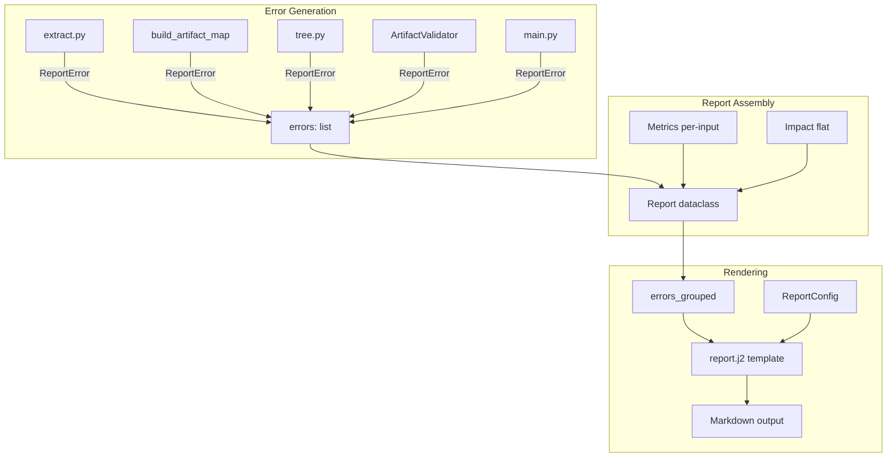

# Improve Analyze Report Structure and UX — Implementation Specification

## Problem Statement

The current `analyze` command produces a flat report where errors are an unnumbered list, metrics are a single section, and no links exist to source files. With 150+ errors across multiple input records, users cannot easily identify which inputs have problems, what categories of errors exist, or navigate directly to the source. This specification adds structured error grouping by input record and error category, configurable Markdown/wiki file links, and per-input metrics grouping.

**Issue:** [#122](https://github.com/flyvercity/syntagmax/issues/122)

## Requirements

1. Replace `errors: list[str]` in the `Report` dataclass with `errors: list[ReportError]`, where `ReportError` carries structured metadata (category, input record, artifact ID, file path, line range).
2. Group errors in the report by **input record name**, then by **error category** within each input.
3. Errors not attributable to any input record (e.g., "must have exactly one root") appear under a "Global" heading.
4. Error category names are **localised** (both English and Russian).
5. Add a `[report]` section to `config.toml` with:
   - `path_as_links` (bool, default `false`) — render file paths as clickable links
   - `wiki_links` (bool, default `false`) — use `[[path]]` wiki-link style; when false, use standard `[file](path#L<line>)` Markdown links
6. File paths in links are **relative to the project root** (working directory).
7. For standard Markdown links, include `#L<start_line>` line anchors when line information is available. For wiki links, omit line anchors (Obsidian does not support them).
8. When `path_as_links` is false, maintain current behaviour (plain path text in parentheses).
9. Metrics section always presents the top-level aggregate system metrics first. When more than one input record contributes requirements, an additional "Metrics by Input Record" subsection breakdown is rendered underneath.
10. Impact analysis section remains flat (unified tree).
11. `ReportError.__str__()` produces the current plain-text format for backward compatibility with logging, MCP, and `--warnings-as-errors` handling.
12. Update README.md and `docs/reference/configuration.md` with the new `[report]` section documentation.

## Background

### Current Report Pipeline

- `main.py:process()` orchestrates the analysis pipeline. Each step appends to a shared `errors: list[str]`.
- `report.py:Report` dataclass holds `errors`, `tree_text`, `metrics`, `impact`, `ai_results`.
- `resources/report.j2` Jinja2 template renders the report. It uses `jinja2.ext.i18n` for localisation.
- Errors are generated in:
  - `extract.py:extract()` — per-record extraction errors
  - `extract.py:build_artifact_map()` — duplicate IDs, missing IDs
  - `tree.py:populate_pids()` — conflicting revisions, invalid parent refs
  - `tree.py:build_tree()` — missing parents, circular references
  - `analyse.py:ArtifactValidator` — schema, attribute, reference, trace errors
  - `main.py:process()` — single root check

### Artifact Provenance

- Each `Artifact` has a `.record: InputRecord | None` field set during extraction.
- `InputRecord.name` is the human-readable input source name (e.g., "software-requirements").
- `Artifact.location` has `.loc_file` for file path and `LineLocation.loc_lines` for line range.

### Configuration Model

- `config.py:ConfigFile` is the Pydantic model for `config.toml`. Adding `report: ReportConfig` follows the same pattern as `metrics: MetricsConfig`, `impact: ImpactConfig`, etc.
- `Config` class exposes the parsed model to the pipeline.

### Localisation

- `i18n.py` provides `setup_i18n()` and `get_translations()`.
- `.po` catalogues live in `src/syntagmax/resources/locales/{en,ru}/LC_MESSAGES/messages.po`.
- The Jinja2 template uses `{{ _("string") }}` for translation.

### Tests

- `tests/test_report.py` tests report rendering with plain-string errors.
- `tests/test_artifact_validation.py` tests error generation in `build_artifact_map`.
- Tests use `MagicMock` for `Config` and custom `MockLocation` for artifact locations.

## Design Decisions

1. **`ReportError` is a dataclass** — lightweight, immutable-friendly, easy to construct at each error site.
2. **Categories are module-level constants** — not a Python `Enum` (too heavy for simple string matching). Defined in `report.py`.
3. **Grouping logic lives in `Report` + template** — The `Report` class exposes a helper method `errors_grouped()` that returns a nested structure. The Jinja2 template iterates it. Categories are sorted by a fixed `CANONICAL_CATEGORY_ORDER` for consistent visual hierarchy.
4. **`[report]` config is optional** — All defaults match current behaviour (no links, plain text paths).
5. **Link rendering is a Jinja2 custom filter** — `format_error(error, config)` renders the path according to config. Keeps template clean.
6. **Backward-compatible `__str__`** — External consumers (MCP, logs) get the same string format they always did.
7. **Error construction at source** — Each error site constructs `ReportError` directly rather than parsing strings. This gives accurate metadata without regex guesswork.
8. **Defensive coercion via `from_any()`** — Legacy code paths, plugins, or AI analysis may still produce plain strings. `ReportError.from_any()` normalises them to prevent `AttributeError` crashes during rendering.
9. **Metrics per-input uses the same `calculate_metrics` logic** — called once per relevant input record, results stored as a list in `Report`. Aggregate totals are always rendered first.

## Proposed Solution

### Architecture



### Data Model

```python
# In report.py

# Error categories
CAT_SCHEMA = 'schema'
CAT_ATTRIBUTE = 'attribute'
CAT_REFERENCE = 'reference'
CAT_TRACE = 'trace'
CAT_DUPLICATE = 'duplicate'
CAT_EXTRACTION = 'extraction'
CAT_STRUCTURE = 'structure'

GLOBAL_INPUT = '__global__'

CANONICAL_CATEGORY_ORDER = [
    CAT_EXTRACTION,
    CAT_STRUCTURE,
    CAT_SCHEMA,
    CAT_ATTRIBUTE,
    CAT_REFERENCE,
    CAT_TRACE,
    CAT_DUPLICATE,
]


@dataclass
class ReportError:
    message: str
    category: str
    input_record: str | None = None   # None → grouped under "Global"
    artifact_id: str | None = None
    artifact_type: str | None = None
    file_path: str | None = None
    line_range: tuple[int, int] | None = None

    @classmethod
    def from_any(cls, err: 'ReportError | str') -> 'ReportError':
        """Defensively coerce plain string errors into ReportError."""
        if isinstance(err, ReportError):
            return err
        return cls(message=str(err), category=CAT_STRUCTURE)

    def __str__(self) -> str:
        """Backward-compatible plain-text representation."""
        loc = ''
        if self.artifact_type and self.artifact_id and self.file_path:
            lines = f':{self.line_range[0]}-{self.line_range[1]}' if self.line_range else ''
            loc = f' ({self.artifact_type}።{self.artifact_id}።{self.file_path}{lines})'
        elif self.artifact_type and self.artifact_id:
            loc = f' ({self.artifact_type}።{self.artifact_id})'
        elif self.file_path:
            loc = f' ({self.file_path})'
        return f'{self.message}{loc}'
```

### Configuration

```python
# In config.py

class ReportConfig(BaseModel):
    model_config = ConfigDict(extra='ignore')
    path_as_links: bool = Field(default=False, description='Render file paths as clickable links in report')
    wiki_links: bool = Field(default=False, description='Use [[wiki-link]] style (Obsidian). When false, use [text](url) Markdown links.')
```

Added to `ConfigFile`:
```python
report: ReportConfig = Field(default_factory=ReportConfig, description='Report formatting options')
```

Exposed on `Config`:
```python
self.report = config_model.report
```

### Template Structure (report.j2)

```jinja2
# {{ _("Analysis Report") }}


## {{ _("Errors") }}

{{ _("Total errors:") }} {{ report.errors | length }}


### {{ input_name }} ({{ categories | sum(attribute='1') }} {{ _("errors") }})


#### {{ _(cat_name) }} ({{ cat_errors | length }})


{{ loop.index }}. {{ error | format_error(report.report_config) }}




```

### Link Rendering

Custom Jinja2 filter `format_error`:
- If `path_as_links = false`: render `{message} ({artifact_type}:{artifact_id} in {file_path}:{lines})`
- If `path_as_links = true, wiki_links = true`: render `{message} ({artifact_type}:{artifact_id} in [[{relative_path}]])`
- If `path_as_links = true, wiki_links = false`: render `{message} ({artifact_type}:{artifact_id} in [{filename}]({relative_path}#L{start_line}))`

Path is relative to the project root (working directory where report is generated).

### Metrics Per-Input

```python
@dataclass
class Report:
    errors: list[ReportError] = field(default_factory=list)
    tree_text: str | None = None
    metrics_by_input: list[tuple[str, benedict]] | None = None  # [(input_name, metrics_data)]
    impact: benedict | None = None
    ai_results: list[dict] | None = None
    tasks_summary: dict | None = None
    report_config: 'ReportConfig | None' = None
```

In `main.py`, always compute aggregate metrics across all artifacts. If multiple input records contribute to the configured `requirement_type`, additionally compute per-input metrics and store in `report.metrics_by_input`.

---

## Task Breakdown

### Task 1: Introduce `ReportError` Dataclass and Error Constants

**Objective:** Create the `ReportError` dataclass with category constants and a backward-compatible `__str__` method. Add `ReportConfig` Pydantic model to `config.py`.

**Implementation:**
- In `src/syntagmax/report.py`:
  - Define category constants: `CAT_SCHEMA`, `CAT_ATTRIBUTE`, `CAT_REFERENCE`, `CAT_TRACE`, `CAT_DUPLICATE`, `CAT_EXTRACTION`, `CAT_STRUCTURE`.
  - Define `GLOBAL_INPUT = '__global__'` sentinel.
  - Define `CANONICAL_CATEGORY_ORDER` list for consistent rendering order.
  - Create `ReportError` dataclass with fields: `message`, `category`, `input_record`, `artifact_id`, `artifact_type`, `file_path`, `line_range`.
  - Implement `from_any(err: ReportError | str)` classmethod for defensive coercion of plain strings.
  - Implement `__str__()` that reproduces the legacy plain-text format, with graceful fallback for partial metadata (renders `(type።id)` when `file_path` is absent).
- In `src/syntagmax/config.py`:
  - Add `ReportConfig(BaseModel)` with `path_as_links: bool = False` and `wiki_links: bool = False`.
  - Add `report: ReportConfig = Field(default_factory=ReportConfig)` to `ConfigFile`.
  - Expose `self.report` on `Config` class in `_read_config`.

**Test requirements:**
- `ReportError('msg', 'attribute', 'sw-reqs', 'REQ-001', 'REQ', 'reqs/file.md', (10, 20)).__str__()` produces `"msg (REQ።REQ-001።reqs/file.md:10-20)"`
- `ReportError('msg', 'attribute', 'sw-reqs', 'REQ-001', 'REQ').__str__()` produces `"msg (REQ።REQ-001)"` (no file_path fallback)
- `ReportError('root error', 'structure').__str__()` produces `"root error"`
- `ReportError.from_any('plain string')` returns `ReportError(message='plain string', category=CAT_STRUCTURE)`
- `ReportError.from_any(existing_error)` returns the same object.
- `ConfigFile` validates with `[report]` section present and absent.
- `ReportConfig(path_as_links=True, wiki_links=True)` instantiates correctly.

**Demo:** Unit tests pass, `ReportError` objects can be created and stringified.

---

### Task 2: Migrate Error Sites in `extract.py` and `build_artifact_map`

**Objective:** Replace string error appends in `extract.py` with `ReportError` objects.

**Implementation:**
- In `src/syntagmax/extract.py`:
  - Import `ReportError`, `CAT_EXTRACTION`, `CAT_DUPLICATE`.
  - In `extract()`: wrap `record_errors` from each extractor. Extractor errors are strings — wrap them as `ReportError(message=err, category=CAT_EXTRACTION, input_record=record.name)`.
  - In `build_artifact_map()`:
    - "has no ID" → `ReportError(message=..., category=CAT_EXTRACTION, input_record=a.record.name if a.record else None, file_path=str(a.location), ...)`
    - "Duplicate artifact ID" → `ReportError(message=..., category=CAT_DUPLICATE, input_record=a.record.name if a.record else None, artifact_id=a.aid, artifact_type=a.atype, file_path=str(a.location), ...)`
- Update function signatures: `errors: list[str]` → `errors: list[ReportError]`.

**Test requirements:**
- `build_artifact_map` with duplicate IDs produces `ReportError` with `category=CAT_DUPLICATE` and correct `input_record`.
- `build_artifact_map` with missing ID produces `ReportError` with `category=CAT_EXTRACTION`.
- `str(error)` still contains the expected substrings for existing test assertions (update `test_artifact_validation.py` to use `str(errors[0])`).

**Demo:** Existing tests adapted and passing; errors carry structured metadata.

---

### Task 3: Migrate Error Sites in `tree.py`

**Objective:** Replace string error appends in `tree.py` with `ReportError` objects.

**Implementation:**
- In `src/syntagmax/tree.py`:
  - Import `ReportError`, `CAT_REFERENCE`, `CAT_STRUCTURE`.
  - `populate_pids()` errors:
    - "Conflicting nominal revisions" → `ReportError(category=CAT_REFERENCE, input_record=a.record.name, artifact_id=a.aid, artifact_type=a.atype, file_path=...)`
    - "Error processing parent link" → `ReportError(category=CAT_REFERENCE, ...)`
  - `build_tree()` errors:
    - "Missing parent" → `ReportError(category=CAT_REFERENCE, input_record=a.record.name, ...)`
    - "Circular reference" → `ReportError(category=CAT_STRUCTURE, input_record=artifacts[ref].record.name if applicable, ...)`

**Test requirements:**
- Build tree with missing parent produces `ReportError` with `category=CAT_REFERENCE`.
- Circular reference produces `ReportError` with `category=CAT_STRUCTURE`.

**Demo:** Tree-related errors carry correct category and input record metadata.

---

### Task 4: Migrate Error Sites in `analyse.py` (ArtifactValidator)

**Objective:** Replace all `self.errors.append(str)` calls in `ArtifactValidator` with `ReportError` objects.

**Implementation:**
- In `src/syntagmax/analyse.py`:
  - Import `ReportError`, `CAT_SCHEMA`, `CAT_ATTRIBUTE`, `CAT_REFERENCE`, `CAT_TRACE`, `CAT_STRUCTURE`.
  - Add helper `_make_error(self, artifact, message, category)` that constructs `ReportError` with artifact's record, ID, type, file path, and line range extracted from `artifact.location`.
  - Replace each `self.errors.append(f"...")` with `self.errors.append(self._make_error(artifact, message, category))`:
    - `_validate_id_schema` → `CAT_SCHEMA`
    - `_check_extra_attributes` → `CAT_ATTRIBUTE`
    - `_check_attribute_requirements` (missing mandatory) → `CAT_ATTRIBUTE`
    - `_check_type` (integer, boolean, enum) → `CAT_ATTRIBUTE`
    - `_check_type` (reference — unknown ID, unknown type) → `CAT_REFERENCE`
    - `_validate_traces` (forbidden trace, mode violation, missing mandatory trace) → `CAT_TRACE`
    - "Unknown artifact type" → `CAT_ATTRIBUTE`
  - `analyse_tree()` "Must have exactly one root" → `ReportError(category=CAT_STRUCTURE, input_record=None)`

**Test requirements:**
- Validator produces `ReportError` objects with correct categories.
- `str(error)` matches legacy format for existing tests in `test_artifact_validation.py`, `test_reference_validation.py`, `test_traces.py`.
- Tests in `test_id_validation.py` adapted.

**Demo:** All validation errors carry structured metadata; existing test assertions pass via `str()`.

---

### Task 5: Migrate Error Sites in `main.py` and `metrics.py`

**Objective:** Convert remaining error sites and implement per-input metrics.

**Implementation:**
- In `src/syntagmax/main.py`:
  - The single-root check produces `ReportError(category=CAT_STRUCTURE, input_record=None)`.
  - Implement metrics computation:
    - Always compute aggregate metrics across all artifacts → `report.metrics`.
    - If >1 input records contribute to `requirement_type`, additionally compute per-input metrics by filtering artifacts by `artifact.record.name` → `report.metrics_by_input = [(record_name, metrics_benedict), ...]`.
- In `src/syntagmax/metrics.py`:
  - "No requirements found" error → `ReportError(category=CAT_STRUCTURE, input_record=None, message="Metrics: No requirements found")`.
  - Accept an optional `input_record_name` parameter to `calculate_metrics` for per-input calls.
  - Accept optional pre-filtered artifact subset for per-input computation.

**Test requirements:**
- With multiple input records, `report.metrics` is populated (aggregate) AND `report.metrics_by_input` has one entry per input.
- With single input record, `report.metrics` is populated and `report.metrics_by_input` is None.
- "No requirements found" is a `ReportError`.

**Demo:** Run analysis on multi-input example; report contains per-input metrics sections.

---

### Task 6: Report Grouping Helper and Updated Template

**Objective:** Add `errors_grouped()` method to `Report` and rewrite `report.j2` with the new grouped structure.

**Implementation:**
- In `src/syntagmax/report.py`:
  - Add `errors_grouped() -> dict[str, list[tuple[str, list[ReportError]]]]` method:
    - Normalises all errors via `ReportError.from_any()` before grouping (defensive against stray strings).
    - Groups errors by `input_record` (using "Global" for `None`).
    - Within each input, groups by `category` sorted by `CANONICAL_CATEGORY_ORDER`.
    - Returns `OrderedDict` with "Global" first (if any), then input records in config order.
  - Add `report_config` field to `Report` dataclass (set in `main.py` from `config.report`).
- Rewrite `src/syntagmax/resources/report.j2`:
  - Errors section: iterate `report.errors_grouped()`, render `### {input_name} ({count} errors)` then `#### {category_name} ({count})` with numbered items.
  - Metrics section: always render aggregate metrics first. If `report.metrics_by_input`, render additional per-input subsections underneath.
  - Impact section: unchanged (flat).
  - Category names use `{{ _(...) }}` for localisation.

**Test requirements:**
- `Report` with errors from multiple inputs groups correctly.
- `Report` with only global errors renders "Global" section.
- Empty errors still produces no "Errors" section.
- Categories are sorted by `CANONICAL_CATEGORY_ORDER` (extraction before schema before attribute, etc.).
- Plain string errors in the list do not crash rendering (coerced via `from_any()`).
- Aggregate metrics always rendered; per-input metrics render when present.
- Flat metrics (single input) renders aggregate only without "by input" subsection.

**Demo:** `syntagmax --render-tree --cwd ./example/obsidian-driver analyze` produces a grouped report with input sections.

---

### Task 7: File Link Rendering

**Objective:** Implement configurable file link rendering in error output.

**Implementation:**
- In `src/syntagmax/report.py`:
  - Add Jinja2 custom filter `format_error(error: ReportError, config: ReportConfig) -> str`:
    - If `config.path_as_links` is false: return `str(error)` (legacy format).
    - If `config.wiki_links` is true: render message with `[[relative_path]]` (no line anchor).
    - Otherwise: render message with `[filename](relative_path#L{start_line})`.
    - Path is relative to input record root (stored in `error.file_path` which is already relative per `config.derive_path()`).
  - Register the filter in `Report.render()` when creating the Jinja2 environment.
- In error construction sites: ensure `file_path` is set using `config.derive_path()` (already produces posix relative paths from base_dir — these are relative to project root).

**Test requirements:**
- With `path_as_links=False`: output matches legacy format.
- With `path_as_links=True, wiki_links=True`: output contains `[[path/to/file.md]]`.
- With `path_as_links=True, wiki_links=False`: output contains `[file.md](path/to/file.md#L10)`.
- Errors without file_path render without link regardless of config.

**Demo:** Set `[report] path_as_links = true` in example config; run analyze; report contains clickable links.

---

### Task 8: Localisation Updates

**Objective:** Add translated strings for error categories and new report structure elements.

**Implementation:**
- Add to `messages.po` (both en and ru):
  - Category names: "Schema Errors", "Attribute Errors", "Reference Errors", "Trace Errors", "Duplicate Errors", "Extraction Errors", "Structure Errors"
  - "Global" heading
  - "errors" (plural form for count suffix)
- Compile `.mo` files using: `msgfmt src/syntagmax/resources/locales/{lang}/LC_MESSAGES/messages.po -o src/syntagmax/resources/locales/{lang}/LC_MESSAGES/messages.mo` for each language (en, ru).
- Russian translations for all new strings.

**Test requirements:**
- With `language = "ru"`, report renders category names in Russian.
- English report uses English category names.

**Demo:** `syntagmax --lang ru analyze` produces report with Russian category headings.

---

### Task 9: Documentation Update

**Objective:** Update README.md and `docs/reference/configuration.md` with the new `[report]` section and updated report structure description.

**Implementation:**
- In `README.md`:
  - Update "Report Output" section to describe the new grouped structure.
  - Add `[report]` section documentation with examples.
  - Show example output snippets with grouped errors.
- In `docs/reference/configuration.md`:
  - Add `[report]` section reference with field descriptions, defaults, and examples.
  - Document link rendering behaviour (wiki vs standard, path relativity).

**Test requirements:** N/A (documentation only).

**Demo:** Documentation accurately reflects the new report capabilities.

---

### Task 10: Integration Tests

**Objective:** End-to-end tests covering the full report pipeline with structured errors, grouping, and link rendering.

**Implementation:**
- Create `tests/test_report_grouping.py`:
  - Test: multiple errors from different inputs group correctly in rendered output.
  - Test: global errors appear under "Global" heading.
  - Test: single input record produces aggregate metrics only.
  - Test: multiple input records produce aggregate metrics + per-input metrics subsections.
  - Test: `path_as_links=True, wiki_links=False` produces Markdown links in output.
  - Test: `path_as_links=True, wiki_links=True` produces wiki links in output.
  - Test: `path_as_links=False` produces plain text paths (backward compat).
  - Test: plain string errors mixed with `ReportError` objects do not crash rendering.
  - Test: categories render in `CANONICAL_CATEGORY_ORDER`.
  - Test: `--warnings-as-errors` CLI flag correctly triggers `FatalError` when `ReportError` instances are present.
- Update `tests/test_report.py`:
  - Adapt existing tests to use `ReportError` objects instead of strings.
  - Verify backward compatibility of `__str__`.
- Update `tests/test_artifact_validation.py`, `tests/test_reference_validation.py`:
  - Assertions use `str(errors[0])` where testing string content, or check `.category` / `.input_record` fields for structured assertions.

**Test requirements:** All tests pass; no regressions.

**Demo:** Full test suite green; `pytest tests` passes with no warnings.
