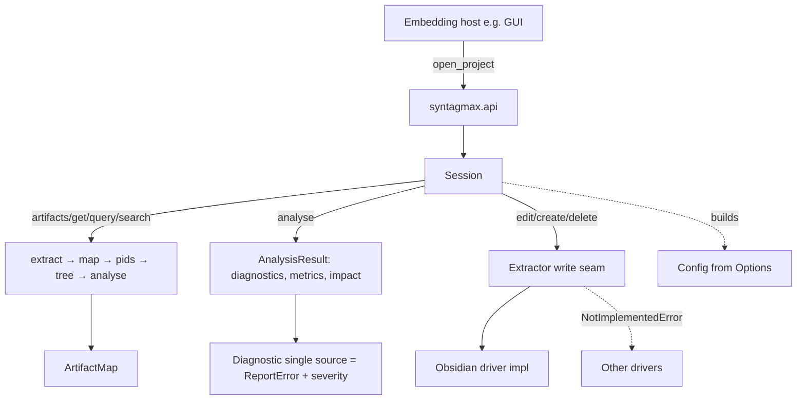
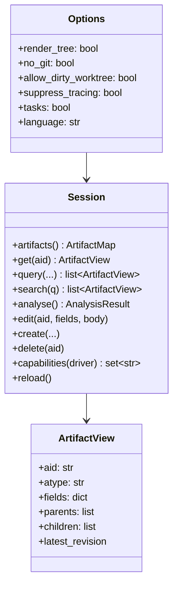

# Library-First Embedding API for Syntagmax

## Problem Statement

`syntagmax` is today a CLI-first tool. Embedding it as a Python library — the immediate driver being the Syntagmax Web GUI, which imports the core in-process — forces every host to re-implement core knowledge: it must open-code the analysis pipeline to reach a populated `ArtifactMap`, fabricate a CLI-shaped `Params` dict to build a `Config`, walk raw `Artifact` objects to answer list/get/search, parse flat diagnostic strings to display issues, and it cannot redirect generated impact tasks out of the versioned worktree. This spec adds a small, sanctioned, additive embedding surface — `syntagmax.api` — plus three supporting core capabilities, so a host can consume Syntagmax as a library and delegate domain logic back to the core. The CLI is left working unchanged.

This spec derives from the seed `docs/seed/library-embedding-api.seed.md` and the GUI-side brainstorm (`syntagmax-gui/docs/brainstorms/CORE_OFFLOAD_REPORT.md`, Approach B). It lands on the `gui-adaptations` branch.

## Requirements

### R1 — `syntagmax.api` embedding facade
1. A new module `src/syntagmax/api.py` exposes `open_project(config_path: str | Path, *, options: Options | None = None) -> Session`.
2. `Options` is a dataclass carrying library-facing options with defaults matching current CLI defaults: `render_tree: bool = False`, `no_git: bool = False`, `allow_dirty_worktree: bool = False`, `suppress_tracing: bool = False`, `tasks: bool = False`, `language: str = 'en'`, `warnings_as_errors: bool = False`, `log_level: str | None = None`.
3. The facade builds a `syntagmax.config.Config` internally from `Options` (translating to the `Params` `TypedDict` the `Config` constructor requires) — **the host never constructs `Params`**.
4. `Session.artifacts() -> ArtifactMap` returns the populated artifact graph, wrapping the canonical sequence `extract → build_artifact_map → populate_pids → build_tree → analyse_tree` exactly once. Results are computed on demand; a `Session` may cache within its own lifetime but must expose a way to force recomputation after a write (`Session.reload()`).
5. `Session.get(aid: str) -> ArtifactView | None`, `Session.query(*, atype: str | None = None, ...) -> list[ArtifactView]`, and `Session.search(q: str) -> list[ArtifactView]` return **structured dataclasses**, not formatted strings. `ArtifactView` carries at least: `aid`, `atype`, `fields` (dict), `parents` (list of `{pid, nominal_revision, is_suspicious}`), `children` (list of ids), `latest_revision` (or `None`). Serialisation (e.g. JSON) is the host's responsibility.
6. `Session.analyse() -> AnalysisResult` returns structured `diagnostics: list[Diagnostic]`, `metrics`, and `impact` (see R2 for `Diagnostic`).
7. `Session.edit/create/delete` are the write seam (see R3), with per-driver capability introspection (`Session.capabilities(record_or_driver) -> set[str]` or equivalent).
8. `FatalError` / `RMSException` propagate unchanged out of facade methods (the fatal-config contract is preserved); the facade does not swallow them. The facade adds no HTTP/async concepts and remains fully synchronous.
9. The CLI (`cli.py`, `main.process`) continues to work with no behavioural change. Rebasing the CLI onto the facade is explicitly out of scope.

### R2 — Structured diagnostics (single source of truth)
10. A `Diagnostic` model is the single structured representation of an analysis issue. The core **already** has `ReportError` in `report.py` (`message, category, input_record, artifact_id, artifact_type, file_path, line_range`) and `Report.errors: list[ReportError]` with `errors_grouped()`. This work **completes and converges on that model** rather than adding a parallel one.
11. Add a `severity` field to the structured error model (`error | warning`, default `error`), preserving existing field names and `__str__`/`format_error` output.
12. Diagnostic producers that currently append **bare strings** to the `errors` list are migrated to append the structured type. `Report.errors` already coerces via `ReportError.from_any`; the goal is that structured data is the source and human strings are **derived** from it — no second parallel channel (per the Q3 decision "no duplication").
13. Existing CLI and report **text output must remain byte-for-byte identical**, verified by golden-output tests.
14. `Session.analyse()` exposes the structured diagnostics (mapped to the public `Diagnostic` dataclass) so a host can aggregate by document/folder and bind each entry to its artifact.

### R3 — Driver-agnostic write seam (Obsidian implementation)
15. The `Extractor` base class (`src/syntagmax/extractors/extractor.py`) gains three methods with base implementations that raise `NotImplementedError` (or a typed `UnsupportedOperation`): `edit_artifact(...)`, `create_artifact(...)`, `delete_artifact(...)`.
16. For this phase, only the **obsidian** driver implements them, reusing its existing content path (`update_artifact_attributes` and the markdown writing already present).
17. `edit_artifact` sets one or more fields and/or the body (`contents`) of an existing artifact identified by id; `create_artifact` adds a new artifact to a target document; `delete_artifact` removes an artifact. All write real files to disk. The core does **not** commit them.
18. A typed `UnsupportedOperation(RMSException)` is raised for drivers without an implementation, and `Session` advertises per-driver capabilities so a host can present only valid actions.

### R4 — Redirectable impact tasks (`impact.task_dir`)
19. `ImpactConfig` (`config.py`) gains a new field `task_dir: str | None = None`, **distinct** from the existing `tasks_dir`.
20. A resolver `Config.task_dir()` returns: the value of `impact.task_dir` if set — honouring an **absolute** path as-is, else resolved relative to `root_dir` — and, when unset, exactly today's behaviour (`Path(root_dir, impact.tasks_dir)`), so default CLI behaviour is unchanged.
21. Impact task generation (`tasks.py`, invoked from the `impact` step in `main.py`) writes to `Config.task_dir()`.

### R5 — Documentation
22. `README.md` gains a short "Embedding Syntagmax as a library" section.
23. `docs/reference/` gains: an embedding-API reference page, and documentation of the new `impact.task_dir` setting on the configuration reference page.
24. `CHANGELOG.md` gains an entry.

## Background

### Config construction (verified)
- `Config(params: Params, config_filename: Path)` — `Params` is a `TypedDict` in `params.py` (`render_tree, ai, cwd, no_git, allow_dirty_worktree, language, suppress_tracing, tasks`, plus `NotRequired` `log_level`, `warnings_as_errors`).
- The CLI builds `Params` from click kwargs (`ctx.obj = Params(**kwargs)`) and calls `u.load_config_or_exit(obj, config_file)` → `Config(obj, cfg_path)` (`utils.py`).
- The `analyze` command sets `obj['allow_dirty_worktree']`, `obj['suppress_tracing']`, `obj['tasks']` before loading. The facade's `Options → Params` mapping must fill all required `Params` keys with these same defaults (note `ai` and `cwd` are required by the `TypedDict`; use `ai=False` and `cwd=''`/cwd-of-config).

### Pipeline (verified)
- `main.process(requested_step, config) -> Report` runs a dependency-ordered DAG (`extract → build_artifact_map → populate_pids → build_tree → tree(analyse_tree) → populate_revisions → impact → metrics`).
- The populated-`ArtifactMap` sequence used by read consumers is `extract → build_artifact_map → populate_pids → build_tree → analyse_tree` (see the existing pattern; the facade centralises it).
- `populate_revisions` is skipped when `config.params['no_git']` is set.

### Structured errors already exist (verified)
- `report.py` defines `ReportError` (dataclass) and `format_error()`; `Report.errors: list[ReportError]`; `Report.errors_grouped()` groups by input record then by `CANONICAL_CATEGORY_ORDER` categories (`extraction, structure, schema, attribute, reference, trace, duplicate`).
- `ReportError.from_any()` coerces a bare `str` to a `ReportError(category=CAT_STRUCTURE)`.
- **53 `errors.append(...)` sites** across the pipeline (17 in `analyse.py`, 11 in `metamodel.py`, 9 in `config.py`, plus `tree.py`, `extract.py`, `metrics.py`, `git_utils.py`, etc.); many append bare strings. These are the migration surface for R2.

### Write seam (verified)
- `Extractor` base (`extractors/extractor.py`) has `update_artifacts(loc_file, updates)` (renumber path) and `update_artifact_attributes(loc_file, updates, target_type)` which raises `NotImplementedError` for all drivers except obsidian.
- `edit_attrs.manipulate_attributes` shows the obsidian write orchestration (group by file, build updates, `update_artifact_attributes`, write with `encoding='utf-8', newline=''`).
- Obsidian artifacts are `MarkdownArtifact` (`extractors/markdown.py`) carrying `yaml_data` and `source_metadata`.

### tasks_dir (verified)
- `ImpactConfig` (`config.py:151`): `tasks_enabled: bool`, `tasks_dir: str = 'tasks/'`.
- `Config.tasks_dir()` returns `Path(self._root_dir, self.impact.tasks_dir)` — **no absolute handling**, unlike `Config.output_dir()` which honours absolute `output_path`.

## Proposed Solution

### Key design decisions
1. **Converge diagnostics on the existing `ReportError`, don't add a parallel model.** The core already has the structured type and grouping the GUI needs; only `severity` and consistent structured appending are missing. This honours Q3's "no duplication" with far less risk than a from-scratch rebuild.
2. **The facade owns the `Options → Params → Config` translation.** This isolates the CLI-shaped `Params` inside one place; embedders see only `Options`.
3. **The public `ArtifactView`/`Diagnostic` dataclasses are distinct from internal `Artifact`/`ReportError`.** This gives the facade a stable public contract without freezing internal representations.
4. **Writes never commit.** Per the brainstorm Q2 decision, Git writes stay with the host; the core write seam only mutates files.
5. **`impact.task_dir` is additive and defaulted to `None`.** Unset means byte-identical behaviour to today.

## Task Breakdown

### Task 1: `impact.task_dir` setting (R4)

**Objective:** Allow embedders to redirect generated impact tasks without changing default behaviour.

**Implementation guidance:**
- In `config.py`, add to `ImpactConfig`: `task_dir: str | None = Field(default=None, description='Override directory for generated task files; absolute honoured as-is, else relative to config dir. When unset, uses tasks_dir.')`.
- Add `Config.task_dir()`:
  - if `self.impact.task_dir` is set: `p = Path(self.impact.task_dir)`; return `p` if `p.is_absolute()` else `Path(self._root_dir, p)`.
  - else: return `Path(self._root_dir, self.impact.tasks_dir)` (current behaviour).
- Route task generation to `Config.task_dir()`: update the write site in `tasks.py` (and any caller in `main.py`'s `impact` step) that currently uses `tasks_dir()`.

**Test requirements (`tests/test_tasks.py` / new `tests/test_task_dir.py`):**
- Unset `task_dir` → tasks written under `<root>/tasks/` (unchanged); assert an existing task test still passes.
- Relative `task_dir = "out/tasks"` → written under `<root>/out/tasks`.
- Absolute `task_dir` → written at that absolute path, outside the root.

**Demo:** `uv run syntagmax --cwd ./example/<a-project-with-tasks> analyze --tasks` writes tasks to the default location; setting `task_dir` in that project's config redirects them.

### Task 2: `severity` on the structured error model (R2, part 1)

**Objective:** Add severity without changing existing output.

**Implementation guidance:**
- In `report.py`, add `severity: str = 'error'` to `ReportError` (after existing fields; keep field order stable for any positional construction — prefer keyword construction).
- Ensure `ReportError.from_any(str)` sets `severity='error'`.
- `__str__` and `format_error` are unchanged (severity is not rendered unless a later doc decision says so).

**Test requirements (`tests/test_report.py`, `tests/test_report_error.py`):**
- `ReportError('msg', category=CAT_STRUCTURE).severity == 'error'`.
- `format_error` output unchanged for a representative error (golden assertion).

**Demo:** existing report tests remain green.

### Task 3: Converge diagnostic producers on structured errors (R2, part 2)

**Objective:** Make structured errors the single source; derive strings from them; no duplication.

**Implementation guidance:**
- Inventory the 53 `errors.append(...)` sites. For each site that appends a **bare string** and has the context to populate structure (artifact id/type, file, category), construct a `ReportError(...)` instead. Sites without an artifact/file context may remain string-coerced via `from_any` (still one channel).
- Prioritise `analyse.py` (17 sites) and `tree.py`/`metrics.py`/`impact.py` since those feed the Analysis view; `metamodel.py`/`config.py` errors are load-time and may stay coerced.
- Do **not** introduce a second list; keep appending to the same `errors` list that becomes `Report.errors`.

**Test requirements:**
- **Golden-output tests**: capture current `report.render()` output for representative fixtures (reuse `tests/test_report_grouping.py` fixtures) and assert unchanged after migration.
- New assertions that migrated errors carry `artifact_id`/`category`/`severity` where applicable.

**Demo:** `uv run pytest tests/test_report.py tests/test_report_grouping.py tests/test_analyse.py` green; a spot-check that a schema error now has a populated `artifact_id`.

### Task 4: Obsidian write seam (R3)

**Objective:** Programmatic edit/create/delete for the obsidian driver behind a general interface.

**Implementation guidance:**
- In `errors.py`, add `class UnsupportedOperation(RMSException)`.
- In `extractors/extractor.py`, add base methods raising `UnsupportedOperation(f'Driver "{self._record.driver}" does not support <op>')`:
  - `edit_artifact(self, artifact: Artifact, *, fields: dict[str, str | None] | None = None, body: str | None = None) -> None`
  - `create_artifact(self, *, target_file: str, atype: str, aid: str | None, fields: dict, body: str) -> Artifact`
  - `delete_artifact(self, artifact: Artifact) -> None`
- Implement all three in the obsidian extractor (the class in `extractors/markdown.py` / obsidian driver). Reuse `update_artifact_attributes` for field edits and the existing marker/YAML writing for body/create/delete. Write files with `encoding='utf-8', newline=''` (matching `edit_attrs`).
- Add a driver capability declaration (e.g. a class attribute `WRITE_CAPABILITIES = {'edit', 'create', 'delete'}`, empty on the base).

**Test requirements (`tests/test_edit_attrs.py` neighbour, new `tests/test_write_seam.py`):**
- Obsidian: edit a field on an existing artifact → re-extract shows new value.
- Obsidian: edit body/contents → re-extract shows new contents.
- Obsidian: create a new artifact in a file → re-extract finds it.
- Obsidian: delete an artifact → re-extract no longer finds it.
- A non-obsidian driver (e.g. `simple-markdown` or `sidecar`) raises `UnsupportedOperation`.
- Windows: the round-trip test runs on Windows (path/newline correctness).

**Demo:** a short script constructs the obsidian extractor, edits an artifact in `example/`, and prints the re-extracted value.

### Task 5: `syntagmax.api` facade — read side (R1, part 1)

**Objective:** The embedding entry point and read operations.

**Implementation guidance:**
- Create `src/syntagmax/api.py`.
- `@dataclass class Options` with the fields/defaults from R1.2.
- Internal `_options_to_params(options, cwd) -> Params` filling every required `Params` key (`render_tree, ai=False, cwd, no_git, allow_dirty_worktree, language, suppress_tracing, tasks`, plus optional `log_level`, `warnings_as_errors`).
- `open_project(config_path, *, options=None) -> Session`: resolves the path, builds `Config(_options_to_params(...), Path(config_path))`.
- `class Session`:
  - lazily runs `extract → build_artifact_map → populate_pids → build_tree → analyse_tree` to produce and cache an `ArtifactMap`; `reload()` clears the cache.
  - `artifacts()`, `get(aid)`, `query(atype=None, ...)`, `search(q)` build `ArtifactView` dataclasses from `Artifact`s (map `parent_links`, `children`, `latest_revision`, `fields`). Move the *semantics* of search/typed-view here (case-insensitive match over id/atype/fields, mirroring what a consumer would otherwise re-implement).
- `@dataclass class ArtifactView` per R1.5.

**Test requirements (`tests/test_api.py`):**
- `Config` parity: a facade-built `Config` matches a CLI-style `Config` on `root_dir`, `output_dir`, `input_records` for the `example/` project.
- `get`/`query`/`search` over `example/` return expected ids/atypes; `query(atype=...)` filters; `search` matches fields.
- `FatalError` propagates for a broken config path.

**Demo:** `python -c "from syntagmax import api; s=api.open_project('example/.../config.toml'); print(len(s.artifacts()))"`.

### Task 6: `syntagmax.api` facade — analyse + write side (R1, parts 6–7)

**Objective:** Structured analysis result and the write methods with capability introspection.

**Implementation guidance:**
- `@dataclass class Diagnostic` (`severity, artifact_id, rule, category, location, message`); map from `ReportError` (rule may be derived from category or a rule id if available).
- `@dataclass class AnalysisResult` (`diagnostics: list[Diagnostic]`, `metrics`, `impact`).
- `Session.analyse() -> AnalysisResult`: run the analysis path (reuse `main.process('metrics', config)` or the internal steps), convert `Report.errors` → `Diagnostic`s, pass through `metrics`/`impact`.
- `Session.edit(aid, *, fields=None, body=None)`, `Session.create(...)`, `Session.delete(aid)`: resolve the artifact's record/driver, obtain the extractor, call the R3 seam, then `reload()`.
- `Session.capabilities(driver_or_record) -> set[str]`: read the extractor's `WRITE_CAPABILITIES`.

**Test requirements (`tests/test_api.py`):**
- `analyse()` on a fixture with a known issue returns a `Diagnostic` with the expected `artifact_id`/`category`/`severity`.
- `edit()` on an obsidian fixture changes a field; a follow-up `get()` (after implicit reload) reflects it.
- `edit()` on a non-obsidian driver raises `UnsupportedOperation`; `capabilities()` reports empty for it.

**Demo:** script: `open_project` → `analyse()` prints diagnostics → `edit()` an obsidian artifact → `get()` shows the change.

### Task 7: Documentation & changelog (R5)

**Objective:** Make the new surface discoverable; satisfy the docs-update requirement (README **and** reference pages).

**Implementation guidance:**
- `README.md`: add "Embedding Syntagmax as a library" with the `open_project`/`Session` example from the seed.
- `docs/reference/`: add `embedding-api.md` (facade, `Options`, `Session`, `ArtifactView`, `Diagnostic`, `AnalysisResult`, capability model, obsidian-only write note); on the configuration reference page, document `impact.task_dir` (absolute vs relative, default = current `tasks_dir` behaviour).
- `CHANGELOG.md`: add an entry summarising the four capabilities.

**Test requirements:** docs are accurate and consistent with the implemented API; internal links valid.

**Demo:** the embedding reference page shows a complete, runnable example matching `tests/test_api.py`.

## Sequencing & Dependencies

- Task 1 (`task_dir`) and Task 2 (`severity`) are independent and can go first.
- Task 3 (diagnostic convergence) depends on Task 2.
- Task 4 (write seam) is independent of 1–3.
- Task 5 (facade read) depends on nothing beyond the existing pipeline; Task 6 depends on Tasks 3, 4, 5.
- Task 7 documents whatever has landed and should be finalised last.

## Out of Scope (per brainstorm decisions)

- Any Git write/worktree/commit functionality in the core (host owns it; Q2).
- Write support for non-obsidian drivers (Q4).
- Rebasing the CLI / `main.process` onto the facade (deferred future work).
- Auth/authorization and any HTTP/async in the core.
- Automatic upstream/publishing of the `gui-adaptations` branch (handled manually; Q6).
