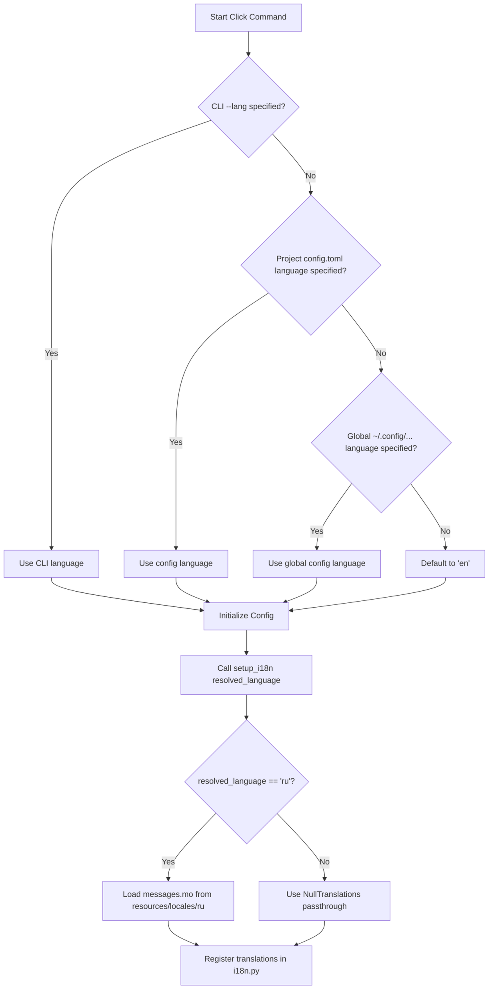

# Localization — Implementation Specification

## Problem Statement

All user-facing strings in Syntagmax reports (change reports, metrics, impact analysis) are hardcoded in English. The project needs a unified i18n infrastructure supporting English and Russian output, controlled by a global `language` config setting and a `--lang` CLI flag.

## Requirements

- Support two languages: English (`en`) and Russian (`ru`), using short codes only
- Global CLI flag `--lang` that affects all report-producing commands
- Top-level `language` setting in `config.toml` (default: `en`)
- Resolution order: CLI `--lang` > config `language` > default `en`
- Localize change reports (`change_render.py`): both full and summary variants
- Localize analysis reports (`report.j2`): metrics, impact, errors, AI sections
- Wire up the existing (currently unused) `.po` locale files and Babel infrastructure
- Compiled `.mo` catalogs must be available at runtime

## Background

- `babel>=2.14` is already a project dependency
- `babel.cfg` exists, configured to extract from `src/syntagmax/resources/*.j2`
- `.po` files exist at `src/syntagmax/resources/locales/{en,ru}/LC_MESSAGES/messages.po` covering impact/metrics strings (originally from a now-merged `impact.j2` template)
- The translation machinery is **not wired up** — no `gettext` module is initialized anywhere in Python code
- `change_render.py` renders markdown via Python string assembly with ~50 translatable strings (headers, labels, status words, table column names)
- `report.j2` is a Jinja2 template with ~20 translatable strings, rendered in `Report.render()` (`report.py`)
- `Params` TypedDict holds global CLI options; it flows to `Config` and downstream modules
- The `rms` Click group defines global options (`--verbose`, `--cwd`, `--no-git`, `--output`, `--render-tree`)

## Design Decisions

1. **Central `i18n.py` module** — single point of gettext initialization; exposes `_()` for import by any renderer. Does not pollute Python builtins.
2. **Jinja2 `i18n` extension** for templates — uses `{{ _("...") }}` markers in `.j2` files, standard Babel/Jinja2 integration.
3. **Python-side `_()`** for `change_render.py` — imported from the central module, same gettext domain.
4. **Single gettext domain** (`messages`) — all strings in one catalog per language, simplifies management.
5. **Commit `.mo` files** — small project, avoids requiring users to run compilation steps. `.gitignore` exception ensures Hatchling includes them in wheels.
6. **Validation at CLI level** — `click.Choice` rejects invalid language codes immediately with standard error formatting.
7. **Centralized resolution in `Config`** — language is resolved once in the `Config` constructor (CLI > config > default), avoiding per-command duplication.
8. **No English catalog** — English is the source language; `NullTranslations` is used directly, avoiding redundant identity lookups.
9. **Warning on missing catalog** — logs a diagnostic warning when a requested locale's `.mo` fails to load, aiding troubleshooting.

## Proposed Solution

1. Create `src/syntagmax/i18n.py` as the central translation module
2. Add `--lang` to the CLI global options and `language` to `ConfigFile`
3. Compile `.po` → `.mo` files for both locales
4. Update `report.j2` to use `{{ _("...") }}` gettext markers
5. Update `change_render.py` to use `_()` for all user-facing strings
6. Extend `.po` files with all new translatable strings (change reports + updated `report.j2`)
7. Add Russian translations for all new strings
8. Add tests and documentation
9. Add exception rule `!src/syntagmax/resources/locales/**/*.mo` to `.gitignore` to ensure compiled catalog distribution

### Language Resolution Flow



### Scope Boundaries

- **In scope:** Change reports, analysis reports (metrics/impact/AI/errors)
- **Out of scope:** `publish` command (renders user content), MCP server (consumed by LLMs — English-only to avoid breaking prompt parsing)

---

## Task Breakdown

### Task 1: Create the i18n Module

**Objective:** Build `src/syntagmax/i18n.py` as the central translation infrastructure.

**Implementation:**
- `setup_i18n(language: str) -> gettext.GNUTranslations | gettext.NullTranslations` — configures gettext for the specified locale:
  - Locale directory: `Path(__file__).parent / 'resources' / 'locales'`
  - Domain: `messages`
  - For `'en'`: uses `NullTranslations` directly (English is the source language — no catalog needed)
  - For `'ru'`: loads the compiled `.mo` catalog; logs a warning and falls back to `NullTranslations` if `.mo` not found
  - Validates `language in ('en', 'ru')`; raises `FatalError` otherwise
  - Does **NOT** call `translations.install()` to avoid builtins pollution and static analysis issues
- Module-level `_()` wrapper function that delegates to the active `GNUTranslations` or `NullTranslations` object
- `get_translations() -> gettext.NullTranslations` — returns the current translation catalog for Jinja2 environment initialization
- `SUPPORTED_LANGUAGES = ('en', 'ru')` constant

**Test requirements:**
- `setup_i18n('en')` followed by `_("Summary")` returns `"Summary"`
- `setup_i18n('ru')` followed by `_("Summary")` returns `"Сводка"`
- `setup_i18n('fr')` raises `FatalError`
- Graceful fallback: if `.mo` missing, returns msgid unchanged

**Demo:** Importing the module and calling `setup_i18n('ru')` then `_("Summary")` returns `"Сводка"`.

---

### Task 2: Add `--lang` Global CLI Flag and `language` Config Field

**Objective:** Wire the language setting through CLI options and configuration.

**Implementation:**
- Add `language: str` to `Params` TypedDict (default `'en'`)
- Add `@click.option('--lang', 'language', type=click.Choice(['en', 'ru']), default=None, help='Output language (en, ru)')` to the `rms` Click group
- Store in `ctx.obj` as `language`
- Add `language: str = Field(default='en', description='Output language for reports')` to `ConfigFile` with validator restricting to `SUPPORTED_LANGUAGES`
- Centralize the resolution logic inside the `Config` constructor (`config.py`):
  1. Resolve active language: `self.language = self.params.get('language') or config_model.language or 'en'`
  2. Call `setup_i18n(self.language)`
- This ensures all commands that instantiate `Config` automatically get i18n initialized — no per-command boilerplate needed
- The `publish` command does NOT use this (publish renders user content, not system labels)

**Test requirements:**
- `--lang ru` overrides config `language = "en"`
- Config `language = "ru"` used when no CLI flag given
- Invalid value `--lang fr` produces error
- Missing both → defaults to `en`

**Demo:** `syntagmax --lang ru analyze` loads Russian translations before rendering.

---

### Task 3: Compile `.mo` Files and Update Build Pipeline

**Objective:** Ensure compiled message catalogs are available at runtime and included in distribution.

**Implementation:**
- Run `pybabel compile -d src/syntagmax/resources/locales` to generate `.mo` from existing `.po` (only `ru` catalog is needed; English uses `NullTranslations` directly)
- Add exception `!src/syntagmax/resources/locales/**/*.mo` to `.gitignore` — Hatchling respects `.gitignore` and would otherwise silently exclude `.mo` from wheels
- Commit the `.mo` files to the repository (at `src/syntagmax/resources/locales/ru/LC_MESSAGES/messages.mo`)
- Verify `pyproject.toml` / hatch config includes `resources/locales/**/*.mo` in the wheel
- Add a `Makefile` target or script: `make i18n-compile` for developer convenience
- Update `babel.cfg` to also extract from Python files:
  ```
  [python: src/syntagmax/change_render.py]
  [python: src/syntagmax/report.py]
  [jinja2: src/syntagmax/resources/*.j2]
  encoding = utf-8
  ```

**Test requirements:**
- `.mo` files load without error for both `en` and `ru`
- `gettext.translation('messages', localedir, languages=['ru'])` succeeds

**Demo:** `.mo` files exist and `gettext.translation(...)` loads them.

---

### Task 4: Localize `report.j2` (Analysis Reports)

**Objective:** Make the Jinja2 analysis report template translation-aware.

**Implementation:**
- Update `Report.render()` in `report.py`:
  - Add `'jinja2.ext.i18n'` to `Environment(extensions=[...])`
  - Get the active translations via `syntagmax.i18n.get_translations()` and install via `env.install_gettext_translations(translations)`
- Replace hardcoded strings in `report.j2` with `{{ _("...") }}`:
  - `# Analysis Report` → `# {{ _("Analysis Report") }}`
  - `## Errors` → `## {{ _("Errors") }}`
  - `Total errors:` → `{{ _("Total errors:") }}`
  - `## Artifact Tree` → `## {{ _("Artifact Tree") }}`
  - `## Metrics` → `## {{ _("Metrics") }}`
  - `Total Requirements:` → `{{ _("Total Requirements") }}:`
  - `### Requirements by Status` → `### {{ _("Requirements by Status") }}`
  - `| Status | Count |` → `| {{ _("Status") }} | {{ _("Count") }} |`
  - `Requirements without verification (%):` → `{{ _("Requirements without verification (%)") }}:`
  - `Requirements with TBD (%):` → `{{ _("Requirements with TBD (%)") }}:`
  - `## Impact Analysis` → `## {{ _("Impact Analysis") }}`
  - `Total suspicious links:` → `{{ _("Total suspicious links") }}:`
  - `| Artifact | Parent | Required Revision | Actual Revision |` → translated headers
  - `### Suspicious Tree` → `### {{ _("Suspicious Tree") }}`
  - `## AI Analysis` → `## {{ _("AI Analysis") }}`
  - `| Artifact | Ambiguity | Completeness | Verifiability | Singularity |` → translated headers
- Update `.po` files with any new strings beyond what already exists

**Test requirements:**
- `Report.render()` with `language='ru'` produces `## Метрики` instead of `## Metrics`
- English output is byte-for-byte identical to current behavior (regression)

**Demo:** `syntagmax --lang ru analyze` produces a report with Russian section headers.

---

### Task 5: Localize `change_render.py` (Change Reports)

**Objective:** Replace all hardcoded English strings in change report renderers with gettext calls.

**Implementation:**
- Add `from syntagmax.i18n import _` at the top of `change_render.py`
- Wrap all user-facing strings with `_()`. Complete list:
  - **Titles:** `"Change Report"`, `"Change Report (Summary)"`
  - **Section headers:** `"Repository Information"`, `"Summary"`, `"Changed Files"`, `"Detailed Changes"`
  - **Repo info labels:** `"Base revision"`, `"Target revision"`, `"Generated"`, `"Input record"`
  - **Summary table headers:** `"Parameter"`, `"Value"`
  - **Summary row labels:** `"Files changed"`, `"Files added"`, `"Files removed"`, `"Artifacts added"`, `"Artifacts modified"`, `"Artifacts removed"`, `"Text fragments modified"`, `"Binary artifacts added"`, `"Binary artifacts modified"`, `"Binary artifacts removed"`, `"Extraction errors"`
  - **Changed files table headers:** `"Filename"`, `"Status"`, `"Objects changed"`
  - **Status labels:** `"Added"`, `"Removed"`, `"Modified"`, `"Renamed"`
  - **Artifact detail labels:** `"Status:"`, `"Text"`, `"Attributes"`, `"Attribute Changes"`, `"Link Changes"`
  - **Table column headers:** `"Attribute"`, `"Value"`, `"Previous"`, `"Current"`
  - **Binary labels:** `"Binary Content"`, `"SHA-256"`, `"Size"`, `"Dimensions"`, `"Added (binary)"`, `"Removed (binary)"`, `"Modified (binary)"`, `"Modified (metadata)"`
  - **Text fragment labels:** `"Text fragment"`, `"Old lines"`, `"New lines"`
  - **Misc:** `"No changes detected."`, `"Extraction Error"`, `"Fallback plain-text diff:"`
  - **Summary report:** `"Objects"`, `"Text fragments"`
- Keep f-string interpolation outside `_()`: e.g., `f'- **{_("Base revision")}:** {data.base_revision}'`

**Test requirements:**
- `render_change_report(data)` with Russian locale produces Russian headers/labels
- `render_summary_report(data)` with Russian locale produces Russian output
- English output matches current behavior exactly (snapshot/regression test)

**Demo:** `syntagmax --lang ru change report --base HEAD~1 --target HEAD` produces a report titled `# Отчет об изменениях`.

---

### Task 6: Write Russian Translations for All New Strings

**Objective:** Populate the Russian `.po` file with complete translations for change report and updated template strings.

**Implementation:**
- Run `pybabel extract -F babel.cfg -o messages.pot .` to generate updated POT
- Run `pybabel update -i messages.pot -d src/syntagmax/resources/locales` to merge into `.po` files
- Fill in Russian translations for all new entries. Key translations:
  - `"Change Report"` → `"Отчет об изменениях"`
  - `"Change Report (Summary)"` → `"Отчет об изменениях (Сводка)"`
  - `"Repository Information"` → `"Информация о репозитории"`
  - `"Changed Files"` → `"Измененные файлы"`
  - `"Detailed Changes"` → `"Детальные изменения"`
  - `"Base revision"` → `"Базовая ревизия"`
  - `"Target revision"` → `"Целевая ревизия"`
  - `"Generated"` → `"Создан"`
  - `"Input record"` → `"Входная запись"`
  - `"Parameter"` → `"Параметр"`
  - `"Value"` → `"Значение"`
  - `"Files changed"` → `"Файлов изменено"`
  - `"Files added"` → `"Файлов добавлено"`
  - `"Files removed"` → `"Файлов удалено"`
  - `"Artifacts added"` → `"Артефактов добавлено"`
  - `"Artifacts modified"` → `"Артефактов изменено"`
  - `"Artifacts removed"` → `"Артефактов удалено"`
  - `"Text fragments modified"` → `"Текстовых фрагментов изменено"`
  - `"Filename"` → `"Имя файла"`
  - `"Status"` → `"Статус"` (already exists)
  - `"Objects changed"` → `"Измененные объекты"`
  - `"Added"` → `"Добавлен"`
  - `"Removed"` → `"Удален"`
  - `"Modified"` → `"Изменен"`
  - `"Renamed"` → `"Переименован"`
  - `"Text"` → `"Текст"`
  - `"Attributes"` → `"Атрибуты"`
  - `"Attribute Changes"` → `"Изменения атрибутов"`
  - `"Link Changes"` → `"Изменения связей"`
  - `"Attribute"` → `"Атрибут"` (already exists)
  - `"Previous"` → `"Предыдущее"`
  - `"Current"` → `"Текущее"`
  - `"Binary Content"` → `"Бинарное содержимое"`
  - `"SHA-256"` → `"SHA-256"` (unchanged)
  - `"Size"` → `"Размер"`
  - `"Dimensions"` → `"Размеры"`
  - `"Added (binary)"` → `"Добавлен (бинарный)"`
  - `"Removed (binary)"` → `"Удален (бинарный)"`
  - `"Modified (binary)"` → `"Изменен (бинарный)"`
  - `"Modified (metadata)"` → `"Изменен (метаданные)"`
  - `"Text fragment"` → `"Текстовый фрагмент"`
  - `"Old lines"` → `"Старые строки"`
  - `"New lines"` → `"Новые строки"`
  - `"No changes detected."` → `"Изменений не обнаружено."`
  - `"Extraction Error"` → `"Ошибка извлечения"`
  - `"Fallback plain-text diff:"` → `"Резервный текстовый diff:"`
  - `"Analysis Report"` → `"Отчет об анализе"`
  - `"Errors"` → `"Ошибки"`
  - `"Total errors:"` → `"Всего ошибок:"`
  - `"Artifact Tree"` → `"Дерево артефактов"`
  - `"AI Analysis"` → `"Анализ ИИ"`
  - `"Ambiguity"` → `"Двусмысленность"`
  - `"Completeness"` → `"Полнота"`
  - `"Verifiability"` → `"Проверяемость"`
  - `"Singularity"` → `"Единичность"`
  - `"Objects"` → `"Объекты"`
  - `"Text fragments"` → `"Текстовые фрагменты"`
- Update the English `.po` as the source reference (no compilation needed — English uses `NullTranslations`)
- Recompile Russian `.mo` file

**Test requirements:**
- Verify no empty `msgstr` entries in `ru/LC_MESSAGES/messages.po` for any msgid used in code
- Run full rendering in Russian — no English strings leak through

**Demo:** Complete Russian `.po` with all entries translated and compiled.

---

### Task 7: Integration Tests and Documentation

**Objective:** End-to-end validation and user-facing documentation.

**Implementation:**
- Add test in `tests/test_change_report.py`:
  - Parametrize existing change report test with `language='ru'`
  - Verify Russian title and section headers in output
- Add test in a new `tests/test_i18n.py`:
  - Unit tests for `setup_i18n` function
  - Verify all supported languages load correctly
- Add test for analyze command with `--lang ru` (extend existing analyze tests)
- Update `README.md`:
  - Add a "Localization" section documenting `language` config and `--lang` flag
  - List supported languages
- Update `docs/reference/configuration.md` if it exists:
  - Document the `language` field

**Test requirements:**
- Integration: `syntagmax --lang ru change report --base HEAD~1 --target HEAD` succeeds with Russian output
- Integration: `syntagmax --lang ru analyze` produces Russian headers
- Integration: default (no flag, no config) produces English output unchanged
- Unit: `i18n.py` module tests pass

**Demo:** All tests pass. `README.md` documents the localization feature.
