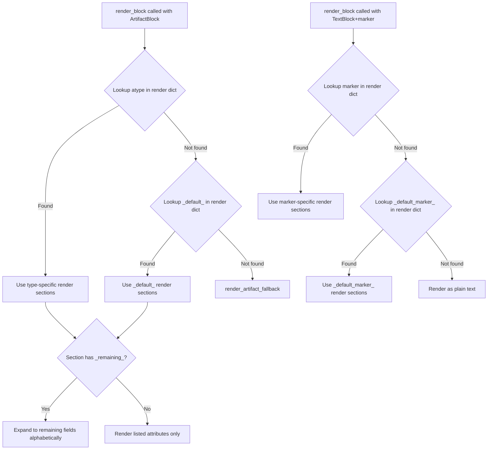

# Default Render Section in Publish Config — Implementation Specification

## Problem Statement

The `render` section in `publish.yaml`/`publish.toml` is keyed by artifact type (e.g., `REQ`, `SYS`) or marker (e.g., `COM`). If a type or marker isn't listed, the renderer falls back to a hardcoded format (heading + body + field/value table for artifacts; plain text for markers). Users need a configurable default that applies to any unmapped artifact type or marker, avoiding duplication when most types share the same rendering layout.

## Requirements

1. Add `_default_` reserved key for artifact type render defaults in the `render` section
2. Add `_default_marker_` reserved key for marker render defaults in the `render` section
3. Support `_remaining_` as a special pseudo-attribute name in `TableSection` and `TextSection` that expands to all artifact fields not explicitly listed across ALL sections in the current render config for that type
4. `_remaining_` expansion excludes fields listed in any section (cross-section exclusion)
5. `_remaining_` always excludes `id` and `contents` (matching current fallback behavior)
6. `_remaining_` fields render in alphabetical order by field name
7. `_default_marker_` uses `MarkerRenderSection` schema; if `alias` contains `{marker}`, it dynamically expands to the block's actual marker name (e.g., `alias: "{marker}"` renders as `**TODO**`, `**WARNING**`, etc.)
8. When both a specific type key AND `_default_` exist, the specific key takes priority
9. When both a specific marker key AND `_default_marker_` exist, the specific key takes priority
10. Existing behavior is fully preserved when no `_default_`/`_default_marker_` keys are present
11. Both YAML and TOML formats must support the new keys

## Background

- `PublishConfig.render` is `dict[str, list[RenderSection]]` in `src/syntagmax/publish_config.py`
- `RenderSection = Union[TableSection, TextSection, MarkerRenderSection]`
- `render_block()` in `publish.py` (line 330) does a case-insensitive lookup for artifact type or marker in `pub_config.render`
- If artifact type not found → calls `render_artifact_fallback()` (heading + contents + sorted field/value table excluding `id`/`contents`)
- If marker not found → renders as plain text with heading adjustment
- `_EXCLUDED_FIELDS = {'id', 'ID', 'Id', 'iD', 'contents', 'CONTENTS', 'Contents'}` at line 291
- `Artifact.fields` is `dict[str, str | list[str]]` — always has `id` and `contents`
- `get_artifact_field_value()` does case-insensitive lookup with caching via `_normalized_fields`
- `TableSection.attributes` and `TextSection.attributes` are `list[dict[str, AttributeRender]]` with single-key validation
- `attribute_presence` setting controls whether empty attributes are rendered (interacts with `_remaining_`)
- Example `publish.toml` at `example/obsidian-driver/.syntagmax/publish.toml` defines render sections for `SYS`, `REQ`, `COM`

## Design Decisions

1. **Reserved key names** — `_default_` uses underscore-wrapping to avoid collision with any real artifact type name. Same pattern for `_default_marker_`.
2. **Separate defaults for artifacts and markers** — Artifacts and markers have fundamentally different rendering schemas (`TableSection`/`TextSection` vs `MarkerRenderSection`), so they need separate default keys.
3. **`_remaining_` is cross-section** — Fields mentioned in ANY section of the render config for a type are excluded from `_remaining_` expansion (using case-insensitive comparison), preventing duplicate rendering.
3b. **Metamodel-aware field collection** — The candidate field set for `_remaining_` is collected from `artifact.fields.keys()` AND metamodel attribute definitions for that artifact type (when metamodel is available), ensuring `attribute_presence: all` and `mandatory` render missing attributes correctly.
4. **Alphabetical ordering** — Matches existing `render_artifact_fallback()` behavior (`sorted(fields.keys())`).
5. **`_remaining_` alias is ignored** — Since it expands to multiple fields, field names are used as labels. The `alias` field in `AttributeRender` is required by the schema but will be ignored at render time for `_remaining_`. We'll use a convention of `alias: ""` or `alias: "_"`.
5b. **Title-case formatting for `_remaining_` labels** — Raw field names (e.g., `customer_id`, `sys_priority`) are formatted for display by replacing underscores with spaces and applying title-casing (e.g., `customer_id` → `Customer Id`, `priority` → `Priority`). This produces readable labels without requiring explicit aliases for every field.
6. **`attribute_presence` interaction** — `_remaining_` respects the effective `attribute_presence` mode. In `values-only` mode (default), only remaining fields with values are rendered. In `all` mode, all metamodel-defined remaining fields are rendered. In `mandatory` mode, only mandatory remaining fields (or those with values) are rendered.
7. **Validation** — No special validator is needed to prevent naming an artifact type `_default_` since it's just a dict key lookup. The logic simply checks specific key first, then `_default_`.
8. **Multiple `_remaining_` directives** — If `_remaining_` appears in more than one section of the same render config (e.g., both a `TableSection` and a `TextSection`), each occurrence expands independently against the same initial explicit attribute set. This means the same remaining fields will render in every section that contains `_remaining_`. This is intentional — it allows rendering remaining fields as both a table summary and text detail if desired.

## Proposed Solution

### Architecture



### Configuration Examples

**YAML:**
```yaml
render:
  _default_:
    - type: table
      attributes:
        - id:
            alias: "ID"
        - status:
            alias: "Status"
    - type: text
      mode: block
      attributes:
        - contents:
            alias: "Description"
        - _remaining_:
            alias: ""
  
  _default_marker_:
    - type: text
      mode: block
      alias: "{marker}"
  
  REQ:
    - type: table
      attributes:
        - id:
            alias: "Identifier"
        - parent:
            alias: "Parent"
    - type: text
      mode: block
      attributes:
        - contents:
            alias: "Requirement"
        - _remaining_:
            alias: ""
```

**TOML:**
```toml
[[render._default_]]
type = "table"

[[render._default_.attributes]]
[render._default_.attributes.id]
alias = "ID"

[[render._default_.attributes]]
[render._default_.attributes.status]
alias = "Status"

[[render._default_]]
type = "text"
mode = "block"

[[render._default_.attributes]]
[render._default_.attributes.contents]
alias = "Description"

[[render._default_.attributes]]
[render._default_.attributes._remaining_]
alias = ""

[[render._default_marker_]]
type = "text"
mode = "block"
alias = "{marker}"
```

### Key Implementation Details

**`_remaining_` expansion logic:**
```python
def collect_explicit_attributes(sections: list[RenderSection]) -> set[str]:
    """Collect all explicitly-named attributes across all sections."""
    explicit = set()
    for sec in sections:
        if isinstance(sec, (TableSection, TextSection)):
            for attr_dict in sec.attributes:
                attr_name = next(iter(attr_dict)).lower()
                if attr_name != REMAINING_SENTINEL:
                    explicit.add(attr_name)
    # Always exclude id and contents
    explicit.add('id')
    explicit.add('contents')
    return explicit
```

**Lookup logic in render_block (artifact):**
```python
render_sections = None
for k, v in pub_config.render.items():
    if k.upper() == a.atype.upper():
        render_sections = v
        break

if not render_sections:
    # Try _default_
    for k, v in pub_config.render.items():
        if k == '_default_':
            render_sections = v
            break

if not render_sections:
    return image_embed + render_artifact_fallback(...)
```

## Task Breakdown

### Task 1: Add constants and model support for `_remaining_` and default keys

**Objective:** Define reserved constants and ensure the Pydantic model accepts them without validation errors.

**Implementation guidance:**
- Add `REMAINING_SENTINEL = '_remaining_'`, `DEFAULT_ARTIFACT_KEY = '_default_'`, `DEFAULT_MARKER_KEY = '_default_marker_'` constants to `publish_config.py`
- No model changes needed — `_remaining_` is just a string key in the attributes dict, and `_default_`/`_default_marker_` are just dict keys in `render`
- Add `collect_explicit_attributes(sections: list[RenderSection]) -> set[str]` helper to `publish_config.py`

**Test requirements:**
- Test that `PublishConfig` parses a render dict containing `_default_` key
- Test that `PublishConfig` parses a render dict containing `_default_marker_` key
- Test that `_remaining_` is accepted as an attribute key in `TableSection` and `TextSection`
- Test `collect_explicit_attributes` returns correct set (excluding `_remaining_`, always includes `id`/`contents`)

**Demo:** `uv run pytest tests/test_publish_config.py -k "default or remaining"` passes.

---

### Task 2: Implement `_default_` and `_default_marker_` lookup in `render_block()`

**Objective:** Modify the render lookup logic so unmatched artifact types fall through to `_default_` and unmatched markers fall through to `_default_marker_` before using hardcoded fallback.

**Implementation guidance:**
- In `render_block()` (line ~415 in `publish.py`), after the artifact type lookup loop fails, add a second loop checking for `DEFAULT_ARTIFACT_KEY`
- In the marker section (line ~349), after the marker lookup fails, add a second loop checking for `DEFAULT_MARKER_KEY`
- If `_default_marker_` is found, render using `MarkerRenderSection` logic (same as explicit marker config). Before rendering, expand `{marker}` placeholder in the alias with `block.marker` (preserving original marker casing, e.g., `TODO` stays `TODO`).
- If `_default_` is found, proceed to section rendering (same as explicit artifact config)
- Keep existing fallback as last resort
- Add a warning log (`lg.warning(...)`) when a section type incompatible with the block type is encountered under `_default_` or `_default_marker_` (e.g., a `TableSection` found under `_default_marker_`, or a `MarkerRenderSection` found under `_default_`). The incompatible section is skipped.

**Test requirements:**
- Test: artifact type `FOO` not in render, `_default_` present → uses default config
- Test: artifact type `REQ` in render, `_default_` also present → uses `REQ` config (not default)
- Test: marker `NOTE` not in render, `_default_marker_` present → uses default marker config
- Test: marker `COM` in render, `_default_marker_` also present → uses `COM` config
- Test: no `_default_` key, unmapped type → still uses `render_artifact_fallback`

**Demo:** `uv run pytest tests/test_publish.py -k "default"` passes.

---

### Task 3: Implement `_remaining_` attribute expansion at render time

**Objective:** When processing sections containing `_remaining_`, dynamically resolve and render all artifact fields not explicitly listed.

**Implementation guidance:**
- In the `TableSection` rendering branch of `render_block()`, detect `_remaining_` attribute
- Call `collect_explicit_attributes(render_sections)` once per artifact block (cache for the block)
- When `_remaining_` is encountered in a section:
  1. Build candidate field set from `artifact.fields.keys()` union with metamodel attribute names for `a.atype` (if metamodel available via `context.config.metamodel`).
  2. Filter candidate fields: remove any field whose lowercased name is in `collect_explicit_attributes(render_sections)`.
  3. Sort remaining fields alphabetically.
  4. Render each field subject to `should_render_attribute()`.
- For `TableSection` with `_remaining_`: render each remaining field as a table row using title-cased field name as label and `get_artifact_field_value()` for value
- For `TextSection` with `_remaining_`: render each remaining field using the section's `mode` with title-cased field name as bold label
- Respect `attribute_presence` for each remaining field (call `should_render_attribute()`)
- Skip `_remaining_` gracefully if no remaining fields exist (produce no output)

**Test requirements:**
- Test `_remaining_` in table section: artifact with fields `{id, contents, status, priority, owner}`, explicit attributes list `[id, status]` → `_remaining_` renders `Owner, Priority` (alphabetical, title-cased)
- Test `_remaining_` in text section with `mode: block`: renders `**Owner**\n\nvalue\n\n**Priority**\n\nvalue\n\n`
- Test `_remaining_` in text section with `mode: inline`: renders `**Owner**: value\n\n**Priority**: value\n\n`
- Test title-case formatting: `customer_id` → `Customer Id`, `sys_priority` → `Sys Priority`
- Test cross-section exclusion: field listed in table section excluded from `_remaining_` in text section
- Test empty remaining (all fields are explicit) → no extra output
- Test `_remaining_` with `attribute_presence: all` → renders empty cells for missing fields
- Test `_remaining_` combined with `_default_` key

**Demo:** `uv run pytest tests/test_publish.py -k "remaining"` passes.

---

### Task 4: Update documentation and example

**Objective:** Document the new features in the publishing reference and add practical examples.

**Implementation guidance:**
- In `docs/reference/publishing.md`, under "Render Section", add subsections:
  - "Default Render Configuration (`_default_`)" explaining artifact default
  - "Default Marker Configuration (`_default_marker_`)" explaining marker default
  - "Remaining Attributes (`_remaining_`)" explaining dynamic expansion
- Update the "Fallback Rendering" paragraph to mention `_default_` is checked first
- Add a `_default_` entry to `example/obsidian-driver/.syntagmax/publish.toml`
- Show YAML and TOML examples for all three features

**Test requirements:**
- Verify example still parses: `uv run syntagmax --cwd ./example/obsidian-driver publish .syntagmax/outputs/output.md` succeeds
- Verify updated `publish.toml` validates against the Pydantic model

**Demo:** Docs are updated; example project publishes successfully with default config applied to unmapped types.

---

### Task 5: Integration tests and edge cases

**Objective:** Validate end-to-end behavior and edge cases.

**Implementation guidance:**
- Add integration test class `TestDefaultRenderIntegration` in `tests/test_publish.py`
- Test full pipeline: build block tree with mixed artifact types (some mapped, some not), publish with `_default_` config, verify output
- Test TOML parsing of `[[render._default_]]` syntax
- Test YAML parsing of `_default_:` key
- Edge case: artifact with only `id` and `contents` → `_remaining_` produces nothing
- Edge case: `_default_marker_` with `mode: inline`
- Edge case: `_default_` with `_remaining_` and `attribute_presence: mandatory` (needs metamodel)
- Edge case: all types are explicitly mapped → `_default_` is never used (no side effects)

**Test requirements:**
- Full test suite passes: `uv run pytest`
- No regressions in existing publish tests

**Demo:** `uv run pytest` passes; `uv run syntagmax --cwd ./example/obsidian-driver publish .syntagmax/outputs/output.md` produces correct output with default rendering applied.
