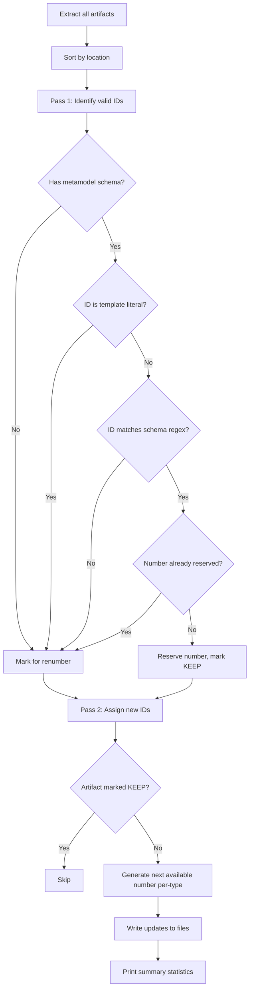

# Preserve Valid IDs During Renumber

## Problem Statement

`edit renumber` unconditionally reassigns sequential IDs to all targeted artifacts. Users expect artifacts that already have valid, schema-conforming IDs to be left in place. New IDs must not duplicate existing valid ones.

## Requirements

1. An artifact's ID is "valid" if it matches the metamodel schema regex for its type (same logic as `_validate_id_schema` in `analyse.py`).
2. Artifacts with valid IDs are skipped — never renumbered.
3. Artifacts with `<undefined>` IDs, template IDs (containing `{num`/`{atype}`), or IDs that don't match the metamodel schema are renumbered.
4. Collision avoidance is per artifact type: if `REQ-003` is already claimed, the REQ counter skips 3.
5. If no metamodel schema exists for a type, all artifacts of that type are renumbered (no valid-ID protection possible without a schema to validate against).
6. The `--schema` CLI option is removed. The metamodel is the single source of truth for ID format (both validation and generation).
7. Duplicate valid IDs are resolved by preserving the first occurrence (lowest in sort order) and marking subsequent duplicates for renumbering.
8. The command prints a summary at the end of execution: preserved count, renumbered count, total.

## Background

- `analyse.py` already compiles schemas into validation regexes via `_NUM_PATTERN`. The same regex pattern is independently defined in `edit.py`.
- The current implementation uses a single global counter. The new logic needs per-type counters with per-type reserved-number sets.
- The metamodel schema is at `config.metamodel['artifacts'][ATYPE]['attributes']['id'][n]['schema']`.
- The `UNDEFINED_ID` sentinel is `<undefined>` (defined in `artifact.py`).
- Existing tests use IDs like `OLD-001` and `OLD-SYS` which won't match any metamodel schema (their metamodels define `id is string` without an `as SCHEMA` clause), so they should still be renumbered without changes.
- The metamodel grammar does not allow conditions on `id` rules (`"id" "is" type ["as" schema_value] _NL`). Schema resolution is therefore strictly per-type, not per-artifact.

## Proposed Solution

Refactor `renumber_artifacts` into a two-pass algorithm and remove the `--schema` CLI option.

### Schema Resolution (Simplified)

With `--schema` removed, the schema for both validation and generation is resolved as:

1. Metamodel schema (`id is TYPE as SCHEMA`) — if defined.
2. Default `{atype}-{num:3}` — if no metamodel schema exists.

Template IDs (containing `{num`/`{atype}` literals in the source file) are always treated as invalid and renumbered regardless.

When compiling a schema into a regex, literal (non-macro) portions of the schema string must be escaped with `re.escape` to avoid treating characters like `-`, `.`, or `+` as regex operators.

### Two-Pass Algorithm

```
Pass 1 — Collect reserved numbers:
  For each artifact (sorted by location):
    Resolve metamodel schema for its type
    If schema exists AND aid is not a template AND aid matches the compiled regex:
      Extract the numeric portion → num
      If num NOT already in reserved_numbers[atype]:
        Add num to reserved_numbers[atype]
        Mark artifact as KEEP
      Else:
        Mark artifact for renumbering (duplicate valid ID)
    Else:
      Mark artifact for renumbering

Pass 2 — Assign new IDs:
  Per-type counter starts at 1
  For each artifact NOT marked "keep":
    Resolve schema (metamodel → default)
    Increment counter, skipping reserved_numbers[atype]
    Generate new ID

Print summary: "Preserved N valid IDs. Renumbered M artifacts. Total: N+M."
```



### ID State Classification

| ID State | Renumbered? | Example |
|----------|-------------|---------|
| Matches metamodel schema (first occurrence) | No | `REQ-007` when schema is `REQ-{num:3}` |
| Matches metamodel schema (duplicate) | Yes | Second `REQ-007` in sorted order |
| Does not match schema | Yes | `OLD-001` when schema is `REQ-{num:3}` |
| `<undefined>` (no ID) | Yes | — |
| Template literal | Yes | `REQ-{num:3}` in source |
| No schema defined for type | Yes (all) | `id is string` without `as ...` |

### Per-Type Counter Isolation

Collision avoidance is scoped per artifact type. Valid `REQ-003` reserves number 3 only for the `REQ` type. `SYS-003` can still be generated independently for `SYS` artifacts.

## Task Breakdown

### Task 1: Extract schema compilation into a shared utility function

**Objective:** Create `compile_id_schema(schema: str, atype: str) -> re.Pattern` and `extract_number_from_id(aid: str, schema: str, atype: str) -> int | None` as reusable helpers in a new `src/syntagmax/id_utils.py` module.

**Implementation guidance:**
- Move `_NUM_PATTERN` to `id_utils.py` as the canonical location.
- `compile_id_schema` builds a regex by:
  1. Replacing `{atype}` with `re.escape(atype)`.
  2. Splitting the remaining string on `{num}` / `{num:N}` boundaries.
  3. Escaping each literal segment with `re.escape`.
  4. Replacing `{num:N}` with `\d{N}` and `{num}` with `\d+`.
  5. Anchoring with `^...$`.
- `extract_number_from_id` does the same but uses a capture group `(\d{N})` or `(\d+)` around the num position, then returns `int(match.group(1))` or `None`.
- Update `analyse.py` to import from `id_utils` instead of duplicating the logic.
- Update `edit.py` to import `_NUM_PATTERN` from `id_utils`.

**Test requirements** (`tests/test_id_utils.py`):
- `REQ-{num:3}` + `REQ` → matches `REQ-001`, `REQ-999`; rejects `REQ-01`, `REQ-1000` (4 digits), `SYS-001`.
- `{atype}-{num}` + `SYS` → matches `SYS-1`, `SYS-42`; rejects `REQ-1`.
- Schema with regex-special characters: `REQ.{num:3}` + `REQ` → matches `REQ.001`; rejects `REQX001` (dot must be literal).
- `extract_number_from_id("REQ-007", "REQ-{num:3}", "REQ")` → `7`.
- `extract_number_from_id("INVALID", "REQ-{num:3}", "REQ")` → `None`.

**Demo:** `pytest tests/test_id_utils.py` passes.

### Task 2: Implement two-pass renumber logic and remove `--schema`

**Objective:** Refactor `renumber_artifacts` in `src/syntagmax/edit.py` to preserve valid IDs and avoid collisions. Remove the `schema_override` parameter and `--schema` CLI option.

**Implementation guidance:**
- Remove `--schema` from `cli_edit.py` (the `@click.option` and the parameter).
- Remove `schema_override` parameter from `renumber_artifacts()`.
- **Pass 1:** Iterate sorted artifacts. For each, look up the metamodel schema for its type (cached per-type). If no schema exists, mark for renumber. If schema exists, compile it, check `artifact.aid`:
  - If `aid == UNDEFINED_ID` → mark for renumber.
  - If `aid` contains `{num` or `{atype}` (template literal) → mark for renumber.
  - If `aid` matches the compiled schema regex → extract number. If number is NOT already in `reserved_numbers[atype]`, add it and mark as KEEP. Otherwise mark for renumber (duplicate).
  - Otherwise → mark for renumber.
- **Pass 2:** Maintain `counters: dict[str, int]` starting at 0 per type. For each artifact marked for renumber (in the same sorted order):
  - Resolve schema: metamodel schema if available, otherwise default `{atype}-{num:3}`.
  - Increment the type's counter, skipping any value in `reserved_numbers[atype]`.
  - Generate the new ID.
- After processing, log summary: `"Preserved {kept} valid IDs. Renumbered {changed} artifacts. Total: {total}."`.
- The rest (dry-run logging, grouping updates by file, delegating to extractors) remains unchanged.

**Test requirements** (new `tests/test_renumber.py`):
- **Mixed valid/invalid:** 5 artifacts, 2 have valid IDs (`REQ-002`, `REQ-004`). After renumber, those two are untouched. The other 3 get `REQ-001`, `REQ-003`, `REQ-005` (skipping 2 and 4).
- **All valid:** All artifacts have conforming IDs → no files modified.
- **All invalid:** All get sequential IDs (existing behaviour preserved).
- **Undefined IDs:** `<undefined>` is always renumbered.
- **Template IDs:** `REQ-{num:3}` literal is always renumbered.
- **No schema in metamodel:** All artifacts of that type are renumbered (no protection).
- **Per-type isolation:** Valid `REQ-003` does not block `SYS-003`.
- **Duplicate valid IDs:** Two artifacts both have `REQ-002`. First (by sort order) is preserved; second is renumbered to the next available number.
- **Dry-run:** Valid artifacts not logged as "would renumber"; invalid ones are.
- **Summary output:** Verify summary statistics are logged correctly.

**Demo:** `pytest tests/test_renumber.py` passes.

### Task 3: Update existing tests for compatibility

**Objective:** Ensure `test_independent_atype_marker.py` and `test_multiple_records_same_driver.py` still pass.

**Implementation guidance:** These tests use IDs like `OLD-001` and `OLD-SYS` which won't match any metamodel schema (their metamodels define `id is string` without an `as SCHEMA` clause), so all artifacts should still be renumbered. The removed `--schema` parameter shouldn't affect them since they never passed it. Run existing tests; if they pass without changes, no action needed.

**Test requirements:** Full `pytest tests` passes.

**Demo:** `pytest tests` clean; `ruff` clean.

### Task 4: Update documentation (README.md, docs/reference/CLI.md)

**Objective:** Document the two-pass renumber behaviour and remove `--schema` references from all documentation.

**README.md changes:**
- Remove `--schema <schema>`: Use a custom schema for renumbering.` from the Options list under Renumbering Command.
- Remove the ID Schema Format sub-section (no longer user-facing; schema is defined in the metamodel).
- Add a new subsection "### ID Preservation" after the existing Renumbering Command content:
  - **When IDs are preserved:** Artifacts whose current ID matches the metamodel schema regex for their type are never renumbered. This requires the metamodel to define an `id is TYPE as SCHEMA` rule. Only the first occurrence (by file/line sort order) of a given numeric ID is preserved; duplicates are renumbered.
  - **When IDs are renumbered:** `<undefined>` IDs, template placeholder IDs (containing `{num}` or `{atype}` literals), IDs that don't conform to the metamodel schema, duplicate valid IDs, and all IDs when no schema is defined for the artifact type.
  - **Collision avoidance:** Newly generated numbers skip any number already claimed by a valid (preserved) ID of the same artifact type.
  - **Per-type isolation:** Valid `REQ-003` does not block generation of `SYS-003`.
  - A concrete before/after example showing mixed valid/invalid artifacts.

**docs/reference/CLI.md changes:**
- Remove the `--schema` row from the Options table.
- Remove the `--schema` example.
- Remove the "ID Schema Format" sub-section (schema is defined in the metamodel DSL, documented in the metamodel reference).
- Add a "#### Behaviour" sub-section after the Options table:
  - Algorithm overview: two-pass (collect reserved numbers → assign new IDs).
  - Definition of "valid ID": matches the compiled regex from `id is TYPE as SCHEMA` in the metamodel.
  - ID state classification table (same as in this spec).
  - Duplicate handling: first occurrence preserved, subsequent duplicates renumbered.
  - Collision avoidance: per-type counter skips reserved numbers.
  - Per-type isolation note.
  - Summary statistics output.
  - Worked example:
    ```
    Given artifacts (sorted by location):
      file-a.md: REQ-002 (valid), <undefined>, OLD-X
      file-b.md: REQ-004 (valid), REQ-{num:3}
    Metamodel schema: REQ-{num:3}

    Pass 1: REQ-002 → reserve 2; REQ-004 → reserve 4
    Pass 2: counter starts at 1
      - <undefined> → 1 (not reserved) → REQ-001
      - OLD-X → next=3 (2 reserved, skip) → REQ-003
      - REQ-{num:3} → next=5 (4 reserved, skip) → REQ-005

    Result: REQ-001, REQ-002, REQ-003, REQ-004, REQ-005
    Summary: Preserved 2 valid IDs. Renumbered 3 artifacts. Total: 5.
    ```

**Demo:** Documentation accurately describes the new behaviour with worked examples.
