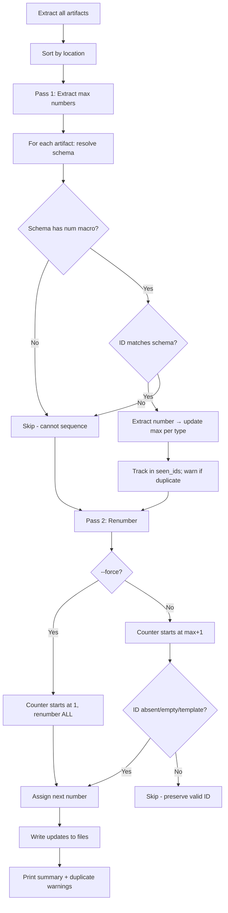

# Preserve Valid IDs During Renumber

## Problem Statement

`edit renumber` unconditionally reassigns sequential IDs to all targeted artifacts. Users expect artifacts that already have valid, schema-conforming IDs to be left in place. New IDs must not duplicate existing valid ones.

## Requirements

1. An artifact's ID is "valid" if it matches the resolved schema regex for its type (where `{num:N}` means minimum N digits, not exact count).
2. Without `--force`, only artifacts with absent, empty, or templated IDs are renumbered. Valid IDs are never touched.
3. With `--force`, all artifacts are renumbered starting from 1 per type.
4. Without `--force`, renumbering starts from `max(existing sequential numbers) + 1` per type.
5. The `--schema` CLI option is removed. The metamodel is the single source of truth for ID format.
6. Any schema may contain at most one `{num}` macro. Multiple `{num}` macros in a metamodel schema must cause metamodel loading to fail. Multiple `{num}` macros detected in an artifact's template ID must cause the renumber command to fail before making any changes.
7. A schema with zero `{num}` macros is valid in the metamodel (e.g. fixed-ID singletons) but cannot support sequential renumbering. The renumber command skips artifact types whose resolved schema has no `{num}` macro.
8. `{num:N}` denotes minimum padding, not a strict digit count. `REQ-1234` is valid under schema `REQ-{num:3}`.
9. The command prints a summary at the end of execution: preserved count, renumbered count, total.
10. If duplicate valid IDs are detected during Pass 1, all occurrences are preserved (resolving duplicates is `analyze`'s responsibility), but a warning listing the duplicate IDs is printed at the end of execution.

## Background

- `analyse.py` already compiles schemas into validation regexes via `_NUM_PATTERN`. The same regex pattern is independently defined in `edit.py`.
- The current implementation uses a single global counter. The new logic needs per-type counters starting from max+1.
- The metamodel schema is at `config.metamodel['artifacts'][ATYPE]['attributes']['id'][n]['schema']`.
- The `UNDEFINED_ID` sentinel is `<undefined>` (defined in `artifact.py`).
- Existing tests use IDs like `OLD-001` and `OLD-SYS` which won't match any metamodel schema (their metamodels define `id is string` without an `as SCHEMA` clause), so they should still be renumbered without changes.
- The metamodel grammar does not allow conditions on `id` rules. Schema resolution is therefore strictly per-type.

## Proposed Solution

Refactor `renumber_artifacts` into a two-pass algorithm, remove `--schema`, and add `--force`.

### Schema Resolution

For each artifact, the identification schema is resolved in order of precedence:

1. If the artifact's current ID contains a template (literal `{num` or `{atype}` macros), use it as the schema.
2. If the metamodel defines a schema for the artifact's type (`id is TYPE as SCHEMA`), use it.
3. Otherwise, fall back to `{atype}-{num:3}`.

The same resolved schema is used for both validation (Pass 1) and generation (Pass 2).

When compiling a schema into a regex, literal (non-macro) portions must be escaped with `re.escape`. The `{num:N}` macro compiles to a capture group `(\d{N,})` (minimum N digits), and `{num}` compiles to `(\d+)`. This allows both validation and number extraction in a single regex match.

### Algorithm

```
Pass 1 — Maximum number extraction:
  For each artifact (sorted by location):
    Resolve schema
    Validate schema has at most one {num} macro (fail if multiple)
    If schema has no {num} macro → skip (cannot extract number)
    If artifact's ID matches the compiled schema regex:
      Extract the numeric portion → update max_number[atype] if larger
      Track ID in seen_ids[atype]; if already seen, record as duplicate

Pass 2 — Renumber:
  If --force:
    counter[atype] starts at 1 for each type
    Renumber ALL artifacts (skip types with no {num} in schema)
  Else:
    counter[atype] starts at max_number[atype] + 1 for each type (or 1 if no valid IDs exist)
    Renumber only artifacts with absent, empty, or templated IDs (skip types with no {num} in schema)

Print summary: "Preserved N valid IDs. Renumbered M artifacts. Total: N+M."
If duplicates detected, print warning: "Warning: Duplicate valid IDs detected: [list]"
```



### ID State Classification

| ID State | Renumbered (no --force)? | Renumbered (--force)? | Example |
|----------|--------------------------|----------------------|---------|
| Matches schema | No | Yes | `REQ-007` when schema is `REQ-{num:3}` |
| Does not match schema | No | Yes | `OLD-001` when schema is `REQ-{num:3}` |
| `<undefined>` (no ID) | Yes | Yes | — |
| Template literal | Yes | Yes | `REQ-{num:3}` in source |
| No schema defined for type | Yes (all, from 1) | Yes (all, from 1) | `id is string` without `as ...` |

**Note:** Without `--force`, artifacts whose IDs don't match the schema but are not absent/empty/template are left alone. Only `analyze` validates schema conformance — `renumber` is not responsible for fixing non-conforming IDs. It only fills in missing ones.

### Per-Type Counter Isolation

Counters and max-number tracking are scoped per artifact type. `REQ` and `SYS` are numbered independently.

### `{num:N}` Semantics

The padding value N is a **minimum**, not an exact count:
- Schema `REQ-{num:3}` matches `REQ-001`, `REQ-012`, `REQ-1234` (all have ≥3 digits).
- When generating new IDs, the number is zero-padded to at least N digits. If the number exceeds N digits naturally (e.g. counter=1000 with N=3), it is not truncated.

### Single `{num}` Macro Enforcement

- At **metamodel load time**: if any schema in the metamodel contains more than one `{num}` (or `{num:N}`) macro, loading must fail with a clear error. Schemas with zero `{num}` macros are valid (for fixed-ID singletons) but will be skipped by renumbering.
- At **renumber time**: if any artifact's template ID (used as a resolved schema) contains more than one `{num}` macro, the command must fail before making any file changes. Template IDs with zero `{num}` macros are skipped (cannot be sequenced).

## Task Breakdown

### Task 1: Extract schema compilation into a shared utility function

**Objective:** Create `compile_id_schema(schema: str, atype: str) -> re.Pattern` and `extract_number_from_id(aid: str, schema: str, atype: str) -> int | None` as reusable helpers in a new `src/syntagmax/id_utils.py` module. Also add `count_num_macros(schema: str) -> int` for validation.

**Implementation guidance:**
- Move `_NUM_PATTERN` to `id_utils.py` as the canonical location.
- `compile_id_schema` builds a regex by:
  1. Replacing `{atype}` with `re.escape(atype)`.
  2. Splitting the remaining string on `{num}` / `{num:N}` boundaries.
  3. Escaping each literal segment with `re.escape`.
  4. Replacing `{num:N}` with a capture group `(\d{N,})` (minimum N digits) and `{num}` with `(\d+)`.
  5. Anchoring with `^...$`.
- `extract_number_from_id` matches the compiled schema regex against the ID and returns `int(match.group(1))` if matched, else `None`. Since `compile_id_schema` already includes the capture group, no separate regex is needed.
- `count_num_macros(schema: str) -> int` returns the number of `{num}` / `{num:N}` occurrences in a schema string.
- Update `analyse.py` to import `compile_id_schema` from `id_utils` and use it for ID validation. This aligns `analyse.py` with the new minimum-padding semantics (`\d{N,}` instead of `\d{N}`).
- Update `edit.py` to import `_NUM_PATTERN` from `id_utils`.

**Test requirements** (`tests/test_id_utils.py`):
- `REQ-{num:3}` + `REQ` → matches `REQ-001`, `REQ-999`, `REQ-1234`; rejects `REQ-01` (only 2 digits), `SYS-001`.
- `{atype}-{num}` + `SYS` → matches `SYS-1`, `SYS-42`; rejects `REQ-1`.
- Schema with regex-special characters: `REQ.{num:3}` + `REQ` → matches `REQ.001`; rejects `REQX001` (dot must be literal).
- `extract_number_from_id("REQ-007", "REQ-{num:3}", "REQ")` → `7`.
- `extract_number_from_id("REQ-1234", "REQ-{num:3}", "REQ")` → `1234`.
- `extract_number_from_id("INVALID", "REQ-{num:3}", "REQ")` → `None`.
- `count_num_macros("REQ-{num:3}")` → `1`.
- `count_num_macros("{num}-{num:2}")` → `2`.
- `count_num_macros("REQ-FIXED")` → `0`.

**Demo:** `pytest tests/test_id_utils.py` passes.

### Task 2: Add `{num}` macro validation to metamodel loading

**Objective:** Ensure metamodel loading fails if any schema contains more than one `{num}` macro. Schemas with zero `{num}` macros are allowed (for fixed-ID types).

**Implementation guidance:**
- In `validate_metamodel()` in `src/syntagmax/metamodel.py`, after validating `id` rules, check each rule's `schema` value (if present) using `count_num_macros`. If count > 1, append an error.
- Import `count_num_macros` from `id_utils`.

**Test requirements** (add to `tests/test_metamodel.py` or similar):
- Metamodel with `id is string as "REQ-{num:3}"` → loads successfully.
- Metamodel with `id is string as "REQ-FIXED"` → loads successfully (zero macros allowed).
- Metamodel with `id is string as "{num}-{num:2}"` → fails with a clear error message mentioning multiple `{num}` macros.

**Demo:** `pytest tests/test_metamodel.py` passes (or whichever test file covers metamodel validation).

### Task 3: Implement two-pass renumber logic, remove `--schema`, add `--force`

**Objective:** Refactor `renumber_artifacts` in `src/syntagmax/edit.py` to use the max+1 algorithm. Remove `schema_override` parameter and `--schema` CLI option. Add `--force` flag.

**Implementation guidance:**
- Remove `--schema` from `cli_edit.py` (the `@click.option` and the parameter).
- Add `--force` flag to `cli_edit.py`, passed as `force` parameter to `renumber_artifacts()`.
- Remove `schema_override` parameter from `renumber_artifacts()`. Add `force: bool = False`.
- **Schema resolution per artifact:**
  1. If `aid` contains `{num` or `{atype}` → use `aid` as schema.
  2. Elif metamodel has schema for the type → use it.
  3. Else → use `{atype}-{num:3}`.
  - Validate resolved schema has ≤1 `{num}` macro. If any artifact's template schema has >1, fail immediately before any changes.
- **Pass 1 (max extraction):** Iterate sorted artifacts. For each, resolve schema. If schema has a `{num}` macro and the artifact's `aid` matches the compiled regex, extract the number. Track `max_number[atype] = max(max_number[atype], extracted)`.
- **Pass 2 (renumber):**
  - If `force`: counter starts at 1 per type, renumber all artifacts.
  - Else: counter starts at `max_number[atype] + 1` per type (or 1 if no max). Renumber only artifacts whose `aid` is `UNDEFINED_ID`, empty, or contains template macros.
  - For each artifact to renumber: resolve schema, generate ID using counter, increment counter.
- Log summary at end.
- The rest (dry-run logging, grouping updates by file, delegating to extractors) remains unchanged.

**Test requirements** (new `tests/test_renumber.py`):
- **Max+1 behaviour:** 3 artifacts with valid IDs `REQ-002`, `REQ-005`, `REQ-003`. Two with `<undefined>`. After renumber (no force), undefined ones get `REQ-006`, `REQ-007`.
- **Force mode:** Same input. With `--force`, all get `REQ-001` through `REQ-005` sequentially.
- **All valid (no force):** No files modified.
- **All invalid (no valid IDs exist):** Counter starts at 1, all get sequential IDs.
- **Template IDs:** `REQ-{num:3}` literal is renumbered.
- **No schema in metamodel:** All artifacts renumbered from 1 (no valid IDs can exist without a schema).
- **Per-type isolation:** Max for `REQ` is independent of max for `SYS`.
- **Multiple `{num}` in template ID:** Command fails with error before any changes.
- **Zero `{num}` in schema:** Artifacts of that type are skipped entirely (no renumbering attempted).
- **Duplicate valid IDs:** Two artifacts with `REQ-003` — both preserved, warning printed listing the duplicate.
- **Padding semantics:** With max=999 and schema `REQ-{num:3}`, next ID is `REQ-1000` (not truncated to 3 digits).
- **Dry-run:** Unchanged artifacts not logged; to-be-renumbered ones are.
- **Summary output:** Verify summary statistics are logged correctly.

**Demo:** `pytest tests/test_renumber.py` passes.

### Task 4: Update existing tests for compatibility

**Objective:** Ensure `test_independent_atype_marker.py` and `test_multiple_records_same_driver.py` still pass.

**Implementation guidance:** These tests use IDs like `OLD-001` and `OLD-SYS` which won't match any metamodel schema (their metamodels define `id is string` without an `as SCHEMA` clause), so all artifacts should still be renumbered. The removed `--schema` parameter shouldn't affect them since they never passed it. Run existing tests; if they pass without changes, no action needed.

**Test requirements:** Full `pytest tests` passes.

**Demo:** `pytest tests` clean; `ruff` clean.

### Task 5: Update documentation (README.md, docs/reference/CLI.md)

**Objective:** Document the new renumber behaviour and remove `--schema` references from all documentation.

**README.md changes:**
- Remove `--schema <schema>` from the Options list under Renumbering Command.
- Add `--force` to the Options list: "Bypass valid-ID preservation and renumber all artifacts from 1."
- Remove the ID Schema Format sub-section (schema is defined in the metamodel).
- Add a new subsection "### ID Preservation" after the Renumbering Command content:
  - **When IDs are preserved:** Without `--force`, artifacts whose current ID matches the resolved schema are never renumbered. The schema is resolved from the metamodel (`id is TYPE as SCHEMA`).
  - **When IDs are renumbered:** Only artifacts with absent (`<undefined>`), empty, or template IDs are renumbered. New IDs are numbered starting from `max(existing) + 1` for each artifact type.
  - **`--force` mode:** All artifacts are renumbered sequentially from 1, regardless of current ID validity.
  - **Padding semantics:** `{num:3}` means "at least 3 digits". `REQ-1234` is valid under `REQ-{num:3}`. Generated IDs are zero-padded to at least N digits but never truncated.
  - **Per-type isolation:** `REQ` and `SYS` are numbered independently.
  - A concrete before/after example.

**docs/reference/CLI.md changes:**
- Remove the `--schema` row from the Options table.
- Add `--force` row: Flag, off, "Renumber all artifacts from 1, ignoring existing valid IDs."
- Remove the `--schema` example.
- Remove the "ID Schema Format" sub-section (documented in metamodel reference).
- Add a "#### Behaviour" sub-section after the Options table:
  - Schema resolution order (template in ID → metamodel → default).
  - Algorithm overview: extract max number per type → renumber from max+1.
  - Definition of which artifacts are renumbered (absent/empty/template only, unless `--force`).
  - Padding semantics for `{num:N}`.
  - Per-type isolation note.
  - Summary statistics output.
  - Single `{num}` macro constraint.
  - Worked example:
    ```
    Given artifacts (sorted by location):
      file-a.md: REQ-002 (valid), <undefined>, REQ-005 (valid)
      file-b.md: REQ-{num:3} (template), <undefined>
    Metamodel schema: REQ-{num:3}

    Pass 1: max(REQ) = max(2, 5) = 5
    Pass 2: counter starts at 6
      - <undefined> (file-a) → REQ-006
      - REQ-{num:3} (file-b) → REQ-007
      - <undefined> (file-b) → REQ-008

    Result: REQ-002, REQ-005 preserved. REQ-006, REQ-007, REQ-008 assigned.
    Summary: Preserved 2 valid IDs. Renumbered 3 artifacts. Total: 5.
    ```
  - Worked example with `--force`:
    ```
    Same input, with --force:
    Pass 2: counter starts at 1, ALL renumbered in sort order:
      REQ-001, REQ-002, REQ-003, REQ-004, REQ-005

    Summary: Preserved 0 valid IDs. Renumbered 5 artifacts. Total: 5.
    ```

**Demo:** Documentation accurately describes the new behaviour with worked examples.
