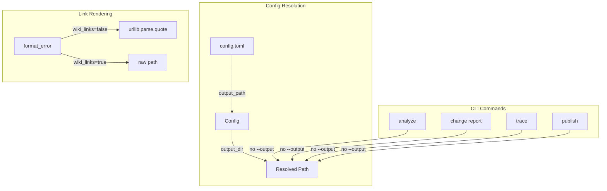

# Report Fixes — Implementation Specification

## Problem Statement

Two fixes to the Syntagmax report output system are needed:

1. **URL encoding in Markdown links (#125):** Standard Markdown links in error output must percent-encode special characters (spaces, parentheses, Cyrillic, etc.) so they work correctly in Obsidian and other Markdown viewers. Example: `[ОПС](Описание%20проекта%20БРУД/4%20Описание%20компонентов%20системы/4.0%20content.md)`

2. **Configurable output directory (#124):** A new top-level `output_path` config parameter should control where all report-like outputs are written, instead of hardcoding `.syntagmax/outputs/`.

**Issues:** [#126](https://github.com/flyvercity/syntagmax/issues/126) (tracking), [#125](https://github.com/flyvercity/syntagmax/issues/125), [#124](https://github.com/flyvercity/syntagmax/issues/124)

## Requirements

1. When `path_as_links=true, wiki_links=false`, the path portion of generated Markdown links must be percent-encoded using `urllib.parse.quote()` (safe `/`, encode spaces as `%20`, handle `()`, `#`, Cyrillic, etc.).
2. Wiki links (`[[path]]`) must NOT be encoded (Obsidian handles them as-is).
3. The display text portion of the link (`[filename]`) remains unencoded for readability.
4. A new top-level `output_path` field in `config.toml` sets the base directory for report-like outputs: analysis report, change reports, trace exports, published documents.
5. `output_path` is resolved relative to the config file directory (consistent with `tasks_dir`, `base`, `metamodel.filename`).
6. Default value: `outputs/` (which, resolved from `.syntagmax/config.toml`, produces `.syntagmax/outputs/`).
7. CLI `--output` exists only on subcommands (`analyze`, `change report`, `trace`, `publish`) — not on the top-level `syntagmax` group. Each subcommand's `--output` defaults to `None`; when not provided, the command falls back to `config.output_dir()` + command-specific suffix. Resolution: explicit `--output` > `config.output_dir()`.
8. Commands that currently hardcode `.syntagmax/outputs/...` as a fallback should read `config.output_dir()` when no explicit `--output` is provided.
9. `output_path` does NOT affect tasks directory (`impact.tasks_dir` remains independent).
10. On Windows, `file_path` values must be normalized to forward slashes before URL encoding to avoid `%5C` in links.
11. If `output_path` is an absolute path, it is used as-is without prepending `root_dir`.

## Background

### Current Link Rendering

- `format_error()` in `report.py` builds links like `[file.md](path/to/file.md#L10)` — currently no URL encoding is applied.
- `file_path` values come from `config.derive_path()` which produces posix-style relative paths (e.g., `requirements/REQS/file with spaces.md`).
- Wiki links use `[[path]]` format which Obsidian handles natively without encoding.

### Current Output Path Handling

- Output paths are hardcoded as `.syntagmax/outputs/` in:
  - `cli.py` — analyze report: `.syntagmax/outputs/report.md`
  - `cli_change.py` — change reports: `.syntagmax/outputs/change/`
  - `cli_tools.py` — trace exports: `.syntagmax/outputs/trace-<child>-<parent>-<date>.csv`
  - `cli_publish.py` — published documents: `.syntagmax/outputs/published.md` or `.syntagmax/outputs/`
- `Config.root_dir()` returns the config file's parent directory (`.syntagmax/`).
- All other directory-type config fields (`base`, `tasks_dir`, `metamodel`) resolve relative to `root_dir`.

### Configuration Model

- `ConfigFile` is the Pydantic model for `config.toml`. Top-level fields include `base`, `language`, `log_level`, etc.
- `Config` class exposes resolved paths via methods like `root_dir()`, `base_dir()`, `tasks_dir()`.
- Adding `output_path` follows the same pattern.

### CLI Architecture

- The global `--output` option on the top-level `syntagmax` click group currently sets a report file path in `Params` (to be removed).
- Subcommands (`change report`, `trace`, `publish`) have their own `--output` options with `None` defaults, falling back to hardcoded paths.
- `analyze` will gain its own `--output` option (moved from the group level).
- `Params` TypedDict defines CLI parameter types.

## Proposed Solution

### URL Encoding (Issue #125)

In `format_error()`, apply `urllib.parse.quote(path, safe='/')` to the path before inserting it into the `[text](url)` Markdown link construct. The `#L{line}` anchor is appended after encoding. Wiki links remain unencoded.

```python
import urllib.parse

# Standard Markdown link with encoding
posix_path = path.replace('\\', '/')
encoded_path = urllib.parse.quote(posix_path, safe='/')
anchor = f'#L{error.line_range[0]}' if error.line_range else ''
filename_display = filename.replace(']', '\\]')
link = f'[{filename_display}]({encoded_path}{anchor}){line_suffix}'
```

### Output Path Configuration (Issue #124)

Add `output_path` to `ConfigFile` and expose via `Config.output_dir()`:

```python
# In ConfigFile
output_path: str = Field(default='outputs/', description='Base directory for report-like outputs (relative to config file directory)')

# In Config
def output_dir(self) -> Path:
    p = Path(self._output_path)
    if p.is_absolute():
        return p
    return Path(self._root_dir, self._output_path)
```

Commands read `config.output_dir()` for their defaults instead of hardcoding paths.

### Architecture



---

## Task Breakdown

### Task 1: URL-encode paths in `format_error()` for standard Markdown links

**Objective:** When rendering standard Markdown links (`wiki_links=false`), percent-encode the path using `urllib.parse.quote(path, safe='/')`.

**Implementation:**
- In `src/syntagmax/report.py`, in the `format_error()` function:
  - Add `import urllib.parse` (at top of function or module).
  - In the non-wiki branch, normalize path separators (`path.replace('\\', '/')`) and apply `urllib.parse.quote(posix_path, safe='/')` to the path before inserting it into the `[text](url)` construct.
  - The `#L{line}` anchor is appended after encoding (it's not part of the file path).
  - The display text (`filename`) remains unencoded for readability. Note: if filename contains `]`, it could break Markdown link syntax — escape as `\]` in the display portion.
  - Wiki links remain unencoded (Obsidian handles raw paths).

**Test requirements:**
- New test: `format_error` with `file_path='Описание проекта/4 content.md'` and `path_as_links=True, wiki_links=False` produces a link with `%20` and Cyrillic percent-encoded.
- New test: paths with parentheses like `dir/file (copy).md` are properly encoded.
- Existing test: `reqs/file.md` (no special chars) still passes — `quote('reqs/file.md', safe='/')` returns the same string.
- Wiki link test: paths with spaces are NOT encoded when `wiki_links=True`.

**Demo:** `pytest tests/test_report_error.py -v`

---

### Task 2: Add `output_path` to `ConfigFile` and expose `output_dir()` on `Config`

**Objective:** Add a new top-level config field and a resolution method.

**Implementation:**
- In `src/syntagmax/config.py`:
  - Add `output_path: str = Field(default='outputs/', description='Base directory for report-like outputs (relative to config file directory)')` to `ConfigFile`.
  - In `Config._read_config()`, store the resolved output path: `self._output_path = config_model.output_path`.
  - Add `output_dir() -> Path` method to `Config` that returns `Path(self._root_dir, self._output_path)`.
- No CLI changes in this task — just the config model and resolution.

**Test requirements:**
- `ConfigFile` validates with and without `output_path` present.
- Default: `Config.output_dir()` returns `<root_dir>/outputs/`.
- Custom: with `output_path = "../reports"`, `Config.output_dir()` returns `<root_dir>/../reports` resolved.
- Absolute: with `output_path = "/tmp/reports"` (or OS equivalent), `Config.output_dir()` returns `Path("/tmp/reports")` without prepending root_dir.

**Demo:** `pytest tests/test_config.py -v -k output`

---

### Task 3: Move `--output` from `rms` group to `analyze` subcommand, wire `output_dir()`

**Objective:** Remove `--output` from the top-level `syntagmax` click group. Add `--output` to the `analyze` subcommand with `None` default, falling back to `config.output_dir() / 'report.md'`.

**CLI `--output` Resolution Rule (all commands):**
- Each subcommand owns its `--output` option (no top-level `--output`).
- When `--output` is provided, it takes precedence.
- When `--output` is not provided (None), fall back to `config.output_dir()` + command-specific suffix.

**Implementation:**
- In `src/syntagmax/cli.py`:
  - Remove `@click.option('--output', ...)` from the `rms` function (top-level group) decorator.
  - Add `@click.option('--output', default=None, help='Report output file or "console" for stdout (default: <output_path>/report.md)')` to the `analyze` command.
  - In the `analyze` command function, accept `output: str | None` parameter. After `Config` is created, if `output is None`, set it to `str(config.output_dir() / 'report.md')`.
- In `src/syntagmax/params.py`:
  - Remove `output: str` from the `Params` TypedDict (it's no longer a top-level param).

**Test requirements:**
- When `--output` not specified and config has default `output_path='outputs/'`, report goes to `<root_dir>/outputs/report.md` (backward compat).
- When `--output` is explicitly set, it takes precedence (used as-is).
- `--output console` prints to stdout.
- When config has `output_path='../reports'`, default output goes to `<root_dir>/../reports/report.md`.
- Top-level `syntagmax --output ...` is no longer accepted (breaking change, documented).

**Demo:** `syntagmax analyze` without `--output` — verify it uses config-resolved path.

---

### Task 4: Wire `output_dir()` into change report, trace export, and publish defaults

**Objective:** Replace hardcoded `.syntagmax/outputs/change/`, `.syntagmax/outputs/trace-...`, and `.syntagmax/outputs/published.md` defaults with `config.output_dir()`-based defaults.

**Note:** `syntagmax ci install` generates CI workflow files with hardcoded `.syntagmax/outputs/` paths. If users set a custom `output_path`, generated CI artifacts may point to non-existent paths. This is noted for awareness; CI template updates are out of scope for this issue but should be tracked separately.

**Implementation:**
- In `src/syntagmax/cli_change.py`:
  - When `output_path is None`, set to `str(config.output_dir() / 'change/')` instead of `'.syntagmax/outputs/change/'`.
- In `src/syntagmax/cli_tools.py` (trace command):
  - When `output is None`, construct the default filename under `config.output_dir()` instead of `'.syntagmax/outputs/'`.
  - The trace command already creates its own `Config` instance — use `config.output_dir()` from it.
- In `src/syntagmax/cli_publish.py`:
  - When `output_path` is None, default to `str(config.output_dir() / 'published.md')` for `--single` or `str(config.output_dir()) + '/'` for multi-file.
- All subcommands keep their existing `--output` option; only the fallback default changes.

**Test requirements:**
- Change report with no `--output` writes to `<output_dir>/change/`.
- Trace export with no `--output` writes to `<output_dir>/trace-...`.
- Publish with no `--output` writes to `<output_dir>/` or `<output_dir>/published.md`.
- All commands still respect explicit `--output` as-is.

**Demo:** Run each command without `--output`; verify paths match `config.output_dir()`.

---

### Task 5: Documentation and config reference update

**Objective:** Update README.md and `docs/reference/configuration.md` with the new `output_path` field and URL encoding behavior.

**Implementation:**
- In `README.md`:
  - Add `output_path` to the Configuration section key fields list.
  - Add `output_path = "outputs/"` to the config example.
  - Update "Report Configuration" subsection to mention that standard Markdown links are Obsidian-compliant with proper percent-encoding of spaces and special characters.
- In `docs/reference/configuration.md`:
  - Add `output_path` field reference: description, default (`outputs/`), resolution rules (relative to config file directory).
  - Note that it does not affect `impact.tasks_dir`.
  - Document the precedence: explicit `--output` is independent; `output_path` only controls the default base directory.

**Test requirements:** N/A (documentation only).

**Demo:** Documentation accurately reflects new behavior.
