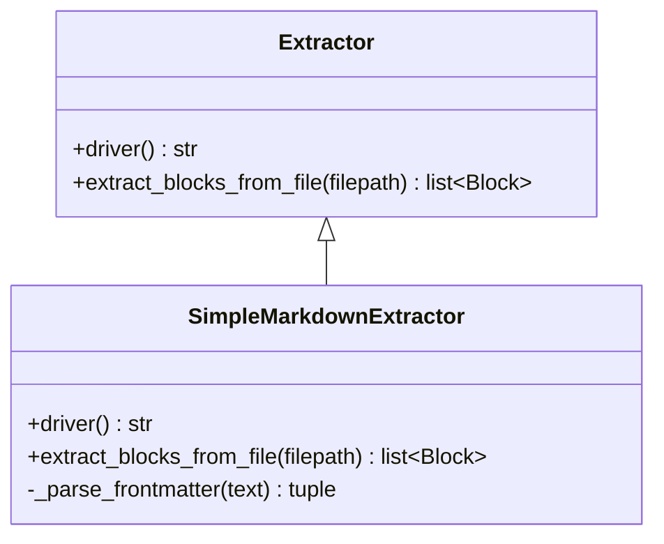
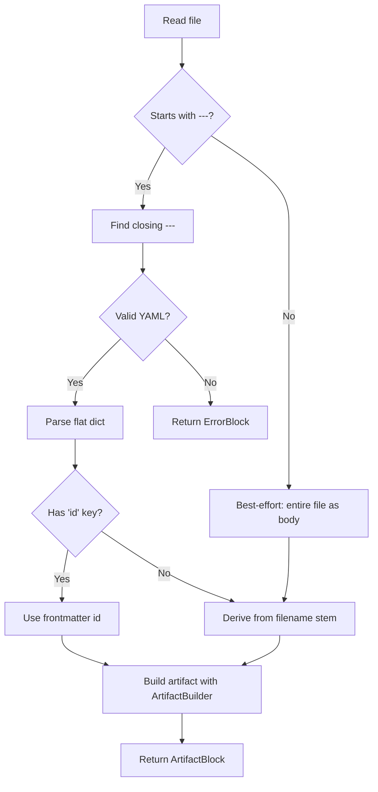

# Simple Markdown Driver

## Problem Statement

The project needs a lightweight driver for standalone artifacts where each markdown file represents a single artifact. The existing Obsidian driver requires heavy custom grammar markers (`[id]`, `[contents]`, nested `attrs` YAML blocks) which is excessive for simple use cases like task files, release notes, or standalone specifications. A new `simple-markdown` driver should provide a minimal extraction path: flat YAML frontmatter for attributes and markdown body as contents.

## Requirements

1. Each markdown file in the input directory is parsed as exactly one artifact.
2. Standard YAML frontmatter (enclosed in `---`) is parsed as a flat dictionary — all top-level keys become artifact attributes directly (no nested `attrs:` key).
3. If no `id` key exists in the frontmatter, the driver derives the ID from the filename stem (e.g., `TASK-001.md` → `TASK-001`).
4. The markdown body (everything after the closing `---`) is assigned to the `contents` attribute.
5. No custom parser markup (`[attribute]`, `[/marker]`) is required in the body.
6. If a file has no YAML frontmatter, best-effort behavior applies: treat the entire file as `contents`, derive ID from filename, use default atype. If YAML frontmatter is present (file starts with `---`) but malformed, return an `ErrorBlock` containing the parsing exception — do not silently fall back to best-effort.
7. The driver implements the full block interface (`extract_blocks_from_file` returning `ArtifactBlock`) to support the publish pipeline.
8. Parent references work through the metamodel: if a frontmatter key is declared as a `reference to parent` in the metamodel, the tree builder resolves it automatically (no special handling in the extractor beyond storing the field value).
9. An `atype` key in frontmatter overrides the record's `default_atype`.
10. List-valued YAML attributes are handled by calling `add_field` for each element.
11. The driver is registered as `'simple-markdown'` in the `EXTRACTORS` dict.
12. Default file filter for the driver is `'**/*.md'`.

## Background

### Extractor Architecture
- All extractors extend `Extractor` (in `src/syntagmax/extractors/extractor.py`).
- Key method: `extract_blocks_from_file(filepath: Path) -> list[Block]`.
- The base `extract()` iterates `self._record.filepaths` and calls `extract_from_file`, which delegates to `extract_blocks_from_file`.
- Return types: `ArtifactBlock(artifact, raw_text)`, `TextBlock(content, ...)`, `ErrorBlock(message, raw_text)`.

### Driver Registration
- `EXTRACTORS` dict in `src/syntagmax/extract.py` maps driver name → class.
- `DEFAULT_FILTERS` in `src/syntagmax/config.py` maps driver name → default glob pattern.

### Artifact Construction Pattern
- `ArtifactBuilder` (in `src/syntagmax/artifact.py`) requires: config, ArtifactClass, driver name, location, metamodel, record.
- Call `builder.add_id(aid, atype)` then `builder.add_field('id', aid)`.
- All other attributes: `builder.add_field(name, value)`.
- Contents: `builder.add_field('contents', body_text)`.
- `builder.build()` validates and returns the artifact.

### Location Model
- Whole-file artifacts use `FileLocation(loc_file)` (see sidecar extractor pattern).
- `self._config.derive_path(filepath)` converts absolute path to project-relative string.

### Parent Link Resolution
- Handled by `tree.py` during the tree-building phase.
- The extractor just stores the field value (e.g., `parent: SYS-001@abc1234`).
- `tree.py` checks metamodel for `reference to parent` type and parses `@revision` syntax.

### YAML Parsing
- `pyyaml` (`yaml.safe_load`) is already a dependency — suitable for simple frontmatter parsing.

### Existing Test Patterns
- Tests are self-contained (no shared conftest).
- Fixtures: `tmp_path`, manually constructed `Config` and `InputRecord`.
- `InputRecord` constructor: `InputRecord(name, dir, record_base, filepaths, driver, default_atype, marker)`.

## Proposed Solution



### Extraction Flow



### Key Design Decisions

1. **Extend `Extractor` directly** — no need for Lark grammar, marker splitting, or element filtering.
2. **Use `FileLocation`** — entire file is one artifact; no line-range tracking needed.
3. **Use `Artifact` class** (not `MarkdownArtifact`) — no need for `yaml_data` or `source_metadata` tracking since there's no mixed markdown/YAML attribute model.
4. **Frontmatter regex**: `^---[ \t]*\r?\n(.*?)\r?\n---[ \t]*(?:\r?\n(.*))?$` with `re.DOTALL` to capture content between delimiters. The trailing newline after closing `---` is optional to handle files that end immediately after the frontmatter.
5. **`id` and `atype` are consumed** — they set artifact identity but are NOT stored as fields (consistent with how other extractors handle `atype`). `id` IS stored as a field (consistent with existing pattern: `builder.add_field('id', aid)`).

## Task Breakdown

### Task 1: Create the SimpleMarkdownExtractor class

**Objective:** Implement the core extractor in `src/syntagmax/extractors/simple_markdown.py`.

**Implementation guidance:**
- Create new file `src/syntagmax/extractors/simple_markdown.py`
- Class `SimpleMarkdownExtractor(Extractor)`
- `driver()` returns `'simple-markdown'`
- Private method `_parse_frontmatter(text: str) -> tuple[dict | None, str]`:
  - Use regex `^---[ \t]*\r?\n(.*?)\r?\n---[ \t]*(?:\r?\n(.*))?$` with `re.DOTALL`
  - If match:
    - Try `yaml.safe_load(group(1))` → if `yaml.YAMLError` is raised, re-raise to the caller so it can construct an `ErrorBlock`
    - If yaml result is not a dict: log warning and return `(None, text)` (treat as no frontmatter)
    - Return the parsed dict and the body (defaulting to empty string if group(2) is None)
  - If no match: return `(None, text)`
- Helper `_pop_case_insensitive(data: dict, key: str, default)` — same pattern as sidecar extractor for case-insensitive key lookup
- `extract_blocks_from_file(filepath: Path) -> list[Block]`:
  - Read file with `encoding='utf-8-sig'` to handle Windows UTF-8 BOM
  - Empty file → return empty list
  - Call `_parse_frontmatter`; if `yaml.YAMLError` is caught, return `[ErrorBlock(message, text)]`
  - Determine `aid`: case-insensitive pop of `id` from frontmatter dict, or `filepath.stem`
  - Determine `atype`: case-insensitive pop of `atype` from frontmatter dict, or `self._record.default_atype`
  - Build location: `FileLocation(self._config.derive_path(filepath))`
  - Build artifact via `ArtifactBuilder(self._config, Artifact, self.driver(), location, self._metamodel, record=self._record)`
  - `builder.add_id(aid, atype)`
  - `builder.add_field('id', aid)`
  - Iterate remaining frontmatter keys: skip keys where value is `None`. For lists call `add_field` per element, for other scalars call `add_field` with `str(value)`
  - `builder.add_field('contents', body.strip())`
  - `builder.build()` → wrap in `ArtifactBlock(artifact=artifact, raw_text=text)`
  - On `ValidationError`: return `[ErrorBlock(str(e), text)]`

**Test requirements:**
- Test with valid frontmatter + explicit id → correct artifact
- Test with missing id → filename-derived ID
- Test with no frontmatter → best-effort (entire file as contents)
- Test with malformed YAML → ErrorBlock returned

**Demo:** `python -c "from syntagmax.extractors.simple_markdown import SimpleMarkdownExtractor; print('OK')"` imports without error.

### Task 2: Register the driver and add default filter

**Objective:** Make the driver available to the configuration system.

**Implementation guidance:**
- In `src/syntagmax/extract.py`:
  - Add import: `from syntagmax.extractors.simple_markdown import SimpleMarkdownExtractor`
  - Add to `EXTRACTORS`: `'simple-markdown': SimpleMarkdownExtractor`
- In `src/syntagmax/config.py`:
  - Add to `DEFAULT_FILTERS`: `'simple-markdown': '**/*.md'`

**Test requirements:**
- Integration test: create config TOML with `driver = "simple-markdown"`, create sample .md files in tmp_path, run `extract(config, errors)`, verify artifacts list is populated.

**Demo:** `uv run syntagmax --cwd ./example/simple-markdown-demo analyze` runs without "unknown driver" error.

### Task 3: Comprehensive unit tests

**Objective:** Full test coverage in `tests/test_simple_markdown_extractor.py`.

**Implementation guidance:**
Create test file with fixtures following existing patterns (`tmp_path`, manually built `Config` and `InputRecord`). Test cases:

1. `test_valid_frontmatter_explicit_id` — file with `id: TASK-001`, verify `artifact.aid == 'TASK-001'`
2. `test_filename_derived_id` — file without `id` key, filename `MY-TASK-002.md`, verify `artifact.aid == 'MY-TASK-002'`
3. `test_no_frontmatter` — file without `---` delimiters, verify entire content in `contents`, filename as id, default atype
4. `test_malformed_yaml` — file with `---` but invalid YAML between them, verify `ErrorBlock` is returned
5. `test_atype_override` — frontmatter with `atype: SPEC`, verify `artifact.atype == 'SPEC'`
6. `test_list_attribute` — frontmatter with `tags: [a, b, c]`, verify field is list
7. `test_parent_field_stored` — frontmatter with `parent: SYS-001@abc1234`, verify `artifact.fields['parent'] == 'SYS-001@abc1234'`
8. `test_empty_body` — only frontmatter, no body, verify `contents` is empty string
9. `test_empty_file` — 0 bytes, verify empty list returned (no artifact, no error)
10. `test_body_content_preserved` — multi-line markdown body with headings, verify full content in `contents`
11. `test_null_values_skipped` — frontmatter with `status: ` (null), verify key is not stored as `"None"`
12. `test_case_insensitive_id` — frontmatter with `ID: TASK-X` (uppercase key), verify `artifact.aid == 'TASK-X'`

**Test requirements:** All 12 tests pass with `uv run pytest tests/test_simple_markdown_extractor.py -v`

**Demo:** Green test suite.

### Task 4: Add example and end-to-end verification

**Objective:** Create a working example directory and verify the full pipeline.

**Implementation guidance:**
- Create `example/simple-markdown-demo/.syntagmax/config.toml`:
  ```toml
  base = ".."

  [[input]]
  name = "tasks"
  dir = "tasks"
  driver = "simple-markdown"
  atype = "TASK"

  [metamodel]
  filename = "project.syntagmax"
  ```
- Create `example/simple-markdown-demo/.syntagmax/project.syntagmax`:
  ```
  artifact TASK:
      attribute id is mandatory string
      attribute contents is mandatory string
      attribute status is optional string
  ```
- Create `example/simple-markdown-demo/tasks/TASK-001.md`:
  ```markdown
  ---
  id: TASK-001
  status: open
  ---
  # Sample Task

  This is a sample task demonstrating the simple-markdown driver.
  ```
- Create `example/simple-markdown-demo/tasks/TASK-002.md` (without explicit id to show filename fallback):
  ```markdown
  ---
  status: draft
  ---
  # Another Task

  This task derives its ID from the filename.
  ```
- Verify: `uv run syntagmax --cwd ./example/simple-markdown-demo --render-tree analyze` produces report with both artifacts.

**Test requirements:** Command exits 0, report contains `TASK-001` and `TASK-002`.

**Demo:** `uv run syntagmax --cwd ./example/simple-markdown-demo --render-tree --output console analyze` prints the artifact tree showing both tasks.
