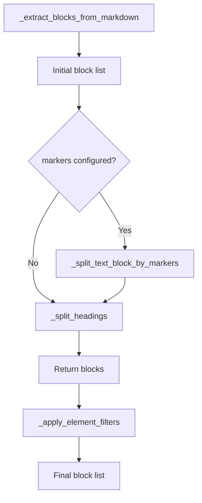

# Split Headings as Separate Text Blocks

## Problem Statement

When only a heading changes in an input Markdown file (outside artifacts), the change report flags the entire surrounding text block as modified. This is noisy and inconvenient — users expect precision: only the heading should appear as changed, not the entire paragraph block beneath it.

## Requirements

1. ATX-style headings (`#` through `######`) outside artifacts are extracted as individual `TextBlock` instances with `marker="HEADING"`.
2. Heading splitting is code-block-aware: headings inside fenced code blocks (```` ``` ````) must not be split.
3. Heading regex is CommonMark-compliant: at most 3 leading spaces before `#` (4+ spaces is an indented code block).
4. `source_offset` is correctly preserved for all resulting blocks, computed incrementally (no `list.index()` usage).
5. Whitespace-only text blocks between headings are preserved (not dropped) to maintain formatting fidelity.
6. No explicit `id` on heading blocks — positional/content matching in `compare_text_blocks` handles diffs.
7. The behaviour is unconditional (no configuration flag).
8. The change report renderer labels heading changes as "Heading" instead of "Text fragment".
9. The `exclude_elements` filter correctly handles pre-split heading blocks.
10. The `edit_markers` renumber command ignores `"HEADING"` blocks (only processes user-configured markers).
11. The publish pipeline treats `"HEADING"` blocks as unmarked text for purposes of `include_plain_text` filtering.
12. Existing tests remain green.

## Background

### How Text Blocks Are Formed

`MarkdownExtractor._extract_blocks_from_markdown` (line ~852 in `src/syntagmax/extractors/markdown.py`) captures all text between artifact markers as a single `TextBlock`. After initial extraction, a marker-splitting pass (`_split_text_block_by_markers`, line ~925) breaks blocks by user-defined fragment markers (`[COM]`, `[NOTE]`, etc.). Remaining unmarked text stays as monolithic blocks.

### How Text Blocks Are Diffed

`compare_text_blocks` in `src/syntagmax/change_diff.py` groups text blocks by file path, then:
1. Matches blocks by explicit ID (if `block.explicit_id` is set).
2. For remaining unmatched blocks, uses `difflib.SequenceMatcher` on content to align by similarity.
3. Reports added/removed/modified fragments.

The comparison is atomic per block — any change within a block marks the entire block as modified.

### Element Filters

`_apply_element_filters` runs *after* `_extract_blocks_from_markdown` returns. It operates on individual `TextBlock` instances. With heading splitting, heading blocks become standalone — the filter can drop or transform them individually rather than stripping lines from a larger block.

### Change Report Rendering

`_render_text_fragment` in `src/syntagmax/change_render.py` (line 335) renders `TextFragmentChange` objects. The `marker` field is available on the change object but not currently used in the heading label. The enhancement point is to check `change.marker == "HEADING"` and use a distinct label.

### Edit Markers Subsystem

`renumber_markers` in `src/syntagmax/edit_markers.py` iterates all `TextBlock`s with `marker is not None` and `not block.explicit_id`. It will pick up `"HEADING"` blocks unless explicitly filtered. Since headings don't have `[HEADING]` bracket syntax in the source, `_compute_tag_replacement` will fail and produce warnings.

### Publish Subsystem

`render_block` in `src/syntagmax/publish.py` routes blocks with `marker is not None` through a marker-lookup path. If the marker is not in `pub_config.render` (which `"HEADING"` won't be), it falls through to plain-text rendering — but *without* checking `pub_config.include_plain_text`. This means heading blocks would render even when `include_plain_text = false`.

### Test Patterns

Tests use `tmp_path`, `Config`, `InputRecord`, and `ObsidianExtractor` fixtures (see `tests/test_marked_fragments.py`, `tests/test_extractors.py`). Change report integration tests use `git.Repo.init`, `CliRunner`, and the syntagmax CLI (see `tests/test_change_report.py`).

## Proposed Solution



### Data Model

No new dataclasses. Heading blocks are `TextBlock` instances with:
- `content`: The heading line including the `#` prefix and trailing newline.
- `marker`: `"HEADING"` (reserved internal marker name).
- `id`: `None`.
- `explicit_id`: `False`.
- `source_offset`: Correct character offset in the source file.

### Splitting Algorithm

```python
def _split_headings(self, blocks: list[Block]) -> list[Block]:
    """Split ATX headings out of unmarked TextBlocks as separate heading blocks."""
    result: list[Block] = []
    heading_re = re.compile(r'^([ ]{0,3}#{1,6}\s)')

    for block in blocks:
        if not isinstance(block, TextBlock) or block.marker is not None:
            result.append(block)
            continue

        lines = block.content.splitlines(keepends=True)
        base_offset = block.source_offset
        accumulator: list[str] = []
        current_offset = base_offset
        acc_offset = base_offset
        in_code_block = False

        for line in lines:
            stripped = line.lstrip()

            # Track fenced code block state
            if stripped.startswith('```'):
                in_code_block = not in_code_block
                if not accumulator and current_offset is not None:
                    acc_offset = current_offset
                accumulator.append(line)
                if current_offset is not None:
                    current_offset += len(line)
                continue

            if in_code_block:
                if not accumulator and current_offset is not None:
                    acc_offset = current_offset
                accumulator.append(line)
                if current_offset is not None:
                    current_offset += len(line)
                continue

            if heading_re.match(line):
                # Flush preceding text (preserve whitespace-only blocks)
                if accumulator:
                    text = ''.join(accumulator)
                    result.append(TextBlock(content=text, source_offset=acc_offset))
                    accumulator = []

                # Emit heading block
                result.append(TextBlock(content=line, marker='HEADING', source_offset=current_offset))
                if current_offset is not None:
                    current_offset += len(line)
                acc_offset = current_offset
            else:
                if not accumulator and current_offset is not None:
                    acc_offset = current_offset
                accumulator.append(line)
                if current_offset is not None:
                    current_offset += len(line)

        # Flush remaining text (preserve whitespace-only blocks)
        if accumulator:
            text = ''.join(accumulator)
            result.append(TextBlock(content=text, source_offset=acc_offset))

    return result
```

### Change Render Enhancement

In `_render_text_fragment`:

```python
if change.marker == 'HEADING':
    label = _('Heading')
else:
    label = _('Text fragment')
lines = [f'##### {label} ({_(change.status.value)})', '']
```

### Edit Markers Guard

In `renumber_markers` (edit_markers.py), add a filter to skip blocks whose marker is not in the record's configured markers:

```python
if block.marker not in record.markers:
    continue
```

### Publish Guard

In `render_block` (publish.py), treat `"HEADING"` blocks as unmarked text:

```python
if isinstance(block, TextBlock):
    marker = block.marker
    if marker == 'HEADING':
        marker = None  # Treat heading blocks as unmarked text
    if marker is not None:
        # ... existing marker rendering logic ...
```

## Task Breakdown

### Task 1: Implement `_split_headings` in `MarkdownExtractor`

**Objective:** Add a method that iterates unmarked `TextBlock`s and splits ATX headings into separate blocks with `marker="HEADING"`.

**Implementation guidance:**
- File: `src/syntagmax/extractors/markdown.py`
- Add `_split_headings(self, blocks: list[Block]) -> list[Block]` method.
- Use heading regex `r'^([ ]{0,3}#{1,6}\s)'` (CommonMark-compliant, max 3 leading spaces).
- Logic: iterate blocks; skip non-`TextBlock` or blocks with `marker is not None`; for qualifying blocks scan lines tracking fenced-code state; on heading line flush accumulator as `TextBlock(marker=None)`, emit heading as `TextBlock(marker="HEADING")`.
- Compute `source_offset` incrementally using a `current_offset` accumulator (NOT `list.index()`).
- Preserve whitespace-only text blocks (do NOT drop them with `if text.strip()`).
- Wire it at the end of `_extract_blocks_from_markdown`, after the marker-splitting pass (unconditionally, regardless of whether markers are configured).

**Test requirements:** Unit tests in `tests/test_heading_split.py`:
- Single heading at start of block → heading + body.
- Multiple headings → multiple heading blocks with body blocks between them.
- Heading inside fenced code block → NOT split.
- Consecutive headings → consecutive heading blocks (no empty body blocks between them).
- Whitespace-only body between headings → preserved as a TextBlock.
- `source_offset` is correctly computed for each resulting block (test with duplicate lines).
- Blocks with `marker != None` (e.g. `"COM"`) are not processed.
- Heading with 4+ leading spaces → NOT split (treated as indented code).

**Demo:** `uv run pytest tests/test_heading_split.py -v`

---

### Task 2: Integrate with element filters

**Objective:** Ensure `_apply_element_filters` correctly handles pre-split heading blocks.

**Implementation guidance:**
- File: `src/syntagmax/extractors/markdown.py`, method `_apply_element_filters`.
- When `headings` is in `exclude_elements` and block has `marker == "HEADING"`:
  - Mode `string` / `string-on-start`: Drop the block entirely (skip it).
  - Mode `only`: Strip the `#` prefix from content (convert heading to plain text), change marker back to `None`.
- The existing `if content and content.strip()` check already handles empty blocks.

**Test requirements:** Add cases in `tests/test_heading_split.py` or `tests/test_exclude_tags.py`:
- `headings` exclusion mode `string` drops heading blocks.
- `headings` exclusion mode `only` converts heading blocks to plain text blocks.
- Body text blocks adjacent to removed headings are unaffected.

**Demo:** `uv run pytest tests/test_heading_split.py tests/test_exclude_tags.py -v`

---

### Task 3: Fix edit_markers and publish integration

**Objective:** Prevent `"HEADING"` blocks from causing side effects in marker renumbering and publishing.

**Implementation guidance:**

Edit Markers:
- File: `src/syntagmax/edit_markers.py`, in the block iteration loop (~line 147).
- Add guard: skip blocks whose `marker` is not in `record.markers`. This ensures only user-configured markers are processed.

Publishing:
- File: `src/syntagmax/publish.py`, function `render_block` (~line 347).
- At the start of the `TextBlock` handling, if `marker == "HEADING"`, set local `marker = None`. This routes heading blocks through the unmarked text path, respecting `include_plain_text`.

**Test requirements:**
- `tests/test_heading_split.py`: Add a test that heading blocks are NOT included in `renumber_markers` output.
- `tests/test_publish.py`: Add a test that heading blocks are excluded when `include_plain_text = false`, and rendered normally when `include_plain_text = true`.

**Demo:** `uv run pytest tests/test_heading_split.py tests/test_publish.py -v`

---

### Task 4: Enhance change report renderer

**Objective:** Label heading changes as "Heading" in the change report.

**Implementation guidance:**
- File: `src/syntagmax/change_render.py`, function `_render_text_fragment` (line 335).
- Check `change.marker == 'HEADING'`; use `_("Heading")` as label, else `_("Text fragment")`.
- Add `"Heading"` to locale files:
  - `src/syntagmax/resources/locales/en/LC_MESSAGES/messages.po`
  - `src/syntagmax/resources/locales/ru/LC_MESSAGES/messages.po` (translate as `"Заголовок"`)
- Recompile `.mo` files.

**Test requirements:** Add a test in `tests/test_change_report.py`:
- Create a repo with a file containing a heading + body text + artifact.
- Commit, then modify only the heading, commit again.
- Run `change report --base HEAD~1 --target HEAD`.
- Assert output contains "Heading" (or localised equivalent) and NOT the full body text as a single modified fragment.

**Demo:** `uv run pytest tests/test_change_report.py -v`

---

### Task 5: End-to-end verification

**Objective:** Verify the full pipeline with the example project and full test suite.

**Implementation guidance:**
- Run `uv run syntagmax --render-tree --cwd ./example/obsidian-driver/ analyze` — confirm no regressions.
- Run full test suite.
- Run linter.

**Test requirements:**
- `uv run pytest tests -v` — all tests pass.
- `uv run ruff check src tests` — clean.

**Demo:** All green.

---

### Task 6: Documentation update

**Objective:** Document the heading block behaviour.

**Implementation guidance:**
- `docs/reference/obsidian.md`: Add a subsection after the existing "Overview" section explaining that headings are automatically extracted as separate text blocks with `marker="HEADING"`. Mention: CommonMark-compliant (max 3 leading spaces), code-block awareness, no configuration needed, improves change report granularity.
- `README.md`: No change needed (the feature is transparent; no new CLI flags or config).
- `docs/reference/configuration.md`: No change needed (no new config option).

**Test requirements:** N/A.

**Demo:** Documentation reads coherently and accurately describes the new behaviour.
