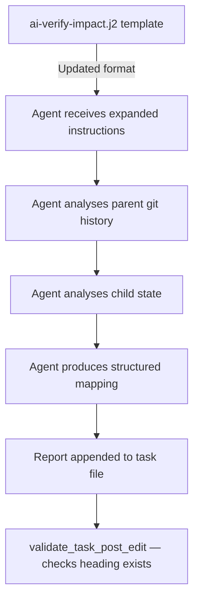

# Spec: More Verbose Impact Verification Report

## Problem Statement

Current AI agent verification reports for impact tasks lack justification, clarity, and detail. The existing prompt instructs the agent to produce a 3–10 sentence rationale, but does not require it to:

1. Outline what changed in the parent artifact.
2. Outline what (if anything) changed in the child artifact.
3. Explain how each parent change is addressed by corresponding child changes.
4. Alternatively, explain why the child does not need to change.

This makes reports difficult to audit and provides no traceability between specific parent changes and their impact assessment.

## Requirements

1. The verification report format must include a **Parent Changes** subsection listing each distinct change observed in the parent since the recorded revision.
2. The verification report format must include a **Child Changes** subsection listing each distinct change observed in the child since the recorded revision (or stating "No changes" if unchanged).
3. The verification report must include a **Change Mapping** subsection that maps each parent change to the corresponding child change that addresses it, OR explains why no child change is needed.
4. The overall **Rationale** field is retained for a brief summary verdict explanation.
5. The post-edit validator (`validate_task_post_edit`) must accept the new report format (new subsections are optional for backward compatibility with already-verified tasks, but the `## Verification Report` heading remains mandatory).
6. The prompt template must instruct the agent to produce the expanded report format.
7. The documentation in `docs/reference/ai.md` must be updated to reflect the new report format.
8. The `README.md` AI Commands section must be updated with the new report structure.

## Background

### Current Prompt Template (`ai-verify-impact.j2`)

The template currently asks the agent to append:

```markdown
## Verification Report
- **Verdict:** PASS | FAIL
- **Agent:** {{ agent_name }}
- **Date:** {{ timestamp }}
- **Parent revision observed:** <short hash> (dirty: yes/no)
- **Child revision observed:** <short hash> (dirty: yes/no)
- **Rationale:** <3-10 sentences explaining your assessment>
```

This flat structure provides no structured breakdown of what changed or how the impact was assessed.

### Current Validation Logic (`ai.py`)

`validate_task_post_edit` checks:
- Valid frontmatter present
- `id` unchanged
- `status` in (`open`, `closed`)
- `## Verification Report` section exists

The validator does NOT inspect internal subsections, so adding new subsections is non-breaking.

### Agent Invocation Flow

1. `cli_ai.py` parses the task, resolves agent, renders prompt.
2. Prompt is written to a temp `.md` file and passed to the agent CLI.
3. Agent reads parent/child files, inspects git history, appends report.
4. `validate_task_post_edit` checks structural integrity.

## Proposed Solution

### New Verification Report Format

Replace the current flat format with a structured multi-section report:

```markdown
## Verification Report
- **Verdict:** PASS | FAIL
- **Agent:** <agent_name>
- **Date:** <YYYY-MM-DD>
- **Parent revision observed:** <short hash> (dirty: yes/no)
- **Child revision observed:** <short hash> (dirty: yes/no)

### Parent Changes
<Bullet list describing each distinct change in the parent artifact since the
recorded revision. Use git diff or blame to identify changes. Each bullet should
be a concise description of what was added, modified, or removed.>

### Child Changes
<Bullet list describing each distinct change in the child artifact since the
recorded revision, OR a single line: "No changes observed.">

### Change Mapping
<For each parent change listed above, explain which child change addresses it.
If a parent change does NOT require a child update, explain why (e.g., the change
is editorial, does not affect derived requirements, or is out of scope for this
child). Format as a numbered list mapping parent changes to child responses.>

### Rationale
<2-5 sentence summary of the overall verdict. Reference specific items from the
change mapping above to justify PASS or FAIL.>
```

### Prompt Template Changes

Update `src/syntagmax/resources/ai-verify-impact.j2`:

1. Replace the "Verification Report Format" section with the expanded format above.
2. Add concise, intent-driven instructions in the "Instructions" section to:
   - Inspect the parent artifact's history/diff since the recorded revision to identify what changed.
   - Inspect the child artifact file and its recent history.
   - Map each parent change to a child response or explain why no change is needed.
3. Update the constraints section to clarify that the mapping must cover ALL parent changes (no omissions).
4. Add fallback and conciseness guidance to constraints:
   - If git history is unresolvable (shallow clone, non-git state), fall back to direct file comparison.
   - For large diffs (>5 distinct changes), group related changes logically into summary bullet points.

### Validation — No Changes Required

The current `validate_task_post_edit` function checks only for the `## Verification Report` heading. Since the new format still uses this heading, no validator changes are needed. The subsections are enforced by prompt instructions, not by code validation.

### Architecture

No new modules or architectural changes. This is a template and documentation update only.



## Task Breakdown

### Task 1: Update the prompt template

**Objective:** Amend `ai-verify-impact.j2` to require the expanded verification report format.

**Implementation guidance:**
- File: `src/syntagmax/resources/ai-verify-impact.j2`
- Replace the `## Verification Report Format` section content with the new multi-section format.
- In the `## Instructions` numbered list, keep steps concise and intent-focused:
  ```
  2. Inspect the parent artifact's history/diff since revision `{{ parent_revision }}` to identify what changed.
  3. Inspect the child artifact file and its recent history.
  4. For each parent change, determine whether the child addresses it or explain why no change is needed.
  5. Assess overall consistency.
  6. Edit the task file at `{{ task_file_path }}`:
     - If consistent: set `status: closed` in frontmatter.
     - If not consistent: leave `status: open`.
     - Append a `## Verification Report` section (format below).
  ```
- Update the `## Constraints` section to add:
  ```
  - The Change Mapping MUST address every item listed in Parent Changes. Do not omit any.
  - If the parent has no meaningful changes (e.g., only whitespace), state that explicitly.
  - If git history is unresolvable (shallow clone, non-git state), perform direct file comparison instead.
  - For large diffs (>5 distinct changes), group related changes logically into summary bullet points to maintain report conciseness.
  ```

**Test requirements:**
- Unit test: render the updated template with sample variables and verify all new section headings appear (`### Parent Changes`, `### Child Changes`, `### Change Mapping`, `### Rationale`).
- Verify existing `test_ai.py` tests still pass (they don't inspect template content beyond basic rendering).

**Demo:**
```bash
uv run pytest tests/test_ai.py -v
```

---

### Task 2: Update reference documentation (`docs/reference/ai.md`)

**Objective:** Update the AI reference page to document the new verification report format.

**Implementation guidance:**
- File: `docs/reference/ai.md`
- Replace the "Verification Report Format" subsection under "Prompt Template" with the new expanded format.
- Add a brief explanation of each subsection's purpose.

**Test requirements:**
- Manual verification that the documentation is consistent with the template.

---

### Task 3: Update README.md

**Objective:** Update the README AI Commands section with the new report structure.

**Implementation guidance:**
- File: `README.md`
- In the `## AI Commands` section, update the brief mention of the verification report format to show the new multi-section structure.

**Test requirements:**
- Manual verification that README examples match the template.

---

### Task 4: Add template rendering and validation tests

**Objective:** Add tests verifying the new template sections and post-edit validator acceptance.

**Implementation guidance:**
- File: `tests/test_ai.py`
- Add a test `test_render_verify_prompt_contains_expanded_sections` that:
  1. Mocks `config` with a persona string.
  2. Calls `render_verify_prompt(...)` with sample values.
  3. Asserts the rendered output contains:
     - `### Parent Changes`
     - `### Child Changes`
     - `### Change Mapping`
     - `### Rationale`
  4. Asserts the output still contains the core metadata fields (Verdict, Agent, Date).
- Add a test `test_validate_task_post_edit_expanded_format` that:
  1. Writes a sample task file containing the full expanded report structure (all four subsections under `## Verification Report`).
  2. Calls `validate_task_post_edit(task_path, original_id)`.
  3. Asserts `(True, 'valid')` is returned — confirming the validator accepts the new format.

**Test requirements:**
- Both tests must pass with `uv run pytest tests/test_ai.py -v`.

**Demo:**
```bash
uv run pytest tests/test_ai.py::test_render_verify_prompt_contains_expanded_sections -v
```

---

### Task 5: Run linter and full test suite

**Objective:** Verify no regressions.

**Implementation guidance:**
- Run `uv run ruff check src/ tests/` — no errors or warnings.
- Run `uv run pytest tests/` — all tests pass.

**Demo:**
```bash
uv run ruff check src/ tests/
uv run pytest tests/ -v
```
