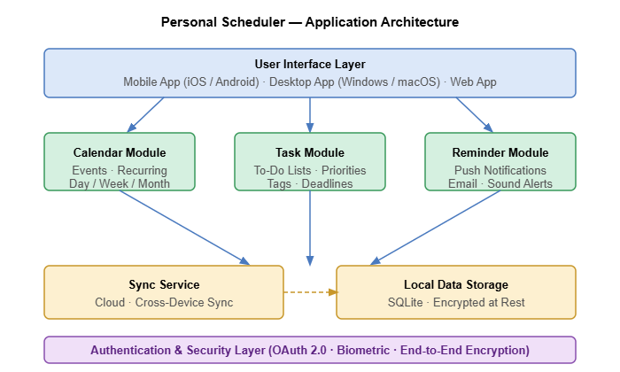

The high-level architecture of Personal Scheduler is shown in Figure 1. The application is structured into three core functional modules — Calendar, Tasks, and Reminders — backed by a local encrypted data store and an optional cloud synchronization service.

[FIG 1]
Figure 1. Personal Scheduler — Application Architecture.

The functions performed by Personal Scheduler are listed in Table 1.

[TABLE 1]
Table 1. Personal Scheduler Functions.

| **Function ID** | **Function Name**            | **Module**   | **Description**                                                                  |
| --------------- | ---------------------------- | ------------ | -------------------------------------------------------------------------------- |
| F_CAL_001       | Display calendar views       | Calendar     | Show events in day, week, month, and agenda views                                |
| F_CAL_002       | Create and edit events       | Calendar     | Create, modify, and delete one-time and recurring calendar events                |
| F_CAL_003       | Import/export calendar data  | Calendar     | Support iCalendar (.ics) format for import and export of events                  |
| F_TASK_001      | Create and organize tasks    | Tasks        | Create tasks with title, description, due date, priority, and tags               |
| F_TASK_002      | Group tasks into lists       | Tasks        | Support multiple named task lists with drag-and-drop reordering                  |
| F_TASK_003      | Mark tasks as complete       | Tasks        | Check off tasks; completed tasks are archived and searchable                     |
| F_REM_001       | Schedule reminders           | Reminders    | Attach time-based reminders to events and tasks                                  |
| F_REM_002       | Deliver push notifications   | Reminders    | Send on-device push notifications at the scheduled reminder time                 |
| F_REM_003       | Snooze and dismiss reminders | Reminders    | Snooze a reminder for a configurable interval or dismiss it entirely             |
| F_SYNC_001      | Synchronize data             | Sync         | Optionally sync all user data with a personal cloud account in real time         |
| F_AUTH_001      | Authenticate users           | Security     | Support PIN, password, and biometric (fingerprint / Face ID) unlock              |
| F_SEARCH_001    | Search events and tasks      | UI / Core    | Full-text search across all events, tasks, and notes                             |
